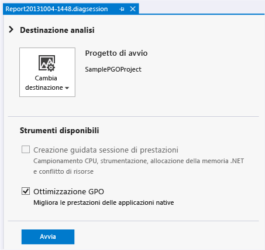
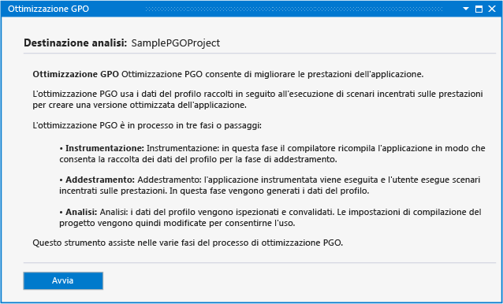
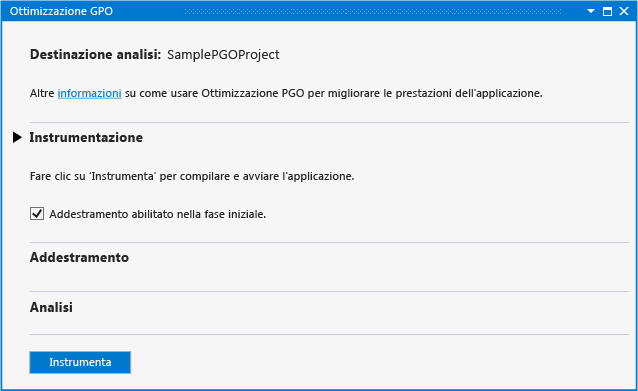
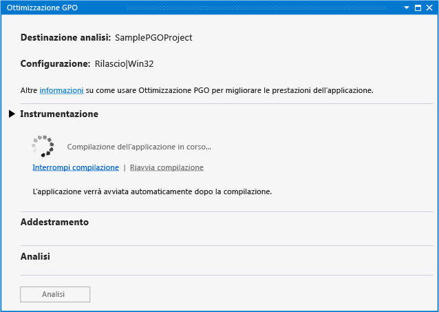
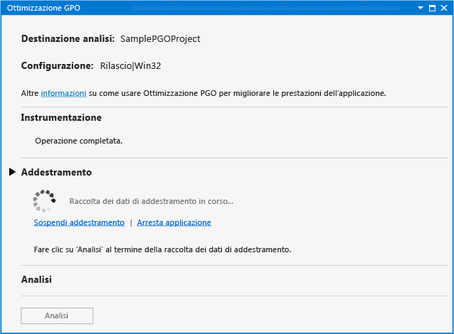
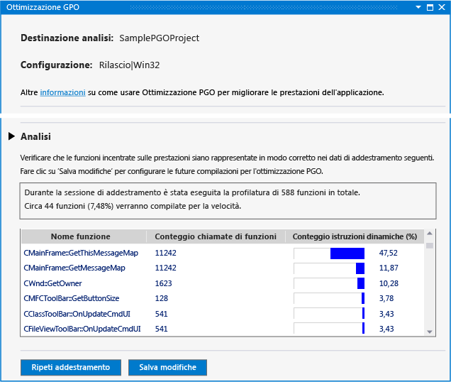
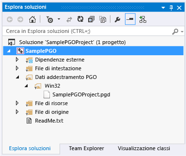
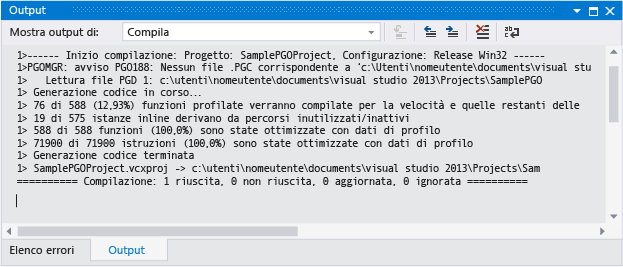

# Ottimizzazione GPO nell'hub Prestazioni e diagnostica
Il plug-in di ottimizzazione PGO per Visual C++ nell'hub Prestazioni e diagnostica migliora l'esperienza di ottimizzazione PGO per gli sviluppatori. È possibile [scaricare il plug-in](http://go.microsoft.com/fwlink/p/?LinkId=327915) dal sito Web di Visual Studio.  
  
 L'ottimizzazione PGO consente di creare compilazioni per applicazioni native x86 e x64 ottimizzate per il modo in cui gli utenti interagiscono con esse. PGO è un processo in più passaggi: si crea una compilazione dell'applicazione instrumentata per il profiling e quindi si esegue la "formazione", ovvero si esegue l'applicazione instrumentata attraverso scenari di interazione dell'utente comune. Salvare i dati di profiling acquisiti e quindi ricompilare l'applicazione utilizzando i risultati per guidare l'ottimizzazione dell'intero programma. Sebbene sia possibile eseguire singolarmente queste operazioni in Visual Studio o dalla riga di comando, il plug-in PGO centralizza e semplifica il processo. Il plug-in PGO imposta tutte le opzioni richieste, guida l'utente per ogni passaggio, mostra l'analisi e quindi utilizza i risultati per configurare la compilazione e ottimizzare ogni funzione per dimensione o velocità. Il plug-in PGO consente inoltre di eseguire nuovamente il training dell'applicazione ed aggiornare i dati dell'ottimizzazione della compilazione non appena si modifica il codice.  
  
## Prerequisiti  
 È necessario [scaricare il plug-in PGO](http://go.microsoft.com/fwlink/p/?LinkId=327915) e installarlo in Visual Studio prima di poter utilizzare nell'Hub prestazioni e diagnostica.  
  
## Procedura dettagliata: utilizzare il plug-in PGO per ottimizzare un'applicazione  
 Innanzitutto, verrà creata un'applicazione desktop Win32 di base in Visual Studio. Se si dispone già di un'applicazione che si desidera ottimizzare, è possibile utilizzarla e saltare questo passaggio.  
  
#### Per creare un'applicazione  
  
1.  Nella barra dei menu scegliere **File**, **Nuovo**, **Progetto**.  
  
2.  Nel riquadro sinistro della finestra di **nuovo progetto** finestra di dialogo espandere **installato**, **modelli**, **Visual C++**e quindi selezionare  **MFC**.  
  
3.  Nel riquadro centrale selezionare **applicazione MFC**.  
  
4.  Specificare un nome per il progetto, ad esempio, **SamplePGOProject**-in di **nome** casella. Fare clic sul pulsante **OK** .  
  
5.  Nel **Panoramica** pagina del **Creazione guidata applicazione MFC** finestra di dialogo scegliere la **fine** pulsante.  
  
 Quindi, impostare la configurazione della compilazione dell'applicazione su Rilascio per prepararla ai passaggi di compilazione e di training PGO.  
  
#### Per impostare la configurazione di compilazione  
  
1.  Nella barra dei menu scegliere **Compilazione**, **Gestione configurazione**.  
  
2.  Nel **Configuration Manager** finestra di dialogo scegliere la **configurazione soluzione attiva** pulsante a discesa e selezionare **versione**. Scegliere il **Chiudi** pulsante.  
  
 Aprire l'Hub prestazioni e diagnostica, sulla barra dei menu, scegliere **Analizza**, **prestazioni e diagnostica**. Viene aperta una pagina della sessione di diagnostica con gli strumenti di analisi disponibili per il tipo di progetto.  
  
   
  
 In **strumenti disponibili**, selezionare il **ottimizzazione PGO** casella di controllo. Scegliere il **avviare** per avviare il plug-in PGO.  
  
   
  
 Il **ottimizzazione PGO** pagina vengono descritti i passaggi di plug-in utilizza per migliorare le prestazioni dell'app. Scegliere il **avviare** pulsante.  
  
   
  
 Nel **strumentazione** sezione, utilizzare il **Training inizialmente abilitato** possibile scegliere se includere la fase di avvio dell'app come parte della formazione. Se questa opzione non è selezionata, i dati del training non vengono registrati in un'applicazione instrumentata in esecuzione finché non si abilita il training in modo esplicito.  
  
 Scegliere il **strumento** per compilare l'app con uno speciale set di opzioni del compilatore. Il compilatore inserisce istruzioni probe nel codice generato. Queste istruzioni registrano i dati di profilatura durante la fase di training.  
  
   
  
 Quando la compilazione instrumentata dell'applicazione è completa, l'applicazione viene avviata automaticamente.  
  
 In caso di eventuali errori o avvisi durante la compilazione, correggerli e quindi scegliere **riavvia compilazione** per riavviare la compilazione instrumentata.  
  
 Quando l'applicazione viene avviata, è possibile utilizzare il **avvia formazione** e **Sospendi formazione** di collegamenti nel **Training** sezione per controllare quando vengono registrate le informazioni di profilatura. È possibile utilizzare il **Arresta applicazione** e **Avvia applicazione** collegamenti per arrestare e riavviare l'app.  
  
   
  
 Durante il training, eseguire gli scenari utente per acquisire le informazioni di profilatura di cui il plug-in PGO necessita per ottimizzare il codice. Dopo aver completato il training, chiudere l'applicazione o scegliere il **Arresta applicazione** collegamento. Scegliere il **Analizza** per avviare la fase di analisi.  
  
 Quando l'analisi viene completata, il **Analysis** sezione per visualizzare un report delle informazioni di profilatura che sono state acquisite durante la fase di training dello scenario utente. È possibile utilizzare questo report per esaminare le funzioni che sono state più chiamate e che hanno richiesto la maggior quantità di tempo da parte dell'applicazione. Il plug-in PGO utilizza le informazioni per determinare quale funzione dell'applicazione ottimizzare per velocità e quali ottimizzare per dimensione. Il plug-in PGO configura le ottimizzazioni di compilazione per creare la più piccola e veloce applicazione per gli scenari utente registrati durante il training.  
  
   
  
 Se il training ha acquisito le informazioni di profilatura previste, è possibile scegliere **Salva modifiche** per salvare i dati di profilatura analizzati nel progetto per ottimizzare le compilazioni future. Per eliminare i dati di profilo e avviare la formazione dall'inizio, scegliere **Ripeti formazione**.  
  
 Il file di dati di profilo viene salvato nel progetto in un **dati di Training PGO** cartella. Questi dati vengono utilizzati per controllare le impostazioni dell'ottimizzazione della compilazione del compilatore nell'applicazione.  
  
   
  
 Dopo le analisi, il plug-in PGO imposta le opzioni di compilazione nel progetto per utilizzare i dati di profiling per ottimizzare in modo selettivo l'applicazione durante la compilazione. È possibile continuare a modificare e compilare l'applicazione con gli stessi dati di profiling. Quando l'applicazione viene compilata, l'output della compilazione mostra quante funzioni e istruzioni sono state ottimizzate utilizzando i dati di profiling.  
  
   
  
 Se si apportano modifiche significative al codice durante lo sviluppo, potrebbe essere necessario riqualificare l'applicazione per ottenere le migliori ottimizzazioni. È consigliabile riqualificare l'applicazione quando l'output di compilazione mostra che meno dell'80% delle funzioni o delle istruzioni sono state ottimizzate utilizzando i dati di profiling.