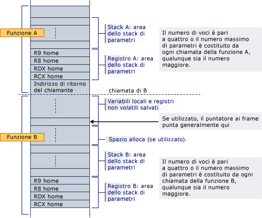

# Uso dello stack x64

Tutta la memoria oltre l'indirizzo corrente di RSP è considerata volatile: il sistema operativo, o un debugger, può sovrascrivere questa memoria durante una sessione di debug utente o un gestore di interrupt. Pertanto, RSP deve sempre essere impostato prima di provare a leggere o scrivere valori in un stack frame.

In questa sezione viene illustrata l'allocazione dello spazio dello stack per le variabili locali e la funzione intrinseca **alloca** .

## Allocazione dello stack

Il prologo di una funzione è responsabile dell'allocazione dello spazio dello stack per variabili locali, registri salvati, parametri dello stack e parametri di registro.

L'area dei parametri si trova sempre nella parte inferiore dello stack (anche se viene usato `alloca`), in modo che sia sempre adiacente all'indirizzo restituito durante qualsiasi chiamata di funzione. Contiene almeno quattro voci, ma sempre spazio sufficiente per contenere tutti i parametri necessari per qualsiasi funzione che può essere chiamata. Si noti che lo spazio viene sempre allocato per i parametri del registro, anche se i parametri stessi non vengono mai assegnati allo stack; un chiamato è garantito che lo spazio sia stato allocato per tutti i parametri. Gli indirizzi Home sono necessari per gli argomenti Register, quindi è disponibile un'area contigua nel caso in cui la funzione chiamata debba prendere l'indirizzo dell'elenco di argomenti (va_list) o di un singolo argomento. In quest'area è inoltre possibile salvare gli argomenti di registro durante l'esecuzione del thunk e come opzione di debug (ad esempio, rende gli argomenti facili da trovare durante il debug se archiviati nei rispettivi indirizzi Home nel codice di prologo). Anche se la funzione chiamata dispone di meno di 4 parametri, questi 4 percorsi dello stack sono di proprietà della funzione chiamata e possono essere usati dalla funzione chiamata per altri scopi oltre al salvataggio dei valori del registro parametri.  In questo modo il chiamante non può salvare le informazioni in questa area dello stack in una chiamata di funzione.

Se lo spazio viene allocato dinamicamente (`alloca`) in una funzione, è necessario usare un registro non volatile come puntatore di frame per contrassegnare la base della parte fissa dello stack e il registro deve essere salvato e inizializzato nel prologo. Si noti che quando si usa `alloca`, le chiamate allo stesso chiamato dallo stesso chiamante possono avere indirizzi Home diversi per i relativi parametri di registro.

Lo stack verrà sempre allineato a 16 byte, tranne che all'interno del prologo, ad esempio dopo il push dell'indirizzo restituito, e, ad eccezione dei casi indicati nei [tipi di funzione](#function-types) per una determinata classe di funzioni frame.

Di seguito è riportato un esempio del layout dello stack in cui la funzione A chiama una funzione non foglia B. il prologo della funzione A ha già allocato spazio per tutti i parametri Register e stack richiesti da B nella parte inferiore dello stack. La chiamata esegue il push dell'indirizzo restituito e il prologo B alloca spazio per le variabili locali, i registri non volatili e lo spazio necessario per chiamare le funzioni. Se B utilizza `alloca`, lo spazio viene allocato tra l'area di salvataggio del registro variabile locale/non volatile e l'area dello stack di parametri.

Quando la funzione B chiama un'altra funzione, l'indirizzo restituito viene inserito immediatamente sotto l'indirizzo Home per RCX.

## Costruzione dell'area dello stack di parametri dinamici

Se viene usato un puntatore a frame, l'opzione esiste per creare dinamicamente l'area dello stack di parametri. Questa operazione non è attualmente eseguita nel compilatore x64.

## Tipi di funzione

Sono fondamentalmente disponibili due tipi di funzioni. Una funzione che richiede un stack frame viene chiamata *funzione frame*. Una funzione che non richiede un stack frame viene chiamata *funzione foglia*.

Una funzione frame è una funzione che alloca lo spazio dello stack, chiama altre funzioni, Salva i registri non volatili o usa la gestione delle eccezioni. Richiede anche una voce di tabella di funzione. Una funzione frame richiede un prologo e un epilogo. Una funzione frame può allocare in modo dinamico lo spazio dello stack e può utilizzare un puntatore al frame. Una funzione Frame offre le funzionalità complete di questo standard di chiamata a sua disposizione.

Se una funzione frame non chiama un'altra funzione, non è necessario allineare lo stack (a cui si fa riferimento nell' [allocazione dello stack](#stack-allocation)della sezione).

Una funzione foglia è una funzione che non richiede una voce di tabella di funzione. Non può apportare modifiche a tutti i registri non volatili, incluso RSP, il che significa che non è possibile chiamare funzioni o allocare spazio dello stack. È consentito lasciare lo stack non allineato durante l'esecuzione.

## allineamento malloc

[malloc](../c-runtime-library/reference/malloc.md) garantisce la restituzione di memoria allineata in modo adeguato per l'archiviazione di qualsiasi oggetto con un allineamento fondamentale e che possa adattarsi alla quantità di memoria allocata. Un *allineamento fondamentale* è un allineamento minore o uguale all'allineamento più grande supportato dall'implementazione senza una specifica di allineamento. In Visual C++è l'allineamento richiesto per un `double`o 8 byte. Nel codice destinato alle piattaforme a 64 bit, è di 16 byte. Ad esempio, un'allocazione a quattro byte verrebbe allineata a un limite che supporta qualsiasi oggetto a quattro byte o più piccolo.

L' C++ oggetti visivi consente tipi con *allineamento esteso*, noti anche come tipi con *allineatura eccessiva* . Ad esempio, i tipi SSE [__m128](../cpp/m128.md) e `__m256`e i tipi dichiarati tramite `__declspec(align( n ))` in cui `n` è maggiore di 8, hanno un allineamento esteso. L'allineamento della memoria su un limite appropriato per un oggetto che richiede l'allineamento esteso non è garantito da `malloc`. Per allocare memoria per i tipi eccessivamente allineati, utilizzare [_aligned_malloc](../c-runtime-library/reference/aligned-malloc.md) e le relative funzioni.

## alloca

[_alloca](../c-runtime-library/reference/alloca.md) deve essere allineato a 16 byte ed è necessario usare un puntatore a frame.

Lo stack allocato deve includere lo spazio dopo di esso per i parametri delle funzioni chiamate successivamente, come descritto in [allocazione dello stack](#stack-allocation).

## Vedere anche

[Convenzioni del software x64](../build/x64-software-conventions.md) 
[align](../cpp/align-cpp.md) 
[__declspec](../cpp/declspec.md)
