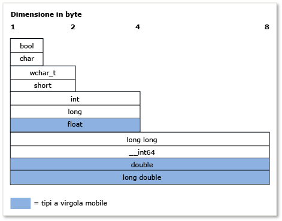

# <a name="c-type-system-modern-c"></a>Sistema di tipi C++ (C++ moderno)

Il concetto di *tipo* è molto importante in C++. Per poter essere compilati è necessario che a ogni variabile, argomento di funzione e valore restituito di una funzione siano associati tipi. A ogni espressione (compresi i valori letterali) viene inoltre assegnato un tipo in modo implicito prima della restituzione di un risultato. Alcuni esempi di tipi **int** per archiviare i valori integrali, **double** per archiviare valori a virgola mobile (noto anche come *scalare* i tipi di dati), o la classe della libreria Standard [std:: basic_string](../standard-library/basic-string-class.md) per archiviare testo. È possibile creare un tipo personalizzato definendo un **classe** oppure **struct**. Il tipo specifica la quantità di memoria che verrà allocata per la variabile (o risultato dell'espressione), i tipi di valori che è possibile archiviare in tale variabile, la modalità di interpretazione di questi valori (come schemi di bit) e le operazioni che è possibile eseguire su di essi. In questo articolo viene offerta una panoramica informale delle principali funzionalità del sistema di tipi C++.

## <a name="terminology"></a>Terminologia

**Variabile**: il collegamento simbolico nome di una quantità di dati in modo che il nome utilizzabile per accedere ai dati di cui fa riferimento a nell'ambito del codice in cui è definito. In C++ *variabile* viene generalmente usato per fare riferimento alle istanze di tipi di dati scalari, mentre le istanze di altri tipi sono in genere chiamate *oggetti*.

**Oggetto**: per motivi di semplicità e coerenza, in questo articolo viene usato il termine *oggetto* per fare riferimento a qualsiasi istanza di una classe o struttura, quando viene usato in senso generale include tutti i tipi, anche le variabili scalari.

**Tipo POD** (dati non aggiornati): questa categoria informale di tipi di dati in C++ fa riferimento a tipi che sono scalari (vedere la sezione tipi fondamentali) o vengono *classi POD*. Una classe POD non contiene membri dati statici che non siano anche POD e non contiene costruttori, distruttori e operatori di assegnazione definiti dall'utente. Una classe POD non include funzioni virtuali, né una classe base e né membri dati non statici privati o protetti. I tipi POD vengono spesso utilizzati per lo scambio di dati esterni, ad esempio con un modulo scritto nel linguaggio C (che presenta solo tipi POD).

## <a name="specifying-variable-and-function-types"></a>Specificare tipi di funzione e di variabile

C++ è un *fortemente tipizzato* lingua ed è inoltre *tipizzato staticamente*; ogni oggetto dispone di un tipo e che non cambia mai (non per essere confusi con gli oggetti dati statici).
**Quando si dichiara una variabile** nel codice, è necessario specificarne il tipo in modo esplicito o usare il **automatica** (parola chiave) per indicare al compilatore di dedurre il tipo dall'inizializzatore.
**Quando si dichiara una funzione** nel codice, è necessario specificare il tipo di ogni argomento e il relativo valore restituito, o **void** se viene restituito alcun valore dalla funzione. Si verifica un'eccezione quando si utilizzano modelli di funzione che consentono l'utilizzo di argomenti di tipi arbitrari.

Dopo aver dichiarato una variabile, non è più possibile modificarne il tipo. È tuttavia possibile copiare il valore della variabile o il valore restituito di una funzione in un'altra variabile di un tipo diverso. Tali operazioni sono denominate *conversioni di tipi*, sono talvolta necessarie, ma sono anche potenziali fonti di inesattezze o perdite di dati.

Quando si dichiara una variabile di tipo POD, è consigliabile inizializzarla, ovvero assegnare ad essa un valore iniziale. Finché non viene inizializzata, una variabile presenta un valore consistente di qualsiasi bit che in precedenza si trovava in quella posizione di memoria. Si tratta di un aspetto importante di C++ da ricordare, specialmente se si è abituati a un altro linguaggio che gestisce l'inizializzazione in modo automatico. Quando si dichiara una variabile di un tipo di classe non POD, il costruttore gestisce l'inizializzazione.

Nell'esempio seguente vengono illustrate alcune dichiarazioni di variabile semplici con alcune descrizioni per ognuna. Nell'esempio viene inoltre illustrato il modo in cui il compilatore utilizza le informazioni sul tipo per consentire o meno operazioni successive sulla variabile.

```cpp
int result = 0;              // Declare and initialize an integer.
double coefficient = 10.8;   // Declare and initialize a floating
                             // point value.
auto name = "Lady G.";       // Declare a variable and let compiler
                             // deduce the type.
auto address;                // error. Compiler cannot deduce a type
                             // without an intializing value.
age = 12;                    // error. Variable declaration must
                             // specify a type or use auto!
result = "Kenny G.";         // error. Can’t assign text to an int.
string result = "zero";      // error. Can’t redefine a variable with
                             // new type.
int maxValue;                // Not recommended! maxValue contains
                             // garbage bits until it is initialized.
```

## <a name="fundamental-built-in-types"></a>Tipi fondamentali (predefiniti)

A differenza di alcuni linguaggi, C++ non presenta alcun tipo di base universale da cui derivano tutti gli altri tipi. L'implementazione di Visual C++ del linguaggio include molti *tipi fondamentali*, noto anche come *tipi incorporati*. Questo include i tipi numerici, ad esempio **int**, **double**, **long**, **bool**, più il **char** e**wchar_t** tipi per i caratteri ASCII e UNICODE, rispettivamente. I tipi più importanti (tranne **bool**, **double**, **wchar_t** e i tipi correlati) versioni che modificano l'intervallo di valori che la variabile può archiviare tutte senza segno. Ad esempio, un' **int**, che archivia un intero con segno a 32 bit, può rappresentare un valore compreso tra -2.147.483.648 e 2.147.483.647. Un' **unsigned int**, che viene archiviato anche come 32 bit, è possibile archiviare un valore compreso tra 0 e 4.294.967.295. Il numero totale di valori possibili è in ogni caso lo stesso, solo l'intervallo è diverso.

I tipi fondamentali sono riconosciuti dal compilatore che ha regole predefinite che stabiliscono quali operazioni è possibile eseguire su di essi e come possono essere convertiti in altri tipi fondamentali. Per un elenco completo dei tipi incorporati e le dimensioni e limiti numerici, vedere [tipi fondamentali](../cpp/fundamental-types-cpp.md).

Di seguito vengono mostrate le dimensioni relative dei tipi predefiniti:



Nella tabella seguente sono elencati i tipi fondamentali di uso più comune:

|Tipo|Dimensione|Commento|
|----------|----------|-------------|
|int|4 byte|Scelta predefinita per i valori integrali.|
|double|8 byte|Scelta predefinita per i valori a virgola mobile.|
|bool|1 byte|Rappresenta i valori che possono essere true o false.|
|char|1 byte|Utilizzare i caratteri ASCII negli oggetti std::string o nelle stringhe di tipo C precedenti che non dovranno mai essere convertiti in UNICODE.|
|wchar_t|2 byte|Rappresenta valori a caratteri "wide" che è possibile codificare in formato Unicode (UTF-16 in Windows, per altri sistemi operativi potrebbe essere diverso). Si tratta del tipo di carattere utilizzato in stringhe di tipo `std::wstring`.|
|unsigned char|1 byte|C++ non include alcun tipo `byte` predefinito.  Utilizzare il tipo unsigned char per rappresentare un valore byte.|
|unsigned int|4 byte|Scelta predefinita per i flag di bit.|
|long long|8 byte|Rappresenta valori integer di grandi dimensioni.|

## <a name="the-void-type"></a>Tipo void

Il **void** tipo è un tipo speciale; non è possibile dichiarare una variabile di tipo **void**, ma è possibile dichiarare una variabile di tipo `void *` (puntatore a **void**), ovvero In alcuni casi, è necessario quando si alloca memoria non elaborata (senza tipo). Tuttavia, i puntatori ai **void** sono non indipendente dai tipi e in genere l'uso è fortemente sconsigliato nel linguaggio C++ moderno. In una dichiarazione di funzione, una **void** valore restituito indica che la funzione non restituisce un valore; si tratta di un uso comune e accettabile **void**. Mentre il linguaggio C richiede funzioni con zero parametri per dichiarare **void** nell'elenco dei parametri, ad esempio `fou(void)`, questa pratica è sconsigliata nel linguaggio C++ moderno e deve essere dichiarato come `fou()`. Per altre informazioni, vedere [conversioni di tipi e indipendenza dai tipi](../cpp/type-conversions-and-type-safety-modern-cpp.md).

## <a name="const-type-qualifier"></a>qualificatore di tipo const

Qualsiasi tipo predefinito o definito dall'utente può essere qualificato tramite la parola chiave const. Inoltre, potrebbero essere funzioni membro **const**-completo e persino **const**-sottoposti a overload. Il valore di una **const** tipo non può essere modificato dopo l'inizializzazione.

```cpp

const double PI = 3.1415;
PI = .75 //Error. Cannot modify const variable.
```

Il **const** qualificatore viene ampiamente usato nelle dichiarazioni di funzione e la variabile e "correttezza di const" è un concetto importante in C++; fondamentalmente di utilizzare **const** assicurazione in fase di compilazione che è possibile che i valori non vengano modificati accidentalmente. Per altre informazioni, vedere [const](../cpp/const-cpp.md).

Oggetto **const** tipo è diverso dalla relativa versione non const; ad esempio **const int** è un tipo diverso da **int**. È possibile usare C++ **const_cast** operatore in quei rari casi in cui è necessario rimuovere *constness* da una variabile. Per altre informazioni, vedere [conversioni di tipi e indipendenza dai tipi](../cpp/type-conversions-and-type-safety-modern-cpp.md).

## <a name="string-types"></a>Tipi di stringa

In teoria, il linguaggio C++ non dispone di alcun tipo di stringa predefinite; **char** e **wchar_t** archiviano caratteri singoli, è necessario dichiarare una matrice di questi tipi per avvicinarsi a una stringa, aggiungendo un valore null finale (ad esempio ASCII `'\0'`) all'elemento della matrice Dopo l'ultimo carattere valido (detto anche un *stringa in formato C*). Le stringhe di tipo C richiedono la scrittura di una quantità maggiore di codice o l'utilizzo delle funzioni della libreria dell'utilità di stringa esterna. Ma nel linguaggio C++ moderno, sono disponibili i tipi della libreria Standard `std::string` (8 bit **char**-digitare le stringhe di caratteri) oppure `std::wstring` (per 16 bit **wchar_t**-digitare le stringhe di caratteri). Questi contenitori della libreria Standard C++ possono essere considerati come tipi di stringa nativi perché fanno parte delle librerie standard incluse in qualsiasi ambiente di compilazione conforme a C++. È sufficiente utilizzare la direttiva `#include <string>` per rendere questi tipi disponibili nel programma. (Se si utilizza MFC o ATL, è disponibile anche la classe CString, anche se non fa parte dello standard C++). L'utilizzo di matrici di caratteri con terminazione Null (le stringhe in stile C citate in precedenza) è fortemente sconsigliato nel linguaggio C++ moderno.

## <a name="user-defined-types"></a>Tipi definiti dall'utente

Quando si definisce una **classe**, **struct**, **union**, oppure **enum**, quel costrutto viene utilizzato nel resto del codice come se fosse un tipo fondamentale . Ha una dimensione nota in memoria e alcune regole sull'utilizzo si applicano a esso per la verifica in fase di compilazione e, al runtime, per la durata del programma. Di seguito sono elencate le differenze principali tra i tipi fondamentali predefiniti e i tipi definiti dall'utente:

- Il compilatore non ha una conoscenza predefinita di un tipo definito dall'utente. Viene a conoscenza del tipo quando rileva la definizione durante il processo di compilazione.

- Specificare le operazioni che è possibile eseguire sul tipo e il modo in cui può essere convertito in altri tipi, definendo (tramite overload) gli operatori appropriati, come membri di classe o come funzioni non membro. Per altre informazioni, vedere [overload di funzioni](function-overloading.md).

- Non è necessario che siano tipizzati in modo statico (regola secondo la quale il tipo di un oggetto non cambia mai). Tramite i meccanismi del *ereditarietà* e *polimorfismo*, una variabile dichiarata come tipo definito dall'utente della classe, definito a un'istanza dell'oggetto di una classe, potrebbe essere un tipo diverso in fase di esecuzione rispetto a fase di compilazione. Per altre informazioni, vedere [Ereditarietà](../cpp/inheritance-cpp.md).

## <a name="pointer-types"></a>Tipi puntatore

Tornando alle versioni precedenti del linguaggio C, C++ continua a consentire la dichiarazione di una variabile di un tipo di puntatore tramite il dichiaratore speciale `*` (asterisco). Un tipo di puntatore archivia l'indirizzo della posizione in memoria in cui è archiviato il valore effettivo dei dati. Nel linguaggio C++ moderno, queste sono denominate *puntatori non elaborati*e sono accessibili nel codice mediante operatori speciali `*` (asterisco) o `->` (trattino con maggiore-a). Questa operazione viene definita *dereferenziazione*, e quale quella da utilizzare dipende dal fatto che si dereferenzi un puntatore a un valore scalare o un puntatore a un membro in un oggetto. L'utilizzo dei tipi di puntatore ha rappresentato per molto tempo uno degli aspetti più ostici e confusi dello sviluppo di programmi in C e C++. Questa sezione vengono descritti alcuni fatti e delle procedure consigliate che semplificano l'utilizzo di puntatori non elaborati se desidera, ma nel linguaggio C++ moderno ha non è più necessario (o consigliata) usare i puntatori non elaborati per la proprietà dell'oggetto affatto, via dell'evoluzione il [puntatore intelligente](../cpp/smart-pointers-modern-cpp.md) ( illustrata più dettagliatamente alla fine di questa sezione). È ancora utile e sicuro utilizzare i puntatori non elaborati per l'osservazione degli oggetti, tuttavia se è necessario utilizzarli per la proprietà dell'oggetto, è necessario farlo con attenzione valutando attentamente come vengono creati ed eliminati definitivamente gli oggetti di proprietà.

La prima cosa da sapere è che dichiarare una variabile di puntatore non elaborato comporta l'allocazione della sola memoria necessaria per archiviare un indirizzo di posizione in memoria a cui farà riferimento il puntatore quando verrà dereferenziato. Allocazione della memoria per il valore dati stesso (chiamato anche *archivio di backup*) non è ancora allocato. In altre parole, dichiarando una variabile di puntatore non elaborato si crea una variabile di indirizzo di memoria, non una variabile dati effettivi. Dereferenziare una variabile di puntatore senza verificare che contenga un indirizzo valido a un archivio di backup causa un comportamento non definito (in genere un errore irreversibile) nel programma. Nell'esempio seguente viene illustrato questo tipo di errore:

```cpp
int* pNumber;       // Declare a pointer-to-int variable.
*pNumber = 10;      // error. Although this may compile, it is
                    // a serious error. We are dereferencing an
                    // uninitialized pointer variable with no
                    // allocated memory to point to.
```

Nell'esempio viene dereferenziato un tipo di puntatore senza avere allocato memoria per archiviare i dati di tipo integer effettivi o aver assegnato a esso un indirizzo di memoria valido. Nel codice seguente vengono corretti questi errori:

```cpp
    int number = 10;          // Declare and initialize a local integer
                              // variable for data backing store.
    int* pNumber = &number;   // Declare and initialize a local integer
                              // pointer variable to a valid memory
                              // address to that backing store.
...
    *pNumber = 41;            // Dereference and store a new value in
                              // the memory pointed to by
                              // pNumber, the integer variable called
                              // "number". Note "number" was changed, not
                              // "pNumber".
```

Nell'esempio di codice corretto viene utilizzata la memoria dello stack locale per creare l'archivio di backup a cui punta `pNumber`. Per semplicità viene utilizzato un tipo fondamentale. In pratica, l'archivio di backup per i puntatori sono la maggior parte dei tipi spesso definiti dall'utente che vengono allocate in modo dinamico in un'area di memoria denominata il *heap* (o *archivio libero*) usando un **nuova** espressione di parola chiave (nella programmazione di tipo C meno recente `malloc()` funzione della libreria runtime C è stato usato). Una volta allocata, queste variabili in genere vengono definite come oggetti, soprattutto se sono basate su una definizione di classe. Memoria allocata con **nuove** deve essere eliminato una corrispondente **eliminare** istruzione (o, se è stato usato il `malloc()` funzione di allocazione, la funzione di runtime C `free()`).

Tuttavia, è facile dimenticare di eliminare un allocata dinamicamente oggetto, specialmente in codice complesso, che fa sì che un bug di risorse denominato una *perdita di memoria*. Per questo motivo, l'utilizzo dei puntatori non elaborati è fortemente sconsigliato nel linguaggio C++ moderno. È quasi sempre consigliabile eseguire il wrapping di un puntatore non elaborato in un [puntatore intelligente](../cpp/smart-pointers-modern-cpp.md), quale la memoria venga rilasciata automaticamente quando viene richiamato il relativo distruttore (quando il codice esce dall'ambito del puntatore intelligente); utilizzando i puntatori intelligenti è praticamente Elimina un'intera classe di bug nei programmi C++. Nell'esempio seguente si supponga che `MyClass` sia un tipo definito dall'utente avente un metodo pubblico `DoSomeWork();`

```cpp
void someFunction() {
    unique_ptr<MyClass> pMc(new MyClass);
    pMc->DoSomeWork();
}
  // No memory leak. Out-of-scope automatically calls the destructor
  // for the unique_ptr, freeing the resource.
```

Per altre informazioni sui puntatori intelligenti, vedere [puntatori intelligenti](../cpp/smart-pointers-modern-cpp.md).

Per altre informazioni sulle conversioni dei puntatori, vedere [conversioni di tipi e indipendenza dai tipi](../cpp/type-conversions-and-type-safety-modern-cpp.md).

Per altre informazioni sui puntatori in generale, vedere [puntatori](../cpp/pointers-cpp.md).

## <a name="windows-data-types"></a>Tipi di dati Windows

Nella programmazione Win32 classica per C e C++, la maggior parte delle funzioni utilizza typedef specifici di Windows e macro #define (definite in `windef.h`) per specificare i tipi di parametri e i valori restituiti. Questi tipi di dati di Windows sono principalmente nomi speciali (alias) assegnati ai tipi predefiniti di C/C++. Per un elenco completo dei typedef e definizioni del preprocessore, vedere [tipi di dati Windows](/windows/desktop/WinProg/windows-data-types). Alcuni di questi typedef, ad esempio HRESULT e LCID, sono utili e descrittivi. Altri, come INT, non hanno un significato speciale e sono solo alias dei tipi C++ fondamentali. Altri tipi di dati Windows presentano nomi derivanti dalla programmazione C e dai processori a 16 bit e non hanno alcuno scopo o significato con l'hardware e i sistemi operativi moderni. Esistono inoltre tipi di dati speciali associati con la libreria di Runtime di Windows, elencato come [tipi di dati di base di Windows Runtime](/windows/desktop/WinRT/base-data-types). Nel linguaggio C++ moderno, la linea guida generale è quella di preferire i tipi C++ fondamentali, a meno che il tipo Windows non trasmetta un significato aggiuntivo sull'interpretazione del valore.

## <a name="more-information"></a>Altre informazioni

Per ulteriori informazioni sul sistema di tipi di C++, vedere gli argomenti seguenti:

|||
|-|-|
|[Tipi valore](../cpp/value-types-modern-cpp.md)|Descrive *i tipi di valore* e i problemi relativi all'utilizzo.|
|[Conversioni di tipi e indipendenza dai tipi](../cpp/type-conversions-and-type-safety-modern-cpp.md)|Vengono descritti i problemi di conversione dei tipi comuni e i modi per evitarli.|

## <a name="see-also"></a>Vedere anche

[Bentornati a C++](../cpp/welcome-back-to-cpp-modern-cpp.md)<br/>
[Riferimenti al linguaggio C++](../cpp/cpp-language-reference.md)<br/>
[Libreria standard C++](../standard-library/cpp-standard-library-reference.md)