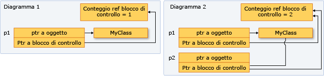

# Procedura: creare e utilizzare istanze shared_ptr
[!INCLUDE[vs2017banner](../assembler/inline/includes/vs2017banner.md)]

Il tipo `shared_ptr` è un puntatore intelligente nella libreria standard di C\+\+ progettata per gli scenari in cui più di un proprietario potrebbe avere la necessità di gestire la durata dell'oggetto in memoria.  Dopo avere inizializzato `shared_ptr`, è possibile copiarlo, passarlo come valore negli argomenti della funzione e assegnarlo alle altre istanze di `shared_ptr`.  Tutte le istanze puntano allo stesso oggetto e condividono l'accesso a un "blocco di controllo" che incrementa e decrementa il contatore delle referenze ogni qualvolta che un nuovo `shared_ptr` viene aggiunto, esce dalla procedura o viene reimpostato.  Quando il contatore delle referenze arriva a zero, il blocco di controllo elimina la risorsa di memoria e sé stesso.  
  
 La seguente figura mostra diverse istanze di `shared_ptr` che puntano a una locazione di memoria.  
  
   
  
## Esempio  
 Quando possibile, utilizzare la funzione [make\_shared](../Topic/make_shared%20\(%3Cmemory%3E\).md) per creare `shared_ptr` quando la risorsa di memoria viene creata per la prima volta.  `make_shared` è un'eccezione di sicurezza.  Utilizza la stessa chiamata per allocare memoria per un blocco di controllo e la risorsa e quindi riduce l'overhead del costrutto.  Se non si utilizza `make_shared`, è necessario utilizzare una nuova espressione esplicita per creare l'oggetto prima di passarlo al costruttore `shared_ptr`.  Nell'esempio seguente vengono mostrati vari modi per dichiarare e inizializzare `shared_ptr` insieme a un nuovo oggetto.  
  
 [!code-cpp[stl_smart_pointers#1](../cpp/codesnippet/CPP/how-to-create-and-use-shared-ptr-instances_1.cpp)]  
  
## Esempio  
 Di seguito viene illustrato come dichiarare e inizializzare le istanze di `shared_ptr` che hanno proprietà condivisa di un oggetto che è già stato allocato da un altro `shared_ptr`.  Si supponga che `sp2` sia un `shared_ptr` inizializzato.  
  
 [!code-cpp[stl_smart_pointers#2](../cpp/codesnippet/CPP/how-to-create-and-use-shared-ptr-instances_2.cpp)]  
  
## Esempio  
 `shared_ptr` è utile anche nei contenitori della Libreria dei Modelli Standard \(STL\) quando si utilizzano algoritmi per la copia di elementi.  È possibile eseguire il wrapping degli elementi in `shared_ptr`, quindi copiarlo in altri contenitori beninteso che la memoria sottostante è valida fino a quando si ha necessità, e non oltre.  Nell'esempio seguente viene illustrato come utilizzare l'algoritmo `replace_copy_if` su delle istanze `shared_ptr` in un vettore.  
  
 [!code-cpp[stl_smart_pointers#4](../cpp/codesnippet/CPP/how-to-create-and-use-shared-ptr-instances_3.cpp)]  
  
## Esempio  
 È possibile utilizzare `dynamic_pointer_cast`, `static_pointer_cast` e `const_pointer_cast` per eseguire il cast di `shared_ptr`.  Queste funzioni sono simili agli operatori `dynamic_cast`, `static_cast`, `const_cast`.  Di seguito viene illustrato come verificare il tipo derivato di ogni elemento di un vettore di `shared_ptr` delle classi di base e quindi di copiare elementi e visualizzare informazioni su di essi.  
  
 [!code-cpp[stl_smart_pointers#5](../cpp/codesnippet/CPP/how-to-create-and-use-shared-ptr-instances_4.cpp)]  
  
## Esempio  
 È possibile passare `shared_ptr` a un'altra funzione nei modi seguenti:  
  
-   Passare `shared_ptr` per valore.  Ciò richiama il costruttore della copia, incrementa il conteggio dei riferimenti e rende proprietario il chiamato.  Esiste una piccola quantità di sovraccarico in questa operazione, che può essere significativa in base al numero di oggetti `shared_ptr` che si stanno passando.  Utilizzare questa opzione quando il contratto \(implicito o esplicito\) tra il chiamante e il chiamato richiede che il chiamato sia un proprietario.  
  
-   Passare `shared_ptr` per riferimento o per riferimento const.  In questo caso, il conteggio dei riferimenti non viene incrementato e il chiamato può accedere al puntatore fino a quando il chiamante non esce dal proprio ambito.  In alternativa, il chiamato può decidere di creare un `shared_ptr` basato sulla referenza e pertanto di diventare un proprietario condiviso.  Utilizzare questa opzione quando il chiamante non possiede alcuna informazione del chiamato, o quando è necessario passare `shared_ptr` e si desidera evitare l'operazione di copia per motivi performativi.  
  
-   Passare il puntatore sottostante o un riferimento all'oggetto sottostante.  Ciò consente al chiamato di utilizzare l'oggetto, ma non consente di condividere la proprietà o di estendere la durata.  Se il chiamato crea un `shared_ptr` da un puntatore grezzo, il nuovo `shared_ptr` è indipendente dall'originale e non controlla la risorsa sottostante.  Utilizzare questa opzione quando il contratto tra il chiamante e il chiamato specifica chiaramente che il chiamante trattiene la proprietà del ciclo di vita di `shared_ptr`.  
  
-   Quando si decide come passare un `shared_ptr`, determinare se il chiamato deve condividere la proprietà della risorsa sottostante.  "Un proprietario" è un oggetto o una funzione che può mantenere la risorsa sottostante attiva fino a quando ne ha bisogno.  Se il chiamante deve garantire che il chiamato può prolungare il ciclo di vita del puntatore oltre la durata della propria funzione, utilizzare la prima opzione.  Se non è necessario che il chiamato estenda il ciclo di vita, allora passare per riferimento e consentire al chiamato di copiarlo o meno.  
  
-   Se è necessario fornire un accesso ad una funzione di supporto al puntatore sottostante, e si è al corrente che la funzione di supporto userà il puntatore e ritornerà prima che ritorni la funzione chiamante, allora tale funzione non dovrà condividere la proprietà del puntatore sottostante.  Deve solamente accedere al puntatore entro il ciclo di vita del `shared_ptr` del chiamante.  In questo caso, è possibile passare `shared_ptr` per riferimento, oppure passare il puntatore non elaborato o un riferimento all'oggetto sottostante.  Passare questo metodo fornisce un piccolo miglioramento delle prestazioni, e può inoltre aiutare ad indicare il proprio intento di programmazione.  
  
-   Talvolta, ad esempio in un `std:vector<shared_ptr<T>>`, è necessario passare ogni `shared_ptr` ad un corpo di espressione lambda o ad un oggetto funzione denominato.  Se la lambda o la funzione non memorizza il puntatore, allora passa il `shared_ptr` con riferimento per evitare di invocare la copia del costruttore per ogni elemento.  
  
 [!CODE [stl_smart_pointers#6](../CodeSnippet/VS_Snippets_Cpp/stl_smart_pointers#6)]  
  
## Esempio  
 Di seguito viene illustrato come `shared_ptr` esegue l'overload di alcuni operatori di confronto per abilitare i confronti del puntatore sulla memoria che è posseduta da istanze di `shared_ptr`.  
  
 [!code-cpp[stl_smart_pointers#3](../cpp/codesnippet/CPP/how-to-create-and-use-shared-ptr-instances_6.cpp)]  
  
## Vedere anche  
 [Puntatori intelligenti](../cpp/smart-pointers-modern-cpp.md)