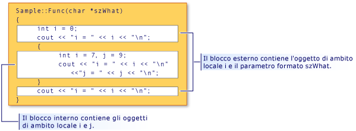

# <a name="scope-c"></a>Ambito (C++)

Quando si dichiara un elemento del programma, ad esempio una classe, una funzione o una variabile, il nome può essere "visualizzato" solo e utilizzato in determinate parti del programma. Il contesto in cui un nome è visibile è denominato *ambito*. Se, ad esempio, si dichiara una variabile `x` all'interno di una funzione, `x` è visibile solo all'interno del corpo di tale funzione. Ha *ambito locale*. Nel programma potrebbero essere presenti altre variabili con lo stesso nome; finché si trovano in ambiti diversi, non violano la regola di definizione di una definizione e non viene generato alcun errore.

Per le variabili automatiche non statiche, l'ambito determina anche quando vengono creati ed eliminati nella memoria del programma.

Sono disponibili sei tipi di ambito:

- **Ambito globale** Un nome globale è uno dichiarato al di fuori di qualsiasi classe, funzione o spazio dei nomi. Tuttavia, in C++ anche questi nomi esistono con uno spazio dei nomi globale implicito. L'ambito dei nomi globali si estende dal punto di dichiarazione fino alla fine del file in cui sono dichiarati. Per i nomi globali, la visibilità è regolata anche dalle regole di [collegamento](program-and-linkage-cpp.md) , che determinano se il nome è visibile in altri file del programma.

- **Ambito dello spazio dei nomi** Un nome dichiarato all'interno di uno [spazio dei nomi](namespaces-cpp.md), esterno a qualsiasi definizione di classe o di enumerazione o blocco di funzione, è visibile dal punto di dichiarazione alla fine dello spazio dei nomi. Uno spazio dei nomi può essere definito in più blocchi tra file diversi.

- **Ambito locale** Un nome dichiarato all'interno di una funzione o di un'espressione lambda, inclusi i nomi dei parametri, ha ambito locale. Sono spesso denominate "variabili locali". Sono visibili solo dal punto di dichiarazione alla fine della funzione o del corpo dell'espressione lambda. L'ambito locale è un tipo di ambito del blocco, illustrato più avanti in questo articolo.

- **Ambito della classe** I nomi dei membri della classe hanno un ambito di classe che si estende in tutta la definizione della classe, indipendentemente dal punto di dichiarazione. L'accessibilità dei membri di classe è ulteriormente controllata dalle **`public`** **`private`** **`protected`** parole chiave, e. È possibile accedere ai membri pubblici o protetti solo tramite gli operatori di selezione dei membri (**.** o **->** ) o operatori puntatore a membro (**.** <strong>\*</strong> o **->** <strong>\*</strong> ).

- **Ambito dell'istruzione** I nomi dichiarati in un' **`for`** **`if`** istruzione,, **`while`** o **`switch`** sono visibili fino alla fine del blocco di istruzioni.

- **Ambito della funzione** Un' [etichetta](labeled-statements.md) ha un ambito di funzione, il che significa che è visibile in un corpo di funzione anche prima del relativo punto di dichiarazione. L'ambito della funzione rende possibile la scrittura di istruzioni come `goto cleanup` prima che l' `cleanup` etichetta venisse dichiarata.

## <a name="hiding-names"></a>Nascondere nomi

È possibile nascondere un nome dichiarandolo in un blocco chiuso. Nella figura seguente `i` viene ridichiarato nel blocco interno, quindi nascondendo la variabile associata a `i` nell'ambito del blocco esterno.

 <br/>
Nascondere il nome e l'ambito del blocco

L'output del programma illustrato nella figura è:

```cpp
i = 0
i = 7
j = 9
i = 0
```

> [!NOTE]
> L'argomento `szWhat` viene considerato nell'ambito della funzione. Di conseguenza, viene considerato come se fosse stato dichiarato nel blocco più esterno della funzione.

## <a name="hiding-class-names"></a>Nascondere nomi di classi

È possibile nascondere i nomi della classe mediante la dichiarazione di una funzione, un oggetto o una variabile o un enumeratore nello stesso ambito. Tuttavia, è ancora possibile accedere al nome della classe quando il prefisso è preceduto dalla parola chiave **`class`** .

```cpp
// hiding_class_names.cpp
// compile with: /EHsc
#include <iostream>
using namespace std;

// Declare class Account at global scope.
class Account
{
public:
    Account( double InitialBalance )
        { balance = InitialBalance; }
    double GetBalance()
        { return balance; }
private:
    double balance;
};

double Account = 15.37;            // Hides class name Account

int main()
{
    class Account Checking( Account ); // Qualifies Account as
                                       //  class name

    cout << "Opening account with a balance of: "
         << Checking.GetBalance() << "\n";
}
//Output: Opening account with a balance of: 15.37
```

> [!NOTE]
> Per ogni posizione in cui viene chiamato il nome della classe ( `Account` ), la classe della parola chiave deve essere usata per distinguerla dall'account della variabile con ambito globale. Questa regola non viene applicata quando il nome della classe si trova a sinistra dell'operatore di risoluzione dell'ambito (::). I nomi a sinistra dell'operatore di risoluzione dell'ambito vengono sempre considerati nomi classe.

Nell'esempio seguente viene illustrato come dichiarare un puntatore a un oggetto di tipo `Account` utilizzando la **`class`** parola chiave:

```cpp
class Account *Checking = new class Account( Account );
```

L'oggetto `Account` nell'inizializzatore (tra parentesi) nell'istruzione precedente ha ambito globale; è di tipo **`double`** .

> [!NOTE]
> Il riutilizzo dei nomi degli identificatori come illustrato in questo esempio viene considerato uno stile di programmazione di qualità insufficiente.

Per informazioni sulla dichiarazione e l'inizializzazione degli oggetti classe, vedere [classi, strutture e unioni](../cpp/classes-and-structs-cpp.md). Per informazioni sull'uso degli **`new`** **`delete`** operatori Free-Store e, vedere [operatori new e Delete](new-and-delete-operators.md).

## <a name="hiding-names-with-global-scope"></a>Nascondere nomi con ambito globale

È possibile nascondere i nomi con ambito globale dichiarando in modo esplicito lo stesso nome nell'ambito del blocco. È tuttavia possibile accedere ai nomi di ambito globali utilizzando l'operatore di risoluzione dell'ambito ( `::` ).

```cpp
#include <iostream>

int i = 7;   // i has global scope, outside all blocks
using namespace std;

int main( int argc, char *argv[] ) {
   int i = 5;   // i has block scope, hides i at global scope
   cout << "Block-scoped i has the value: " << i << "\n";
   cout << "Global-scoped i has the value: " << ::i << "\n";
}
```

```Output
Block-scoped i has the value: 5
Global-scoped i has the value: 7
```

## <a name="see-also"></a>Vedi anche

[Concetti di base](../cpp/basic-concepts-cpp.md)
