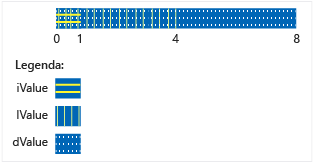

# <a name="unions"></a>Unioni
`union` è un tipo definito dall'utente in cui tutti i membri condividono la stessa posizione di memoria. Ciò significa che in qualsiasi momento un'unione può includere al massimo un oggetto dal rispettivo elenco di membri. Significa anche che, indipendentemente dal numero di membri, un'unione usa sempre solo la quantità di memoria necessaria per archiviare il membro più grande.  
  
 Le unioni possono risultare utili per conservare la memoria quando sono presenti molti oggetti e/o la memoria è limitata. È tuttavia necessario prestare particolare attenzione e usarle correttamente, poiché occorre assicurare di accedere sempre all'ultimo membro sottoposto a scrittura. Se alcuni tipi di membro hanno un costruttore non superfluo, sarà necessario scrivere codice aggiuntivo per costruire e distruggere esplicitamente tale membro. Prima di usare un'unione, stabilire se il problema da risolvere non possa essere espresso meglio mediante una classe base e classi derivate.  
  
## <a name="syntax"></a>Sintassi  
  
```cpp  
union [name]  { member-list };  
```  
  
#### <a name="parameters"></a>Parametri  
 `name`  
 Nome del tipo assegnato all'unione.  
  
 `member-list`  
 Membri che possono essere inclusi nell'unione. Vedere la sezione Osservazioni.  
  
## <a name="remarks"></a>Note  
  
## <a name="declaring-a-union"></a>Dichiarazione di un'unione  
 Iniziare la dichiarazione di un'unione con la parola chiave `union` e racchiudere l'elenco dei membri tra parentesi graffe:  
  
```cpp  
// declaring_a_union.cpp  
union RecordType    // Declare a simple union type  
{  
    char   ch;  
    int    i;  
    long   l;  
    float  f;  
    double d;  
    int *int_ptr;  
};   
int main()  
{  
    RecordType t;  
    t.i = 5; // t holds an int  
    t.f = 7.25 // t now holds a float   
}  
```  
  
## <a name="using-unions"></a>Uso delle unioni  
 Nell'esempio precedente il codice che accede all'unione deve sapere quale membro contiene i dati. La soluzione più comune per questo problema consiste nel racchiudere l'unione in uno struct insieme a un membro di enumerazione aggiuntivo che indica il tipo di dati attualmente archiviati nell'unione. Si tratta di un *unione discriminata* e nell'esempio seguente viene illustrato il modello di base.  
  
```cpp  
#include "stdafx.h"  
#include <queue>  
  
using namespace std;  
  
enum class WeatherDataType  
{  
    Temperature, Wind  
};  
  
struct TempData  
{  
    int StationId;  
    time_t time;  
    double current;  
    double max;  
    double min;  
};  
  
struct WindData  
{  
    int StationId;  
    time_t time;  
    int speed;  
    short direction;  
};  
  
struct Input  
{  
    WeatherDataType type;  
    union  
    {  
        TempData temp;  
        WindData wind;  
    };  
};  
  
// Functions that are specific to data types  
void Process_Temp(TempData t) {}  
void Process_Wind(WindData w) {}  
  
// Container for all the data records  
queue<Input> inputs;  
void Initialize();  
  
int main(int argc, char* argv[])  
{  
    Initialize();  
    while (!inputs.empty())  
    {  
        Input i = inputs.front();  
        switch (i.type)  
        {  
        case WeatherDataType::Temperature:  
            Process_Temp(i.temp);  
            break;  
        case WeatherDataType::Wind:  
            Process_Wind(i.wind);  
            break;  
        default:  
            break;  
        }  
        inputs.pop();  
  
    }  
    return 0;  
}  
  
void Initialize()  
{  
    Input first, second;  
    first.type = WeatherDataType::Temperature;  
    first.temp = { 101, 1418855664, 91.8, 108.5, 67.2 };  
    inputs.push(first);  
  
    second.type = WeatherDataType::Wind;  
    second.wind = { 204,1418859354, 14, 27 };  
    inputs.push(second);  
}  
  
```  
  
 Si noti che nell'esempio precedente l'unione nello struct Input non ha nome. Si tratta di un'unione anonima ed è possibile accedere ai rispettivi membri come se fossero membri diretti dello struct. Per altre informazioni sulle unioni anonime, vedere la sezione seguente.  
  
 Ovviamente, l'esempio precedente illustra un problema che può essere risolto anche usando classi derivate da una classe base comune e creando rami del codice in base al tipo di runtime di ogni oggetto nel contenitore. Questo può permettere di ottenere codice più semplice da mantenere e comprendere, ma può risultare più lento rispetto all'uso di unioni. Un'unione permette anche di archiviare tipi completamente non correlati e di cambiare dinamicamente il tipo del valore archiviato senza cambiare il tipo della variabile di unione stessa. È quindi possibile creare una matrice eterogenea di MyUnionType, i cui elementi archiviano valori di tipi diversi.  
  
 Si noti che lo struct `Input` nell'esempio seguente può essere facilmente usato in modo improprio. L'uso corretto del discriminatore per accedere al membro contenente i dati dipende completamente dall'utente. È possibile proteggersi da un uso improprio rendendo privata l'unione e fornendo funzioni di accesso speciali, come illustrato nell'esempio seguente.  
  
## <a name="unrestricted-unions-c11"></a>Unioni senza restrizioni (C++11)  
 In C++03 e versioni precedenti un'unione può contenere membri dati non statici con un tipo di classe, purché il tipo non includa costruttori, distruttori oppure operatori di assegnazione forniti dall'utente. In C++11 queste restrizioni sono state rimosse. Se si include un membro di questo tipo nell'unione, il compilatore contrassegnerà automaticamente come eliminate eventuali funzioni membro speciali non fornite dall'utente. Se l'unione è un'unione anonima in una classe o uno struct, eventuali funzioni membro speciali della classe o dello struct non fornite dall'utente verranno contrassegnate come eliminate. L'esempio seguente illustra come gestire il caso in cui uno dei membri dell'unione include un membro che richiede questo trattamento speciale:  
  
```cpp  
// for MyVariant  
#include <crtdbg.h>  
#include <new>  
#include <utility>  
  
// for sample objects and output  
#include <string>  
#include <vector>  
#include <iostream>  
  
using namespace std;  
  
struct A   
{  
    A() = default;  
    A(int i, const string& str) : num(i), name(str) {}  
  
    int num;  
    string name;  
    //...  
};  
  
struct B   
{  
    B() = default;  
    B(int i, const string& str) : num(i), name(str) {}  
  
    int num;  
    string name;  
    vector<int> vec;  
    // ...  
};  
  
enum class Kind { None, A, B, Integer };  
  
#pragma warning (push)  
#pragma warning(disable:4624)  
class MyVariant  
{  
public:  
    MyVariant()  
        : kind_(Kind::None)  
    {  
    }  
  
    MyVariant(Kind kind)  
        : kind_(kind)  
    {  
        switch (kind_)  
        {  
        case Kind::None:  
            break;  
        case Kind::A:  
            new (&a_) A();  
            break;  
        case Kind::B:  
            new (&b_) B();  
            break;  
        case Kind::Integer:  
            i_ = 0;  
            break;  
        default:  
            _ASSERT(false);  
            break;  
        }  
    }  
  
    ~MyVariant()  
    {  
        switch (kind_)  
        {  
        case Kind::None:  
            break;  
        case Kind::A:  
            a_.~A();  
            break;  
        case Kind::B:  
            b_.~B();  
            break;  
        case Kind::Integer:  
            break;  
        default:  
            _ASSERT(false);  
            break;  
        }  
        kind_ = Kind::None;  
    }  
  
    MyVariant(const MyVariant& other)  
        : kind_(other.kind_)  
    {  
        switch (kind_)  
        {  
        case Kind::None:  
            break;  
        case Kind::A:  
            new (&a_) A(other.a_);  
            break;  
        case Kind::B:  
            new (&b_) B(other.b_);  
            break;  
        case Kind::Integer:  
            i_ = other.i_;  
            break;  
        default:  
            _ASSERT(false);  
            break;  
        }  
    }  
  
    MyVariant(MyVariant&& other)  
        : kind_(other.kind_)  
    {  
        switch (kind_)  
        {  
        case Kind::None:  
            break;  
        case Kind::A:  
            new (&a_) A(move(other.a_));  
            break;  
        case Kind::B:  
            new (&b_) B(move(other.b_));  
            break;  
        case Kind::Integer:  
            i_ = other.i_;  
            break;  
        default:  
            _ASSERT(false);  
            break;  
        }  
        other.kind_ = Kind::None;  
    }  
  
    MyVariant& operator=(const MyVariant& other)  
    {  
        if (&other != this)  
        {  
            switch (other.kind_)  
            {  
            case Kind::None:  
                this->~MyVariant();  
                break;  
            case Kind::A:  
                *this = other.a_;  
                break;  
            case Kind::B:  
                *this = other.b_;  
                break;  
            case Kind::Integer:  
                *this = other.i_;  
                break;  
            default:  
                _ASSERT(false);  
                break;  
            }  
        }  
        return *this;  
    }  
  
    MyVariant& operator=(MyVariant&& other)  
    {  
        _ASSERT(this != &other);  
        switch (other.kind_)  
        {  
        case Kind::None:  
            this->~MyVariant();  
            break;  
        case Kind::A:  
            *this = move(other.a_);  
            break;  
        case Kind::B:  
            *this = move(other.b_);  
            break;  
        case Kind::Integer:  
            *this = other.i_;  
            break;  
        default:  
            _ASSERT(false);  
            break;  
        }  
        other.kind_ = Kind::None;  
        return *this;  
    }  
  
    MyVariant(const A& a)  
        : kind_(Kind::A), a_(a)  
    {  
    }  
  
    MyVariant(A&& a)  
        : kind_(Kind::A), a_(move(a))  
    {  
    }  
  
    MyVariant& operator=(const A& a)  
    {  
        if (kind_ != Kind::A)  
        {  
            this->~MyVariant();  
            new (this) MyVariant(a);  
        }  
        else  
        {  
            a_ = a;  
        }  
        return *this;  
    }  
  
    MyVariant& operator=(A&& a)  
    {  
        if (kind_ != Kind::A)  
        {  
            this->~MyVariant();  
            new (this) MyVariant(move(a));  
        }  
        else  
        {  
            a_ = move(a);  
        }  
        return *this;  
    }  
  
    MyVariant(const B& b)  
        : kind_(Kind::B), b_(b)  
    {  
    }  
  
    MyVariant(B&& b)  
        : kind_(Kind::B), b_(move(b))  
    {  
    }  
  
    MyVariant& operator=(const B& b)  
    {  
        if (kind_ != Kind::B)  
        {  
            this->~MyVariant();  
            new (this) MyVariant(b);  
        }  
        else  
        {  
            b_ = b;  
        }  
        return *this;  
    }  
  
    MyVariant& operator=(B&& b)  
    {  
        if (kind_ != Kind::B)  
        {  
            this->~MyVariant();  
            new (this) MyVariant(move(b));  
        }  
        else  
        {  
            b_ = move(b);  
        }  
        return *this;  
    }  
  
    MyVariant(int i)  
        : kind_(Kind::Integer), i_(i)  
    {  
    }  
  
    MyVariant& operator=(int i)  
    {  
        if (kind_ != Kind::Integer)  
        {  
            this->~MyVariant();  
            new (this) MyVariant(i);  
        }  
        else  
        {  
            i_ = i;  
        }  
        return *this;  
    }  
  
    Kind GetKind() const  
    {  
        return kind_;  
    }  
  
    A& GetA()  
    {  
        _ASSERT(kind_ == Kind::A);  
        return a_;  
    }  
  
    const A& GetA() const  
    {  
        _ASSERT(kind_ == Kind::A);  
        return a_;  
    }  
  
    B& GetB()  
    {  
        _ASSERT(kind_ == Kind::B);  
        return b_;  
    }  
  
    const B& GetB() const  
    {  
        _ASSERT(kind_ == Kind::B);  
        return b_;  
    }  
  
    int& GetInteger()  
    {  
        _ASSERT(kind_ == Kind::Integer);  
        return i_;  
    }  
  
    const int& GetInteger() const  
    {  
        _ASSERT(kind_ == Kind::Integer);  
        return i_;  
    }  
  
private:  
    Kind kind_;  
    union  
    {  
        A a_;  
        B b_;  
        int i_;  
    };  
};  
#pragma warning (pop)  
  
int main()  
{  
    A a(1, "Hello from A");  
    B b(2, "Hello from B");  
  
    MyVariant mv_1 = a;  
  
    cout << "mv_1 = a: " << mv_1.GetA().name << endl;  
    mv_1 = b;  
    cout << "mv_1 = b: " << mv_1.GetB().name << endl;  
    mv_1 = A(3, "hello again from A");  
    cout << R"aaa(mv_1 = A(3, "hello again from A"): )aaa" << mv_1.GetA().name << endl;  
    mv_1 = 42;  
    cout << "mv_1 = 42: " << mv_1.GetInteger() << endl;  
  
    b.vec = { 10,20,30,40,50 };  
  
    mv_1 = move(b);  
    cout << "After move, mv_1 = b: vec.size = " << mv_1.GetB().vec.size() << endl;  
  
    cout << endl << "Press a letter" << endl;  
    char c;  
    cin >> c;  
}  
#include <queue>  
#include <iostream>  
using namespace std;  
  
enum class WeatherDataType  
{  
    Temperature, Wind  
};  
  
struct TempData  
{  
    TempData() : StationId(""), time(0), current(0), maxTemp(0), minTemp(0) {}  
    TempData(string id, time_t t, double cur, double max, double min)  
        : StationId(id), time(t), current(cur), maxTemp(max), minTemp(0) {}  
    string StationId;  
    time_t time = 0;  
    double current;  
    double maxTemp;  
    double minTemp;  
};  
  
struct WindData  
{  
    int StationId;  
    time_t time;  
    int speed;  
    short direction;  
};  
  
struct Input  
{  
    Input() {}  
    Input(const Input&) {}  
  
    ~Input()  
    {  
        if (type == WeatherDataType::Temperature)  
        {  
            temp.StationId.~string();  
        }  
    }  
  
    WeatherDataType type;  
    void SetTemp(const TempData& td)  
    {  
        type = WeatherDataType::Temperature;  
  
        // must use placement new because of string member!  
        new(&temp) TempData(td);  
    }  
  
    TempData GetTemp()  
    {  
        if (type == WeatherDataType::Temperature)  
            return temp;  
        else  
            throw logic_error("Can't return TempData when Input holds a WindData");  
    }  
    void SetWind(WindData wd)  
    {  
        // Explicitly delete struct member that has a   
        // non-trivial constructor  
        if (type == WeatherDataType::Temperature)  
        {  
            temp.StationId.~string();  
        }  
        wind = wd; //placement new not required.  
    }  
    WindData GetWind()  
    {  
        if (type == WeatherDataType::Wind)  
        {  
            return wind;  
        }  
        else  
            throw logic_error("Can't return WindData when Input holds a TempData");  
    }  
  
private:  
  
    union  
    {  
        TempData temp;  
        WindData wind;  
    };  
};  
  
```  
  
 Le unioni non possono archiviare riferimenti. Le unioni non supportano l'ereditarietà, quindi un'unione stessa non può essere usata come classe base o ereditare da un'altra classe oppure includere funzioni virtuali.  
  
## <a name="initializing-unions"></a>Inizializzazione delle unioni  
 È possibile dichiarare e inizializzare un'unione nella stessa istruzione assegnando un'espressione racchiusa tra parentesi graffe. L'espressione viene valutata e assegnata al primo campo dell'unione.  
  
```cpp  
#include <iostream>  
using namespace std;  
  
union NumericType  
{  
    short       iValue;  
    long        lValue;    
    double      dValue;    
};  
  
int main()  
{  
    union NumericType Values = { 10 };   // iValue = 10  
    cout << Values.iValue << endl;  
    Values.dValue = 3.1416;  
    cout << Values.dValue) << endl;  
}  
/* Output:  
 10  
 3.141600  
*/  
  
```  
  
 L'unione `NumericType` viene gestita in memoria (concettualmente) come illustrato nella figura seguente.  
  
   
Archiviazione di dati in unione NumericType  
  
## <a name="anonymous_unions"></a> Unioni anonime  
 Unioni anonime sono unioni che sono dichiarate senza un *del nome della classe* o *declarator-list*.  
  
```cpp  
union  {  member-list  }    
```  
  
I nomi dichiarati in un'unione anonima vengono utilizzati direttamente, come le variabili non membro. I nomi dichiarati in un'unione anonima devono essere quindi univoci nell'ambito circostante.  
  
Oltre alle restrizioni per le unioni denominate, unioni anonime sono soggette a limitazioni aggiuntive seguenti:  
  
-   Deve inoltre essere dichiarate come **statico** se dichiarata in ambito file o spazio dei nomi.  
  
-   Possono avere solo membri pubblici; i membri privati e protetti nelle unioni anonime generano errori.  
  
-   Non possono avere funzioni membro.  
  
## <a name="see-also"></a>Vedere anche  
 [Classi e struct](../cpp/classes-and-structs-cpp.md)   
 [Parole chiave](../cpp/keywords-cpp.md)   
 [class](../cpp/class-cpp.md)   
 [struct](../cpp/struct-cpp.md)