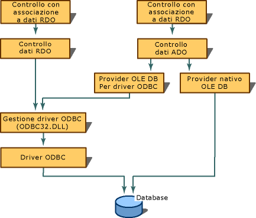

# Creazione di connessioni a database
[!INCLUDE[vs2017banner](../../assembler/inline/includes/vs2017banner.md)]

Per utilizzare l'associazione dati è necessario configurare un'origine dati.  Quando si utilizza il controllo dati ADO, è necessario configurare una connessione OLE DB,  mentre quando si utilizza il controllo RemoteData RDO, è necessario creare una connessione ODBC \(Open Database Connectivity\).  Dal momento che Visual C\+\+ viene fornito con un provider OLE DB per le origini dati ODBC, il controllo dati ADO potrà utilizzare anche connessioni ODBC.  
  
   
  
## Vedere anche  
 [Controlli associati a dati \(ADO e RDO\)](../../data/ado-rdo/data-bound-controls-ado-and-rdo.md)   
 [Connessioni ODBC](../../data/ado-rdo/odbc-connections.md)   
 [Connessioni Oracle](../../data/ado-rdo/oracle-connections.md)