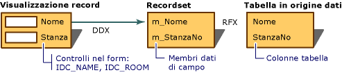

# Scambio di dati per le visualizzazioni di record (accesso ai dati MFC)

Quando si usa [Aggiungi classe](../mfc/reference/adding-an-mfc-odbc-consumer.md) per eseguire il mapping dei controlli in una risorsa modello di finestra di dialogo di una visualizzazione di record ai campi di un recordset, il Framework gestisce lo scambio di dati in entrambe le direzioni, da recordset a controlli e da controlli a recordset. Il meccanismo DDX elimina la necessità di scrivere manualmente il codice per il trasferimento dei dati nelle due direzioni.

DDX per le visualizzazioni di record funziona insieme a [RFX](../data/odbc/record-field-exchange-rfx.md) per i recordset della classe `CRecordset` (ODBC).  RFX sposta i dati tra il record corrente dell'origine dati e i membri dati del campo di un oggetto recordset. DDX sposta i dati dai membri dati di campi ai controlli nel form. Questa combinazione fornisce i dati per i controlli del form sia inizialmente sia quando l'utente si sposta da un record all'altro. Inoltre è in grado di spostare nuovamente nel recordset e quindi nell'origine dati i dati aggiornati.

Nella figura seguente viene illustrata la relazione tra DDX e RFX per le visualizzazioni di record.

 
DDX (Dialog Data Exchange) e RFX (Record Field Exchange)

Per altre informazioni su DDX, vedere [Convalida e DDX (Dialog Data Exchange)](../mfc/dialog-data-exchange-and-validation.md). Per ulteriori informazioni su RFX, vedere [trasferimento di campi di record (RFX)](../data/odbc/record-field-exchange-rfx.md).

## Vedi anche

[Visualizzazioni di record (accesso ai dati MFC)](../data/record-views-mfc-data-access.md) 
[Elenco di driver ODBC](../data/odbc/odbc-driver-list.md)
