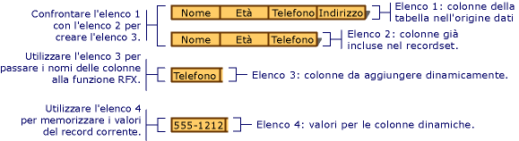

# <a name="recordset-dynamically-binding-data-columns-odbc"></a>Recordset: associazione dinamica di colonne di dati (ODBC)

Le informazioni contenute in questo argomento sono valide per le classi ODBC MFC.

I recordset gestiscono l'associazione delle colonne di tabella specificate in fase di progettazione, tuttavia in alcuni casi è necessario associare colonne che erano sconosciute in fase di progettazione. In questo argomento:

- [Quando associare colonne in modo dinamico a un oggetto recordset](#_core_when_you_might_bind_columns_dynamically).

- [Come associare le colonne in modo dinamico in fase di esecuzione](#_core_how_to_bind_columns_dynamically).

> [!NOTE]
>  Questo argomento si applica agli oggetti derivati da `CRecordset` in cui non è stato implementato il recupero di massa di righe. Le tecniche descritte in genere non sono consigliate se si usa il recupero di massa di righe. Per altre informazioni sul recupero di massa di righe, vedere [Recordset: recupero di record in blocco (ODBC)](../../data/odbc/recordset-fetching-records-in-bulk-odbc.md).

##  <a name="_core_when_you_might_bind_columns_dynamically"></a> Quando associare colonne in modo dinamico

> [!NOTE] 
> La Creazione guidata consumer ODBC MFC non è disponibile in Visual Studio 2019 e versioni successive. È comunque possibile creare manualmente un consumer.

In fase di progettazione, la Creazione guidata applicazione MFC o la [Creazione guidata consumer ODBC MFC](../../mfc/reference/adding-an-mfc-odbc-consumer.md) (da **Aggiungi classe**) crea le classi recordset in base alle tabelle e alle colonne note nell'origine dati. I database possono cambiare tra il momento in cui si esegue la progettazione e quello in cui l'applicazione usa le tabelle e le colonne in fase di esecuzione. Un utente potrebbe aggiungere o eliminare una tabella oppure aggiungere o eliminare colonne da una tabella su cui è basato il recordset dell'applicazione. Questo forse non rappresenta un problema per tutte le applicazioni di accesso ai dati. Tuttavia, in questi casi, com'è possibile gestire le modifiche dello schema del database, senza eseguire la riprogettazione e la ricompilazione? Lo scopo del presente argomento è rispondere a questa domanda.

In questo argomento viene descritto il caso più comune, in cui è possibile associare le colonne in modo dinamico: dopo aver iniziato con un recordset basato su uno schema di database noto, si vogliono gestire colonne aggiuntive in fase di esecuzione. Nell'argomento si presuppone inoltre che le colonne aggiuntive siano mappate ai membri dati di campo `CString` (il caso più comune), anche se vengono forniti suggerimenti per la gestione di altri tipi di dati.

Con una piccola quantità di codice aggiuntivo, è possibile:

- [Determinare quali colonne sono disponibili in fase di esecuzione](#_core_how_to_bind_columns_dynamically).

- [Associare le colonne aggiuntive al recordset in modo dinamico, in fase di esecuzione](#_core_adding_the_columns).

Il recordset contiene ancora i membri dati per le colonne che erano note in fase di progettazione. Inoltre, include una piccola quantità di codice aggiuntivo che determina in modo dinamico se sono state aggiunte nuove colonne alla tabella di destinazione e, in tal caso, associa le nuove colonne alla memoria allocata in modo dinamico (invece che ai membri dati del recordset).

In questo argomento non vengono illustrati altri casi di associazione dinamica, come le colonne o tabelle eliminate. In questi casi, è necessario usare le chiamate all'API ODBC in modo più diretto. Per informazioni, vedere le *informazioni di riferimento per programmatori* dell'SDK di ODBC sul CD di MSDN Library.

##  <a name="_core_how_to_bind_columns_dynamically"></a> Come associare le colonne in modo dinamico

Per associare le colonne in modo dinamico, è necessario conoscere (o essere in grado di determinare) i nomi delle colonne aggiuntive. È anche necessario allocare memoria per i membri dati di campo aggiuntivi, specificarne i nomi e i tipi e specificare il numero di colonne da aggiungere.

Nella descrizione seguente sono specificati due diversi recordset. Il primo è il recordset principale, che seleziona i record dalla tabella di destinazione. Il secondo è uno speciale recordset di colonna usato per ottenere informazioni sulle colonne nella tabella di destinazione.

###  <a name="_core_the_general_process"></a> Processo generale

A livello generale, è necessario procedere come segue:

1. Costruire l'oggetto recordset principale.

   Facoltativamente, passare un puntatore a un oggetto `CDatabase` aperto o specificare le informazioni di connessione per il recordset di colonna in un altro modo.

1. Eseguire i passaggi per aggiungere le colonne in modo dinamico.

   Vedere la procedura descritta di seguito nella sezione Aggiunta delle colonne.

1. Aprire il recordset principale.

   Il recordset seleziona i record e usa il trasferimento di campi di record (RFX) per associare le colonne statiche (mappate ai membri dati di campo del recordset) e le colonne dinamiche (mappate alla memoria aggiuntiva allocata).

###  <a name="_core_adding_the_columns"></a> Aggiunta delle colonne

L'associazione dinamica di colonne aggiunte in fase di esecuzione richiede i passaggi seguenti:

1. Determinare in fase di esecuzione quali sono le colonne nella tabella di destinazione. Estrarre da tali informazioni un elenco delle colonne che sono state aggiunte alla tabella dopo la progettazione della classe recordset.

   Un buon approccio consiste nell'usare una classe recordset di colonna progettata per eseguire query sull'origine dati in modo da ottenere le informazioni sulle colonne per la tabella di destinazione, ad esempio il nome e il tipo di dati della colonna.

1. Fornire l'archiviazione per i nuovi membri dati di campo. Poiché la classe recordset principale non dispone di membri dati di campo per le colonne sconosciute, è necessario specificare una posizione in cui archiviare i nomi, i valori dei risultati ed eventualmente le informazioni sul tipo di dati (se le colonne sono di tipi di dati diversi).

   Un approccio consiste nel compilare uno o più elenchi dinamici, uno per i nuovi nomi delle colonne, un altro per i valori dei risultati e un terzo per i tipi di dati (se necessario). Questi elenchi, in particolare l'elenco dei valori, forniscono le informazioni e l'archiviazione necessaria per l'associazione. La figura seguente illustra la compilazione degli elenchi.

   <br/>
   Compilazione degli elenchi di colonne da associare in modo dinamico

1. Aggiungere una chiamata di funzione RFX alla funzione `DoFieldExchange` del recordset principale per ciascuna colonna aggiunta. Queste chiamate RFX eseguono il recupero di un record, incluse le colonne aggiuntive, e l'associazione delle colonne ai membri dati del recordset o all'archiviazione fornita in modo dinamico.

   Un approccio consiste nell'aggiungere un ciclo alla funzione `DoFieldExchange` del recordset principale, per scorrere l'elenco delle nuove colonne e chiamare la funzione RFX appropriata per ogni colonna nell'elenco. Per ogni chiamata RFX, passare un nome di colonna dall'elenco dei nomi di colonna e un percorso di archiviazione nel membro corrispondente dell'elenco dei valori dei risultati.

###  <a name="_core_lists_of_columns"></a> Elenchi di colonne

Nella tabella seguente sono illustrati i quattro elenchi con cui è necessario lavorare.

|||
|-|-|
|**Current-Table-Columns**| (Elenco 1 nella figura) Un elenco delle colonne attualmente presenti nella tabella dell'origine dati. Questo elenco può corrispondere all'elenco delle colonne attualmente associate nel recordset.|
|**Bound-Recordset-Columns**| (Elenco 2 nella figura) Un elenco delle colonne associate nel recordset. Queste colonne contengono già istruzioni RFX nella funzione `DoFieldExchange`.|
|**Columns-To-Bind-Dynamically**| (Elenco 3 nella figura) Un elenco delle colonne presenti nella tabella ma non nel recordset. Queste sono le colonne da associare in modo dinamico.|
|**Dynamic-Column-Values**| (Elenco 4 nella figura) Un elenco che contiene l'archiviazione per i valori recuperati dalle colonne associate in modo dinamico. Gli elementi di questo elenco corrispondono a quelli in Columns-to-Bind-Dynamically, con una relazione uno a uno.|

###  <a name="_core_building_your_lists"></a> Compilazione degli elenchi

Dopo aver definito una strategia generale, è possibile occuparsi dei dettagli. Le procedure descritte nella parte restante di questo argomento illustrano come compilare gli elenchi riportati nella sezione [Elenchi di colonne](#_core_lists_of_columns). Le procedure illustrano gli aspetti seguenti:

- [Determinazione dei nomi delle colonne non presenti nel recordset](#_core_determining_which_table_columns_are_not_in_your_recordset).

- [Specificazione dell'archiviazione dinamica per le nuove colonne aggiunte alla tabella](#_core_providing_storage_for_the_new_columns).

- [Aggiunta dinamica delle chiamate RFX per le nuove colonne](#_core_adding_rfx_calls_to_bind_the_columns).

###  <a name="_core_determining_which_table_columns_are_not_in_your_recordset"></a> Determinazione delle colonne di tabella non incluse nel recordset

Compilare un elenco (Bound-Recordset-Columns, come l'elenco 2 nella figura) che contiene un elenco delle colonne già associate nel recordset principale. Compilare quindi un elenco (Columns-to-Bind-Dynamically, derivato da Current-Table-Columns e Bound-Recordset-Columns) che contiene i nomi di colonna presenti nella tabella dell'origine dati, ma non nel recordset principale.

##### <a name="to-determine-the-names-of-columns-not-in-the-recordset-columns-to-bind-dynamically"></a>Per determinare i nomi delle colonne non presenti nel recordset (Columns-to-Bind-Dynamically)

1. Compilare un elenco (Bound-Recordset-Columns) delle colonne già associate nel recordset principale.

   Un approccio consiste nella creazione di Bound-Recordset-Columns in fase di progettazione. È possibile esaminare visivamente le chiamate di funzione RFX nella funzione `DoFieldExchange` del recordset per ottenere tali nomi. Impostare quindi l'elenco come una matrice inizializzata con i nomi.

   Ad esempio, la figura mostra Bound-Recordset-Columns (elenco 2) con tre elementi. In Bound-Recordset-Columns manca la colonna Phone mostrata in Current-Table-Columns (elenco 1).

1. Confrontare Current-Table-Columns e Bound-Recordset-Columns per compilare un elenco (Columns-to-Bind-Dynamically) delle colonne che non sono già associate nel recordset principale.

   Un approccio consiste nello scorrere in ciclo l'elenco di colonne della tabella in fase di esecuzione (Current-Table-Columns) e l'elenco di colonne già associate nel recordset (Bound-Recordset-Columns) in parallelo. Inserire in Columns-to-Bind-Dynamically tutti i nomi contenuti in Current-Table-Columns che non sono presenti in Bound-Recordset-Columns.

   Ad esempio, la figura mostra Columns-to-Bind-Dynamically (elenco 3) con un solo elemento: la colonna Phone presente in Current-Table-Columns (elenco 1) ma non in Bound-Recordset-Columns (elenco 2).

1. Compilare un elenco Dynamic-Column-Values (come l'elenco 4 nella figura), in cui archiviare i valori dei dati corrispondenti a ogni nome di colonna archiviato nell'elenco delle colonne da associare in modo dinamico (Columns-to-Bind-Dynamically).

   Gli elementi di questo elenco costituiscono i membri dati di campo del nuovo recordset. Sono i percorsi di archiviazione a cui sono associate le colonne dinamiche. Per le descrizioni degli elenchi, vedere [Elenchi di colonne](#_core_lists_of_columns).

###  <a name="_core_providing_storage_for_the_new_columns"></a> Specificazione dell'archiviazione per le nuove colonne

Impostare quindi i percorsi di archiviazione per le colonne da associare in modo dinamico. L'idea è fornire un elemento di elenco in cui archiviare ogni valore della colonna. Questi percorsi di archiviazione sono paralleli alle variabili membro del recordset, in cui sono archiviate le colonne associate normalmente.

#### <a name="to-provide-dynamic-storage-for-new-columns-dynamic-column-values"></a>Per fornire l'archiviazione dinamica per le nuove colonne (Dynamic-Column-Values)

1. Compilare Dynamic-Column-Values, parallelamente a Columns-to-Bind-Dynamically, per contenere il valore dei dati in ogni colonna.

   Ad esempio, la figura mostra Dynamic-Column-Values (elenco 4) con un solo elemento: un oggetto `CString` contenente il numero di telefono per il record corrente, "555-1212".

   Nel caso più comune, Dynamic-Column-Values dispone di elementi di tipo `CString`. Se si usano colonne con svariati tipi di dati, è necessario un elenco in grado di contenere elementi di diversi tipi.

Il risultato di queste procedure sono due elenchi principali: Columns-to-Bind-Dynamically, che contiene i nomi delle colonne, e Dynamic-Column-Values, che contiene i valori nelle colonne per il record corrente.

> [!TIP]
> Se le nuove colonne non sono tutte dello stesso tipo di dati, può essere utile un altro elenco parallelo contenente elementi che definiscono in qualche modo il tipo di ciascun elemento corrispondente nell'elenco delle colonne. A tale scopo, è possibile usare i valori AFX_RFX_BOOL AFX_RFX_BYTE e così via. Queste costanti sono definite in AFXDB.H. Scegliere un tipo di elenco in base alla modalità di rappresentazione dei tipi di dati delle colonne.

###  <a name="_core_adding_rfx_calls_to_bind_the_columns"></a> Aggiunta delle chiamate RFX per l'associazione delle colonne

Infine, predisporre l'associazione dinamica inserendo chiamate RFX per le nuove colonne nella funzione `DoFieldExchange`.

##### <a name="to-dynamically-add-rfx-calls-for-new-columns"></a>Per aggiungere in modo dinamico le chiamate RFX per le nuove colonne

1. Nella funzione membro `DoFieldExchange` del recordset principale aggiungere codice per scorrere in ciclo l'elenco delle nuove colonne (Columns-to-Bind-Dynamically). In ogni ciclo, estrarre un nome di colonna da Columns-to-Bind-Dynamically e un valore di risultato per la colonna da Dynamic-Column-Values. Passare questi elementi a una chiamata di funzione RFX appropriata per il tipo di dati della colonna. Per le descrizioni degli elenchi, vedere [Elenchi di colonne](#_core_lists_of_columns).

Nel caso più comune, nelle chiamate di funzioni `RFX_Text` si estraggono dagli elenchi gli oggetti `CString`, come nelle righe di codice seguenti, in cui Columns-to-Bind-Dynamically è un oggetto `CStringList` denominato `m_listName` e Dynamic-Column-Values è un oggetto `CStringList` denominato `m_listValue`:

```cpp
RFX_Text( pFX,
            m_listName.GetNext( posName ),
            m_listValue.GetNext( posValue ));
```

Per altre informazioni sulle funzioni RFX, vedere [Macro e funzioni globali](../../mfc/reference/mfc-macros-and-globals.md) nelle *informazioni di riferimento sulla libreria di classi*.

> [!TIP]
> Se le nuove colonne sono di diversi tipi di dati, usare un'istruzione switch nel ciclo per chiamare la funzione RFX appropriata per ogni tipo.

Quando il framework chiama `DoFieldExchange` durante il processo `Open` per associare le colonne al recordset, le chiamate RFX per le colonne statiche associano tali colonne. Il ciclo chiama quindi ripetutamente le funzioni RFX per le colonne dinamiche.

## <a name="see-also"></a>Vedere anche

[Recordset (ODBC)](../../data/odbc/recordset-odbc.md)<br/>
[Recordset: gestione di dati di grandi dimensioni (ODBC)](../../data/odbc/recordset-working-with-large-data-items-odbc.md)