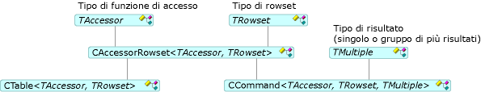

# Comandi e tabelle

Comandi e tabelle è possibile accedere a set di righe; vale a dire, aprire i set di righe, eseguire i comandi e associare le colonne. Il [CCommand](../../data/oledb/ccommand-class.md) e [CTable](../../data/oledb/ctable-class.md) classi creare un'istanza di oggetti comando e la tabella, rispettivamente. Tali classi derivano da [CAccessorRowset](../../data/oledb/caccessorrowset-class.md) come illustrato nella figura seguente.

 
Comando e le classi di tabella

Nella tabella precedente `TAccessor` può essere qualsiasi tipo di funzione di accesso elencata nelle [tipi di funzione di accesso](../../data/oledb/accessors-and-rowsets.md). `TRowset` può essere qualsiasi tipo di set di righe elencata nelle [tipi di set di righe](../../data/oledb/accessors-and-rowsets.md). `TMultiple` Specifica il tipo di risultato (una o più set di risultati).

Il [Creazione guidata Consumer OLE DB ATL](../../atl/reference/atl-ole-db-consumer-wizard.md) consente di specificare se si desidera che un oggetto comando o di tabella.

- Per le origini dati senza comandi, è possibile usare il `CTable` classe. In genere viene utilizzato per semplici set di righe che non specificare alcun parametro e non richiede più risultati. Questa semplice classe apre una tabella in un'origine dati utilizzando un nome di tabella specificato.

- Per le origini dati che supportano i comandi, è possibile usare il `CCommand` classe. Per eseguire un comando, chiamare [aperto](../../data/oledb/ccommand-open.md) in questa classe. In alternativa, è possibile chiamare `Prepare` per preparare un comando che si desidera eseguire più volte.

   `CCommand` dispone di tre argomenti di modello: un tipo di funzione di accesso, un tipo di set di righe e un tipo di risultato (`CNoMultipleResults`, per impostazione predefinita, o `CMultipleResults`). Se si specifica `CMultipleResults`, il `CCommand` supportate dalla classe di `IMultipleResults` interfaccia e gestisca più set di righe. Il [DBVIEWER](https://github.com/Microsoft/VCSamples) esempio viene illustrato come gestire i risultati di più.

## Vedere anche

[Modelli Consumer OLE DB](../../data/oledb/ole-db-consumer-templates-cpp.md)