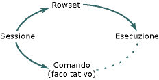

# Interfacce dell'oggetto Session

Nella tabella seguente mostra le interfacce obbligatorie e facoltative definite da OLE DB per un oggetto di sessione.

|Interfaccia|Obbligatorio?|Implementata da modelli OLE DB?|
|---------------|---------------|--------------------------------------|
|[IGetDataSource](/previous-versions/windows/desktop/ms709721(v=vs.85))|Obbligatorio|Yes|
|[IOpenRowset](/previous-versions/windows/desktop/ms716946(v=vs.85))|Obbligatorio|Yes|
|[ISessionProperties](/previous-versions/windows/desktop/ms713721(v=vs.85))|Obbligatorio|Yes|
|[IAlterIndex](/previous-versions/windows/desktop/ms714943(v=vs.85))|Facoltativo|No|
|[IAlterTable](/previous-versions/windows/desktop/ms719764(v=vs.85))|Facoltativo|No|
|[IBindResource](/previous-versions/windows/desktop/ms714936(v=vs.85))|Facoltativo|No|
|[ICreateRow](/previous-versions/windows/desktop/ms716832(v=vs.85))|Facoltativo|No|
|[IDBCreateCommand](/previous-versions/windows/desktop/ms711625(v=vs.85))|Facoltativo|Yes|
|[IDBSchemaRowset](/previous-versions/windows/desktop/ms713686(v=vs.85))|Facoltativo|Yes|
|[IIndexDefinition](/previous-versions/windows/desktop/ms711593(v=vs.85))|Facoltativo|No|
|[ISupportErrorInfo](/previous-versions/windows/desktop/ms715816(v=vs.85))|Facoltativo|Yes|
|[ITableCreation](/previous-versions/windows/desktop/ms713639(v=vs.85))|Facoltativo|No|
|[ITableDefinition](/previous-versions/windows/desktop/ms714277(v=vs.85))|Facoltativo|No|
|[ITableDefinitionWithConstraints](/previous-versions/windows/desktop/ms720947(v=vs.85))|Facoltativo|No|
|[ITransaction](/previous-versions/windows/desktop/ms723053(v=vs.85))|Facoltativo|No|
|[ITransactionJoin](/previous-versions/windows/desktop/ms718071(v=vs.85))|Facoltativo|No|
|[ITransactionLocal](/previous-versions/windows/desktop/ms714893(v=vs.85))|Facoltativo|No|
|[ITransactionObject](/previous-versions/windows/desktop/ms713659(v=vs.85))|Facoltativo|No|

L'oggetto sessione crea un oggetto set di righe. Se il provider supporta i comandi, la sessione crea anche un oggetto command (`CCommand`, l'implementazione di OLE DB `TCommand`). L'oggetto comando implementa il `ICommand` interfaccia e viene utilizzato il `ICommand::Execute` metodo per eseguire comandi nel set di righe, come illustrato nella figura seguente.

## Vedere anche

[Architettura dei modelli di provider OLE DB](../../data/oledb/ole-db-provider-template-architecture.md) 
