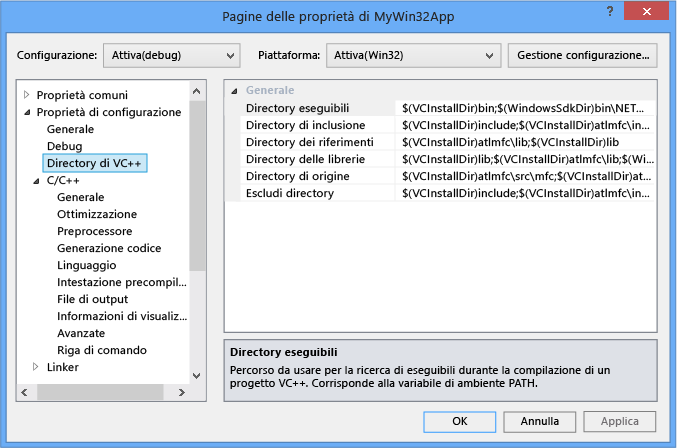
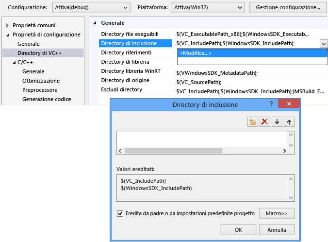
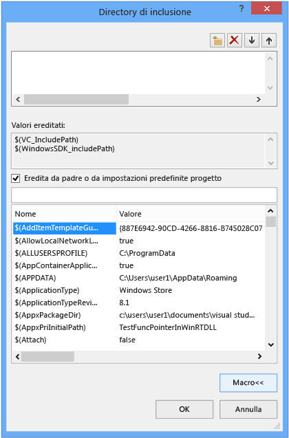
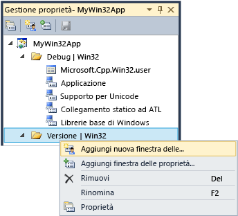

# Utilizzo di propriet&#224; di progetto
[!INCLUDE[vs2017banner](../assembler/inline/includes/vs2017banner.md)]

Nell'IDE, tutte le informazioni necessarie per compilare un progetto viene esposto come              *proprietà*. Queste informazioni includono il nome dell'applicazione, estensione (ad esempio DLL, LIB, EXE), opzioni del compilatore, opzioni del linker, le impostazioni del debugger, istruzioni di compilazione personalizzate e molte altre cose. Utilizzare              *pagine delle proprietà* (             **progetto &#124; Proprietà**) per visualizzare e modificare queste proprietà.  
  
 Quando si crea un progetto, il sistema assegna i valori per le varie proprietà. Le impostazioni predefinite variano leggermente a seconda del tipo di progetto e le opzioni selezionate nella creazione guidata applicazione. Ad esempio, un progetto ATL ha le proprietà relative a file MIDL, ma questi sono assenti in un'applicazione console di base.   Le proprietà predefinite vengono visualizzate nel riquadro generale nelle pagine delle proprietà:  
  
   
  
 Alcune proprietà, ad esempio il nome dell'applicazione, si applicano a tutte le variazioni di compilazione, indipendentemente dalla piattaforma di destinazione o se si tratta di una build di debug o release. Ma la maggior parte delle proprietà sono dipendenti dalla configurazione.   Questo avviene perché il compilatore deve sapere quale piattaforma specifica, il programma verrà eseguito su e il compilatore specificato opzioni da utilizzare per generare il codice corretto. Pertanto, quando si imposta una proprietà, è importante prestare attenzione a quale configurazione e piattaforma consigliabile applicare il nuovo valore.  Deve applicare solo alle compilazioni di Debug Win32 o vale anche per eseguire il Debug ARM e x64 Debug? Ad esempio, il              **Ottimizzazione** per impostazione predefinita, viene impostata su              **Ottimizza velocità (/ O2)** in una configurazione di rilascio, ma è disabilitato nella configurazione di Debug.  
  
 Le pagine delle proprietà sono progettati in modo che è sempre possibile visualizzare, e se è necessario modificarla, quale piattaforma e configurazione di un valore di proprietà dovrà essere applicata. Nella figura seguente mostra le pagine delle proprietà con le informazioni di configurazione e piattaforma nelle caselle di riepilogo nella parte superiore. Quando la proprietà ottimizzazione non è impostata, viene applicato solo alle compilazioni di Debug Win32, che risulta essere la configurazione attiva, come indicato dalle frecce rosse.  
  
   
  
 Nella figura seguente mostra la pagina delle proprietà progetto stesso, ma la configurazione è stata modificata a versione. Prendere nota del valore diverso per la proprietà di ottimizzazione. Si noti inoltre che la configurazione attiva è ancora Debug. È possibile impostare proprietà per qualsiasi configurazione qui. non deve necessariamente essere quello attivo.  
  
   
  
 Il sistema del progetto stesso è basato su MSBuild, che definisce i formati di file e le regole per la creazione di progetti di qualsiasi tipo. MSBuild consente di gestire la complessità di compilazione per più configurazioni e piattaforme, ma è necessario comprendere un po' sul suo funzionamento. Ciò è particolarmente importante se si desidera definire le configurazioni personalizzate o creare un set riutilizzabile di proprietà che è possibile condividere e importare in più progetti.  
  
 Proprietà di progetto vengono archiviate direttamente nel file di progetto (*.vcxproj) o in altri file. XML o con estensione props che le importazioni di file di progetto e che forniscono valori predefiniti. Come illustrato in precedenza, la stessa proprietà per la stessa configurazione potrebbe assegnata un valore diverso in file diversi. Quando si compila un progetto, il motore MSBuild valuta il file di progetto e tutti i file importati in un ordine ben definito (descritta di seguito). Come viene valutato ogni file, i valori delle proprietà definiti in tale file sostituirà i valori esistenti.  Tutti i valori non specificati vengono ereditati dal file che sono stati valutati in precedenza.  Pertanto, quando si imposta una proprietà con le pagine delle proprietà, è inoltre importante prestare attenzione a cui è stato impostato. Se è impostata una proprietà su "X" in un file con estensione props, ma la proprietà è impostata su "Y" nel file di progetto, il progetto viene compilato con la proprietà impostata su "Y". Se la stessa proprietà è impostata su "Z" su un elemento di progetto, ad esempio un file con estensione cpp, il motore MSBuild utilizzerà il valore "Z". Per ulteriori informazioni, vedere              [ereditarietà della proprietà](#bkmkPropertyInheritance) più avanti in questo articolo.  
  
## Configurazioni di compilazione  
 Una configurazione è solo un gruppo di proprietà che viene assegnato un nome arbitrario. Visual Studio fornisce configurazioni Debug e rilascio e ogni imposta varie proprietà in modo appropriato per una build di debug o di una build di rilascio. È possibile utilizzare il                  **Configuration Manager** per definire le configurazioni personalizzate come un modo pratico per le proprietà di gruppo per una versione specifica di compilazione.  La gestione di proprietà viene utilizzata per operazioni avanzate con le proprietà, ma abbiamo introdotto dalla qui perché consente di visualizzare le configurazioni della proprietà. Accedervi da                  **visualizzazione &#124;  Gestione proprietà** o                  **visualizzazione &#124; Altre finestre &#124; Gestione proprietà** a seconda delle impostazioni. Si dispone dei nodi per ogni coppia di configurazione e della piattaforma nel progetto. In ciascuno di questi nodi sono nodi per le finestre delle proprietà (file con estensione props) che impostare alcune proprietà specifiche per la configurazione.  
  
   
  
 Se nel riquadro generale nelle pagine delle proprietà (vedere la figura precedente) e impostare la proprietà del Set di caratteri "Non impostata" anziché "Utilizza Unicode" e fare clic su                  **OK**,  verrà visualizzato Gestione proprietà alcun                  **supporto Unicode** finestra delle proprietà per la configurazione corrente, ma sarà ancora disponibile per le altre configurazioni.  
  
 Per ulteriori informazioni sulla gestione di proprietà e finestre delle proprietà, vedere                  [creazione di configurazioni di proprietà riutilizzabili](#bkmkPropertySheets) più avanti in questo articolo.  
  
> [!TIP]
>  Il file con estensione User è una funzionalità legacy ed è consigliabile eliminarlo per evitare che le proprietà raggruppate correttamente in base alla configurazione e della piattaforma.  
  
## Piattaforme di destinazione  
 *Piattaforma di destinazione* fa riferimento al tipo di dispositivo e/o del sistema operativo in cui verrà eseguito il file eseguibile. È possibile compilare un progetto per più piattaforme. Le piattaforme di destinazione disponibile per i progetti C++ dipendono dal tipo di progetto. essi includono ma non sono limitati a Win32, x64, ARM, Android e iOS.     Il                   **x86** piattaforma di destinazione che si verifichino in                  **Configuration Manager** è identico a                  **Win32** nei progetti C++ nativi. Win32 significa Windows a 32 bit e                  **x64** significa Windows a 64 bit.  Per ulteriori informazioni su queste due piattaforme, vedere                  [applicazioni in esecuzione a 32 bit](https://msdn.microsoft.com/library/windows/desktop/aa384249\(v=vs.85\).aspx).  
  
 Il                  **qualsiasi CPU** valore piattaforma che si verifichino nella destinazione                  **Configuration Manager** non ha alcun effetto in progetti nativi C++; è pertinente per C + + CLI e altri .NET tipi di progetto. Per ulteriori informazioni, vedere                  [/CLRIMAGETYPE (Specifica tipo di immagine CLR)](../build/reference/clrimagetype-specify-type-of-clr-image.md).  
  
## pagine delle proprietà  
 Come affermato in precedenza, il sistema di progetto Visual C++ è basato su                  [MSBuild](MSBuild%20Properties.md) e i valori vengono archiviati nel file di progetto XML predefinito con estensione props e targets file che (per Visual Studio 2015) si trovano                     **\< unità>file \Programmi (x86)\MSBuild\Microsoft.Cpp\v4.0\V140** e nei file con estensione props personalizzato che è possibile aggiungere. Si consiglia di utilizzare NON modifica i file manualmente e utilizzare le pagine delle proprietà nell'IDE per modificare tutte le proprietà, specialmente quelle che partecipano all'ereditarietà, a meno che non si dispone di una buona conoscenza di MSBuild.  
  
 La figura seguente mostra le pagine delle proprietà per un progetto Visual C++. Nel riquadro a sinistra, il                  **directory di VC + +***regola* è selezionata, e il riquadro di destra sono elencate le proprietà associate a tale regola. Il                  `$(...)` valori Purtroppo sono denominati                  *macro*. Si tratta di                  *non* macro di C/C++ ma costanti semplicemente in fase di compilazione. Vengono illustrate le macro nel                  [macro pagina proprietà](#bkmkPropertiesVersusMacros) sezione più avanti in questo articolo.)  
  
   
  
> [!WARNING]
>  Le configurazioni di                      **Proprietà comuni** delle versioni precedenti di Visual Studio sono state rimosse. Per aggiungere un riferimento a un progetto, è ora necessario usare la finestra di dialogo                      **Aggiungi riferimento** allo stesso modo che per i linguaggi gestiti. Vedere                      [la gestione di riferimenti in un progetto](../Topic/Managing%20references%20in%20a%20project.md).  
  
#### Per impostare una proprietà per un progetto  
  
1.  Per la maggior parte degli scenari, è possibile impostare le proprietà a livello di progetto senza creare una finestra delle proprietà personalizzate. Nel menu principale scegliere                                  **progetto &#124; Proprietà**, oppure fare clic sul nodo del progetto in                                  **Esplora** e scegliere                                  **proprietà**.  
  
2.  Utilizzare il                                  **configurazione** e                                  **piattaforma** elenco caselle nella parte superiore della finestra di dialogo per specificare quali gruppi di proprietà devono applicare le modifiche. In molti casi                                  **tutte le piattaforme** e                                  **tutte le configurazioni** rappresentano la scelta ideale. Per impostare le proprietà per solo alcune configurazioni, effettuare una selezione multipla in                                  **Gestione proprietà**, quindi aprire il menu di scelta rapida e scegliere                                  **Proprietà**.  
  
 La finestra di dialogo                  **Pagine delle proprietà** mostra solo le pagine delle proprietà che si applicano al progetto corrente. Ad esempio, se il progetto non dispone di un file con estensione idl, la pagina delle proprietà MIDL non viene visualizzata.  
  
 Quando si seleziona una proprietà in una pagina delle proprietà, è possibile premere                  **F1** per passare all'argomento di riferimento per altre informazioni relative all'opzione del compilatore o del linker corrispondente.  
  
 È possibile trovare ulteriori informazioni su ogni pagina delle proprietà nei seguenti argomenti:  
  
-   [Pagina delle proprietà Generale (progetto)](../ide/general-property-page-project.md)  
  
-   [Pagina delle proprietà Generale (File)](../ide/general-property-page-file.md)  
  
-   [Pagine delle proprietà della riga di comando](../ide/command-line-property-pages.md)  
  
-   [Impostazioni di progetto per una configurazione di Debug C++](../Topic/Project%20Settings%20for%20a%20C++%20Debug%20Configuration.md)  
  
-   [Pagina delle proprietà NMake](../ide/nmake-property-page.md)  
  
-   [Pagine delle proprietà linker](../ide/linker-property-pages.md)  
  
-   [Pagine delle proprietà risorse](../ide/resources-property-pages.md)  
  
-   [Pagine delle proprietà MIDL](../ide/midl-property-pages.md)  
  
-   [Pagina delle proprietà riferimenti Web](../ide/web-references-property-page.md)  
  
-   [Pagina proprietà strumento generatore di dati XML](../ide/xml-data-generator-tool-property-page.md)  
  
## Per cercare e trovare tutte le proprietà rapidamente  
 Il                  **tutte le opzioni** pagina delle proprietà (sotto il                  **proprietà di configurazione &#124; C/C++** nodo il                  **pagine delle proprietà** la finestra di dialogo) fornisce un modo rapido per cercare e trovare le proprietà disponibili nel contesto corrente. Include una casella di ricerca speciale e una sintassi semplice per filtrare facilmente i risultati:  
  
 Nessun prefisso:  
 ricerca solo nei nomi delle proprietà (sottostringa senza distinzione tra maiuscole e minuscole).  
  
 '/' o '-':  
 ricerca solo nelle opzioni del compilatore (prefisso senza distinzione tra maiuscole e minuscole)  
  
 v:  
 ricerca solo nei valori (sottostringa senza distinzione tra maiuscole e minuscole).  
  
##   Macro di pagina delle proprietà  
 Oggetto                  *macro* è una costante in fase di compilazione che può fare riferimento a un valore che è definito da Visual Studio o il sistema MSBuild o a un valore definito dall'utente. Usando le macro anziché i valori hardcoded come i percorsi di directory, è possibile condividere con maggiore facilità le impostazioni delle proprietà tra i computer e tra le versioni di Visual Studio, nonché assicurarsi meglio che le impostazioni del progetto partecipino in modo appropriato all'ereditarietà della proprietà. È possibile utilizzare l'Editor di proprietà per visualizzare i valori di tutte le macro disponibili.  
  
### Macro predefinite  
 macro globali  
 Si applica a tutti gli elementi di una configurazione del progetto. Presenta la sintassi                                  `$(name)`. Un esempio di macro globale è                                  `$(VCInstallDir)`, che archivia la directory radice dell'installazione di Visual Studio. Una macro globale corrisponde a                                  `PropertyGroup` in MSBuild.  
  
 macro elemento  
 Presenta la sintassi                                  `%(name)`. Per un file una macro di elemento si applica solo a quel file. Ad esempio è possibile usare                                  `%(AdditionalIncludeDirectories)` per specificare le directory di inclusione che si applicano solo a un determinato file. Questo tipo di macro di elemento corrisponde ai metadati                                  `ItemGroup` in MSBuild. Quando viene usata nel contesto di una configurazione di progetto, una macro di elemento viene applicata a tutti i file di un certo tipo. Ad esempio, nella proprietà di configurazione                                  **Definizioni preprocessore** di C/C++ può essere accettata una macro di elemento                                  `%(PreprocessorDefinitions)` che si applica a tutti i file con estensione cpp nel progetto. Questo tipo di macro di elemento corrisponde ai metadati                                  `ItemDefinitionGroup` in MSBuild. Per altre informazioni, vedere                                  [Item Definitions](../Topic/Item%20Definitions.md).  
  
### Macro definite dall'utente  
 È possibile creare                          *macro definite dall'utente* da usare come variabili nelle compilazioni di progetto. Ad esempio, si potrebbe creare una macro definita dall'utente per fornire un valore a un'istruzione di compilazione personalizzata o a uno strumento di compilazione personalizzato. Una macro definita dall'utente è una coppia nome/valore. In un file di progetto usare la notazione                          **$(***name***)** per accedere al valore.  
  
 Una macro definita dall'utente viene archiviata in una finestra delle proprietà. Se il progetto non contiene già una finestra delle proprietà, è possibile crearne uno seguendo i passaggi descritti nella                          [creazione di configurazioni di proprietà riutilizzabili](#bkmkPropertySheets).  
  
##### Per creare una macro definita dall'utente  
  
1.  Nella finestra                                          **Gestione proprietà** (sulla barra dei menu scegliere                                          **Visualizza**,                                          **Gestione proprietà**) aprire il menu di scelta rapida per una finestra delle proprietà (il nome termina con .user), quindi scegliere Proprietà. Viene aperta la finestra di dialogo                                          **Pagine delle proprietà** per la finestra delle proprietà.  
  
2.  Nel riquadro sinistro della finestra selezionare                                          **Macro utente**. Nel riquadro destro scegliere il pulsante                                          **Aggiungi macro** per aprire la finestra di dialogo                                          **Aggiungi macro utente** .  
  
3.  Nella finestra di dialogo specificare un nome e un valore per la macro. Se possibile, selezionare la casella di controllo                                          **Imposta questa macro come variabile di ambiente nell'ambiente di compilazione** .  
  
## Editor proprietà  
 È possibile usare l'Editor della proprietà per modificare alcune proprietà stringa e selezionare le macro come valori. Per accedere all'Editor proprietà, selezionare una proprietà in una pagina delle proprietà, quindi scegliere il pulsante freccia in giù a destra. Se l'elenco a discesa contiene                  **\< modifica>**, è possibile sceglierlo per visualizzare l'Editor di proprietà per tale proprietà.  
  
   
  
 In Editor proprietà è possibile scegliere il pulsante                  **Macro** per visualizzare le macro disponibili e i relativi valori correnti. La figura seguente mostra l'Editor proprietà per la proprietà                  **Directory di inclusione aggiuntive** dopo aver scelto il pulsante                  **Macro** . Quando la casella di controllo                  **Eredita da padre o da impostazioni predefinite progetto** è selezionata e si aggiunge un nuovo valore, questo viene aggiunto a tutti i valori ereditati. Se si deseleziona la casella di controllo, il nuovo valore sostituisce i valori ereditati. Nella maggior parte dei casi lasciare selezionata la casella di controllo.  
  
   
  
##   Creazione di configurazioni di proprietà riutilizzabili  
 Sebbene sia possibile impostare le proprietà "globali" per singolo utente e per computer, questo approccio non è più consigliabile. In alternativa, è consigliabile usare                  **Gestione proprietà** per creare una                  *finestra delle proprietà* per archiviare le impostazioni per ogni tipo di progetto che si desidera poter riutilizzare o condividere con altri utenti. Tramite le finestre delle proprietà è meno probabile che le impostazioni delle proprietà per altri tipi di progetto vengano modificate inavvertitamente. Finestre delle proprietà vengono illustrate in dettaglio                  [creazione di configurazioni di proprietà riutilizzabili](#bkmkPropertySheets).  
  
> [!IMPORTANT]
>  **file con estensione User e perché sono problematici**  
>   
>  Nelle versioni precedenti di Visual Studio vengono utilizzate finestre delle proprietà globali un'estensione di file con estensione User e sono disponibili nel \< userprofile>\AppData\Local\Microsoft\MSBuild\v4.0\ cartella. Questi file non sono più consigliabili perché impostano le proprietà per le configurazioni di progetto su una base per utente e per computer. Impostazioni globali di questo tipo possono interferire con le compilazioni, specialmente quando si intende usare più piattaforme nel computer di compilazione. Ad esempio, se si dispone sia di un progetto MFC sia di un progetto Windows Phone, le proprietà con estensione user non saranno valide per uno di essi. Le finestre delle proprietà riutilizzabile sono più flessibili e affidabili.  
>   
>  Sebbene i file con estensione user vengano ancora installati da Visual Studio e partecipino all'ereditarietà delle proprietà, sono vuoti per impostazione predefinita. Si consiglia di eliminare il riferimento a essi in                      **Gestione proprietà** per assicurarsi che i progetti funzionino a prescindere dalle impostazioni per utente e per computer. Questo è importante per assicurare il corretto funzionamento in un ambiente di controllo del codice sorgente.  
  
 Per visualizzare                  **Gestione proprietà**, sulla barra dei menu scegliere                  **Visualizza**,                  **Altre finestre**,                  **Gestione proprietà**.  
  
 Se si dispone di un set di proprietà comune usato di frequente da applicare a più progetti, è possibile usare                  **Gestione proprietà** per acquisirle in un file della                  *finestra delle proprietà* riutilizzabile la cui estensione di file è generalmente props. È possibile applicare il foglio (o i fogli) a nuovi progetti in modo da non dover impostare le relative proprietà da zero. Per accedere a                  **Gestione proprietà**, sulla barra dei menu scegliere                  **Visualizza**,                  **Gestione proprietà**.  
  
   
  
 In ogni nodo di configurazione, verranno visualizzati i nodi per ogni finestra delle proprietà che si applica a questa configurazione. Il sistema lo aggiunge finestre delle proprietà che impostano valori in base alle opzioni selezionate nella procedura guidata dell'applicazione quando si crea il progetto. Fare doppio clic su qualsiasi nodo e scegliere Proprietà per visualizzare le proprietà che si applicano a tale nodo.  Tutte le finestre delle proprietà vengono importate automaticamente nella finestra delle proprietà "master" del progetto (ms.cpp.props) e vengono valutate nell'ordine in cui appaiono nella gestione delle proprietà. È possibile spostarli per modificare l'ordine di valutazione. Finestre delle proprietà che vengono valutate in un secondo momento sostituirà i valori nei fogli valutata in precedenza.  
  
 Se si sceglie                  **Aggiungi nuova finestra delle proprietà del progetto** e successivamente si seleziona ad esempio la finestra delle proprietà MyProps.props, viene visualizzata una finestra di dialogo della pagina delle proprietà. Questa condizione è valida per la finestra delle proprietà MyProps. Le modifiche apportate vengono scritte nella finestra, non nel file di progetto (con estensione vcxproj).  
  
 Le proprietà in una finestra delle proprietà vengono sottoposte a override se la stessa proprietà viene impostata direttamente nel file con estensione vcxproj.  
  
 È possibile importare una finestra delle proprietà ogni volta che si rivela necessario. Più progetti in una soluzione possono ereditare le impostazioni dalla stessa finestra delle proprietà e in un progetto possono essere presenti più finestre. La stessa finestra delle proprietà può ereditare le impostazioni da un'altra finestra delle proprietà.  
  
 È inoltre possibile creare una finestra delle proprietà per più configurazioni. A tale scopo, creare una finestra delle proprietà per ogni configurazione, aprire il menu di scelta rapida per uno di essi, scegliere                  **Aggiungi finestra delle proprietà esistente**, quindi aggiungere gli altri fogli. Se tuttavia si usa una finestra delle proprietà comuni, si tenga presente che quando si imposta una proprietà, essa è valida per tutte le configurazioni a cui la finestra viene applicata. Inoltre, tramite l'IDE non vengono mostrati i progetti o le altre finestre delle proprietà tramite cui si sta ereditando da una finestra delle proprietà specificata.  
  
 In soluzioni di grandi dimensioni, in cui vengono usati numerosi progetti, può essere utile creare una finestra delle proprietà a livello di soluzione. Quando si aggiunge un progetto alla soluzione, usare                  **Gestione proprietà** per aggiungere tale finestra delle proprietà al progetto. Se richiesto a livello di progetto, è possibile aggiungere una nuova finestra delle proprietà per impostare i valori specifici del progetto.  
  
> [!IMPORTANT]
>  Un file props per impostazione predefinita non partecipa al controllo del codice sorgente, poiché non viene creato come elemento di progetto. È possibile aggiungere manualmente il file come elemento di soluzione se si desidera includerlo nel controllo del codice sorgente.  
  
#### Per creare una finestra delle proprietà  
  
1.  Sulla barra dei menu scegliere                                  **Visualizza**,                                  **Gestione proprietà**. Verrà aperto                                  **Gestione proprietà** .  
  
2.  Per definire l'ambito della finestra delle proprietà, selezionare l'elemento a cui si applica. Può trattarsi di una configurazione specifica o di un'altra finestra delle proprietà. Aprire il menu di scelta rapida per questo elemento, quindi scegliere                                  **Aggiungi nuova finestra delle proprietà del progetto**. Specificare un nome e un percorso.  
  
3.  In                                  **Gestione proprietà**aprire la nuova finestra delle proprietà e successivamente impostare le proprietà che si desidera includere.  
  
##   Ereditarietà delle proprietà  
 Le proprietà del progetto sono sovrapposte. Ogni livello eredita i valori del livello precedente, ma un valore ereditato può essere sottoposto a override impostando esplicitamente la proprietà. Di seguito è riportato l'albero di ereditarietà di base:  
  
1.  Impostazioni predefinite dal set di strumenti di MSBuild CPP (..\Programmi\MSBuild\Microsoft.Cpp\v4.0\Microsoft.Cpp.Default.props, importato dal file .vcxproj).  
  
2.  Finestre delle proprietà  
  
3.  File con estensione vcxproj È possibile ignorare l'impostazione predefinita e le impostazioni della finestra delle proprietà.  
  
4.  Metadati degli elementi  
  
> [!TIP]
>  In una pagina delle proprietà, una proprietà in                      `bold` è definita nel contesto corrente. Viene ereditata una proprietà in caratteri normali.  
  
 Un file di progetto (.vcxproj) importa altre finestre delle proprietà in fase di compilazione. Una volta importate tutte le finestre delle proprietà, il file di progetto viene valutato e l'ultima definizione del valore di una proprietà è quella usata. Talvolta è utile visualizzare il file espanso per determinare come viene ereditato un valore di proprietà specificato. Per visualizzare la versione estesa, inserire il comando seguente a un prompt dei comandi di Visual Studio. Modificare i nomi dei file segnaposto in quello che si desidera usare.  
  
 **msbuild /pp:** *temp* **.txt** *myapp* **.vcxproj**  
  
 I file di progetto espansi possono essere di grandi dimensioni e difficili da comprendere a meno che l'utente non abbia familiarità con MSBuild. Di seguito è riportata la struttura di base di un file di progetto:  
  
1.  Proprietà di progetto di base che non sono esposte nell'IDE.  
  
2.  Importazione di Microsoft.cpp.default.props, tramite cui vengono definite alcune proprietà di base indipendenti dal set di strumenti.  
  
3.  Proprietà globali di configurazione (esposte come                          **PlatformToolset** ) e proprietà predefinite                          **Progetto** nella pagina                          **Informazioni generali configurazione** . Queste proprietà determinano quali set di strumenti e finestre delle proprietà di intrinseche vengono importati in Microsoft.cpp.props durante il passaggio successivo.  
  
4.  Importazione di Microsoft.cpp.props, tramite cui viene impostata la maggior parte delle impostazioni predefinite del progetto.  
  
5.  Importazione di tutte le finestre delle proprietà, inclusi i file con estensione user. Queste finestre delle proprietà possono ignorare tutto ad eccezione delle proprietà predefinite                          **Progetto** e                          **PlatformToolset** .  
  
6.  Il resto delle proprietà della configurazione del progetto. Questi valori possono ignorare le operazioni impostate nelle finestre delle proprietà.  
  
7.  Elementi (file) insieme ai relativi metadati. Queste sono sempre l'ultima parola delle regole di valutazione di MSBuild, anche se si verificano prima di altre proprietà e importazioni.  
  
 Per altre informazioni, vedere                  [MSBuild Properties](MSBuild%20Properties.md).  
  
## Aggiunta di una directory di inclusione al set di directory predefinite  
 Quando si aggiunge una directory di inclusione a un progetto, è importante non eseguire l'override di tutte le directory predefinite. Il modo corretto per aggiungere una directory consiste nell'aggiungere il nuovo percorso, ad esempio "C:\MyNewIncludeDir\" e quindi aggiunge la macro                  **$(IncludePath)** al valore della proprietà.  
  
## Impostazione delle variabili di ambiente di una compilazione  
 Il compilatore di Visual C++ (cl.exe) riconosce alcune variabili di ambiente, in particolare LIB, LIBPATH, PATH e INCLUDE. Quando si esegue una compilazione con l'IDE, le proprietà impostate nella pagina delle proprietà                  [VC++ Directories Property Page](../ide/vcpp-directories-property-page.md) vengono usate per impostare tali variabili di ambiente. Se i valori LIB, LIBPATH e INCLUDE sono già stati impostati, ad esempio da un prompt dei comandi dello sviluppatore, vengono sostituiti con i valori delle proprietà MSBuild corrispondenti. La compilazione antepone il valore della proprietà delle directory di file eseguibili Directory di VC++ a PATH. È possibile impostare una variabile di ambiente definita dall'utente creando una macro definita dall'utente e selezionando la casella che riporta                  **Imposta questa macro come variabile di ambiente nell'ambiente di compilazione**.  
  
## Impostazione delle variabili di ambiente di una sessione di debug  
 Nel riquadro sinistro della finestra di dialogo                  **Pagine delle proprietà** del progetto espandere il nodo                  **Proprietà di configurazione** e selezionare                  **Debug**.  
  
 Nel riquadro destro modificare le impostazioni del progetto                  **Ambiente** o                  **Esegui merge ambiente** , quindi scegliere                  **OK** .  
  
## Vedere anche  
 [Creazione e gestione di progetti Visual C++](../ide/creating-and-managing-visual-cpp-projects.md)