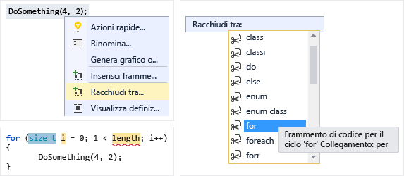
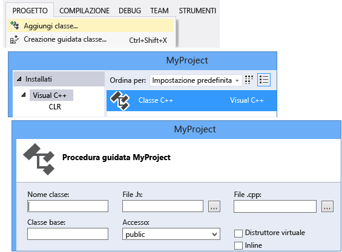
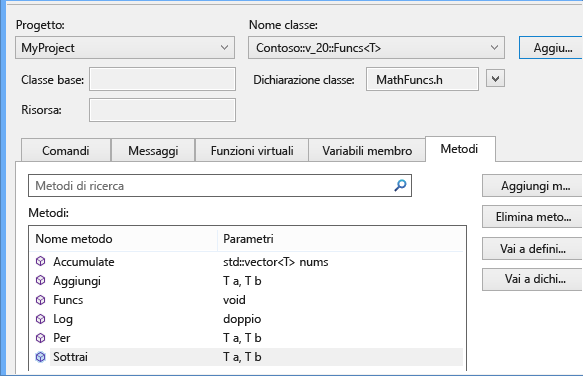
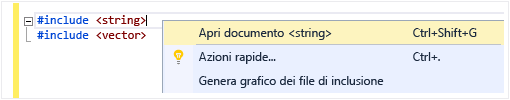
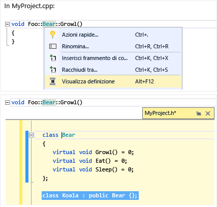
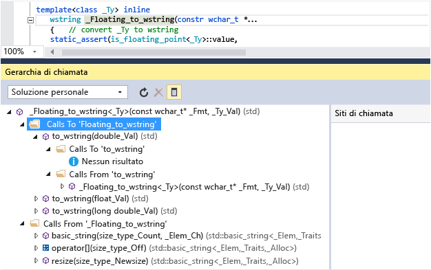
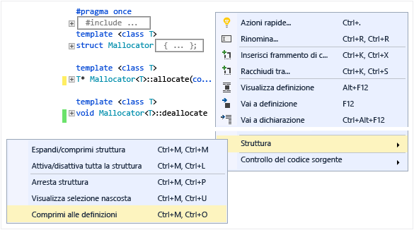
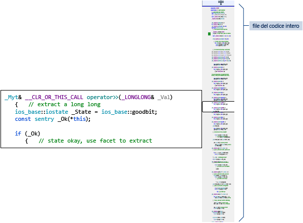
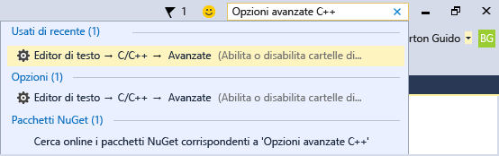

# Scrittura e refactoring del codice (C++)

L'editor di codice e l'IDE di Visual C++ includono numerosi strumenti per la scrittura di codice. Alcuni sono specifici di C++ e altri sono sostanzialmente uguali per tutti i linguaggi di Visual Studio. Per altre informazioni sulle funzionalità condivise, vedere [Scrittura di codice nell'editor di testo e di codice](/visualstudio/ide/writing-code-in-the-code-and-text-editor). Le opzioni per l'abilitazione e configurazione delle funzionalità specifiche di C++ sono disponibili in **Strumenti &#124; Opzioni &#124; Editor di testo &#124; C/C++**. Dopo aver scelto l'opzione da impostare, è possibile ottenere ulteriori informazioni premendo il tasto **F1** quando la finestra di dialogo è attiva. Per le opzioni di formattazione di codice generale, digitare `Editor C++` in **Avvio veloce**.

Le funzionalità sperimentali, che possono o non possono essere incluse in una versione futura di Visual Studio, sono nella finestra di dialogo [Editor di testo C++ Sperimentale](/visualstudio/ide/reference/options-text-editor-c-cpp-experimental). In Visual Studio 2017 è possibile abilitare **IntelliSense predittivo** in questa finestra di dialogo.

## Aggiunta di nuovi file

Per aggiungere nuovi file a un progetto, fare clic con il pulsante destro del mouse sul nodo del progetto in Esplora soluzioni e scegliere **Aggiungi &#124; Nuovo**.

## Opzioni di formattazione

Per impostare le opzioni di formattazione, ad esempio rientri, completamento parentesi graffa e colorazione, digitare "Formattazione C++" nella finestra **Avvio veloce**. Visual Studio 2017 15.7 e versioni successive supporta ClangFormat. È possibile configurarlo nella [pagina delle proprietà di formattazione di C/C++](/visualstudio/ide/reference/options-text-editor-c-cpp-formatting) in **Strumenti &#124; Opzioni &#124; Editor di testo &#124; C/C++ &#124; Formattazione**.

## IntelliSense

IntelliSense è il nome di un set di funzionalità che forniscono informazioni inline su membri, tipi e overload di funzione. Nella figura seguente viene illustrato l'elenco a discesa dei membri che viene visualizzato durante la digitazione. È possibile premere TAB per inserire il testo dell'elemento selezionato nel file del codice.

Per informazioni complete, vedere [IntelliSense per Visual C++](/visualstudio/ide/visual-cpp-intellisense).

## Inserisci frammento di codice

Per frammento si intende una parte predefinita di codice sorgente. Fare clic con il pulsante destro del mouse su un singolo punto o su testo selezionato per inserire un frammento oppure racchiudere il testo selezionato con il frammento. Nella figura seguente sono illustrati i tre passaggi per racchiudere un'istruzione selezionata con un ciclo for. Le evidenziazioni gialle nell'immagine finale sono campi modificabili a cui è possibile accedere premendo TAB. Per altre informazioni, vedere [Code Snippets](/visualstudio/ide/code-snippets) (Frammenti di codice).

## Aggiungi classe

Per aggiungere una nuova classe dal menu **Progetto**, usare la Creazione guidata classe.

È anche possibile usare la Creazione guidata classe per modificare o esaminare una classe esistente.

Per altre informazioni, vedere [Aggiunta di funzionalità con creazioni guidate codice (C++)](../ide/adding-functionality-with-code-wizards-cpp.md).

## Refactoring

I refactoring sono disponibili nel menu di scelta rapida Azioni rapide oppure facendo clic su una [lampadina](/visualstudio/ide/perform-quick-actions-with-light-bulbs) nell'editor.  Alcuni sono inclusi anche nel menu **Modifica > Refactoring**.  Queste funzionalità comprendono:

* [Rinomina](refactoring/rename.md)
* [Estrai funzione](refactoring/extract-function.md)
* [Implementa elementi virtuali puri](refactoring/implement-pure-virtuals.md)
* [Crea dichiarazione / definizione](refactoring/create-declaration-definition.md)
* [Sposta definizione della funzione](refactoring/move-definition-location.md)
* [Converti in valore letterale stringa non elaborata](refactoring/convert-to-raw-string-literal.md)
* [Modifica firma](refactoring/change-signature.md)

## Spostamenti e approfondimenti

Visual C++ condivide con altri linguaggi molte funzionalità di spostamento all'interno del codice. Per altre informazioni, vedere [Spostarsi all'interno del codice](/visualstudio/ide/navigating-code) e [Visualizzare la struttura del codice usando diverse finestre degli strumenti](/visualstudio/ide/viewing-the-structure-of-code).

## Informazioni rapide

È possibile passare con il puntatore del mouse su una variabile per visualizzare le informazioni sul relativo tipo.

## Apri documento (passa all'intestazione)

Fare clic con il pulsante destro del mouse sul nome dell'intestazione in una direttiva `#include` per aprire il file di intestazione.

## Visualizza definizione

Passare il mouse su una dichiarazione di variabile o di funzione, fare clic con il pulsante destro e scegliere **Visualizza definizione** per accedere a una visualizzazione inline della relativa definizione. Per altre informazioni, vedere [Visualizza definizione (ALT+F12)](/visualstudio/ide/how-to-view-and-edit-code-by-using-peek-definition-alt-plus-f12).

## Vai a definizione

Passare il mouse su una dichiarazione di variabile o di funzione, fare clic con il pulsante destro e scegliere **Vai a definizione** per aprire il documento in cui è definito l'oggetto.

## Visualizza gerarchia delle chiamate

Fare clic con il pulsante destro del mouse su una qualsiasi chiamata di funzione per visualizzare un elenco ricorsivo di tutte le funzioni chiamate e di tutte le funzioni che la chiamano. È possibile espandere nello stesso modo tutte le singole funzioni dell'elenco. Per altre informazioni, vedere [Gerarchia delle chiamate](/visualstudio/ide/reference/call-hierarchy).

## Attiva/disattiva file di codice/intestazione

Fare clic con il pulsante destro del mouse e scegliere **Attiva/disattiva file di codice/intestazione** per passare da un file di intestazione al file del codice associato e viceversa.

## struttura

Fare clic con il pulsante destro del mouse in un punto qualsiasi di un file del codice sorgente e scegliere **Struttura** per comprimere o espandere definizioni e/o aree personalizzate e individuare più facilmente solo le parti che interessano. Per altre informazioni, vedere [Struttura](/visualstudio/ide/outlining).

## Modalità mappa per barra di scorrimento

Questa modalità consente di scorrere rapidamente e spostarsi in un file del codice senza abbandonare la posizione corrente oppure di fare clic su un punto qualsiasi nella mappa del codice per passare direttamente a tale posizione. Per altre informazioni, vedere [Procedura: Tenere traccia del codice personalizzando la barra di scorrimento](/visualstudio/ide/how-to-track-your-code-by-customizing-the-scrollbar).

## Genera grafico dei file di inclusione

Fare clic con il pulsante destro del mouse su un file del codice del progetto e scegliere **Genera grafico dei file di inclusione** per visualizzare un grafico dei file inclusi da altri file.

## F1 Guida

Posizionando il cursore su o dopo un qualsiasi tipo, parola chiave o funzione e premendo F1, si passa direttamente all'argomento di riferimento pertinente su docs.microsoft.com. F1 funziona anche con gli elementi dell'elenco errori e in numerose finestre di dialogo.

## Avvio veloce

Per passare facilmente a qualsiasi finestra o strumento in Visual Studio, è sufficiente digitarne il nome nella finestra di avvio veloce nell'angolo in alto a destra dell'interfaccia utente. L'elenco di completamento automatico verrà filtrato durante la digitazione.

