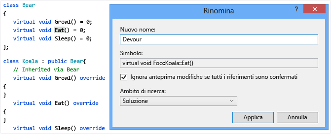
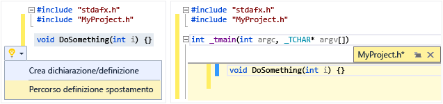
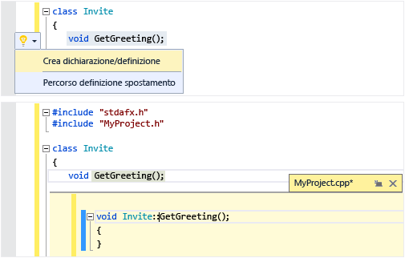
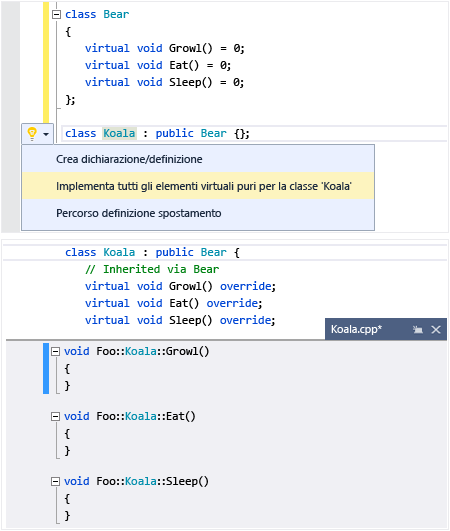
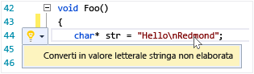
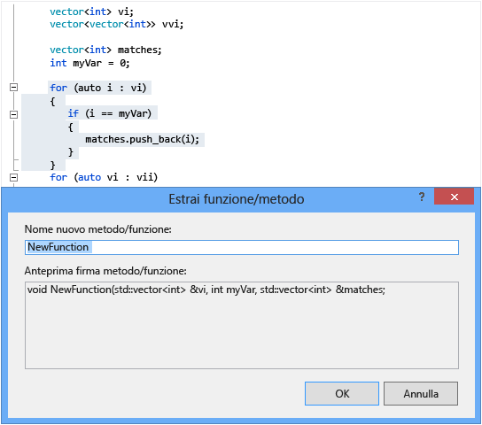

# Scrittura e refactoring del codice (C++)
[!INCLUDE[vs2017banner](../assembler/inline/includes/vs2017banner.md)]

L'editor di codice e l'IDE di Visual C\+\+ includono numerosi strumenti per la scrittura di codice.  Alcuni sono specifici di C\+\+ e altri sono sostanzialmente uguali per tutti i linguaggi di Visual Studio.  Le opzioni per abilitare e configurare queste funzionalità sono disponibili nella finestra di dialogo Avanzate dell'editor di testo C\+\+ \(scegliere **Strumenti &#124; Opzioni &#124; Editor di testo &#124; C\/C\+\+ &#124; Avanzate** o digitare "Avanzate C\+\+" in **Avvio veloce**\).  Dopo aver scelto l'opzione da impostare, è possibile ottenere ulteriori informazioni premendo il tasto **F1** quando la finestra di dialogo è attiva.  Per le opzioni di formattazione di codice generale, digitare `Editor C++` in **Avvio veloce**.  
  
## Aggiunta di nuovo codice  
 Dopo aver creato un progetto, è possibile avviare la codifica nei file generati automaticamente.  Per aggiungere nuovi file, fare clic con il pulsante destro del mouse sul nodo del progetto in Esplora soluzioni e scegliere **Aggiungi &#124; Nuovo**.  
  
 Per impostare opzioni di formattazione quali rientri, completamento parentesi graffa e la colorazione, digitare`Formattazione C++` nella finestra **Avvio veloce**.  
  
### IntelliSense  
 IntelliSense è il nome di un set di funzionalità che forniscono informazioni inline su membri, tipi e overload di funzione.  Nella figura seguente viene illustrato l'elenco a discesa dei membri che viene visualizzato durante la digitazione.  È possibile premere TAB per inserire il testo dell'elemento selezionato nel file del codice.  
  
   
  
 Per informazioni complete, vedere l'argomento [IntelliSense per Visual C\+\+](../Topic/Visual%20C++%20Intellisense.md).  
  
### Inserisci frammento di codice  
 Per frammento si intende una parte predefinita di codice sorgente.  Fare clic con il pulsante destro del mouse su un singolo punto o su testo selezionato per inserire un frammento oppure racchiudere il testo selezionato con il frammento.  Nella figura seguente sono illustrati i tre passaggi per racchiudere un'istruzione selezionata con un ciclo for.  Le evidenziazioni gialle nell'immagine finale sono campi modificabili a cui è possibile accedere premendo TAB.  Per altre informazioni, vedere [Frammenti di codice](../Topic/Code%20Snippets.md).  
  
   
  
### Aggiungi classe  
 Per aggiungere una nuova classe dal menu **Progetto**, usare la Creazione guidata classe.  
  
   
  
### Creazione guidata classe  
 Per modificare o esaminare una classe esistente oppure aggiungere una nuova classe, usare la Creazione guidata classe.  Per altre informazioni, vedere [Aggiunta di funzionalità con creazioni guidate codice \(C\+\+\)](../ide/adding-functionality-with-code-wizards-cpp.md).  
  
   
  
## Refactoring  
 I refactoring sono disponibili nella voce del menu di scelta rapida Azioni rapide oppure facendo clic su una [lampadina](../Topic/Perform%20quick%20actions%20with%20light%20bulbs.md) nell'editor.  
  
### Rinomina  
 È possibile rinominare un tipo, una funzione o una variabile ovunque venga usato nell'ambito specificato.  Nella figura seguente il metodo `Eat` verrà rinominato in `Devour` nella classe di base e in quella derivata.  
  
   
  
### Azione rapida: Percorso definizione spostamento  
 Consente di spostare una o più definizioni di funzione nel file di intestazione il cui nome è uguale a quello del file del codice.  Se l'intestazione non esiste già, ne verrà creata una nuova.  Le definizioni risultanti vengono visualizzate inline in una finestra di anteprima.  
  
   
  
### Azione rapida: Crea dichiarazione\/definizione  
 Consente di creare una o più definizioni nel file del codice associato per le dichiarazioni di intestazione selezionate.  
  
   
  
### Azione rapida: Implementa tutti gli elementi virtuali puri per una classe  
 Consente di generare rapidamente stub di implementazione vuoti per tutte le funzioni virtuali ereditate in una classe.  Per implementare solo le funzioni virtuali in una classe di base specifica, è sufficiente evidenziare la classe nella dichiarazione di classe derivata.  
  
   
  
### Converti in valore letterale stringa non elaborata  
 Quando si posiziona il cursore su un valore letterale stringa, è possibile fare clic con il pulsante destro del mouse e scegliere **Azioni rapide &#124; Converti in valore letterale stringa non elaborata** per convertire una stringa normale in un valore letterale stringa non elaborata di C\+\+ 11.  
  
   
  
### Estrai funzione \(estensione di Visual Studio\)  
 Usare la funzionalità Estrai funzione \(disponibile come [estensione nella raccolta di Visual Studio](https://visualstudiogallery.msdn.microsoft.com/a081dc8c-c805-4589-9b8b-c2c309a05789)\) per spostare una sezione di codice nella propria funzione e sostituire il codice con una chiamata a tale funzione.  
  
   
  
## Spostamenti e approfondimenti  
  
### Informazioni rapide  
 È possibile passare con il puntatore del mouse su una variabile per visualizzare le informazioni sul relativo tipo.  Informazioni rapide  
  
   
  
### Apri documento \(passa all'intestazione\)  
 Fare clic con il pulsante destro del mouse sul nome dell'intestazione in una direttiva `#include` per aprire il file di intestazione.  
  
   
  
### Visualizza definizione  
 Passare con il puntatore del mouse su una dichiarazione di variabile o di funzione, fare clic con il pulsante destro del mouse e scegliere **Visualizza definizione** per accedere a una visualizzazione inline della relativa definizione.  Per altre informazioni, vedere [Visualizza definizione \(ALT\+F12\)](../Topic/How%20to:%20View%20and%20Edit%20Code%20by%20Using%20Peek%20Definition%20\(Alt+F12\).md).  
  
   
  
### Vai a definizione  
 Passare con il puntatore del mouse su una dichiarazione di variabile o di funzione, fare clic con il pulsante destro del mouse e scegliere **Vai a definizione** per aprire il documento in cui è definito l'oggetto.  
  
### Visualizza gerarchia delle chiamate  
 Fare clic con il pulsante destro del mouse su una qualsiasi chiamata di funzione per visualizzare un elenco ricorsivo di tutte le funzioni chiamate e di tutte le funzioni che la chiamano.  È possibile espandere nello stesso modo tutte le singole funzioni dell'elenco.  Per altre informazioni, vedere [Gerarchia delle chiamate](../Topic/Call%20Hierarchy.md).  
  
   
  
### Attiva\/disattiva file di codice\/intestazione  
 Fare clic con il pulsante destro del mouse e scegliere Attiva\/disattiva file di codice\/intestazione per passare da un file di intestazione al file del codice associato e viceversa.  
  
### Struttura  
 Fare clic con il pulsante destro del mouse in un punto qualsiasi di un file del codice sorgente e scegliere **Struttura** per comprimere o espandere definizioni e\/o aree personalizzate e individuare più facilmente solo le parti cui si è interessati.  Per altre informazioni, vedere [Struttura](../Topic/Outlining.md).  
  
   
  
### Modalità mappa per barra di scorrimento  
 Questa modalità consente di scorrere rapidamente e spostarsi in un file del codice senza abbandonare la posizione corrente  oppure di fare clic su un punto qualsiasi nella mappa del codice per passare direttamente a tale posizione.  
  
   
  
### Genera grafico dei file di inclusione  
 Fare clic con il pulsante destro del mouse su un file del codice del progetto e scegliere **Genera grafico dei file di inclusione** per visualizzare un grafico dei file inclusi da altri file.  
  
   
  
### F1 Guida  
 Posizionando il cursore su o dopo un qualsiasi tipo, parola chiave o funzione e premendo F1, verrà visualizzato direttamente l'argomento di riferimento pertinente della libreria MSDN.  F1 funziona anche con gli elementi dell'elenco errori e in numerose finestre di dialogo.  
  
### Avvio veloce  
 Per passare facilmente a qualsiasi finestra o strumento in Visual Studio, è sufficiente digitarne il nome nella finestra di avvio veloce nell'angolo in alto a destra dell'interfaccia utente.  L'elenco di completamento automatico verrà filtrato durante la digitazione.  
  
 