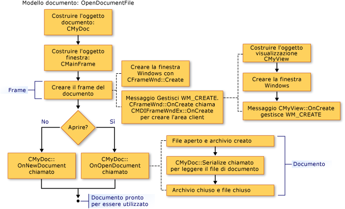

# Creazione di nuovi documenti, finestre e visualizzazioni
[!INCLUDE[vs2017banner](../assembler/inline/includes/vs2017banner.md)]

Le figure seguenti fanno cenni preliminari sul processo di creazione per documenti, visualizzazioni e finestre cornici.  Altri articoli incentrati su oggetti partecipanti per ulteriori dettagli.  
  
 Al completamento del processo, gli oggetti di supporto esistono tra loro e archiviano i puntatori.  Le figure seguenti mostrano la sequenza in cui vengono creati gli oggetti.  È possibile utilizzare la sequenza nella figura alla figura.  
  
   
Sequenza di creazione di un documento  
  
   
Sequenza di creazione di una finestra cornice  
  
   
Sequenza di creazione di una visualizzazione  
  
 Per informazioni su come il framework inizializza il nuovo documento, la visualizzazione e gli oggetti della finestra cornice, vedere le classi [CDocument](../mfc/reference/cdocument-class.md), [CView](../mfc/reference/cview-class.md), [CFrameWnd](../mfc/reference/cframewnd-class.md), [CMDIFrameWnd](../mfc/reference/cmdiframewnd-class.md) e [CMDIChildWnd](../mfc/reference/cmdichildwnd-class.md) in riferimenti alla libreria MFC.  Vedere anche [Nota tecnica 22](../mfc/tn022-standard-commands-implementation.md), che viene illustrata la creazione e processi di inizializzazione ulteriormente nella discussione dei controlli standard del framework per gli elementi `Nuovo` e **Apri** nel menu **File**.  
  
##   Inizializzare le proprie aggiunte a queste classi  
 Le figure precedenti anche suggeriscono punti in cui è possibile eseguire l'override delle funzioni membro per inizializzare gli oggetti dell'applicazione.  Override di `OnInitialUpdate` nella classe di visualizzazione sono la posizione migliore per inizializzare la visualizzazione.  La chiamata di `OnInitialUpdate` generato immediatamente dopo la finestra cornice viene creata e la visualizzazione all'interno della finestra cornice è associata al documento.  Ad esempio, se il punto di vista è una visualizzazione a scorrimento \(derivata da `CScrollView` anziché `CView`\), è necessario impostare le dimensioni di visualizzazione in base al formato documento nell'override di `OnInitialUpdate`. \(Questo processo è descritto in descrizione della classe [CScrollView](../mfc/reference/cscrollview-class.md)\). È possibile eseguire l'override delle funzioni membro `OnNewDocument` e `OnOpenDocument` di **CDocument** per consentire l'inizializzazione specifica dell'applicazione del documento.  In genere, è necessario eseguire l'override di entrambi poiché un documento può essere creato in due modi.  
  
 Nella maggior parte dei casi, le override devono chiamare la versione della classe base.  Per ulteriori informazioni, vedere funzioni membro delle classi denominate [CDocument](../mfc/reference/cdocument-class.md), [CView](../mfc/reference/cview-class.md), [CFrameWnd](../mfc/reference/cframewnd-class.md) e [CWinApp](../mfc/reference/cwinapp-class.md) in riferimenti alla libreria MFC.  
  
## Vedere anche  
 [Modelli di documenti e processo di creazione documento\/visualizzazione](../mfc/document-templates-and-the-document-view-creation-process.md)   
 [Creazione di modelli di documento](../mfc/document-template-creation.md)   
 [Creazione di documenti\/visualizzazioni](../mfc/document-view-creation.md)   
 [Relazioni tra oggetti MFC](../mfc/relationships-among-mfc-objects.md)