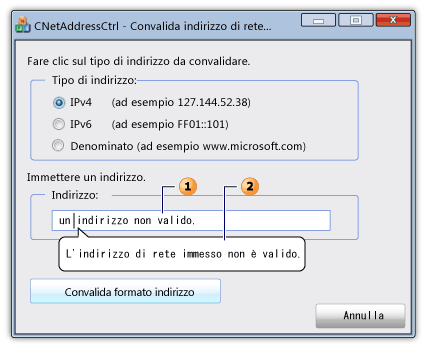

# <a name="cnetaddressctrl-class"></a>Classe CNetAddressCtrl

La classe `CNetAddressCtrl` rappresenta il controllo indirizzo di rete, che è possibile utilizzare per immettere e convalidare il formato di indirizzi IPv4, IPv6 e DNS denominati.

## <a name="syntax"></a>Sintassi

```
class CNetAddressCtrl : public CEdit
```

## <a name="members"></a>Membri

### <a name="public-constructors"></a>Costruttori pubblici

|Nome|Descrizione|
|----------|-----------------|
|[CNetAddressCtrl::CNetAddressCtrl](#cnetaddressctrl)|Costruisce un oggetto `CNetAddressCtrl`.|

### <a name="public-methods"></a>Metodi pubblici

|Nome|Descrizione|
|----------|-----------------|
|[CNetAddressCtrl::Creare](#create)|Crea un controllo di indirizzo di rete con `CNetAddressCtrl` gli stili specificati e lo associa all'oggetto corrente.|
|[CNetAddressCtrl::CreateEx](#createex)|Crea un controllo di indirizzo di rete con gli `CNetAddressCtrl` stili estesi specificati e lo associa all'oggetto corrente.|
|[CNetAddressCtrl::DisplayErrorTip](#displayerrortip)|Visualizza un suggerimento di errore quando l'utente immette un indirizzo di rete non supportato nel controllo dell'indirizzo di rete corrente.|
|[CNetAddressCtrl::GetAddress](#getaddress)|Recupera una rappresentazione convalidata e analizzata dell'indirizzo di rete associato al controllo dell'indirizzo di rete corrente.|
|[CNetAddressCtrl::GetAllowType](#getallowtype)|Recupera il tipo di indirizzo di rete che il controllo dell'indirizzo di rete corrente può supportare.|
|[CNetAddressCtrl::SetAllowType](#setallowtype)|Imposta il tipo di indirizzo di rete supportato dal controllo dell'indirizzo di rete corrente.|

## <a name="remarks"></a>Osservazioni

Il controllo dell'indirizzo di rete verifica che il formato dell'indirizzo immesso dall'utente sia corretto. Il controllo non si connette effettivamente all'indirizzo di rete. Il [cNetAddressCtrl::SetAllowType](#setallowtype) metodo specifica uno o più tipi di indirizzo che il [CNetAddressCtrl::GetAddress](#getaddress) metodo può analizzare e verificare. Un indirizzo può essere sotto forma di indirizzo IPv4, IPv6 o denominato per un server, una rete, un host o una destinazione di messaggi broadcast. Se il formato dell'indirizzo non è corretto, è possibile utilizzare il metodo [CNetAddressCtrl::DisplayErrorTip](#displayerrortip) per visualizzare una finestra di messaggio infotip che punta graficamente alla casella di testo del controllo dell'indirizzo di rete e visualizza un messaggio di errore predefinito.

La `CNetAddressCtrl` classe è derivata dalla [CEdit](../../mfc/reference/cedit-class.md) classe. Di conseguenza, il controllo degli indirizzi di rete fornisce l'accesso a tutti i messaggi di controllo di modifica di Windows.Sequently, the network address control provides access to all Windows edit control messages.

Nella figura seguente viene illustrata una finestra di dialogo che contiene un controllo di indirizzi di rete. La casella di testo (1) per il controllo dell'indirizzo di rete contiene un indirizzo di rete non valido. Se l'indirizzo di rete non è valido, viene visualizzato il messaggio di suggerimento informativo (2).



## <a name="example"></a>Esempio

L'esempio di codice seguente è una parte di una finestra di dialogo che convalida un indirizzo di rete. I gestori eventi per tre pulsanti di opzione specificano che l'indirizzo di rete può essere uno dei tre tipi di indirizzo. L'utente immette un indirizzo nella casella di testo del controllo di rete, quindi preme un pulsante per convalidare l'indirizzo. Se l'indirizzo è valido, viene visualizzato un messaggio di operazione riuscita; in caso contrario, viene visualizzato il messaggio di errore infotip predefinito.

[!code-cpp[NVC_MFC_CNetAddressCtrl_s1#1](../../mfc/reference/codesnippet/cpp/cnetaddressctrl-class_1.cpp)]

## <a name="example"></a>Esempio

Nell'esempio di codice riportato di seguito il file di intestazione della finestra di dialogo vengono definite [le](/windows/win32/api/shellapi/ns-shellapi-nc_address) NC_ADDRESS e [NET_ADDRESS_INFO](/windows/win32/shell/hkey-type) variabili richieste dal metodo [CNetAddressCtrl::GetAddress](#getaddress) .

[!code-cpp[NVC_MFC_CNetAddressCtrl_s1#2](../../mfc/reference/codesnippet/cpp/cnetaddressctrl-class_2.h)]

## <a name="inheritance-hierarchy"></a>Gerarchia di ereditarietà

[CObject](../../mfc/reference/cobject-class.md)

[CCmdTarget](../../mfc/reference/ccmdtarget-class.md)

[CWnd](../../mfc/reference/cwnd-class.md)

[CEdit](../../mfc/reference/cedit-class.md)

`CNetAddressCtrl`

## <a name="requirements"></a>Requisiti

**Intestazione:** afxcmn.h

Questa classe è supportata in Windows Vista e versioni successive.

Ulteriori requisiti per questa classe sono descritti in [Requisiti di compilazione per](../../mfc/build-requirements-for-windows-vista-common-controls.md)i controlli comuni di Windows Vista .

## <a name="cnetaddressctrlcnetaddressctrl"></a><a name="cnetaddressctrl"></a>CNetAddressCtrl::CNetAddressCtrl

Costruisce un oggetto `CNetAddressCtrl`.

```
CNetAddressCtrl();
```

### <a name="remarks"></a>Osservazioni

Utilizzare il metodo [CNetAddressCtrl::Create](#create) o [CNetAddressCtrl::CreateEx](#createex) per creare `CNetAddressCtrl` un controllo di rete e collegarlo all'oggetto.

## <a name="cnetaddressctrlcreate"></a><a name="create"></a>CNetAddressCtrl::Creare

Crea un controllo di indirizzo di rete con `CNetAddressCtrl` gli stili specificati e lo associa all'oggetto corrente.

```
virtual BOOL Create(
    DWORD dwStyle,
    const RECT& rect,
    CWnd* pParentWnd,
    UINT nID);
```

### <a name="parameters"></a>Parametri

|Parametro|Descrizione|
|---------------|-----------------|
|*DwStyle (in stile dwStyle)*|[in] Combinazione bit per bit di stili da applicare al controllo. Per ulteriori informazioni, consultate [Modifica degli stili.](../../mfc/reference/styles-used-by-mfc.md#edit-styles)|
|*Rect*|[in] Riferimento a una struttura [RECT](/previous-versions/dd162897\(v=vs.85\)) che contiene la posizione e le dimensioni del controllo.|
|*pParentWnd (informazioni in due)*|[in] Puntatore non null a un [CWnd](../../mfc/reference/cwnd-class.md) oggetto che è la finestra padre del controllo.|
|*nID*|[in] ID del controllo.|

### <a name="return-value"></a>Valore restituito

TRUESe questo metodo ha esito positivo. in caso contrario, FALSE.

## <a name="cnetaddressctrlcreateex"></a><a name="createex"></a>CNetAddressCtrl::CreateEx

Crea un controllo di indirizzo di rete con gli `CNetAddressCtrl` stili estesi specificati e lo associa all'oggetto corrente.

```
virtual BOOL CreateEx(
    DWORD dwExStyle,
    DWORD dwStyle,
    const RECT& rect,
    CWnd* pParentWnd,
    UINT nID);
```

### <a name="parameters"></a>Parametri

|Parametro|Descrizione|
|---------------|-----------------|
|*DwExStyle (in stile dwExStyle)*|[in] Combinazione bit per bit (OR) di stili estesi da applicare al controllo. Per ulteriori informazioni, vedere il parametro *dwExStyle* della funzione [CreateWindowEx.](/windows/win32/api/winuser/nf-winuser-createwindowexw)|
|*DwStyle (in stile dwStyle)*|[in] Combinazione bit per bit (OR) di stili da applicare al controllo. Per ulteriori informazioni, consultate [Modifica degli stili.](../../mfc/reference/styles-used-by-mfc.md#edit-styles)|
|*Rect*|[in] Riferimento a una struttura [RECT](/previous-versions/dd162897\(v=vs.85\)) che contiene la posizione e le dimensioni del controllo.|
|*pParentWnd (informazioni in due)*|[in] Puntatore non null a un [CWnd](../../mfc/reference/cwnd-class.md) oggetto che è la finestra padre del controllo.|
|*nID*|[in] ID del controllo.|

### <a name="return-value"></a>Valore restituito

TRUESe questo metodo ha esito positivo. in caso contrario, FALSE.

## <a name="cnetaddressctrldisplayerrortip"></a><a name="displayerrortip"></a>CNetAddressCtrl::DisplayErrorTip

Visualizza un messaggio di errore nel fumetto associato al controllo dell'indirizzo di rete corrente.

```
HRESULT DisplayErrorTip();
```

### <a name="return-value"></a>Valore restituito

Valore `S_OK` se questo metodo ha esito positivo; in caso contrario, un codice di errore.

### <a name="remarks"></a>Osservazioni

Utilizzare il [CNetAddressCtrl::SetAllowType](#setallowtype) metodo per specificare i tipi di indirizzi che il controllo degli indirizzi di rete corrente può supportare. Utilizzare il [CNetAddressCtrl::GetAddress](#getaddress) metodo per convalidare e analizzare l'indirizzo di rete che l'utente immette. Utilizzare il [cNetAddressCtrl::DisplayErrorTip metodo](#displayerrortip) per visualizzare un messaggio di errore infotip se il [CNetAddressCtrl::GetAddress](#getaddress) metodo ha esito negativo.

Questo messaggio richiama la macro [NetAddr_DisplayErrorTip,](/windows/win32/api/shellapi/nf-shellapi-netaddr_displayerrortip) descritta in Windows SDK. La macro `NCM_DISPLAYERRORTIP` invia il messaggio.

## <a name="cnetaddressctrlgetaddress"></a><a name="getaddress"></a>CNetAddressCtrl::GetAddress

Recupera una rappresentazione convalidata e analizzata dell'indirizzo di rete associato al controllo dell'indirizzo di rete corrente.

```
HRESULT GetAddress(PNC_ADDRESS pAddress) const;
```

### <a name="parameters"></a>Parametri

*pIndirizzo*<br/>
[in, out] Puntatore a una struttura [NC_ADDRESS.](/windows/win32/api/shellapi/ns-shellapi-nc_address)  Impostare il *membro pAddrInfo* di questa struttura sull'indirizzo di un [NET_ADDRESS_INFO](/windows/win32/shell/hkey-type) struttura prima di chiamare il GetAddress metodo.

### <a name="return-value"></a>Valore restituito

Il valore S_OK se questo metodo ha esito positivo; in caso contrario, un codice di errore COM. Per ulteriori informazioni sui possibili codici di errore, vedere la sezione Valore restituito della macro [NetAddr_GetAddress.](/windows/win32/api/shellapi/nf-shellapi-netaddr_getaddress)

### <a name="remarks"></a>Osservazioni

Se questo metodo ha esito positivo, la [struttura NET_ADDRESS_INFO](/windows/win32/shell/hkey-type) contiene informazioni aggiuntive sull'indirizzo di rete.

Utilizzare il [CNetAddressCtrl::SetAllowType](#setallowtype) metodo per specificare i tipi di indirizzi corrente controllo degli indirizzi di rete può supportare. Utilizzare il [CNetAddressCtrl::GetAddress](#getaddress) metodo per convalidare e analizzare l'indirizzo di rete che l'utente immette. Utilizzare il [cNetAddressCtrl::DisplayErrorTip metodo](#displayerrortip) per visualizzare un messaggio di errore infotip se il [CNetAddressCtrl::GetAddress](#getaddress) metodo ha esito negativo.

Questo metodo richiama la macro [NetAddr_GetAddress,](/windows/win32/api/shellapi/nf-shellapi-netaddr_getaddress) descritta in Windows SDK. Tale macro invia il messaggio NCM_GETADDRESS.

## <a name="cnetaddressctrlgetallowtype"></a><a name="getallowtype"></a>CNetAddressCtrl::GetAllowType

Recupera il tipo di indirizzo di rete che il controllo dell'indirizzo di rete corrente può supportare.

```
DWORD GetAllowType() const;
```

### <a name="return-value"></a>Valore restituito

Combinazione bit per bit (OR) di flag che specifica i tipi di indirizzi che il controllo degli indirizzi di rete può supportare. Per ulteriori informazioni, vedere [NET_STRING](/windows/win32/shell/net-string).

### <a name="remarks"></a>Osservazioni

Questo messaggio richiama la macro [NetAddr_GetAllowType,](/windows/win32/api/shellapi/nf-shellapi-netaddr_getallowtype) descritta in Windows SDK. Tale macro invia il messaggio NCM_GETALLOWTYPE.

## <a name="cnetaddressctrlsetallowtype"></a><a name="setallowtype"></a>CNetAddressCtrl::SetAllowType

Imposta il tipo di indirizzo di rete supportato dal controllo dell'indirizzo di rete corrente.

```
HRESULT SetAllowType(DWORD dwAddrMask);
```

### <a name="parameters"></a>Parametri

|Parametro|Descrizione|
|---------------|-----------------|
|*dwAddrMaschera*|[in] Combinazione bit per bit (OR) di flag che specifica i tipi di indirizzi che il controllo degli indirizzi di rete può supportare. Per ulteriori informazioni, vedere [NET_STRING](/windows/win32/shell/net-string).|

### <a name="return-value"></a>Valore restituito

S_OK se questo metodo ha esito positivo; in caso contrario, un codice di errore COM.

### <a name="remarks"></a>Osservazioni

Utilizzare il [CNetAddressCtrl::SetAllowType](#setallowtype) metodo per specificare i tipi di indirizzi che il controllo degli indirizzi di rete corrente può supportare. Utilizzare il [CNetAddressCtrl::GetAddress](#getaddress) metodo per convalidare e analizzare l'indirizzo di rete che l'utente immette. Utilizzare il [cNetAddressCtrl::DisplayErrorTip metodo](#displayerrortip) per visualizzare un messaggio di errore infotip se il [CNetAddressCtrl::GetAddress](#getaddress) metodo ha esito negativo.

Questo messaggio richiama la macro [NetAddr_SetAllowType,](/windows/win32/api/shellapi/nf-shellapi-netaddr_setallowtype) descritta in Windows SDK. Tale macro invia il messaggio di NCM_SETALLOWTYPE.

## <a name="see-also"></a>Vedere anche

[CNetAddressCtrl (classe)](../../mfc/reference/cnetaddressctrl-class.md)<br/>
[Grafico delle gerarchie](../../mfc/hierarchy-chart.md)<br/>
[CEdit Class](../../mfc/reference/cedit-class.md)
