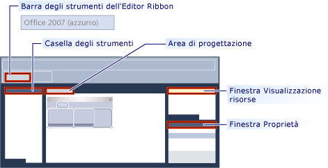

# <a name="ribbon-designer-mfc"></a>Finestra di progettazione della barra multifunzione (MFC)

La finestra di progettazione della barra multifunzione permette di creare e personalizzare barre multifunzione in applicazioni MFC. Una barra multifunzione è un elemento dell'interfaccia utente che organizza i comandi in gruppi logici. Questi gruppi sono visualizzati in schede separate in una striscia che occupa tutta la parte superiore della finestra. La barra multifunzione sostituisce la barra dei menu e le barre degli strumenti. Una barra multifunzione può migliorare significativamente l'usabilità delle applicazioni. Per altre informazioni, vedere [barre multifunzione](/windows/desktop/uxguide/cmd-ribbons). La figura seguente mostra una barra multifunzione.


Nelle versioni precedenti di Visual Studio, dovevano essere creato mediante la scrittura di codice che usa le classi ribbon MFC, ad esempio le barre multifunzione [classe CMFCRibbonBar](../mfc/reference/cmfcribbonbar-class.md). In Visual Studio 2010 e versioni successive, la finestra di progettazione della barra multifunzione fornisce un metodo alternativo per la creazione di barre multifunzione. Prima di tutto, creare e personalizzare una barra multifunzione come risorsa. Caricare quindi la risorsa barra multifunzione dal codice nell'applicazione MFC. È anche possibile usare risorse barra multifunzione e classi Ribbon MFC insieme. È possibile, ad esempio, crea una risorsa barra multifunzione e quindi a livello di programmazione aggiungervi più elementi in fase di esecuzione tramite il codice.

## <a name="understanding-the-ribbon-designer"></a>Informazioni sulla finestra di progettazione della barra multifunzione

La finestra di progettazione della barra multifunzione crea e archivia la barra multifunzione come risorsa. Quando si crea una risorsa barra multifunzione, la finestra di progettazione della barra multifunzione esegue tre operazioni:

- Aggiunge una voce nello script di definizione delle risorse del progetto (*.rc). Nell'esempio seguente, IDR_RIBBON è il nome univoco che identifica la risorsa barra multifunzione, RT_RIBBON_XML è il tipo di risorsa e mfcribbon-ms è il nome del file di risorse.

```
    IDR_RIBBON RT_RIBBON_XML      "res\\ribbon.mfcribbon-ms"
```

- Aggiunge le definizioni degli ID comando a resource.h.

```
#define IDR_RIBBON            307
```

- Crea un file di risorse della barra multifunzione (*.mfcribbon-ms) che contiene il codice XML che definisce i pulsanti, i controlli e gli attributi della barra multifunzione. Le modifiche apportate alla barra multifunzione nella finestra di progettazione della barra multifunzione vengono archiviate come XML nel file di risorse. Esempio di codice seguente viene illustrata parte del contenuto di un \*file con estensione mfcribbon-ms:

```
<RIBBON_BAR>
<ELEMENT_NAME>RibbonBar</ELEMENT_NAME>
<IMAGE>
<ID>
<NAME>IDB_BUTTONS</NAME>
<VALUE>113</VALUE>
</ID>
```

Per usare la risorsa barra multifunzione nell'applicazione MFC, caricare la risorsa chiamando [CMFCRibbonBar:: LoadFromResource](../mfc/reference/cmfcribbonbar-class.md#loadfromresource).

## <a name="creating-a-ribbon-by-using-the-ribbon-designer"></a>Creazione di una barra multifunzione mediante la finestra di progettazione della barra multifunzione

È possibile aggiungere una risorsa barra multifunzione al progetto MFC in due modi diversi:

- Creare un'applicazione MFC e configurare la Creazione guidata progetto MFC in modo da creare la barra multifunzione. Per altre informazioni, vedere [Procedura dettagliata: Creazione di un'applicazione barra multifunzione usando MFC](../mfc/walkthrough-creating-a-ribbon-application-by-using-mfc.md).

- In un progetto MFC esistente creare una risorsa barra multifunzione e caricarla. Per altre informazioni, vedere [Procedura dettagliata: L'aggiornamento dell'applicazione MFC Scribble (parte 1)](../mfc/walkthrough-updating-the-mfc-scribble-application-part-1.md).

Se il progetto contiene già una barra multifunzione codificata manualmente, MFC include funzioni che permettono di convertire la barra multifunzione esistente in una risorsa barra multifunzione. Per altre informazioni, vedere [Procedura: Convertire una barra multifunzione MFC esistente in una risorsa barra multifunzione](../mfc/how-to-convert-an-existing-mfc-ribbon-to-a-ribbon-resource.md).

> [!NOTE]
>  Le barre multifunzione non possono essere create in applicazioni basate su finestra di dialogo. Per altre informazioni, vedere [tipo di applicazione, creazione guidata applicazione MFC](../mfc/reference/application-type-mfc-application-wizard.md).

## <a name="customizing-ribbons"></a>Personalizzazione di barre multifunzione

Per aprire una barra multifunzione nella finestra di progettazione della barra multifunzione, fare doppio clic sulla risorsa barra multifunzione in Visualizzazione risorse. Nella finestra di progettazione è possibile aggiungere, rimuovere e personalizzare gli elementi sulla barra multifunzione, il pulsante dell'applicazione o la barra di accesso rapido. È anche possibile collegare eventi, ad esempio eventi di selezione di pulsanti ed eventi di menu, a un metodo nell'applicazione.

La figura seguente mostra i diversi componenti presenti nella finestra di progettazione della barra multifunzione.



- **Casella degli strumenti:** Contiene i controlli che possono essere trascinati nell'area di progettazione.

- **Nell'area di progettazione:** Contiene la rappresentazione visiva della risorsa barra multifunzione.

- **Finestra delle proprietà:** Elenca gli attributi dell'elemento selezionato nell'area di progettazione.

- **Finestra Visualizzazione risorse:** Consente di visualizzare le risorse che includono risorse della barra multifunzione, nel progetto.

- **Barra degli strumenti Editor Ribbon:** Contiene i comandi che consentono di visualizzare l'anteprima della barra multifunzione e modificarne il tema visivo.

Gli argomenti seguenti descrivono come usare le funzionalità della finestra di progettazione della barra multifunzione:

- [Procedura: Personalizzare il pulsante dell'applicazione](../mfc/how-to-customize-the-application-button.md)

- [Procedura: Personalizzare la barra di accesso rapido](../mfc/how-to-customize-the-quick-access-toolbar.md)

- [Procedura: Aggiungere controlli e gestori eventi della barra multifunzione](../mfc/how-to-add-ribbon-controls-and-event-handlers.md)

- [Procedura: Caricare una risorsa Ribbon da un'applicazione MFC](../mfc/how-to-load-a-ribbon-resource-from-an-mfc-application.md)

## <a name="definitions-of-ribbon-elements"></a>Definizioni degli elementi della barra multifunzione


- **Pulsante dell'applicazione:** Pulsante visualizzato nell'angolo superiore sinistro di una barra multifunzione. Il pulsante dell'applicazione sostituisce il menu File ed è visibile anche quando la barra multifunzione è ridotta a icona. Quando si fa clic su questo pulsante, viene visualizzato un menu che contiene un elenco di comandi.

- **Barra di accesso rapido:** Comandi utilizzati più di una piccola barra degli strumenti personalizzabile che viene visualizzato di frequente.

- **Categoria**: Il raggruppamento logico che rappresenta il contenuto di una scheda della barra multifunzione.

- **Pulsante predefinito della categoria:** Il pulsante visualizzato sulla barra multifunzione quando si è ridotta a icona la barra multifunzione. Quando si fa clic su questo pulsante, la categoria viene visualizzata di nuovo come menu.

- **Pannello:** Un'area della barra multifunzione che visualizza un gruppo di controlli correlati. Ogni categoria della barra multifunzione contiene uno o più pannelli della barra multifunzione.

- **Elementi della barra multifunzione:** Controlli nei pannelli, ad esempio, i pulsanti e caselle combinate. Per i vari controlli che possono essere ospitati in una barra multifunzione, vedere [esempio RibbonGadgets: Sulla barra multifunzione dell'applicazione gadget](../overview/visual-cpp-samples.md).

## <a name="see-also"></a>Vedere anche

[Elementi dell'interfaccia utente](../mfc/user-interface-elements-mfc.md)<br/>
[Uso di file di risorse](../windows/working-with-resource-files.md)
