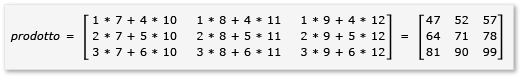
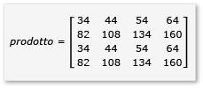

# Procedura dettagliata: moltiplicazione di matrici
[!INCLUDE[vs2017banner](../../assembler/inline/includes/vs2017banner.md)]

In questa procedura dettagliata viene illustrato come utilizzare AMP C\+\+ per velocizzare l'esecuzione di moltiplicazioni fra matrici.  Vengono presentati due algoritmi, uno senza tiling e uno con tiling.  
  
## Prerequisiti  
 Prima di iniziare:  
  
-   Leggere [Cenni preliminari su C\+\+ AMP](../../parallel/amp/cpp-amp-overview.md).  
  
-   Leggere [Utilizzo di sezioni](../../parallel/amp/using-tiles.md).  
  
-   Assicurarsi che [!INCLUDE[win7](../../build/includes/win7_md.md)], [!INCLUDE[win8](../../build/includes/win8_md.md)], [!INCLUDE[winsvr08_r2](../../parallel/amp/includes/winsvr08_r2_md.md)] o [!INCLUDE[winserver8](../../build/includes/winserver8_md.md)] sia installato nel computer in uso.  
  
### Per creare il progetto  
  
1.  Sulla barra dei menu di Visual Studio, scegliere **File**, **Nuovo**, **Project**.  
  
2.  In **installati**, nel riquadro modelli, selezionare **Visual C\+\+**.  
  
3.  Selezionare **Progetto vuoto**, immettere `MatrixMultiply` nella casella **Nome** quindi scegliere il pulsante **OK**.  
  
4.  Fare clic sul pulsante **Avanti**.  
  
5.  In **Esplora soluzioni**, aprire il menu di scelta rapida dei **File di origine**, quindi scegliere **Aggiungi**, **Nuovo elemento**.  
  
6.  Nella finestra di dialogo **Aggiungi nuovo elemento**, selezionare **File di C\+\+ \(.cpp\)**, immettere `MatrixMultiply.cpp` nella casella **Nome** quindi scegliere il pulsante **Aggiungi**.  
  
## Moltiplicazione senza tiling  
 In questa sezione, considerare la moltiplicazione di due matrici A e B, definite come segue:  
  
   
  
   
  
 A è una matrice 3x2 e B è una matrice 2x3.  Il prodotto della moltiplicazione fra A e B è la seguente matrice 3x3.  Il prodotto viene calcolato moltiplicando le righe di A per le colonne di B elemento per elemento.  
  
   
  
### Per moltiplicare senza utilizzare C\+\+ AMP  
  
1.  Aprire MatrixMultiply.cpp e utilizzare il seguente codice sostituendo il codice esistente.  
  
    ```cpp  
  
    #include <iostream>  
  
    void MultiplyWithOutAMP() {  
  
        int aMatrix[3][2] = {{1, 4}, {2, 5}, {3, 6}};  
        int bMatrix[2][3] = {{7, 8, 9}, {10, 11, 12}};  
        int product[3][3] = {{0, 0, 0}, {0, 0, 0}, {0, 0, 0}};  
  
        for (int row = 0; row < 3; row++) {  
            for (int col = 0; col < 3; col++) {  
                // Multiply the row of A by the column of B to get the row, column of product.  
                for (int inner = 0; inner < 2; inner++) {  
                    product[row][col] += aMatrix[row][inner] * bMatrix[inner][col];  
                }  
                std::cout << product[row][col] << "  ";  
            }  
            std::cout << "\n";  
        }  
    }  
  
    void main() {  
        MultiplyWithOutAMP();  
        getchar();  
    }  
  
    ```  
  
     L'algoritmo è una semplice implementazione della definizione della moltiplicazione fra matrici.  Non viene utilizzato nessun algoritmo parallelo o di thread per ridurre il tempo di calcolo.  
  
2.  Nella barra dei menu, scegliere **File**, **Salva tutto**.  
  
3.  Scegliere la scelta rapida F5 per avviare il debug e verificare che l'output sia corretto.  
  
4.  Scegliere Invio per uscire dall'applicazione.  
  
### Per moltiplicare con l'utilizzo di C\+\+ AMP  
  
1.  In MatrixMultiply.cpp, aggiungere il seguente codice prima del metodo `main`.  
  
    ```cpp  
  
    void MultiplyWithAMP() {  
        int aMatrix[] = { 1, 4, 2, 5, 3, 6 };  
        int bMatrix[] = { 7, 8, 9, 10, 11, 12 };  
        int productMatrix[] = { 0, 0, 0, 0, 0, 0, 0, 0, 0 };  
  
        array_view<int, 2> a(3, 2, aMatrix);  
        array_view<int, 2> b(2, 3, bMatrix);  
        array_view<int, 2> product(3, 3, productMatrix);  
  
        parallel_for_each(  
            product.extent,   
             [=](index<2> idx) restrict(amp) {  
                int row = idx[0];  
                int col = idx[1];  
                for (int inner = 0; inner < 2; inner++) {  
                    product[idx] += a(row, inner) * b(inner, col);  
                }  
            }  
        );  
  
        product.synchronize();  
  
        for (int row = 0; row < 3; row++) {  
            for (int col = 0; col < 3; col++) {  
                //std::cout << productMatrix[row*3 + col] << "  ";  
                std::cout << product(row, col) << "  ";  
            }  
            std::cout << "\n";  
        }  
    }  
  
    ```  
  
     Il codice di AMP è simile al codice non\-AMP.  La chiamata a `parallel_for_each` avvia un thread per ogni elemento nel `product.extent` e sostituisce i cicli `for` per riga e colonna.  Il valore della cella in corrispondenza della riga e della colonna è disponibile in `idx`.  È possibile accedere agli elementi di un oggetto `array_view` utilizzando l'operatore `[]` e una variabile di indice, o l'operatore `()` e le variabili di riga e colonna.  L'esempio dimostra entrambi i metodi.  Il metodo `array_view::synchronize` copia i valori della variabile `product` nella variabile `productMatrix`.  
  
2.  Aggiungere le istruzioni `include` e `using` all'inizio di MatrixMultiply.cpp.  
  
    ```cpp  
  
    #include <amp.h>  
    using namespace concurrency;  
  
    ```  
  
3.  Modificare il metodo `main` per chiamare il metodo `MultiplyWithAMP`.  
  
    ```cpp  
  
    void main() {  
        MultiplyWithOutAMP();  
        MultiplyWithAMP();  
        getchar();  
    }  
  
    ```  
  
4.  Scegliere la scelta rapida CTRL\+F5 per avviare il debug e verificare che l'output sia corretto.  
  
5.  Scegliere la barra spaziatrice per uscire dall'applicazione.  
  
## Moltiplicazione con tiling  
 Il tiling è una tecnica dove si partizionano i dati in sottoinsiemi della stessa dimensione, noti come tiles.  Tre cose cambiano quando si utilizza il tiling.  
  
-   È possibile creare variabili `tile_static`.  L'accesso ai dati nello spazio `tile_static` può essere molte volte più veloce di un accesso ai dati dello spazio globale.  Un'istanza di una variabile `tile_static` viene creata per ogni sezione e tutti i thread nella sezione hanno accesso alla variabile.  Il vantaggio principale del tiling è il miglioramento delle prestazioni grazie all'accesso di `tile_static`.  
  
-   È possibile chiamare il metodo [tile\_barrier::wait](../Topic/tile_barrier::wait%20Method.md) per arrestare tutti i thread di un tile a una riga di codice specificata.  Non è possibile garantire l'ordine in cui i thread verranno eseguiti, solo che tutti i thread di un tile si arresteranno alla chiamata a `tile_barrier::wait`, prima di proseguire l'esecuzione.  
  
-   È possibile accedere all'indice del thread relativo dell'intero oggetto `array_view` e all'indice relativo al tile.  Utilizzando l'indice di locale, è possibile semplificare il codice in lettura e debug.  
  
 Per sfruttare il tiling nella moltiplicazione fra matrici, l'algoritmo deve suddividere la matrice in sezioni e poi copiare i dati della sezione nelle variabili `tile_static` per velocizzare l'accesso.  In questo esempio, la matrice è suddivisa in sottomatrici di dimensioni uguali.  Il prodotto viene trovato moltiplicando le sottomatrici.  Le due matrici e il loro prodotto in questo esempio sono:  
  
   
  
   
  
   
  
 Le matrici sono suddivise in quattro matrici 2x2 che sono definite come segue:  
  
   
  
   
  
 Il prodotto di A e B è ora scritto e calcolato come segue:  
  
   
  
 Poiché le matrici `a` e `h` sono matrici 2x2, tutti i prodotti e le somme fra di esse sono ancora matrici 2x2.  Inoltre segue che A\*B è una matrice 4x4, come previsto.  Per verificare rapidamente l'algoritmo, calcolare il valore dell'elemento nella prima riga, prima colonna del prodotto.  Nell'esempio, sarebbe il valore dell'elemento nella prima riga e prima colonna `ae + bg`.  È necessario calcolare solo la prima colonna, la prima riga `ae` e `bg` per ogni termine.  That value for `ae` is `1*1 + 2*5 = 11`.  Il valore della proprietà `bg` è `3*1 + 4*5 = 23`.  Il valore finale è `11 + 23 = 34`, che è corretto.  
  
 Per implementare questo algoritmo, il codice:  
  
-   Utilizza un oggetto `tiled_extent` anziché un oggetto `extent` nella chiamata `parallel_for_each`.  
  
-   Utilizza un oggetto `tiled_index` anziché un oggetto `index` nella chiamata `parallel_for_each`.  
  
-   Crea le variabili `tile_static` per salvare le sottomatrici.  
  
-   Utilizza il metodo `tile_barrier::wait` per arrestare i thread nel calcolo dei prodotti delle sottomatrici.  
  
### Per moltiplicare utilizzando AMP e il tiling  
  
1.  In MatrixMultiply.cpp, aggiungere il seguente codice prima del metodo `main`.  
  
    ```cpp  
  
    void MultiplyWithTiling()  
    {  
        // The tile size is 2.  
        static const int TS = 2;  
  
        // The raw data.  
        int aMatrix[] =       { 1, 2, 3, 4, 5, 6, 7, 8, 1, 2, 3, 4, 5, 6, 7, 8 };  
        int bMatrix[] =       { 1, 2, 3, 4, 5, 6, 7, 8, 1, 2, 3, 4, 5, 6, 7, 8 };  
        int productMatrix[] = { 0, 0, 0, 0, 0, 0, 0, 0, 0, 0, 0, 0, 0, 0, 0, 0 };  
  
        // Create the array_view objects.  
        array_view<int, 2> a(4, 4, aMatrix);  
        array_view<int, 2> b(4, 4, bMatrix);  
        array_view<int, 2> product(4, 4, productMatrix);  
  
        // Call parallel_for_each by using  2x2 tiles.  
        parallel_for_each(product.extent.tile< TS, TS >(),  
            [=] (tiled_index< TS, TS> t_idx) restrict(amp)   
            {  
                // Get the location of the thread relative to the tile (row, col) and the entire array_view (rowGlobal, colGlobal).  
                int row = t_idx.local[0];   
                int col = t_idx.local[1];  
                int rowGlobal = t_idx.global[0];  
                int colGlobal = t_idx.global[1];  
                int sum = 0;  
  
                // Given a 4x4 matrix and a 2x2 tile size, this loop executes twice for each thread.  
                // For the first tile and the first loop, it copies a into locA and e into locB.  
                // For the first tile and the second loop, it copies b into locA and g into locB.  
                for (int i = 0; i < 4; i += TS) {  
                    tile_static int locA[TS][TS];  
                    tile_static int locB[TS][TS];  
                    locA[row][col] = a(rowGlobal, col + i);  
                    locB[row][col] = b(row + i, colGlobal);  
                    // The threads in the tile all wait here until locA and locB are filled.  
                    t_idx.barrier.wait();  
  
                    // Return the product for the thread. The sum is retained across  
                    // both iterations of the loop, in effect adding the two products  
                    // together, for example, a*e.  
                    for (int k = 0; k < TS; k++) {  
                        sum += locA[row][k] * locB[k][col];  
                    }  
  
                    // All threads must wait until the sums are calculated. If any threads  
                    // moved ahead, the values in locA and locB would change.        
                    t_idx.barrier.wait();  
                    // Now go on to the next iteration of the loop.            
                }  
  
                // After both iterations of the loop, copy the sum to the product variable by using the global location.  
                product[t_idx.global] = sum;  
        });  
  
            // Copy the contents of product back to the productMatrix variable.  
            product.synchronize();  
  
            for (int row = 0; row < 4; row++) {  
            for (int col = 0; col < 4; col++) {  
                // The results are available from both the product and productMatrix variables.  
                //std::cout << productMatrix[row*3 + col] << "  ";  
                std::cout << product(row, col) << "  ";  
            }  
            std::cout << "\n";  
        }  
  
    }  
  
    ```  
  
     Questo esempio è molto diverso rispetto all'esempio senza tiling.  Il codice utilizza questi passaggi concettuali:  
  
    1.  Copia gli elementi di tile\[0,0\] di `a` in `locA`.  Copia gli elementi di tile\[0,0\] di `b` in `locB`.  Si noti che `product` è diviso in sezioni, non `a` e `b`.  Pertanto, si utilizzano indici globali per accedere ad `a, b` e `product`.  La chiamata a `tile_barrier::wait` è essenziale.  Arresta tutti thread nella sezione fino a che non sono riempiti sia `locA` che `locB`.  
  
    2.  Moltiplica `locA` e `locB` e inserire i risultati in `product`.  
  
    3.  Copia gli elementi di tile\[0,1\] di `a` in `locA`.  Copia gli elementi di tile\[1,0\] di `b` in `locB`.  
  
    4.  Moltiplica `locA` e `locB` e li aggiunge ai risultati che sono già in `product`.  
  
    5.  La moltiplicazione del tile\[0,0\] è stata completata.  
  
    6.  Ripetuto per gli altri quattro tile.  Non è possibile indicizzare tile e thread i quali possono essere eseguiti in un qualsiasi ordine.  Durante l'esecuzione dei thread, le variabili `tile_static` vengono create per ogni tile in modo appropriato e la chiamata a `tile_barrier::wait` controlla il flusso del programma.  
  
    7.  Esaminando dettagliatamente l'algoritmo, si noti che ogni sottomatrice viene caricata due volte in una memoria `tile_static`.  Tempo di trasferimento dei dati.  Tuttavia, una volta che i dati sono nella memoria `tile_static`, l'accesso ai dati è molto più rapido.  Poiché calcolare i prodotti richiede l'accesso ripetuto ai valori nelle sottomatrici, esiste un aumento globale di prestazioni.  Per ogni algoritmo, è richiesta la sperimentazione per trovare l'algoritmo e la dimensione dei tile ottimali.  
  
         Negli esempi non di AMP e non di tile, per ogni elemento di A e B vengono effettuati quattro accessi dalla memoria globale per calcolare il prodotto.  Nell'esempio del tile, per ogni elemento vengono effettuati due accessi dalla memoria globale e quattro dalla memoria `tile_static`.  Non è un notevole miglioramento di prestazioni.  Tuttavia, se A e B fossero matrici 1024x1024 e la dimensione del tile fosse 16, si avrebbe un aumento significativo delle prestazioni.  In tal caso, ogni elemento verrebbe copiato nella memoria `tile_static` solo 16 volte e acceduto dalla memoria `tile_static` 1024 volte.  
  
2.  Modificare il metodo main per chiamare il metodo `MultiplyWithTiling`, come illustrato.  
  
    ```cpp  
  
    void main() {  
        MultiplyWithOutAMP();  
        MultiplyWithAMP();  
        MultiplyWithTiling();  
        getchar();  
    }  
  
    ```  
  
3.  Scegliere la scelta rapida CTRL\+F5 per avviare il debug e verificare che l'output sia corretto.  
  
4.  Scegliere la barra spaziatrice per uscire dall'applicazione.  
  
## Vedere anche  
 [C\+\+ AMP \(C\+\+ Accelerated Massive Parallelism\)](../../parallel/amp/cpp-amp-cpp-accelerated-massive-parallelism.md)   
 [Procedura dettagliata: Debug di un'applicazione C\+\+ AMP](../../parallel/amp/walkthrough-debugging-a-cpp-amp-application.md)