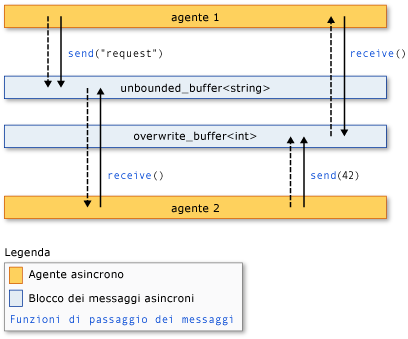

# <a name="asynchronous-agents-library"></a>libreria di agenti asincroni

La libreria di agenti asincroni (o semplicemente *libreria di agenti*) fornisce un modello di programmazione che consente di aumentare l'affidabilità dello sviluppo di applicazioni abilitate per la concorrenza. La libreria di agenti è una libreria di modelli C++ che promuove un modello di programmazione basato su attori e il passaggio dei messaggi in-process per le attività di pipelining e del flusso di lavoro con granularità grossolana. La libreria agenti si basa sui componenti di pianificazione e gestione delle risorse della runtime di concorrenza.

## <a name="programming-model"></a>Modello di programmazione

La libreria di agenti fornisce alternative allo stato condiviso consentendo la connessione di componenti isolati tramite un modello di comunicazione asincrono basato sul flusso di controllo anziché sul flusso di controllo. Il *flusso* di dati fa riferimento a un modello di programmazione in cui vengono eseguiti i calcoli quando sono disponibili tutti i dati necessari. il *flusso di controllo* si riferisce a un modello di programmazione in cui i calcoli vengono eseguiti in un ordine predeterminato.

Il modello di programmazione del flusso di dati è correlato al concetto di *passaggio dei messaggi*, in base al quale i componenti indipendenti di un programma comunicano con un altro programma inviando messaggi.

La libreria di agenti è costituita da tre componenti: *agenti asincroni*, *blocchi di messaggi asincroni* e *funzioni di passaggio dei messaggi*. Gli agenti mantengono lo stato e utilizzano blocchi di messaggio e funzioni di passaggio dei messaggi per comunicare tra loro e con componenti esterni. Le funzioni di passaggio dei messaggi consentono agli agenti di inviare e ricevere messaggi da e verso i componenti esterni. I blocchi di messaggi asincroni contengono messaggi e consentono agli agenti di comunicare in modo sincronizzato.

Nella figura seguente viene illustrato il modo in cui due agenti utilizzano blocchi di messaggi e funzioni di passaggio dei messaggi per comunicare. In questa illustrazione, `agent1` Invia un messaggio a utilizzando `agent2` la funzione [Concurrency:: Send](reference/concurrency-namespace-functions.md#send) e un oggetto [Concurrency:: unbounded_buffer](reference/unbounded-buffer-class.md) . `agent2` Usa la funzione [Concurrency:: Receive](reference/concurrency-namespace-functions.md#receive) per leggere il messaggio. `agent2` USA lo stesso metodo per inviare un messaggio a `agent1` . Le frecce tratteggiate rappresentano il flusso di dati tra gli agenti. Le frecce solide consentono di connettere gli agenti ai blocchi di messaggi da cui vengono scritti o letti.



Un esempio di codice che implementa questa illustrazione viene illustrato più avanti in questo argomento.

Il modello di programmazione dell'agente presenta diversi vantaggi rispetto ad altri meccanismi di sincronizzazione e concorrenza, ad esempio gli eventi. Un vantaggio è che, usando il passaggio dei messaggi per trasmettere le modifiche di stato tra gli oggetti, è possibile isolare l'accesso alle risorse condivise e migliorare quindi la scalabilità. Un vantaggio per il passaggio dei messaggi è che associa la sincronizzazione ai dati anziché associarla a un oggetto di sincronizzazione esterno. In questo modo si semplifica la trasmissione dei dati tra i componenti e si possono eliminare errori di programmazione nelle applicazioni.

## <a name="when-to-use-the-agents-library"></a>Quando usare la libreria di agenti

Utilizzare la libreria di agenti quando si dispone di più operazioni che devono comunicare tra loro in modo asincrono. I blocchi di messaggi e le funzioni di passaggio del messaggio consentono di scrivere applicazioni parallele senza richiedere meccanismi di sincronizzazione quali i blocchi. In questo modo è possibile concentrarsi sulla logica dell'applicazione.

Il modello di programmazione dell'agente viene spesso usato per creare *pipeline di dati* o *reti*. Una pipeline di dati è costituita da una serie di componenti, ognuno dei quali esegue un'attività specifica che contribuisce a un obiettivo più grande. Ogni componente in una pipeline del flusso di lavoro esegue operazioni quando riceve un messaggio da un altro componente. Il risultato di tale operazione viene passato ad altri componenti nella pipeline o nella rete. I componenti possono usare la funzionalità di concorrenza più dettagliata di altre librerie, ad esempio la [libreria PPL (Parallel Patterns Library)](../../parallel/concrt/parallel-patterns-library-ppl.md).

## <a name="example"></a>Esempio

Nell'esempio seguente viene implementata l'illustrazione illustrata in precedenza in questo argomento.

[!code-cpp[concrt-basic-agents#1](../../parallel/concrt/codesnippet/cpp/asynchronous-agents-library_1.cpp)]

Nell'esempio viene prodotto l'output seguente:

```Output
agent1: sending request...
agent2: received 'request'.
agent2: sending response...
agent1: received '42'.
```

Negli argomenti seguenti viene descritta la funzionalità utilizzata in questo esempio.

## <a name="related-topics"></a>Argomenti correlati

[Agenti asincroni](../../parallel/concrt/asynchronous-agents.md)<br/>
Viene descritto il ruolo degli agenti asincroni nella risoluzione di attività di elaborazione più grandi.

[Blocchi di messaggi asincroni](../../parallel/concrt/asynchronous-message-blocks.md)<br/>
Vengono descritti i vari tipi di blocchi di messaggi forniti dalla libreria di agenti.

[Funzioni di passaggio del messaggio](../../parallel/concrt/message-passing-functions.md)<br/>
Descrive le varie routine di passaggio dei messaggi fornite dalla libreria di agenti.

[Procedura: implementare vari modelli di Producer-Consumer](../../parallel/concrt/how-to-implement-various-producer-consumer-patterns.md)<br/>
Viene descritto come implementare il modello producer-consumer nell'applicazione.

[Procedura: fornire funzioni lavoro alle classi call e Transformer](../../parallel/concrt/how-to-provide-work-functions-to-the-call-and-transformer-classes.md)<br/>
Vengono illustrati diversi modi per fornire funzioni lavoro alle classi [Concurrency:: Call](../../parallel/concrt/reference/call-class.md) e [Concurrency:: Transformer](../../parallel/concrt/reference/transformer-class.md) .

[Procedura: usare Transformer in una pipeline di dati](../../parallel/concrt/how-to-use-transformer-in-a-data-pipeline.md)<br/>
Viene illustrato come utilizzare la classe [Concurrency:: Transformer](../../parallel/concrt/reference/transformer-class.md) in una pipeline di dati.

[Procedura: effettuare una selezione tra le attività completate](../../parallel/concrt/how-to-select-among-completed-tasks.md)<br/>
Viene illustrato come utilizzare le classi [Concurrency:: Choice](../../parallel/concrt/reference/choice-class.md) e [Concurrency:: join](../../parallel/concrt/reference/join-class.md) per selezionare la prima attività per completare un algoritmo di ricerca.

[Procedura: inviare un messaggio a intervalli regolari](../../parallel/concrt/how-to-send-a-message-at-a-regular-interval.md)<br/>
Viene illustrato come utilizzare la classe [Concurrency:: timer](../../parallel/concrt/reference/timer-class.md) per inviare un messaggio a intervalli regolari.

[Procedura: utilizzare un filtro di blocco messaggi](../../parallel/concrt/how-to-use-a-message-block-filter.md)<br/>
Viene illustrato come utilizzare un filtro per consentire a un blocco di messaggi asincrono di accettare o rifiutare messaggi.

[PPL (Parallel Patterns Library)](../../parallel/concrt/parallel-patterns-library-ppl.md)<br/>
Viene descritto come utilizzare vari modelli paralleli, ad esempio gli algoritmi paralleli, nelle applicazioni.

[Runtime di concorrenza](../../parallel/concrt/concurrency-runtime.md)<br/>
Descrive il runtime di concorrenza che semplifica la programmazione parallela e contiene i collegamenti ad argomenti correlati.
