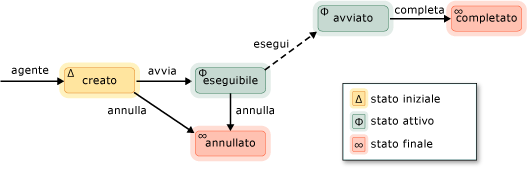

# Agenti asincroni
Un *agente asincrono* (o semplicemente *agente*) è un componente di applicazione che funziona in modo asincrono con altri agenti per risolvere le attività di elaborazione maggiori. Un agente può essere paragonato a un'attività che dispone di un ciclo di vita stabilito. Ad esempio, un agente potrebbe leggere dati da un dispositivo di input/output (ad esempio, la tastiera, un file su disco o una connessione di rete) e un altro agente potrebbero eseguire un'azione su tali dati appena sarà disponibile. Il primo agente utilizza il passaggio di messaggio per informare il secondo agente che sono disponibili più dati. L'utilità di pianificazione di Runtime di concorrenza fornisce un meccanismo efficiente per consentire agli agenti di bloccarsi e passarsi in modo cooperativo senza interruzione meno efficiente.  
  

 Definisce la libreria di agenti di [Concurrency:: Agent](../../parallel/concrt/reference/agent-class.md) classe per rappresentare un agente asincrono. `agent` è una classe astratta che dichiara il metodo virtuale [concurrency::agent::run](reference/agent-class.md#run). Il `run` metodo esegue l'attività che viene eseguita dall'agente. Poiché `run` è astratta, è necessario implementare questo metodo in ogni classe derivata da `agent`.  
  
## Ciclo di vita dell'agente  
 Gli agenti hanno un ciclo di vita stabilito. Il [Concurrency:: agent_status](reference/concurrency-namespace-enums.md#agent_status) enumerazione definisce i vari stati di un agente. Nella figura seguente è un diagramma di stato che mostra l'avanzamento degli agenti da uno stato a un altro. In questa illustrazione, linee continue rappresentano i metodi chiamati dall'applicazione. linee punteggiate rappresentano i metodi chiamati dal runtime.  
  
   
  
 Nella tabella seguente viene descritto ogni stato di `agent_status` enumerazione.  
  
|Stato dell'agente|Descrizione|  
|-----------------|-----------------|  
|`agent_created`|L'agente non è stato pianificato per l'esecuzione.|  
|`agent_runnable`|Il runtime sta pianificando l'esecuzione dell'agente.|  
|`agent_started`|L'agente è stato avviato e sia in esecuzione.|  
|`agent_done`|L'agente è terminata.|  
|`agent_canceled`|L'agente è stata annullata prima dell'ingresso il `started` dello stato.|  
  
 `agent_created` stato iniziale di un agente `agent_runnable` e `agent_started` sono stati attivi, e `agent_done` e `agent_canceled` sono gli stati finali.  
  
 Utilizzare il [concurrency::agent::status](reference/agent-class.md#status) metodo per recuperare lo stato corrente di un `agent` oggetto. Sebbene il `status` metodo è indipendente dalla concorrenza, lo stato dell'agente è possibile modificare il tempo di `status` metodo restituisce. Ad esempio, un agente potrebbe essere nel `agent_started` stato quando si chiama il `status` (metodo), ma è stato spostato nel `agent_done` stato subito dopo il `status` metodo restituisce.  

  
## Metodi e le funzionalità  
 Nella tabella seguente vengono illustrati alcuni dei metodi importanti che appartengono alla `agent` classe. Per ulteriori informazioni su tutte le `agent` metodi della classe, vedere [agente classe](../../parallel/concrt/reference/agent-class.md).  
  
|Metodo|Descrizione|  
|------------|-----------------|  
|[start](reference/agent-class.md#start)|Le pianificazioni di `agent` l'esecuzione dell'oggetto e lo imposta sul `agent_runnable` dello stato.|  
|[run](reference/agent-class.md#run)|Esegue l'attività che deve essere eseguita dal `agent` oggetto.|  
|[Operazione eseguita](reference/agent-class.md#done)|Sposta un agente per il `agent_done` dello stato.|  
|[cancel](../../parallel/concrt/cancellation-in-the-ppl.md#cancel)|Se l'agente non è stato avviato, questo metodo annulla l'esecuzione dell'agente e lo imposta sul `agent_canceled` dello stato.|  
|[status](reference/agent-class.md#status)|Recupera lo stato corrente del `agent` oggetto.|  
|[wait](reference/agent-class.md#wait)|Attende il `agent` oggetto immettere il `agent_done` o `agent_canceled` stato.|  
|[wait_for_all](reference/agent-class.md#wait_for_all)|Attende che tutti fornito `agent` gli oggetti di immettere il `agent_done` o `agent_canceled` stato.|  
|[wait_for_one](reference/agent-class.md#wait_for_one)|È in attesa per almeno uno forniti `agent` gli oggetti di immettere il `agent_done` o `agent_canceled` stato.|  
  
 Dopo aver creato un oggetto agente, chiamare il [metodi](reference/agent-class.md#start) metodo per pianificarne l'esecuzione. Il runtime chiama il `run` metodo dopo aver pianificato l'agente e lo imposta sul `agent_runnable` dello stato.  
  
 Il runtime gestisce le eccezioni generate dagli agenti asincroni. Per ulteriori informazioni sulla gestione delle eccezioni e sugli agenti, vedere [eccezioni](../../parallel/concrt/exception-handling-in-the-concurrency-runtime.md).  
  
## Esempio  
 Per un esempio che illustra come creare un'applicazione basata su agente base, vedere [procedura dettagliata: creazione di un'applicazione basata sugli agenti](../../parallel/concrt/walkthrough-creating-an-agent-based-application.md).  
  
## Vedere anche  
 [Libreria di agenti asincroni](../../parallel/concrt/asynchronous-agents-library.md)

