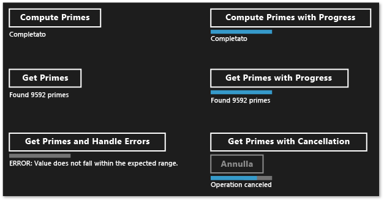

# Creazione di operazioni asincrone in C++ per le applicazioni Windows Store
[!INCLUDE[vs2017banner](../../assembler/inline/includes/vs2017banner.md)]

Questo documento illustra alcuni punti chiave da ricordare quando si usa il runtime di concorrenza per produrre operazioni asincrone basate sul pool di thread d Windows in un'applicazione di [!INCLUDE[win8_appname_long](../../build/includes/win8_appname_long_md.md)].  
  
 L'uso della programmazione asincrona è un componente chiave del modello di app di [!INCLUDE[win8_appname_long](../../build/includes/win8_appname_long_md.md)], poiché permette alle app di rimanere attive per l'inserimento dell'input da parte dell'utente. È possibile avviare un'attività di lunga durata senza bloccare il thread dell'interfaccia utente e ricevere i risultati dell'attività in un secondo momento. È anche possibile annullare attività e ricevere notifiche di stato come attività in esecuzione in background. Nel documento [Programmazione asincrona in C\+\+](http://msdn.microsoft.com/library/windows/apps/Hh780559.aspx) vengono fornite informazioni generali sul modello asincrono disponibile in Visual C\+\+ per creare app di [!INCLUDE[win8_appname_long](../../build/includes/win8_appname_long_md.md)]. Questo documento illustra come utilizzare e creare catene di operazioni [!INCLUDE[wrt](../../atl/reference/includes/wrt_md.md)] asincrone. Questa sezione illustra come usare i tipi in ppltasks.h per produrre operazioni asincrone che possono essere usate da un altro componente [!INCLUDE[wrt](../../atl/reference/includes/wrt_md.md)] e come controllare la modalità di esecuzione di operazioni asincrone. È consigliabile anche leggere la pagina [Modelli di programmazione asincrona e suggerimenti in Hilo \(app per Windows Store scritte in C\+\+ e XAML\)](http://msdn.microsoft.com/library/windows/apps/jj160321.aspx) per informazioni sull'uso della classe dell'attività per implementare operazioni asincrone in Hilo, un'app di [!INCLUDE[win8_appname_long](../../build/includes/win8_appname_long_md.md)] scritta in C\+\+ e XAML.  
  
> [!NOTE]
>  È possibile usare la [libreria PPL \(Parallel Patterns Library\)](../../parallel/concrt/parallel-patterns-library-ppl.md) e la [Libreria di agenti asincroni](../../parallel/concrt/asynchronous-agents-library.md) in un'app di [!INCLUDE[win8_appname_long](../../build/includes/win8_appname_long_md.md)]. Non è tuttavia possibile usare l'Utilità di pianificazione o Gestione risorse. Questo documento illustra le funzionalità aggiuntive offerte dalla libreria PPL e disponibili solo per app di [!INCLUDE[win8_appname_long](../../build/includes/win8_appname_long_md.md)], non per le app desktop.  
  
## Punti chiave  
  
-   Usare [concurrency::create\_async](../Topic/create_async%20Function.md) per creare operazioni asincrone che possono essere usate da altri componenti, che potrebbero essere scritti in linguaggi diversi da C\+\+.  
  
-   Usare [concurrency::progress\_reporter](../../parallel/concrt/reference/progress-reporter-class.md) per segnalare le notifiche di stato ai componenti che chiamano le operazioni asincrone.  
  
-   Usare i token di annullamento per permettere l'annullamento delle operazioni asincrone interne.  
  
-   Il comportamento della funzione `create_async` dipende dal tipo restituito della funzione lavoro che viene passata ad essa. Una funzione lavoro che restituisce un'attività \(`task<T>` o `task<void>`\) viene eseguita in modo sincrono nel contesto che ha chiamato `create_async`. Una funzione lavoro che restituisce `T` o `void` viene eseguita in un contesto arbitrario.  
  
-   È possibile usare il metodo [concurrency::task::then](../Topic/task::then%20Method.md) per creare una catena di attività eseguite una dopo l'altra. In un'app [!INCLUDE[win8_appname_long](../../build/includes/win8_appname_long_md.md)] il contesto predefinito per le continuazioni di un'attività dipende dal modo in cui è stata costruita l'attività. Se l'attività è stata creata passando un'azione asincrona al costruttore di attività oppure passando un'espressione lambda che restituisce un'azione asincrona, il contesto predefinito per tutte le continuazioni dell'attività sarà il contesto corrente. Se l'attività non viene costruita da un'azione asincrona, verrà usato per impostazione predefinita un contesto arbitrario per le continuazioni dell'attività. È possibile eseguire l'override del contesto predefinito con la classe [concurrency::task\_continuation\_context](../../parallel/concrt/reference/task-continuation-context-class.md).  
  
## Contenuto del documento  
  
-   [Creazione di operazioni asincrone](#create-async)  
  
-   [Esempio: Creazione di un componente Windows Runtime C\+\+](#example-component)  
  
-   [Controllo del thread di esecuzione](#exethread)  
  
-   [Esempio: controllo dell'esecuzione in un'app Windows Store con C\+\+ e XAML](#example-app)  
  
##   Creazione di operazioni asincrone  
 È possibile usare il modello di attività e continuazione nella libreria PPL \(Parallel Patterns Library\) per definire le attività in background, oltre ad attività aggiuntive eseguite al completamento dell'attività precedente. Questa funzionalità viene fornita dalla classe [concurrency::task](../../parallel/concrt/reference/task-class-concurrency-runtime.md). Per altre informazioni su questo modello e sulla classe `task`, vedere [Parallelismo delle attività](../../parallel/concrt/task-parallelism-concurrency-runtime.md).  
  
 [!INCLUDE[wrt](../../atl/reference/includes/wrt_md.md)] è un'interfaccia di programmazione che permette di creare app [!INCLUDE[win8_appname_long](../../build/includes/win8_appname_long_md.md)] eseguibili solo in un determinato ambiente di sistema operativo. Queste app usano funzioni, tipi di dati e dispositivi autorizzati e vengono distribuite da [!INCLUDE[win8_appstore_long](../../build/reference/includes/win8_appstore_long_md.md)].[!INCLUDE[wrt](../../atl/reference/includes/wrt_md.md)] è rappresentato da un'*interfaccia ABI \(Application Binary Interface\)*. L'ABI è un contratto binario sottostante che rende disponibili le API di [!INCLUDE[wrt](../../atl/reference/includes/wrt_md.md)] ai linguaggi di programmazione quali Visual C\+\+.  
  
 [!INCLUDE[wrt](../../atl/reference/includes/wrt_md.md)] permette di usare le funzionalità migliori dei diversi linguaggi di programmazione e combinarle in un'unica app. È ad esempio possibile creare l'interfaccia utente in JavaScript ed eseguire la logica app che richiede attività di calcolo complesse in un componente C\+\+. La possibilità di eseguire queste operazioni che richiedono attività di calcolo complesse in background è un fattore essenziale per mantenere reattiva l'interfaccia utente. Poiché la classe `task` è specifica per C\+\+, sarà necessario usare un'interfaccia di [!INCLUDE[wrt](../../atl/reference/includes/wrt_md.md)] per comunicare operazioni asincrone ad altri componenti, che potrebbero essere scritti in linguaggi diversi da C\+\+.[!INCLUDE[wrt](../../atl/reference/includes/wrt_md.md)] offre quattro interfacce che possono essere usate per rappresentare operazioni asincrone:  
  
 [Windows::Foundation::IAsyncAction](http://msdn.microsoft.com/library/windows/apps/windows.foundation.iasyncaction.aspx)  
 Rappresenta un'azione asincrona.  
  
 [Windows::Foundation::IAsyncActionWithProgress\<TProgress\>](http://msdn.microsoft.com/library/windows/apps/br206581.aspx)  
 Rappresenta un'azione asincrona che segnala lo stato di avanzamento.  
  
 [Windows::Foundation::IAsyncOperation\<TResult\>](http://msdn.microsoft.com/library/windows/apps/br206598.aspx)  
 Rappresenta un'operazione asincrona che restituisce un risultato.  
  
 [Windows::Foundation::IAsyncOperationWithProgress\<TResult, TProgress\>](http://msdn.microsoft.com/library/windows/apps/br206594.aspx)  
 Rappresenta un'operazione asincrona che restituisce un risultato e segnala lo stato.  
  
 Il concetto di *azione* indica che un'attività asincrona non produce alcun valore, analogamente a una funzione che restituisce `void`. Il concetto di *operazione* indica che l'attività asincrona produce un valore. Il concetto di *stato* indica che l'attività può inviare messaggi di stato al chiamante. JavaScript, .NET Framework e Visual C\+\+ offrono un modo specifico per creare istanze di queste interfacce da usare oltre i limiti dell'ABI. Per Visual C\+\+ la libreria PPL fornisce la funzione [concurrency::create\_async](../Topic/create_async%20Function.md). Questa funzione crea un'azione asincrona di [!INCLUDE[wrt](../../atl/reference/includes/wrt_md.md)] che rappresenta il completamento di un'attività. La funzione `create_async` accetta una funzione lavoro \(in genere un'espressione lambda\), crea internamente un oggetto `task` ed esegue il wrapping dell'attività in una delle quattro interfacce asincrone di [!INCLUDE[wrt](../../atl/reference/includes/wrt_md.md)].  
  
> [!NOTE]
>  Usare `create_async` solo quando è necessario creare funzionalità a cui è possibile accedere da un altro linguaggio o un altro componente di [!INCLUDE[wrt](../../atl/reference/includes/wrt_md.md)]. Usare direttamente la classe `task` quando si è certi che l'operazione viene prodotta e utilizzata da codice C\+\+ nello stesso componente.  
  
 Il tipo restituito di `create_async` viene determinato dal tipo dei rispettivi argomenti. Se, ad esempio, la funzione lavoro non restituisce alcun valore e non segnala lo stato, `create_async` restituirà `IAsyncAction`. Se la funzione lavoro non restituisce alcun valore ma segnala lo stato, `create_async` restituirà `IAsyncActionWithProgress`. Per segnalare lo stato, fornire un oggetto [concurrency::progress\_reporter](../../parallel/concrt/reference/progress-reporter-class.md) come parametro per la funzione lavoro. La possibilità di segnalare lo stato permette di segnalare la quantità di lavoro eseguita e la quantità rimanente, ad esempio sotto forma di percentuale. Permette anche di segnalare i risultati non appena disponibili.  
  
 Le interfacce `IAsyncAction`, `IAsyncActionWithProgress<TProgress>`, `IAsyncOperation<TResult>` e `IAsyncActionOperationWithProgress<TProgress, TProgress>` forniscono un metodo `Cancel` che permette di annullare l'operazione asincrona. La classe `task` può essere usata con i token di annullamento. Quando si usa un token di annullamento per annullare il lavoro, il runtime non avvia nuovo lavoro che sottoscrive tale token. Il lavoro già attivo è in grado di monitorare l'annullamento e arrestarsi quando possibile. Questo meccanismo è descritto in modo più dettagliato nel documento [Annullamento](../../parallel/concrt/cancellation-in-the-ppl.md). È possibile connettere l'annullamento dell'attività ai metodi `Cancel` di [!INCLUDE[wrt](../../atl/reference/includes/wrt_md.md)] in due modi. È prima di tutto possibile definire la funzione lavoro passata a `create_async` in modo che accetti un oggetto [concurrency::cancellation\_token](cancellation_token). Quando viene chiamato il metodo `Cancel`, il token di annullamento viene annullato e le normali regole di annullamento vengono applicate all'oggetto `task` sottostante che supporta la chiamata a `create_async`. Se non si specifica un oggetto `cancellation_token`, l'oggetto `task` sottostante ne definirà uno implicitamente. Definire un oggetto `cancellation_token` quando è necessario rispondere in modo cooperativo all'annullamento nella funzione lavoro. La sezione [Esempio: Controllo dell'esecuzione in un'app Windows Store con C\+\+ e XAML](#example-app) mostra un esempio relativo a come eseguire l'annullamento in un'app [!INCLUDE[win8_appname_long](../../build/includes/win8_appname_long_md.md)] con C\# e XAML che usa un componente C\+\+ di [!INCLUDE[wrt](../../atl/reference/includes/wrt_md.md)] personalizzato.  
  
> [!WARNING]
>  In una catena di continuazioni di attività è sempre necessario pulire lo stato e quindi chiamare [concurrency::cancel\_current\_task](../Topic/cancel_current_task%20Function.md) quando il token di annullamento viene annullato. Se si esce prima di chiamare `cancel_current_task`, l'operazione passa allo stato completato invece che allo stato annullato.  
  
 La tabella seguente riepiloga le combinazioni che possono essere usate per definire operazioni asincrone nell'app.  
  
|Per creare questa interfaccia [!INCLUDE[wrt](../../atl/reference/includes/wrt_md.md)]|Restituire questo tipo da `create_async`|Passare questi tipi di parametro alla funzione lavoro per usare implicitamente il token di annullamento|Passare questi tipi di parametro alla funzione lavoro per usare esplicitamente il token di annullamento|  
|---------------------------------------------------------------------------------------|----------------------------------------------|-------------------------------------------------------------------------------------------------------------|-------------------------------------------------------------------------------------------------------------|  
|`IAsyncAction`|`void` o `task<void>`|\(nessuno\)|\(`cancellation_token`\)|  
|`IAsyncActionWithProgress<TProgress>`|`void` o `task<void>`|\(`progress_reporter`\)|\(`progress_reporter`, `cancellation_token`\)|  
|`IAsyncOperation<TResult>`|`T` o `task<T>`|\(nessuno\)|\(`cancellation_token`\)|  
|`IAsyncActionOperationWithProgress<TProgress, TProgress>`|`T` o `task<T>`|\(`progress_reporter`\)|\(`progress_reporter`, `cancellation_token`\)|  
  
 È possibile restituire un valore o un oggetto `task` dalla funzione lavoro passata alla funzione `create_async`. Queste variazioni producono comportamenti diversi. Quando viene restituito un valore, la funzione lavoro viene sottoposta a wrapping in `task` in modo che possa essere eseguita su una thread in background. L'oggetto `task` sottostante usa inoltre un token di annullamento implicito. Se invece viene restituito un oggetto `task`, la funzione lavoro viene eseguita in modo sincrono. Se quindi viene restituito un oggetto `task`, assicurarsi che tutte le operazioni lunghe nella funzione lavoro possano essere eseguite come attività per mantenere la reattività dell'applicazione. L'oggetto `task` sottostante inoltre non usa un token di annullamento implicito. È quindi necessario definire la funzione lavoro in modo che accetti un oggetto `cancellation_token` se è necessario il supporto per l'annullamento quando si restituisce un oggetto `task` da `create_async`.  
  
 L'esempio seguente mostra vari modi per creare un oggetto `IAsyncAction` che può essere utilizzato da un altro componente [!INCLUDE[wrt](../../atl/reference/includes/wrt_md.md)].  
  
 [!code-cpp[concrt-windowsstore-primes#100](../../parallel/concrt/codesnippet/CPP/creating-asynchronous-operations-in-cpp-for-windows-store-apps_1.cpp)]  
  
##   Esempio: creazione di un componente Windows Runtime C\+\+ e utilizzo da C\#  
 Si consideri un'applicazione che usa XAML e C\# per definire l'interfaccia utente e un componente C\+\+ di [!INCLUDE[wrt](../../atl/reference/includes/wrt_md.md)] per eseguire operazioni a elevato utilizzo di calcolo. In questo esempio il componente C\+\+ calcola i numeri primi di un intervallo specifico. Per illustrare le differenze tra le quattro interfacce di attività asincrone di [!INCLUDE[wrt](../../atl/reference/includes/wrt_md.md)], in Visual Studio creare prima di tutto una **Soluzione vuota** e denominarla `Primes`. Aggiungere quindi un progetto **Componente Windows Runtime** alla soluzione e denominarlo `PrimesLibrary`. Aggiungere il codice seguente al file di intestazione C\+\+ generato. Questo esempio rinomina Class1.h in Primes.h. Ogni metodo `public` definisce una delle quattro interfacce asincrone. I metodi che restituiscono un valore restituiscono anche un oggetto [Windows::Foundation::Collections::IVector\<int\>](http://msdn.microsoft.com/library/windows/apps/br206631.aspx). I metodi che segnalano lo stato producono valori `double` che definiscono la percentuale di lavoro complessivo completata.  
  
 [!code-cpp[concrt-windowsstore-primes#1](../../parallel/concrt/codesnippet/CPP/creating-asynchronous-operations-in-cpp-for-windows-store-apps_2.h)]  
  
> [!NOTE]
>  Per convenzione, i nomi dei metodi asincroni in [!INCLUDE[wrt](../../atl/reference/includes/wrt_md.md)] terminano in genere con "Async".  
  
 Aggiungere il codice seguente al file di origine C\+\+ generato. Questo esempio rinomina Class1.cpp in Primes.cpp. La funzione `is_prime` determina se l'input è un numero primo. I metodi rimanenti implementano la classe `Primes`. Ogni chiamata a `create_async` usa una firma compatibile con il metodo da cui viene effettuata la chiamata. Ad esempio, poiché `Primes::ComputePrimesAsync` restituisce `IAsyncAction`, la funzione lavoro fornita a `create_async` non restituisce alcun valore e non accetta alcun oggetto `progress_reporter` come parametro.  
  
 [!code-cpp[concrt-windowsstore-primes#2](../../parallel/concrt/codesnippet/CPP/creating-asynchronous-operations-in-cpp-for-windows-store-apps_3.cpp)]  
  
 Ogni metodo esegue prima di tutto la convalida per assicurare che i parametri di input non siano negativi. Se un valore di input è negativo, il metodo genera un'eccezione [Platform::InvalidArgumentException](http://msdn.microsoft.com/library/windows/apps/hh755794\(v=vs.110\).aspx). La gestione degli errori viene illustrata più avanti in questa sezione.  
  
 Per utilizzare questi metodi da un'app [!INCLUDE[win8_appname_long](../../build/includes/win8_appname_long_md.md)], usare il modello **Applicazione vuota \(XAML\)** di Visual C\# per aggiungere un secondo progetto alla soluzione Visual Studio. Questo esempio assegna al progetto il nome `Primes`. Dal progetto `Primes` aggiungere un riferimento al progetto `PrimesLibrary`.  
  
 Aggiungere il codice seguente a MainPage.xaml. Questo codice definisce l'interfaccia utente, in modo da permettere la chiamata del componente C\+\+ e la visualizzazione dei risultati.  
  
 [!code-xml[concrt-windowsstore-primes#3](../../parallel/concrt/codesnippet/Xaml/creating-asynchronous-operations-in-cpp-for-windows-store-apps_4.xaml)]  
  
 Aggiungere il codice seguente alla classe `MainPage` in MainPage.xaml. Questo codice definisce un oggetto `Primes` e i gestori eventi del pulsante.  
  
 [!code-cs[concrt-windowsstore-primes#4](../../parallel/concrt/codesnippet/CSharp/creating-asynchronous-operations-in-cpp-for-windows-store-apps_5.cs)]  
  
 Questi metodi usano le parole chiave `async` e `await` per aggiornare l'interfaccia utente dopo il completamento delle operazioni asincrone. Per informazioni sui modelli asincroni disponibili per C\# e Visual Basic, vedere [Asynchronous patterns in Windows Store apps with C\#](http://msdn.microsoft.com/library/windows/apps/hh464924.aspx) \(Modelli asincroni nelle app di Windows Store con C\#\) e [Asynchronous patterns in Windows Store apps with VB](http://msdn.microsoft.com/library/windows/apps/hh464924.aspx) \(Modelli asincroni nelle app di Windows Store con VB\).  
  
 I metodi `getPrimesCancellation` e `cancelGetPrimes` interagiscono per permettere all'utente di annullare l'operazione. Quando l'utente sceglie il pulsante **Annulla**, il metodo `cancelGetPrimes` chiama [IAsyncOperationWithProgress\<TResult, TProgress\>::Cancel](http://msdn.microsoft.com/library/windows/apps/windows.foundation.iasyncinfo.cancel.aspx) per annullare l'operazione. Il runtime di concorrenza, che gestisce l'operazione asincrona sottostante, genera un tipo di eccezione interna che viene intercettata da [!INCLUDE[wrt](../../atl/reference/includes/wrt_md.md)] per comunicare il completamento della cancellazione. Per altre informazioni sul modello di annullamento, vedere [Annullamento](../../parallel/concrt/cancellation-in-the-ppl.md).  
  
> [!IMPORTANT]
>  Per abilitare la libreria PPL in modo che segnali correttamente l'annullamento dell'operazione a [!INCLUDE[wrt](../../atl/reference/includes/wrt_md.md)], non intercettare questo tipo di eccezione interna. Ciò significa che è necessario non intercettare tutte le eccezioni \(`catch (...)`\). Se occorre intercettare tutte le eccezioni, generare di nuovo l'eccezione per assicurarsi che [!INCLUDE[wrt](../../atl/reference/includes/wrt_md.md)] è in grado di completare l'operazione di annullamento.  
  
 La figura seguente mostra l'app `Primes` dopo che ogni opzione è stata selezionata.  
  
   
  
 Per esempi in cui viene usato `create_async` per creare attività asincrone che possono essere utilizzate da altri linguaggi, vedere [Utilizzo di C\+\+ nell'esempio di utilità di ottimizzazione dei viaggi di Bing Mappe](http://msdn.microsoft.com/library/windows/apps/hh699891\(v=vs.110\).aspx) e [Windows 8 Asynchronous Operations in C\+\+ with PPL](http://code.msdn.microsoft.com/windowsapps/Windows-8-Asynchronous-08009a0d) \(Operazioni asincrone di Windows 8 in C\+\+ con PPL\).  
  
##   Controllo del thread di esecuzione  
 [!INCLUDE[wrt](../../atl/reference/includes/wrt_md.md)] usa il modello di threading COM. In questo modello gli oggetti vengono ospitati in diversi apartment, in base al modo in cui gestiscono la rispettiva sincronizzazione. Gli oggetti thread\-safe vengono ospitati nell'apartment a thread multipli \(MTA, Multi\-Threaded Apartment\). Gli oggetti a cui deve accedere un singolo thread vengono ospitati in un apartment a thread singolo \(STA, Single\-Threaded Apartment\).  
  
 In un'app che ha un'interfaccia utente, il thread ASTA \(Application STA\) è responsabile per la distribuzione dei messaggi della finestra ed è l'unico thread nel processo in grado di aggiornare i controlli dell'interfaccia utente ospitati nell'apartment a thread singolo. Questo comportamento ha due conseguenze. Per abilitare l'app in modo che rimanga reattiva, è prima di tutto necessario che tutte le operazioni a utilizzo elevato di CPU e le operazioni I\/O non vengano eseguite nel thread ASTA. È quindi necessario eseguire di nuovo il marshaling dei thread di background nel thread ASTA per aggiornare l'interfaccia utente. In un'app [!INCLUDE[win8_appname_long](../../build/includes/win8_appname_long_md.md)] in C\+\+, `MainPage` e altre pagine XAML vengono eseguite sul thread ATSA. Le continuazioni delle attività dichiarate nel thread ASTA vengono quindi eseguite in tale thread per impostazione predefinita. Sarà quindi possibile aggiornare i controlli direttamente nel corpo della continuazione. Se tuttavia si annida un'attività in un'altra attività, eventuali continuazioni in tale attività annidata verranno eseguite nell'apartment a thread multipli. È quindi necessario valutare se specificare in modo esplicito il contesto in cui devono essere eseguite le continuazioni.  
  
 Un'attività creata da un'operazione asincrona, ad esempio `IAsyncOperation<TResult>`, usa una semantica speciale che permette di ignorare i dettagli relativi al threading. Anche se è possibile che un'operazione venga eseguita in un thread in background o che non sia supportata da alcun thread, per impostazione predefinita le rispettive continuazioni verranno eseguite nell'apartment che ha avviato le operazioni di continuazione, ovvero l'apartment che ha chiamato `task::then`\). È possibile usare la classe [concurrency::task\_continuation\_context](../../parallel/concrt/reference/task-continuation-context-class.md) per controllare il contesto di esecuzione di una continuazione. Usare questi metodi di helper statici per creare oggetti `task_continuation_context`:  
  
-   Usare [concurrency::task\_continuation\_context::use\_arbitrary](../Topic/task_continuation_context::use_arbitrary%20Method.md) per specificare che la continuazione verrà eseguita in un thread in background.  
  
-   Usare [concurrency::task\_continuation\_context::use\_current](../Topic/task_continuation_context::use_current%20Method.md) per specificare che la continuazione verrà eseguita nel thread che ha chiamato `task::then`.  
  
 È possibile passare un oggetto `task_continuation_context` al metodo [task::then](../Topic/task::then%20Method.md) per controllare in modo esplicito il contesto di esecuzione della continuazione oppure passare l'attività a un altro apartment e quindi chiamare il metodo `task::then` per controllare in modo implicito il contesto di esecuzione.  
  
> [!IMPORTANT]
>  Poiché il thread principale dell'interfaccia utente delle app [!INCLUDE[win8_appname_long](../../build/includes/win8_appname_long_md.md)] in esecuzione nell'apartment a thread singolo, le continuazioni create in tale apartment verranno eseguite per impostazione predefinita nell'apartment a thread singolo. Le continuazioni create nell'apartment a thread multipli verranno di conseguenza eseguite nell'apartment a thread multipli.  
  
 La sezione seguente illustra un'app che legge un file da disco, individua le parole più comuni in tale file e quindi mostra i risultati nell'interfaccia utente. L'operazione finale, l'aggiornamento dell'interfaccia utente, si verifica nel thread dell'interfaccia utente.  
  
> [!IMPORTANT]
>  Questo comportamento è specifico per le app [!INCLUDE[win8_appname_long](../../build/includes/win8_appname_long_md.md)]. Per le app desktop non è possibile controllare la posizione in cui vengono eseguite le continuazioni. L'Utilità di pianificazione sceglie invece un thread di lavoro in cui eseguire ogni continuazione.  
  
> [!IMPORTANT]
>  Non chiamare [concurrency::task::wait](../Topic/task::wait%20Method.md) nel corpo di una continuazione che viene eseguita nell'apartment a thread singolo. In caso contrario, il runtime genera [concurrency::invalid\_operation](../../parallel/concrt/reference/invalid-operation-class.md) poiché questo metodo blocca il thread corrente e può provocare la mancata risposta da parte dell'app. È tuttavia possibile chiamare il metodo [concurrency::task::get](../Topic/task::get%20Method.md) per ricevere il risultato dell'attività antecedente in una continuazione basata su attività.  
  
##   Esempio: controllo dell'esecuzione in un'applicazione [!INCLUDE[win8_appname_long](../../build/includes/win8_appname_long_md.md)] con C\+\+ e XAML  
 Si consideri un'app XAML C\+\+ che legge un file da disco, individua le parole più comuni in tale file e quindi mostra i risultati nell'interfaccia utente. Per creare questa app, in Visual Studio creare prima di tutto un progetto [!INCLUDE[win8_appname_long](../../build/includes/win8_appname_long_md.md)]**Applicazione vuota \(XAML\)** e denominarlo `CommonWords`. Nel manifesto dell'app specificare la capacità **Raccolta documenti** per permettere all'app di accedere alla cartella Documenti. Aggiungere anche il tipo di file di testo \(con estensione txt\) alla sezione relativa alle dichiarazioni nel manifesto dell'app. Per altre informazioni sulle funzionalità e sulle dichiarazioni delle app, vedere [Pacchetti di app e distribuzione](http://msdn.microsoft.com/library/windows/apps/hh464929.aspx).  
  
 Aggiornare l'elemento `Grid` in MainPage.xaml per includere un elemento `ProgressRing` e un elemento `TextBlock`. L'elemento `ProgressRing` indica che l'operazione è in corso e `TextBlock` mostra i risultati del calcolo.  
  
 [!code-xml[concrt-windowsstore-commonwords#1](../../parallel/concrt/codesnippet/Xaml/creating-asynchronous-operations-in-cpp-for-windows-store-apps_6.xaml)]  
  
 Aggiungere le istruzioni `#include` seguenti a pch.h.  
  
 [!code-cpp[concrt-windowsstore-commonwords#2](../../parallel/concrt/codesnippet/CPP/creating-asynchronous-operations-in-cpp-for-windows-store-apps_7.h)]  
  
 Aggiungere le dichiarazioni del metodo seguente alla classe `MainPage` \(MainPage.h\).  
  
 [!code-cpp[concrt-windowsstore-commonwords#3](../../parallel/concrt/codesnippet/CPP/creating-asynchronous-operations-in-cpp-for-windows-store-apps_8.h)]  
  
 Aggiungere le istruzioni `using` seguenti a MainPage.cpp.  
  
 [!code-cpp[concrt-windowsstore-commonwords#4](../../parallel/concrt/codesnippet/CPP/creating-asynchronous-operations-in-cpp-for-windows-store-apps_9.cpp)]  
  
 In MainPage.cpp implementare i metodi `MainPage::MakeWordList`, `MainPage::FindCommonWords` e `MainPage::ShowResults`.`MainPage::MakeWordList` e `MainPage::FindCommonWords` eseguono operazioni a utilizzo elevato di calcolo. Il metodo `MainPage::ShowResults` visualizza il risultato del calcolo nell'interfaccia utente.  
  
 [!code-cpp[concrt-windowsstore-commonwords#5](../../parallel/concrt/codesnippet/CPP/creating-asynchronous-operations-in-cpp-for-windows-store-apps_10.cpp)]  
  
 Modificare il costruttore `MainPage` per creare una catena di attività di continuazione che visualizza nell'interfaccia utente le parole comuni rilevate nel libro *Iliade* di Omero. Le prime due attività di continuazione, che suddividono il testo in singole parole e trovano le parole comuni, possono richiedere molto tempo e sono quindi configurate per l'esecuzione in background. L'attività di continuazione finale, che aggiorna l'interfaccia utente, non specifica alcun contesto di continuazione e quindi segue le regole di threading dell'apartment .  
  
 [!code-cpp[concrt-windowsstore-commonwords#6](../../parallel/concrt/codesnippet/CPP/creating-asynchronous-operations-in-cpp-for-windows-store-apps_11.cpp)]  
  
> [!NOTE]
>  Questo esempio illustra come specificare i contesti di esecuzione e come creare una catena di continuazioni. È importante ricordare che per impostazione predefinita un'attività creata da un'operazione asincrona esegue le rispettive continuazione nell'apartment che ha chiamato `task::then`. Questo esempio usa quindi `task_continuation_context::use_arbitrary` per specificare che le operazioni che non coinvolgono l'interfaccia utente vengano eseguite in un thread in background.  
  
 La figura seguente mostra i risultati dell'app `CommonWords`.  
  
   
  
 In questo esempio è possibile supportare l'annullamento poiché gli oggetti `task` che supportano `create_async` usano un token di annullamento implicito. Definire la funzione lavoro in modo che accetti un oggetto `cancellation_token` se l'attività deve rispondere all'annullamento in modo cooperativo. Per altre informazioni sull'annullamento nella libreria PPL, vedere [Annullamento](../../parallel/concrt/cancellation-in-the-ppl.md).  
  
## Vedere anche  
 [Runtime di concorrenza](../../parallel/concrt/concurrency-runtime.md)