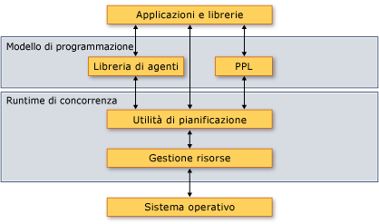

# <a name="overview-of-the-concurrency-runtime"></a>Cenni preliminari sul runtime di concorrenza
Questo documento fornisce i cenni preliminari sul runtime di concorrenza. Illustra i vantaggi del runtime di concorrenza, quando usarlo e che modo i relativi componenti interagiscono tra loro e con il sistema operativo e le applicazioni.

##  <a name="top"></a> Sezioni

Questo documento contiene le seguenti sezioni:

- [Cronologia di implementazione Runtime di concorrenza](#dlls)

- [Motivo per cui un Runtime di concorrenza è importante](#runtime)

- [Architettura](#architecture)

- [Espressioni Lambda C++](#lambda)

- [Requirements](#requirements)

## <a name="dlls"></a> Cronologia di implementazione Runtime di concorrenza

In Visual Studio 2010, 2013, il Runtime di concorrenza è stato incorporato all'interno di msvcr100.dll tramite msvcr120.dll.  Quando il refactoring della libreria UCRT si è verificato in Visual Studio 2015, che è stata sottoposta a refactoring DLL in tre parti:

- ucrtbase. dll: API C, fornito in Windows 10 e gestite di livello inferiore tramite Windows Update-

- vcruntime140.dll: il compilatore supporta le funzioni e runtime EH, messi a disposizione attraverso Visual Studio

- concrt140.dll-Runtime di concorrenza, messi a disposizione attraverso Visual Studio. Obbligatorio per i contenitori paralleli e gli algoritmi, ad esempio `concurrency::parallel_for`. Inoltre, STL richiede questa DLL in Windows XP per le primitive di sincronizzazione di risparmio energia, perché Windows XP non dispone di variabili di condizione.

In Visual Studio 2015 e versioni successive, l'Utilità di pianificazione del runtime di concorrenza non è più l'utilità di pianificazione per la classe di attività e i tipi correlati in ppltasks. Tali tipi ora usano il pool di thread di Windows per migliorare le prestazioni e l'interoperabilità con le primitive di sincronizzazione di Windows.

##  <a name="runtime"></a> Motivo per cui un Runtime di concorrenza è importante

Un runtime di concorrenza fornisce uniformità e prevedibilità alle applicazioni e ai componenti dell'applicazione eseguiti simultaneamente. Sono due esempi dei vantaggi del Runtime di concorrenza *pianificazione cooperativa* e *blocco cooperativo*.

Il runtime di concorrenza usa un'utilità di pianificazione cooperativa che implementa un algoritmo di acquisizione del lavoro per distribuire il lavoro tra le risorse di elaborazione in modo efficiente. Si consideri, ad esempio, un'applicazione che dispone di due thread entrambi gestiti dallo stesso runtime. Se un thread termina l'attività pianificata, può scaricare il lavoro dall'altro thread. Questo meccanismo bilancia il carico di lavoro complessivo dell'applicazione.

Il runtime di concorrenza fornisce inoltre le primitive di sincronizzazione che usano il blocco cooperativo per sincronizzare l'accesso alle risorse. Si consideri, ad esempio, un'attività che deve avere accesso esclusivo a una risorsa condivisa. Mediante il blocco cooperativo, il runtime può usare il quantum rimanente per eseguire un'altra attività mentre la prima attività è in attesa della risorsa. Questo meccanismo consente il massimo utilizzo delle risorse di elaborazione.

[[Torna all'inizio](#top)]

##  <a name="architecture"></a> Architettura

Il runtime di concorrenza è diviso in quattro componenti: libreria PPL (Parallel Patterns Library), libreria di agenti asincroni, Utilità di pianificazione e Gestione risorse. Questi componenti risiedono tra il sistema operativo e le applicazioni.  L'illustrazione seguente mostra come i componenti del runtime di concorrenza interagiscono tra il sistema operativo e le applicazioni:

**Architettura del Runtime di concorrenza**



> [!IMPORTANT]
>  I componenti utilità di pianificazione e Gestione risorse non sono disponibili da un'app Universal Windows Platform (UWP) o quando si usa la classe dell'attività o altri tipi in ppltasks. h.

Il Runtime di concorrenza è altamente *componibile*, vale a dire, è possibile combinare le funzionalità esistenti per eseguire altre operazioni. Il runtime di concorrenza compone molte funzionalità, ad esempio gli algoritmi paralleli, dai componenti di livello inferiore.

Il runtime di concorrenza fornisce inoltre le primitive di sincronizzazione che usano il blocco cooperativo per sincronizzare l'accesso alle risorse. Per altre informazioni sulle primitive di sincronizzazione, vedere [strutture di dati di sincronizzazione](../../parallel/concrt/synchronization-data-structures.md).

Nelle sezioni seguenti vengono forniti alcuni cenni preliminari sui vantaggi di ogni componente e sul relativo uso.

### <a name="parallel-patterns-library"></a>Parallel Patterns Library

La libreria PPL (Parallel Patterns Library) fornisce contenitori e algoritmi di uso generale per l'esecuzione di un parallelismo accurato. La libreria PPL consente *parallelismo imperativo dei dati* fornendo gli algoritmi paralleli che distribuiscono i calcoli sulle raccolte o sui set di dati tra le risorse di calcolo. Consente inoltre *parallelismo delle attività* fornendo oggetti attività che distribuiscono più operazioni indipendenti tra le risorse di calcolo.

Usare la libreria PPL (Parallel Patterns Library) per i calcoli locali che possono trarre vantaggio dall'esecuzione parallela. Ad esempio, è possibile usare la [Concurrency:: parallel_for](reference/concurrency-namespace-functions.md#parallel_for) algoritmo per trasformare un oggetto esistente `for` ciclo per operare in parallelo.

Per altre informazioni sulla libreria PPL, vedere [libreria PPL (Parallel Patterns Library)](../../parallel/concrt/parallel-patterns-library-ppl.md).

### <a name="asynchronous-agents-library"></a>libreria di agenti asincroni

Asynchronous Agents Library (o semplicemente *libreria di agenti*) fornisce un modello di programmazione basato su attori e passaggio dei messaggi interfacce per un flusso di dati di attività di pipelining. Gli agenti asincroni consentono di usare la latenza in modo produttivo eseguendo il lavoro come gli altri componenti in attesa dei dati.

Usare la libreria di agenti quando si dispone di più entità che comunicano tra loro in modo asincrono. È possibile, ad esempio, creare un agente che legge i dati da un file o da una connessione di rete e quindi usa le interfacce per il passaggio dei messaggi per inviare i dati a un altro agente.

Per altre informazioni sulla libreria di agenti, vedere [Asynchronous Agents Library](../../parallel/concrt/asynchronous-agents-library.md).

### <a name="task-scheduler"></a>Utilità di pianificazione

L'Utilità di pianificazione pianifica e coordina le attività in fase di esecuzione. L'Utilità di pianificazione è cooperativa e usa un algoritmo di acquisizione del lavoro per ottenere il massimo utilizzo delle risorse di elaborazione.

Il runtime di concorrenza fornisce un'utilità di pianificazione predefinita in modo da evitare di dover gestire i dettagli dell'infrastruttura.  Tuttavia, per soddisfare le esigenze di qualità dell'applicazione, è anche possibile fornire criteri di pianificazione personalizzati o associare utilità di pianificazione specifiche a specifiche attività.

Per altre informazioni sull'utilità di pianificazione, vedere [utilità di pianificazione](../../parallel/concrt/task-scheduler-concurrency-runtime.md).

### <a name="resource-manager"></a>Gestione risorse

Gestione risorse ha il ruolo di gestire le risorse di elaborazione, ad esempio processori e memoria. Gestione risorse risponde ai carichi di lavoro man mano che vengono modificati in fase di esecuzione assegnando le risorse dove possono risultare più efficaci.

Gestione risorse funge da astrazione sulle risorse di elaborazione e interagisce principalmente con l'Utilità di pianificazione. Sebbene sia possibile usare Gestione risorse per ottimizzare le prestazioni delle librerie e delle applicazioni, in genere vengono usate le funzionalità fornite dalla libreria PPL, dalla libreria di agenti e dall'Utilità di pianificazione. Tali librerie usano Gestione risorse per ribilanciare dinamicamente le risorse in base alla modifica dei carichi di lavoro.

[[Torna all'inizio](#top)]

##  <a name="lambda"></a> Espressioni Lambda C++

Molti dei tipi e degli algoritmi definiti dal runtime di concorrenza vengono implementati come modelli C++.  Alcuni di questi tipi e algoritmi accettano come parametro una routine che esegue il lavoro. Questo parametro può essere una funzione lambda, un oggetto funzione o un puntatore a funzione. Queste entità sono anche detti *funzioni di lavoro* oppure *routine lavoro*.

Le espressioni lambda rappresentano una nuova e importante funzionalità del linguaggio di Visual C++ perché forniscono una modalità succinta per definire le funzioni lavoro per l'elaborazione in parallelo. Gli oggetti funzione e i puntatori a funzione consentono di usare il runtime di concorrenza con il codice esistente. Tuttavia, è consigliabile usare le espressioni lambda quando si scrive nuovo codice per i vantaggi offerti in termini di produttività e sicurezza.

Nell'esempio seguente vengono confrontati la sintassi di funzioni lambda, oggetti funzione e i puntatori a funzione in più chiamate per il [Concurrency:: parallel_for_each](reference/concurrency-namespace-functions.md#parallel_for_each) algoritmo. Ogni chiamata a `parallel_for_each` Usa una tecnica diversa per calcolare il quadrato di ogni elemento in un [std:: Array](../../standard-library/array-class-stl.md) oggetto.

[!code-cpp[concrt-comparing-work-functions#1](../../parallel/concrt/codesnippet/cpp/overview-of-the-concurrency-runtime_1.cpp)]

**Output**

```Output
1
256
6561
65536
390625
```

Per altre informazioni sulle funzioni lambda in C++, vedere [espressioni Lambda](../../cpp/lambda-expressions-in-cpp.md).

[[Torna all'inizio](#top)]

##  <a name="requirements"></a> Requisiti

Nella tabella seguente vengono mostrati i file di intestazione associati a ogni componente del runtime di concorrenza:

|Componente|File di intestazione|
|---------------|------------------|
|PPL (Parallel Patterns Library)|ppl.h<br /><br /> concurrent_queue.h<br /><br /> concurrent_vector.h|
|libreria di agenti asincroni|agents.h|
|Utilità di pianificazione|concrt.h|
|Gestione risorse|concrtrm.h|

Il Runtime di concorrenza viene dichiarato nel [concorrenza](../../parallel/concrt/reference/concurrency-namespace.md) dello spazio dei nomi. (È anche possibile usare [concorrenza](../../parallel/concrt/reference/concurrency-namespace.md), che è un alias per questo spazio dei nomi.) Lo spazio dei nomi `concurrency::details` supporta il framework del runtime di concorrenza e non deve essere usato direttamente dal codice.

Il runtime di concorrenza viene fornito come parte della Libreria di runtime C (CRT). Per altre informazioni su come compilare un'applicazione che usa la libreria CRT, vedere [funzionalità della libreria CRT](../../c-runtime-library/crt-library-features.md).

[[Torna all'inizio](#top)]

