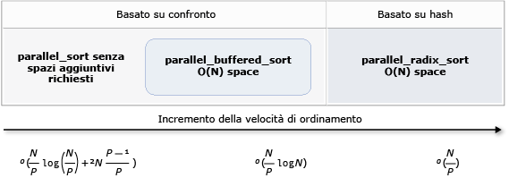

# Algoritmi paralleli
[!INCLUDE[vs2017banner](../../assembler/inline/includes/vs2017banner.md)]

La libreria PPL (Parallel Patterns Library) fornisce gli algoritmi che vengono eseguite contemporaneamente su raccolte di dati. Questi algoritmi sono simili a quelli forniti dalla libreria di modelli Standard (STL).  
  
 Gli algoritmi paralleli sono costituiti da funzionalità esistenti nel Runtime di concorrenza. Ad esempio, il [Concurrency:: parallel_for](../Topic/parallel_for%20Function.md) algoritmo utilizza un [Concurrency:: structured_task_group](../../parallel/concrt/reference/structured-task-group-class.md) oggetto per eseguire le iterazioni del ciclo parallelo. Il `parallel_for` algoritmo partiziona il lavoro in modo ottimale in base al numero di risorse di elaborazione disponibili.  
  
##  <a name="a-nametopa-sections"></a><a name="top"></a> Nelle sezioni  
  
- [L'algoritmo parallel_for](#parallel_for)  
  
- [L'algoritmo parallel_for_each](#parallel_for_each)  
  
- [L'algoritmo parallel_invoke](#parallel_invoke)  
  
- [Gli algoritmi parallel_reduce e parallel_transform](#parallel_transform_reduce)  
  
    - [L'algoritmo parallel_transform](#parallel_transform)  
  
    - [L'algoritmo parallel_reduce](#parallel_reduce)  
  
    - [Esempio: Esecuzione del mapping e riduzione in parallelo](#map_reduce_example)  
  
- [Suddivisione del lavoro](#partitions)  
  
- [Ordinamento parallelo](#parallel_sorting)  
  
    - [Scelta di un algoritmo di ordinamento](#choose_sort)  
  
##  <a name="a-nameparallelfora-the-parallelfor-algorithm"></a><a name="parallel_for"></a> L'algoritmo parallel_for  
 Il [Concurrency:: parallel_for](../Topic/parallel_for%20Function.md) algoritmo esegue ripetutamente la stessa attività in parallelo. Ognuna di queste attività con i parametri di un valore di iterazione. Questo algoritmo è utile quando si dispone di un corpo del ciclo che non condividono le risorse tra le iterazioni del ciclo.  
  
 Il `parallel_for` algoritmo le attività in modo ottimale per l'esecuzione parallela. Viene utilizzato un algoritmo di acquisizione del lavoro e di acquisizione dell'intervallo per bilanciare le partizioni quando i carichi di lavoro non sono bilanciati. Quando un'iterazione del ciclo viene bloccato in modo cooperativo, il runtime ridistribuisce l'intervallo di iterazioni che viene assegnato al thread corrente per altri thread o processori. Analogamente, quando un thread viene completato un intervallo di iterazioni, il runtime ridistribuisce il lavoro da altri thread per tale thread. Il `parallel_for` algoritmo supporta inoltre *annidati parallelismo*. Quando un ciclo parallelo contiene un altro ciclo parallelo, il runtime coordina le risorse di elaborazione tra i corpi di ciclo in modo efficiente per l'esecuzione parallela.  
  
 Nell'algoritmo `parallel_for` sono disponibili diverse versioni di overload. La prima versione accetta un valore iniziale, un valore finale e una funzione lavoro (un'espressione lambda, oggetti funzione o puntatore a funzione). La seconda versione accetta un valore iniziale, un valore finale, un valore che al passaggio e una funzione lavoro. La prima versione di questa funzione utilizza 1 come valore di incremento. Le versioni rimanenti accettano oggetti di partizionamento che consentono di specificare il modo in cui gli intervalli devono essere partizionati tra i thread tramite l'algoritmo `parallel_for`. I partitioner sono descritti più dettagliatamente nella sezione [partizionamento del lavoro](#partitions) in questo documento.  
  
 È possibile convertire molti `for` cicli utilizzare `parallel_for`. Tuttavia, il `parallel_for` rispetto all'algoritmo di `for` istruzione nei modi seguenti:  
  
-   Il `parallel_for` algoritmo `parallel_for` non esegue le attività in un ordine predeterminato.  
  
-   Il `parallel_for` algoritmo non supporta le condizioni di terminazione arbitraria. Il `parallel_for` algoritmo si interrompe quando il valore della variabile di iterazione corrente è minore di `last`.  
  
-   Il `_Index_type` parametro di tipo deve essere un tipo integrale. Questo tipo integrale può essere firmato o non firmato.  
  
-   L'iterazione del ciclo deve essere in avanti. Il `parallel_for` algoritmo genera un'eccezione di tipo [std:: invalid_argument](../../standard-library/invalid-argument-class.md) Se il `_Step` parametro è minore di 1.  
  
-   Il meccanismo di gestione delle eccezioni per il `parallel_for` algoritmo è diverso da quello di un `for` ciclo. Se si verificano più eccezioni contemporaneamente in un corpo del ciclo parallelo, il runtime propaga solo una delle eccezioni per il thread che ha chiamato `parallel_for`. Inoltre, quando un'iterazione del ciclo genera un'eccezione, il runtime non interrompe immediatamente il ciclo globale. Al contrario, il ciclo viene inserito nello stato annullato e il runtime elimina tutte le attività che non hanno ancora avviato. Per ulteriori informazioni sulla gestione delle eccezioni e sugli algoritmi paralleli, vedere [Exception Handling](../../parallel/concrt/exception-handling-in-the-concurrency-runtime.md).  
  
 Sebbene il `parallel_for` algoritmo non supporta le condizioni di terminazione arbitraria, è possibile utilizzare l'annullamento per interrompere tutte le attività. Per ulteriori informazioni sull'annullamento, vedere [annullamento](../../parallel/concrt/exception-handling-in-the-concurrency-runtime.md#cancellation_in_the_ppl).  
  
> [!NOTE]
>  Il costo di pianificazione che i risultati di bilanciamento del carico e supporto per funzionalità quali annullamento potrebbero non superare i vantaggi dell'esecuzione del corpo del ciclo in parallelo, soprattutto quando il corpo del ciclo è relativamente piccolo. È possibile ridurre al minimo questo sovraccarico utilizzando un partitioner nel ciclo parallelo. Per ulteriori informazioni, vedere [partizionamento del lavoro](#partitions) più avanti in questo documento.  
  
### <a name="example"></a>Esempio  
 Nell'esempio seguente viene illustrata la struttura di base di `parallel_for` algoritmo. In questo esempio viene stampato nella console il valore nell'intervallo [1, 5] in parallelo.  
  
 [!code-cpp[concrt-parallel-for-structure#1](../../parallel/concrt/codesnippet/CPP/parallel-algorithms_1.cpp)]  
  
 Questo esempio produce il seguente output di esempio:  
  
```Output  
1 2 4 3 5  
```  
  
 Poiché il `parallel_for` algoritmo agisce su ogni elemento in parallelo, l'ordine in cui i valori vengono visualizzati nella console possono variare.  
  
 Per un esempio completo che utilizza il `parallel_for` algoritmo, vedere [procedura: scrivere un ciclo parallel_for](../../parallel/concrt/how-to-write-a-parallel-for-loop.md).  
  
 [[Torna all'inizio](#top)]  
  
##  <a name="a-nameparallelforeacha-the-parallelforeach-algorithm"></a><a name="parallel_for_each"></a> L'algoritmo parallel_for_each  
 Il [Concurrency:: parallel_for_each](../Topic/parallel_for_each%20Function.md) algoritmo esegue le attività in un contenitore iterativo, ad esempio quelle fornite dalla libreria STL, in parallelo. Usa la stessa logica di partizionamento che il `parallel_for` algoritmo utilizza.  
  
 Il `parallel_for_each` è simile all'algoritmo STL [std:: for_each](../Topic/for_each.md) algoritmo, tranne il fatto che il `parallel_for_each` algoritmo esegue le attività contemporaneamente. Come altri algoritmi paralleli, `parallel_for_each` esegue le attività in un ordine specifico.  
  
 Sebbene il `parallel_for_each` algoritmo funziona in entrambi gli iteratori in avanti e gli iteratori ad accesso casuale, le prestazioni sono migliori con gli iteratori ad accesso casuale.  
  
### <a name="example"></a>Esempio  
 Nell'esempio seguente viene illustrata la struttura di base di `parallel_for_each` algoritmo. In questo esempio viene stampato nella console il valore in un [std:: Array](../../standard-library/array-class-stl.md) oggetto in parallelo.  
  
 [!code-cpp[concrt-parallel-for-each-structure#1](../../parallel/concrt/codesnippet/CPP/parallel-algorithms_2.cpp)]  
  
 Questo esempio produce il seguente output di esempio:  
  
```Output  
4 5 1 2 3  
```  
  
 Poiché il `parallel_for_each` algoritmo agisce su ogni elemento in parallelo, l'ordine in cui i valori vengono visualizzati nella console possono variare.  
  
 Per un esempio completo che utilizza il `parallel_for_each` algoritmo, vedere [procedura: scrivere un ciclo parallel_for_each](../../parallel/concrt/how-to-write-a-parallel-for-each-loop.md).  
  
 [[Torna all'inizio](#top)]  
  
##  <a name="a-nameparallelinvokea-the-parallelinvoke-algorithm"></a><a name="parallel_invoke"></a> L'algoritmo parallel_invoke  
 Il [Concurrency:: parallel_invoke](../Topic/parallel_invoke%20Function.md) algoritmo esegue un set di attività in parallelo. Non restituisce fino al termine di ogni attività. Questo algoritmo è utile quando si dispone di più attività indipendenti che si desidera eseguire contemporaneamente.  
  
 Il `parallel_invoke` algoritmo accetta come parametri una serie di funzioni di lavoro (funzioni lambda, oggetti funzione o puntatori a funzione). Il `parallel_invoke` algoritmo è in overload per accettare da due a dieci parametri. Ogni funzione che viene passato a `parallel_invoke` deve accettare zero parametri.  
  
 Come altri algoritmi paralleli, `parallel_invoke` esegue le attività in un ordine specifico. L'argomento [parallelismo delle attività](../../parallel/concrt/task-parallelism-concurrency-runtime.md) viene illustrato come il `parallel_invoke` algoritmo correlato alle attività e gruppi di attività.  
  
### <a name="example"></a>Esempio  
 Nell'esempio seguente viene illustrata la struttura di base di `parallel_invoke` algoritmo. In questo esempio vengono chiamati simultaneamente il `twice` funzione tre variabili locali e stampi il risultato nella console.  
  
 [!code-cpp[concrt-parallel-invoke-structure#1](../../parallel/concrt/codesnippet/CPP/parallel-algorithms_3.cpp)]  
  
 Questo esempio produce il seguente output:  
  
```Output  
108 11.2 HelloHello  
```  
  
 Per esempi completi che utilizzano il `parallel_invoke` algoritmo, vedere [procedura: utilizzare parallel_invoke per scrivere una Routine di ordinamento parallelo](../../parallel/concrt/how-to-use-parallel-invoke-to-write-a-parallel-sort-routine.md) e [procedura: utilizzare parallel_invoke per eseguire operazioni in parallelo](../../parallel/concrt/how-to-use-parallel-invoke-to-execute-parallel-operations.md).  
  
 [[Torna all'inizio](#top)]  
  
##  <a name="a-nameparalleltransformreducea-the-paralleltransform-and-parallelreduce-algorithms"></a><a name="parallel_transform_reduce"></a> Gli algoritmi parallel_reduce e parallel_transform  
 Il [Concurrency:: parallel_reduce](../Topic/parallel_transform%20Function.md) e [Concurrency:: parallel_transform](../Topic/parallel_reduce%20Function.md) algoritmi sono versioni parallele degli algoritmi STL [std:: Transform](../Topic/transform.md) e [std:: accumulate](../Topic/accumulate.md), rispettivamente. Le versioni del runtime di concorrenza si comportano come le versioni della libreria STL, tuttavia l'ordine delle operazioni non viene determinato in quanto vengono eseguite in parallelo. Sfruttare questi algoritmi quando si utilizza un set sufficientemente grande da ottenere vantaggi di scalabilità e di prestazioni dall'esecuzione in parallelo.  
  
> [!IMPORTANT]
>  Gli algoritmi `parallel_transform` e `parallel_reduce` supportano solo iteratori di accesso casuale, bidirezionale e di inoltro perché tramite questi iteratori vengono generati indirizzi di memoria stabili. Inoltre, tramite questi iteratori devono essere generati valori l-value non `const`.  
  
###  <a name="a-nameparalleltransforma-the-paralleltransform-algorithm"></a><a name="parallel_transform"></a> L'algoritmo parallel_transform  
 È possibile utilizzare l'algoritmo `parallel transform` per eseguire molte operazioni di parallelizzazione dati. Ad esempio, è possibile eseguire queste operazioni:  
  
-   Regolare la luminosità di un'immagine ed eseguire altre operazioni di elaborazione immagini.  
  
-   Sommare o eseguire il prodotto scalare di due vettori e altri calcoli numerici con i vettori.  
  
-   Eseguire il ray tracing 3D in cui per ogni iterazione viene fatto riferimento a un pixel di cui deve essere eseguito il rendering.  
  
 Nell'esempio seguente viene mostrata la struttura di base utilizzata per chiamare l'algoritmo `parallel_transform`. Questo esempio viene negato ogni elemento di un std::[vettore](vector%20Class.md) oggetto in due modi. Nel primo viene utilizzata un'espressione lambda. Il secondo modo utilizza [std:: negate](../../standard-library/negate-struct.md), che deriva da [std:: unary_function](../../standard-library/unary-function-struct.md).  
  
 [!code-cpp[concrt-basic-parallel-transform#1](../../parallel/concrt/codesnippet/CPP/parallel-algorithms_4.cpp)]  
  
> [!WARNING]
>  In questo esempio viene mostrato l'utilizzo di base di `parallel_transform`. Poiché tramite la funzione di lavoro non viene eseguita una quantità significativa di lavoro, in questo esempio non è previsto un miglioramento significativo delle prestazioni.  
  
 Nell'algoritmo `parallel_transform` sono disponibili due overload. Il primo accetta un intervallo di input e una funzione unaria. La funzione unaria può essere un'espressione lambda che accetta un argomento, un oggetto funzione o un tipo che deriva da `unary_function`. Il secondo accetta due intervalli di input e una funzione binaria. La funzione binaria può essere un'espressione lambda che accetta due argomenti, un oggetto funzione o un tipo che deriva da [std:: binary_function](../../standard-library/binary-function-struct.md). Nell'esempio seguente vengono illustrate queste differenze.  
  
 [!code-cpp[concrt-parallel-transform-vectors#2](../../parallel/concrt/codesnippet/CPP/parallel-algorithms_5.cpp)]  
  
> [!IMPORTANT]
>  L'iteratore fornito per l'output di `parallel_transform` deve sovrapporsi completamente all'iteratore di input o non sovrapporsi affatto. Il comportamento di questo algoritmo non è specificato se gli iteratori di input e di output si sovrappongono parzialmente.  
  
###  <a name="a-nameparallelreducea-the-parallelreduce-algorithm"></a><a name="parallel_reduce"></a> L'algoritmo parallel_reduce  
 L'algoritmo `parallel_reduce` è utile quando si dispone di una sequenza di operazioni che soddisfano la proprietà associativa; (per questo algoritmo non è richiesta la proprietà commutativa). Di seguito sono elencate alcune delle operazioni che è possibile eseguire con `parallel_reduce`:  
  
-   Moltiplicare sequenze di matrici per generare una matrice.  
  
-   Moltiplicare un vettore per una sequenza di matrici per generare un vettore.  
  
-   Calcolare la lunghezza di una sequenza di stringhe.  
  
-   Combinare un elenco di elementi, ad esempio stringhe, in un unico elemento.  
  
 Nell'esempio di base seguente viene illustrato come utilizzare l'algoritmo `parallel_reduce` per combinare una sequenza di stringhe in una unica. Come negli esempi di `parallel_transform`, i miglioramenti delle prestazioni non sono previsti in questo esempio di base.  
  
 [!code-cpp[concrt-basic-parallel-reduce#1](../../parallel/concrt/codesnippet/CPP/parallel-algorithms_6.cpp)]  
  
 In molti casi, è possibile pensare `parallel_reduce` come una sintassi abbreviata per l'utilizzo del `parallel_for_each` algoritmo con il [Concurrency:: combinable](../../parallel/concrt/reference/combinable-class.md) (classe).  
  
###  <a name="a-namemapreduceexamplea-example-performing-map-and-reduce-in-parallel"></a><a name="map_reduce_example"></a> Esempio: Esecuzione del mapping e riduzione in parallelo  
 Oggetto *mappa* operazione applica una funzione a ogni valore di una sequenza. Oggetto *ridurre* operazione combina gli elementi di una sequenza in un unico valore. È possibile utilizzare il modello libreria STL (Standard) [std:: Transform](../Topic/transform.md)[std:: accumulate](../Topic/accumulate.md) classi per eseguire mapping e riduzione delle operazioni. Tuttavia, per molti problemi, è possibile utilizzare l'algoritmo `parallel_transform` per eseguire l'operazione di mapping in parallelo e l'algoritmo `parallel_reduce` per eseguire l'operazione di riduzione in parallelo.  
  
 Nell'esempio seguente viene confrontato il tempo necessario per calcolare la somma dei numeri primi in serie e in parallelo. Nella fase di mapping i valori non primi vengono trasformati in 0, mentre in quella di riduzione i valori vengono sommati.  
  
 [!code-cpp[concrt-parallel-map-reduce-sum-of-primes#1](../../parallel/concrt/codesnippet/CPP/parallel-algorithms_7.cpp)]  
  
 Per un altro esempio che esegue una mappa e ridurre l'operazione in parallelo, vedere [procedura: eseguire mappa e ridurre le operazioni in parallelo](../../parallel/concrt/how-to-perform-map-and-reduce-operations-in-parallel.md).  
  
 [[Torna all'inizio](#top)]  
  
##  <a name="a-namepartitionsa-partitioning-work"></a><a name="partitions"></a> Suddivisione del lavoro  
 Per parallelizzare un'operazione su un'origine dati, è un passaggio essenziale *partizione* l'origine in più sezioni a cui è possibile accedere contemporaneamente da più thread. Tramite un partitioner viene specificato il modo in cui gli intervalli devono essere partizionati tra i thread mediante un algoritmo parallelo. Come illustrato in precedenza in questo documento, nella libreria PPL viene utilizzato un meccanismo di partizionamento predefinito tramite cui viene creato un carico di lavoro iniziale e, successivamente, utilizzato un algoritmo di acquisizione del lavoro e uno di acquisizione dell'intervallo per bilanciare queste partizioni quando i carichi di lavoro non lo sono. Ad esempio, quando tramite un'iterazione del ciclo viene completato un intervallo di iterazioni, il lavoro di altri thread viene ridistribuito a questo thread mediante il runtime. Tuttavia, per alcuni scenari, potrebbe essere necessario specificare un meccanismo di partizionamento differente, più adatto al problema.  
  
 Tramite gli algoritmi `parallel_for`, `parallel_for_each` e `parallel_transform` vengono fornite le versioni sottoposte a overload che accettano un parametro aggiuntivo, `_Partitioner`. Tramite questo parametro viene definito il tipo di partitioner che consente la divisione del lavoro. Di seguito sono riportati i tipi di partitioner definiti dalla libreria PPL:  
  
 [Concurrency::affinity_partitioner](../../parallel/concrt/reference/affinity-partitioner-class.md)  
 Il lavoro viene diviso in un numero fisso di intervalli (in genere il numero di thread di lavoro disponibili per il ciclo). Questo tipo di partitioner assomiglia a `static_partitioner`, tuttavia l'affinità della cache viene migliorata per quanto riguarda il mapping degli intervalli ai thread di lavoro. Questo tipo di partitioner può consentire il miglioramento delle prestazioni quando un ciclo viene eseguito più volte nello stesso set di dati (ad esempio un ciclo all'interno di un altro) e i dati sono adatti alla cache. Questo partitioner non è coinvolto completamente nell'annullamento. Inoltre non viene utilizzata la semantica di blocco cooperativo e, pertanto, non può essere utilizzato con cicli paralleli che hanno una dipendenza di inoltro.  
  
 [Concurrency::auto_partitioner](../../parallel/concrt/reference/auto-partitioner-class.md)  
 Il lavoro viene diviso in un numero iniziale di intervalli (in genere il numero di thread di lavoro disponibili nel ciclo). Questo tipo viene utilizzato per impostazione predefinita dal runtime quando non viene chiamato un algoritmo parallelo sottoposto a overload che accetta un parametro `_Partitioner`. Ogni intervallo può essere suddiviso in intervalli secondari consentendo il bilanciamento del carico. Al termine di un intervallo di lavoro, gli intervalli di lavoro secondari vengo ridistribuiti da altri thread a questo tramite il runtime. Utilizzare questo partitioner se il carico di lavoro non rientra in una delle altre categorie o se è necessario un supporto completo per l'annullamento o il blocco cooperativo.  
  
 [Concurrency::simple_partitioner](../../parallel/concrt/reference/simple-partitioner-class.md)  
 Il lavoro viene diviso in intervalli in modo che in ogni intervallo sia disponibile almeno il numero di iterazioni specificate dalla dimensione del blocco fornita. Questo tipo di partitioner è coinvolto nel bilanciamento del carico; tuttavia, gli intervalli non vengono suddivisi in intervalli secondari tramite il runtime. Per ogni thread di lavoro, tramite il runtime viene controllato l'annullamento e viene eseguito il bilanciamento del carico al termine delle iterazioni `_Chunk_size`.  
  
 [Concurrency::static_partitioner](../../parallel/concrt/reference/static-partitioner-class.md)  
 Il lavoro viene diviso in un numero fisso di intervalli (in genere il numero di thread di lavoro disponibili per il ciclo). Le prestazioni possono migliorare grazie a questo tipo di partitioner poiché non viene utilizzata l'acquisizione del lavoro e pertanto il sovraccarico è inferiore. Utilizzare questo tipo di partitioner quando tramite ogni iterazione di un ciclo parallelo viene eseguita una quantità di lavoro fissa e uniforme e non è richiesto supporto per l'annullamento o l'inoltro del blocco cooperativo.  
  
> [!WARNING]
>  Il `parallel_for_each` e `parallel_transform` algoritmi supportano solo i contenitori in cui vengono utilizzati iteratori ad accesso casuale (ad esempio std::[vettore](vector%20Class.md)) per i partitioner statico, semplice e di affinità. Se si utilizzano contenitori con iteratori bidirezionali e di inoltro viene generato un errore in fase di compilazione. Il partitioner predefinito, `auto_partitioner`, supporta tutti e tre i tipi di iteratore.  
  
 In genere, questi partitioner vengono utilizzati nello stesso modo, ad eccezione di `affinity_partitioner`. La maggior parte dei tipi di partitioner non mantiene lo stato e non viene modificata dal runtime. Di conseguenza è possibile creare questi oggetti partitioner a livello del sito di chiamata, come illustrato nell'esempio seguente.  
  
 [!code-cpp[concrt-static-partitioner#1](../../parallel/concrt/codesnippet/CPP/parallel-algorithms_8.cpp)]  
  
 Tuttavia, è necessario passare un oggetto `affinity_partitioner` come riferimento di valore l-value non `const` in modo che tramite l'algoritmo sia possibile archiviare lo stato per poterlo riutilizzare nei cicli futuri. Nell'esempio seguente viene mostrata un'applicazione di base tramite cui viene eseguita, più volte, la stessa operazione in un set di dati in parallelo. L'utilizzo di `affinity_partitioner` può migliorare le prestazioni poiché la matrice è probabilmente adatta alla cache.  
  
 [!code-cpp[concrt-affinity-partitioner#1](../../parallel/concrt/codesnippet/CPP/parallel-algorithms_9.cpp)]  
  
> [!CAUTION]
>  Prestare attenzione quando si modifica il codice esistente basato sulla semantica di blocco cooperativo per utilizzare `static_partitioner` o `affinity_partitioner`. In questi tipi di partitioner non viene utilizzato il bilanciamento del carico o l'acquisizione dell'intervallo, quindi è possibile che il comportamento dell'applicazione venga modificato.  
  
 Il modo migliore per stabilire se è opportuno utilizzare un partitioner in qualsiasi scenario specificato consiste nello sperimentare e misurare il tempo necessario per il completamento delle operazioni con carichi e configurazioni di computer rappresentativi. Ad esempio, il partizionamento statico potrebbe fornire aumento di velocità significativo in un computer multicore con solo pochi core, ma potrebbe comportare rallentamenti nei computer che dispongono di core relativamente elevato.  
  
 [[Torna all'inizio](#top)]  
  
##  <a name="a-nameparallelsortinga-parallel-sorting"></a><a name="parallel_sorting"></a> Ordinamento parallelo  
 La libreria PPL fornisce tre algoritmi di ordinamento: [Concurrency:: parallel_sort](../Topic/parallel_sort%20Function.md), [Concurrency:: parallel_buffered_sort](../Topic/parallel_buffered_sort%20Function.md), e [Concurrency:: parallel_radixsort](../Topic/parallel_radixsort%20Function.md). Questi algoritmi sono utili quando si dispone di un set di dati per cui l'ordinamento in parallelo risulta vantaggioso. In particolare, l'ordinamento in parallelo è utile in caso di un set di dati di grandi dimensioni o quando, per ordinare i dati, si utilizza un'operazione di confronto dispendiosa dal punto di vista del calcolo. Ognuno di questi algoritmi consente l'ordinamento degli elementi sul posto.  
  
 Gli algoritmi `parallel_sort` e `parallel_buffered_sort` sono entrambi basati sul confronto, cioè gli elementi vengono confrontati in base al valore. L'algoritmo `parallel_sort` non presenta requisiti di memoria aggiuntivi ed è appropriato per un ordinamento di utilizzo generale. Il `parallel_buffered_sort` può eseguire l'algoritmo migliore `parallel_sort`, ma richiede spazio o (n).  
  
 L'algoritmo `parallel_radixsort` è basato sull'hash, cioè vengono utilizzate chiavi di interi per ordinare gli elementi. Utilizzando le chiavi, tramite questo algoritmo può essere calcolata direttamente la destinazione di un elemento anziché ricorrere ai confronti. Ad esempio `parallel_buffered_sort`, questo algoritmo richiede spazio o (n).  
  
 Nella tabella seguente sono riepilogate le proprietà importanti dei tre algoritmi di ordinamento parallelo.  
  
|Algoritmo|Descrizione|Meccanismo di ordinamento|Stabilità di ordinamento|Requisiti di memoria|Complessità di tempo|Accesso iteratore|  
|---------------|-----------------|-----------------------|--------------------|-------------------------|---------------------|---------------------|  
|`parallel_sort`|Ordinamento basato sul confronto per utilizzo generale.|Basato sul confronto (crescente)|Instabile|Nessuno|O((N/P)log(N/P) + 2N((P-1)/P))|Random|  
|`parallel_buffered_sort`|Ordinamento più veloce basato sul confronto per utilizzo generale per cui è richiesto lo spazio O(N).|Basato sul confronto (crescente)|Instabile|È necessario ulteriore spazio o (n)|O((N/P)log(N))|Random|  
|`parallel_radixsort`|Ordinamento basato su chiave di interi per cui è richiesto lo spazio O(N).|Basato su hash|Stable|È necessario ulteriore spazio o (n)|O(N/P)|Random|  
  
 Nella figura seguente vengono mostrate graficamente le proprietà importanti dei tre algoritmi di ordinamento paralleli.  
  
   
  
 Per questi algoritmi di ordinamento parallelo sono valide le regole di gestione dell'annullamento e delle eccezioni. Per ulteriori informazioni sull'annullamento e la gestione delle eccezioni nel Runtime di concorrenza, vedere [annullamento degli algoritmi paralleli](../../parallel/concrt/cancellation-in-the-ppl.md#algorithms) e [Exception Handling](../../parallel/concrt/exception-handling-in-the-concurrency-runtime.md).  
  
> [!TIP]
>  Questi algoritmi di ordinamento parallelo supportano la semantica di spostamento. È possibile definire un operatore di assegnazione di spostamento per migliorare l'efficienza delle operazioni di scambio. Per ulteriori informazioni sulla semantica di spostamento e l'operatore di assegnazione di spostamento, vedere [dichiaratore di riferimento Rvalue: & &](../../cpp/rvalue-reference-declarator-amp-amp.md), e [spostare i costruttori e operatori di assegnazione di spostamento (C++)](../../cpp/move-constructors-and-move-assignment-operators-cpp.md). Se non viene fornito un operatore di assegnazione di spostamento o una funzione di scambio, negli algoritmi di ordinamento viene utilizzato il costruttore di copia.  
  
 Nell'esempio di base seguente viene illustrato come utilizzare `parallel_sort` per ordinare un `vector` di valori `int`. Per impostazione predefinita, `parallel_sort` utilizza [std:: less](../../standard-library/less-struct.md) per confrontare i valori.  
  
 [!code-cpp[concrt-basic-parallel-sort#1](../../parallel/concrt/codesnippet/CPP/parallel-algorithms_10.cpp)]  
  
 In questo esempio viene illustrato come fornire una funzione di confronto personalizzata. Usa il [std::complex::real](../Topic/complex::real.md) metodo per ordinare [std:: Complex \< double>](../../standard-library/complex-class.md) valori in ordine crescente.  
  
 [!code-cpp[concrt-basic-parallel-sort#2](../../parallel/concrt/codesnippet/CPP/parallel-algorithms_11.cpp)]  
  
 In questo esempio viene illustrato come fornire una funzione hash all'algoritmo `parallel_radixsort`. In questo esempio vengono ordinati i punti 3D. I punti vengono ordinati in base alla distanza da un punto di riferimento.  
  
 [!code-cpp[concrt-parallel-sort-points#1](../../parallel/concrt/codesnippet/CPP/parallel-algorithms_12.cpp)]  
  
 A titolo esemplificativo, in questo esempio viene utilizzato un set di dati relativamente piccolo. È possibile aumentare la dimensione iniziale del vettore per sperimentare miglioramenti delle prestazioni in set di dati di grandi dimensioni.  
  
 In questo esempio viene utilizzata un'espressione lambda come funzione hash. È inoltre possibile utilizzare una delle implementazioni predefinite di std::[classe hash](hash%20Class.md) o definirne una personalizzata. È anche possibile utilizzare un oggetto della funzione hash personalizzato, come illustrato in questo esempio:  
  
 [!code-cpp[concrt-parallel-sort-points#2](../../parallel/concrt/codesnippet/CPP/parallel-algorithms_13.cpp)]  
  
 [!code-cpp[concrt-parallel-sort-points#3](../../parallel/concrt/codesnippet/CPP/parallel-algorithms_14.cpp)]  
  
 La funzione hash deve restituire un tipo integrale ([std::is_integral::value](../../standard-library/is-integral-class.md) deve essere `true`). Questo tipo integrale deve poter essere convertito nel tipo `size_t`.  
  
###  <a name="a-namechoosesorta-choosing-a-sorting-algorithm"></a><a name="choose_sort"></a> Scelta di un algoritmo di ordinamento  
 In molti casi, tramite `parallel_sort` viene fornito il migliore bilanciamento delle prestazioni di memoria e velocità. Tuttavia, quando si aumenta la dimensione del set di dati, il numero di processori disponibili o la complessità della funzione di confronto, `parallel_buffered_sort` o `parallel_radixsort` può risultare più efficace. Il modo migliore per stabilire quale algoritmo di ordinamento utilizzare in qualsiasi scenario specificato consiste nello sperimentare e misurare il tempo necessario per ordinare dati tipici con configurazioni di computer rappresentativi. Tenere presenti le linee guida seguenti quando si sceglie una strategia di ordinamento.  
  
-   La dimensione del set di dati. In questo documento, un *small* set di dati contiene meno di 1.000 elementi, un *Media* inclusi tra 10.000 e 100.000 elementi e un *grandi* set di dati contiene più di 100.000 elementi.  
  
-   La quantità di lavoro eseguita dalla funzione di confronto o dalla funzione hash.  
  
-   La quantità di risorse di elaborazione disponibili.  
  
-   Le caratteristiche del set di dati. Ad esempio, il funzionamento di un algoritmo può essere ottimo per i dati che sono già quasi ordinati, ma non altrettanto valido per i dati che non sono ordinati.  
  
-   La dimensione del blocco. Nell'argomento `_Chunk_size` facoltativo viene specificato quando l'algoritmo passa da un'implementazione di ordinamento parallela a una seriale mentre l'ordinamento complessivo viene suddiviso in unità di lavoro più piccole. Ad esempio, se si fornisce 512, l'algoritmo passa a un'implementazione seriale quando in un'unità di lavoro sono contenuti al massimo 512 elementi. Con un'implementazione seriale le prestazioni complessive possono migliorare poiché viene eliminato il sovraccarico richiesto per elaborare i dati in parallelo.  
  
 Potrebbe non essere utile effettuare l'ordinamento di un piccolo set di dati in parallelo, anche quando si dispone di molte risorse di elaborazione o quando tramite la funzione hash o di confronto viene eseguita una quantità di lavoro relativamente grande. È possibile utilizzare [std:: Sort](../Topic/sort.md) funzione per ordinare i set di dati piccoli. (`parallel_sort` e `parallel_buffered_sort` chiamare `sort` quando si specifica una dimensione del blocco è maggiore di set di dati; tuttavia, `parallel_buffered_sort` potrebbe essere necessario allocare spazio o (n), che può richiedere più tempo a causa di blocco dell'allocazione di memoria o di contesa.)  
  
 Se è necessario ridurre l'utilizzo di memoria o se l'allocatore di memoria è soggetto ai conflitti di blocco, utilizzare `parallel_sort` per ordinare un set di dati di medie dimensioni. `parallel_sort` è richiesto alcun spazio aggiuntivo; gli altri algoritmi è richiesto spazio o (n).  
  
 Utilizzare `parallel_buffered_sort` per ordinare i set di dati di medie dimensioni e quando l'applicazione soddisfa i requisiti di spazio aggiuntivo o (n). `parallel_buffered_sort` può essere particolarmente utile quando si dispone di molte risorse di elaborazione oppure di una funzione hash o di confronto dispendiosa.  
  
 Utilizzare `parallel_radixsort` per ordinare i set di dati di grandi dimensioni e quando l'applicazione soddisfa i requisiti di spazio aggiuntivo o (n). `parallel_radixsort` può essere particolarmente utile quando l'operazione di confronto equivalente è più dispendiosa o quando entrambe le operazioni sono dispendiose.  
  
> [!CAUTION]
>  Per l'implementazione di una funzione hash valida è necessario conoscere l'intervallo del set di dati e il modo in cui ogni elemento nel set di dati viene trasformato in un valore unsigned corrispondente. Poiché per l'operazione hash vengono utilizzati valori unsigned, prendere in considerazione una strategia di ordinamento diversa se non è possibile generare valori hash unsigned.  
  
 Nell'esempio seguente vengono confrontate le prestazioni di `sort`, `parallel_sort`, `parallel_buffered_sort` e `parallel_radixsort` in set di dati casuali di uguale dimensione.  
  
 [!code-cpp[concrt-choosing-parallel-sort#1](../../parallel/concrt/codesnippet/CPP/parallel-algorithms_15.cpp)]  
  
 In questo esempio, che presuppone che sia accettabile per allocare spazio o (n) durante l'ordinamento, `parallel_radixsort` risulta più efficiente in questo set di dati in questa configurazione del computer.  
  
 [[Torna all'inizio](#top)]  
  
## <a name="related-topics"></a>Argomenti correlati  
  
|Titolo|Descrizione|  
|-----------|-----------------|  
|[Procedura: scrivere un ciclo parallel_for](../../parallel/concrt/how-to-write-a-parallel-for-loop.md)|Viene illustrato come utilizzare il `parallel_for` algoritmo per eseguire la moltiplicazione.|  
|[Procedura: scrivere un ciclo parallel_for_each](../../parallel/concrt/how-to-write-a-parallel-for-each-loop.md)|Viene illustrato come utilizzare il `parallel_for_each` algoritmo per calcolare il conteggio dei numeri primi in un [std:: Array](../../standard-library/array-class-stl.md) oggetto in parallelo.|  
|[Procedura: utilizzare parallel_invoke per scrivere una Routine di ordinamento parallelo](../../parallel/concrt/how-to-use-parallel-invoke-to-write-a-parallel-sort-routine.md)|Viene illustrato come usare l'algoritmo `parallel_invoke` per migliorare le prestazioni dell'algoritmo di ordinamento bitonico.|  
|[Procedura: utilizzare parallel_invoke per eseguire operazioni in parallelo](../../parallel/concrt/how-to-use-parallel-invoke-to-execute-parallel-operations.md)|Viene illustrato come usare l'algoritmo `parallel_invoke` per migliorare le prestazioni di un programma che esegue più operazioni in un'origine dati condivisa.|  
|[Procedura: eseguire mapping e riduzione delle operazioni in parallelo](../../parallel/concrt/how-to-perform-map-and-reduce-operations-in-parallel.md)|Viene mostrato come utilizzare gli algoritmi `parallel_transform` e `parallel_reduce` per eseguire un'operazione di mapping e di riduzione tramite cui vengono contate le occorrenze di parole nei file.|  
|[Parallel Patterns Library (PPL)](../../parallel/concrt/parallel-patterns-library-ppl.md)|Viene descritta la libreria PPL, che fornisce un modello di programmazione imperativa in grado di offrire scalabilità e facilità di utilizzo per lo sviluppo di applicazioni simultanee.|  
|[Annullamento](../../parallel/concrt/exception-handling-in-the-concurrency-runtime.md#cancellation_in_the_ppl)|Viene illustrato il ruolo dell'annullamento nella libreria PPL, come annullare un lavoro parallelo e come determinare quando un gruppo di attività viene annullato.|  
|[Gestione delle eccezioni](../../parallel/concrt/exception-handling-in-the-concurrency-runtime.md)|Viene illustrato il ruolo di gestione delle eccezioni nel Runtime di concorrenza.|  
  
## <a name="reference"></a>Riferimento  
 [Funzione parallel_for](../Topic/parallel_for%20Function.md)  
  
 [Funzione parallel_for_each](../Topic/parallel_for_each%20Function.md)  
  
 [Funzione parallel_invoke](../Topic/parallel_invoke%20Function.md)  
  
 [Classe affinity_partitioner](../../parallel/concrt/reference/affinity-partitioner-class.md)  
  
 [auto_partitioner (classe)](../../parallel/concrt/reference/auto-partitioner-class.md)  
  
 [Classe simple_partitioner](../../parallel/concrt/reference/simple-partitioner-class.md)  
  
 [Classe static_partitioner](../../parallel/concrt/reference/static-partitioner-class.md)  
  
 [parallel_sort (funzione)](../Topic/parallel_sort%20Function.md)  
  
 [Funzione parallel_buffered_sort](../Topic/parallel_buffered_sort%20Function.md)  
  
 [Funzione parallel_radixsort](../Topic/parallel_radixsort%20Function.md)

