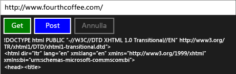

# Procedura dettagliata: Connessione tramite attività e richieste HTTP XML

Questo esempio illustra come usare il [IXMLHTTPRequest2](/windows/desktop/api/msxml6/nn-msxml6-ixmlhttprequest2) e [IXMLHTTPRequest2Callback](/windows/desktop/api/msxml6/nn-msxml6-ixmlhttprequest2callback) interfacce insieme alle attività per inviare richieste HTTP GET e POST a un servizio web in Universal Windows Platform (UWP ) app. Combinando `IXMLHTTPRequest2` insieme alle attività, è possibile scrivere codice che si integra con altre attività. Ad esempio, è possibile usare l'attività di download come parte di una catena di attività. L'attività di download può inoltre rispondere all'annullamento di lavoro.

> [!TIP]
>  È anche possibile usare C++ REST SDK per eseguire richieste HTTP da un'app UWP tramite app C++ o da un desktop app C++. Per altre informazioni, vedi [C++ REST SDK (nome in codice "Casablanca")](https://github.com/Microsoft/cpprestsdk).

Per altre informazioni sulle attività, vedere [Task Parallelism](../../parallel/concrt/task-parallelism-concurrency-runtime.md). Per altre informazioni su come usare le attività in un'app UWP, vedere [programmazione asincrona in C++](/windows/uwp/threading-async/asynchronous-programming-in-cpp-universal-windows-platform-apps) e [creazione di operazioni asincrone in C++ per le app UWP](../../parallel/concrt/creating-asynchronous-operations-in-cpp-for-windows-store-apps.md).

Questo documento viene innanzitutto illustrato come creare `HttpRequest` e le relative classi di supporti. Viene quindi illustrato come utilizzare questa classe da un'app UWP che usa C++ e XAML.

Per un esempio che usa `IXMLHTTPRequest2` ma non le attività, vedere [Guida introduttiva: Connessione tramite richieste HTTP XML (IXMLHTTPRequest2)](/previous-versions/windows/apps/hh770550\(v=win.10\)).

> [!TIP]
>  `IXMLHTTPRequest2` e `IXMLHTTPRequest2Callback` sono le interfacce che è consigliabile per l'uso in un'app UWP. È anche possibile adattare questo esempio per l'uso in un'app desktop.

## Prerequisiti

## Definizione delle classi HttpRequest, HttpRequestBuffersCallback e HttpRequestStringCallback

Quando si usa la `IXMLHTTPRequest2` l'interfaccia per creare richieste web tramite HTTP, si implementa il `IXMLHTTPRequest2Callback` interfaccia per ricevere la risposta del server e rispondere agli altri eventi. Questo esempio viene definito il `HttpRequest` classe per creare richieste web e il `HttpRequestBuffersCallback` e `HttpRequestStringCallback` classi per elaborare le risposte. Il `HttpRequestBuffersCallback` e `HttpRequestStringCallback` le classi supportano il `HttpRequest` classe, ma funzionano solo con il `HttpRequest` classe dal codice dell'applicazione.

Il `GetAsync`, `PostAsync` metodi del `HttpRequest` classe consentono di avviare le operazioni di HTTP GET e POST, rispettivamente. Questi metodi usano il `HttpRequestStringCallback` classe per leggere la risposta del server sotto forma di stringa. Il `SendAsync` e `ReadAsync` metodi consentono di trasmettere contenuti di grandi dimensioni in blocchi. Ciascuno di questi metodi restituisce [Concurrency:: Task](../../parallel/concrt/reference/task-class.md) per rappresentare l'operazione. Il `GetAsync` e `PostAsync` metodi producono `task<std::wstring>` valore, in cui il `wstring` parte rappresenta la risposta del server. Il `SendAsync` e `ReadAsync` metodi producono `task<void>` valori; queste attività completata quando completa le operazioni di lettura e di trasmissione.

Poiché il `IXMLHTTPRequest2` interfacce di agiscono in modo asincrono, questo esempio viene usato [Concurrency:: task_completion_event](../../parallel/concrt/reference/task-completion-event-class.md) per creare un'attività che viene completata dopo che l'oggetto callback al completamento o Annulla l'operazione di download. Il `HttpRequest` classe crea una continuazione basata su attività da questa attività per impostare il risultato finale. Il `HttpRequest` classe Usa una continuazione basata su attività per garantire che l'attività di continuazione viene eseguita anche se l'attività precedente genera un errore o viene annullato. Per altre informazioni sulle continuazioni basate su attività, vedere [parallelismo delle attività](../../parallel/concrt/task-parallelism-concurrency-runtime.md)

Per supportare l'annullamento, la `HttpRequest`, `HttpRequestBuffersCallback`, e `HttpRequestStringCallback` classi usano i token di annullamento. Il `HttpRequestBuffersCallback` e `HttpRequestStringCallback` classi di utilizzare il [concurrency::cancellation_token::register_callback](reference/cancellation-token-class.md#register_callback) metodo per abilitare l'evento di completamento di attività rispondere all'annullamento. Questo callback di annullamento interrompe il download. Per altre informazioni sull'annullamento, vedi [annullamento](../../parallel/concrt/exception-handling-in-the-concurrency-runtime.md#cancellation).

#### Per definire la classe HttpRequest

1. Usare Visual C++ **App vuota (XAML)** modello per creare un progetto di app XAML vuota. Questo esempio assegna al progetto il nome `UsingIXMLHTTPRequest2`.

1. Aggiungere al progetto un file di intestazione denominato HttpRequest.h e un file di origine denominato HttpRequest.

1. In PCH. h, aggiungere questo codice:

   [!code-cpp[concrt-using-ixhr2#1](../../parallel/concrt/codesnippet/cpp/walkthrough-connecting-using-tasks-and-xml-http-requests_1.h)]

1. In HttpRequest.h, aggiungere questo codice:

   [!code-cpp[concrt-using-ixhr2#2](../../parallel/concrt/codesnippet/cpp/walkthrough-connecting-using-tasks-and-xml-http-requests_2.h)]

1. In HttpRequest, aggiungere questo codice:

   [!code-cpp[concrt-using-ixhr2#3](../../parallel/concrt/codesnippet/cpp/walkthrough-connecting-using-tasks-and-xml-http-requests_3.cpp)]

## Utilizzo della classe HttpRequest in un'App UWP

In questa sezione illustra come usare il `HttpRequest` classe in un'app UWP. L'app fornisce una casella di input che definisce una risorsa URL, e comandi del pulsante che eseguono operazioni GET e POST e un pulsante di comando che annulla l'operazione corrente.

#### Per utilizzare la classe HttpRequest

1. In MainPage. XAML, definire le [StackPanel](https://msdn.microsoft.com/library/windows/apps/xaml/windows.ui.xaml.controls.stackpanel.aspx) elemento come indicato di seguito.

   [!code-xml[concrt-using-ixhr2#A1](../../parallel/concrt/codesnippet/xaml/walkthrough-connecting-using-tasks-and-xml-http-requests_4.xaml)]

2. In MainPage, aggiungere questo `#include` direttiva:

   [!code-cpp[concrt-using-ixhr2#A2](../../parallel/concrt/codesnippet/cpp/walkthrough-connecting-using-tasks-and-xml-http-requests_5.h)]

3. In MainPage, aggiungerli `private` le variabili membro per il `MainPage` classe:

   [!code-cpp[concrt-using-ixhr2#A3](../../parallel/concrt/codesnippet/cpp/walkthrough-connecting-using-tasks-and-xml-http-requests_6.h)]

4. In MainPage, dichiarare la `private` metodo `ProcessHttpRequest`:

   [!code-cpp[concrt-using-ixhr2#A4](../../parallel/concrt/codesnippet/cpp/walkthrough-connecting-using-tasks-and-xml-http-requests_7.h)]

5. In MainPage.xaml.cpp, aggiungere questi `using` istruzioni:

   [!code-cpp[concrt-using-ixhr2#A5](../../parallel/concrt/codesnippet/cpp/walkthrough-connecting-using-tasks-and-xml-http-requests_8.cpp)]

6. In MainPage.xaml.cpp, implementare il `GetButton_Click`, `PostButton_Click`, e `CancelButton_Click` metodi del `MainPage` classe.

   [!code-cpp[concrt-using-ixhr2#A6](../../parallel/concrt/codesnippet/cpp/walkthrough-connecting-using-tasks-and-xml-http-requests_9.cpp)]

   > [!TIP]
   > Se l'app non richiede il supporto per l'annullamento, passare [Concurrency:: cancellation_token:: none](reference/cancellation-token-class.md#none) per il `HttpRequest::GetAsync` e `HttpRequest::PostAsync` metodi.

1. In MainPage.xaml.cpp, implementare il `MainPage::ProcessHttpRequest` (metodo).

   [!code-cpp[concrt-using-ixhr2#A7](../../parallel/concrt/codesnippet/cpp/walkthrough-connecting-using-tasks-and-xml-http-requests_10.cpp)]

8. Nelle proprietà del progetto, sotto **Linker**, **Input**, specificare `shcore.lib` e `msxml6.lib`.

Ecco l'app in esecuzione:

## Passaggi successivi

[Procedure dettagliate del runtime di concorrenza](../../parallel/concrt/concurrency-runtime-walkthroughs.md)

## Vedere anche

[Parallelismo delle attività](../../parallel/concrt/task-parallelism-concurrency-runtime.md) 
[Annullamento nella libreria PPL](cancellation-in-the-ppl.md) 
[Programmazione asincrona in C++](/windows/uwp/threading-async/asynchronous-programming-in-cpp-universal-windows-platform-apps) 
[Creazione di operazioni asincrone in C++ per app UWP](../../parallel/concrt/creating-asynchronous-operations-in-cpp-for-windows-store-apps.md) 
[Avvio rapido: Connessione tramite richieste HTTP XML (IXMLHTTPRequest2)](/previous-versions/windows/apps/hh770550\(v=win.10\))
[classe task (Runtime di concorrenza)](../../parallel/concrt/reference/task-class.md) 
[Classe task_completion_event](../../parallel/concrt/reference/task-completion-event-class.md)
