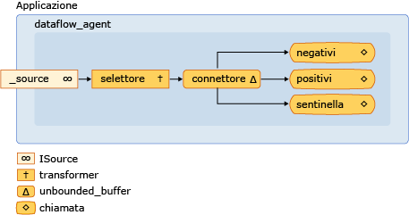

# <a name="walkthrough-creating-a-dataflow-agent"></a>Procedura dettagliata: Creazione di un agente del flusso di dati

In questo documento viene illustrato come creare applicazioni basate su agenti basate sul flusso di controllo, anziché sul flusso di controllo.

Il *flusso di controllo* si riferisce all'ordine di esecuzione delle operazioni in un programma. Il flusso di controllo viene regolato usando strutture di controllo come istruzioni condizionali, cicli e così via. In alternativa, il *flusso* di dati fa riferimento a un modello di programmazione in cui i calcoli vengono eseguiti solo quando sono disponibili tutti i dati necessari. Il modello di programmazione del flusso di data è correlato al concetto di passaggio dei messaggi, in cui i componenti indipendenti di un programma comunicano tra loro tramite l'invio di messaggi.

Gli agenti asincroni supportano i modelli di programmazione del flusso di controllo e del flusso di tempo. Sebbene il modello di flusso di controllo sia appropriato in molti casi, il modello di flusso di dati è appropriato in altri, ad esempio quando un agente riceve i dati ed esegue un'azione basata sul payload di tali dati.

## <a name="prerequisites"></a>Prerequisiti

Prima di iniziare questa procedura dettagliata, leggere i documenti seguenti:

- [Agenti asincroni](../../parallel/concrt/asynchronous-agents.md)

- [Blocchi di messaggi asincroni](../../parallel/concrt/asynchronous-message-blocks.md)

- [Procedura: utilizzare un filtro di blocco messaggi](../../parallel/concrt/how-to-use-a-message-block-filter.md)

## <a name="sections"></a><a name="top"></a> Sezioni

Questa procedura dettagliata contiene le sezioni seguenti:

- [Creazione di un agente Control-Flow di base](#control-flow)

- [Creazione di un agente del flusso di elementi di base](#dataflow)

- [Creazione di un agente Message-Logging](#logging)

## <a name="creating-a-basic-control-flow-agent"></a><a name="control-flow"></a> Creazione di un agente Control-Flow di base

Si consideri l'esempio seguente che definisce la `control_flow_agent` classe. La `control_flow_agent` classe agisce su tre buffer di messaggi: un buffer di input e due buffer di output. Il `run` metodo legge dal buffer dei messaggi di origine in un ciclo e usa un'istruzione condizionale per indirizzare il flusso dell'esecuzione del programma. L'agente incrementa un contatore per i valori negativi diversi da zero e incrementa un altro contatore per i valori positivi diversi da zero. Dopo che l'agente ha ricevuto il valore sentinella pari a zero, invia i valori dei contatori ai buffer dei messaggi di output. I `negatives` `positives` metodi e consentono all'applicazione di leggere i conteggi dei valori negativi e positivi dall'agente.

[!code-cpp[concrt-dataflow-agent#1](../../parallel/concrt/codesnippet/cpp/walkthrough-creating-a-dataflow-agent_1.cpp)]

Sebbene in questo esempio venga utilizzato il flusso di controllo di base di un agente, viene illustrata la natura seriale della programmazione basata sul flusso di controllo. Ogni messaggio deve essere elaborato in sequenza, anche se possono essere disponibili più messaggi nel buffer dei messaggi di input. Il modello di flusso di tempo consente la valutazione simultanea di entrambi i rami dell'istruzione condizionale. Il modello di flusso di dati consente inoltre di creare reti di messaggistica più complesse che agiscono sui dati quando diventano disponibili.

[All'[inizio](#top)]

## <a name="creating-a-basic-dataflow-agent"></a><a name="dataflow"></a> Creazione di un agente del flusso di elementi di base

In questa sezione viene illustrato come convertire la `control_flow_agent` classe per utilizzare il modello di flusso di lavoro per eseguire la stessa attività.

L'agente del flusso di flussi di lavoro consente di creare una rete di buffer di messaggi, ciascuno dei quali svolge uno scopo specifico. In alcuni blocchi di messaggi viene utilizzata una funzione di filtro per accettare o rifiutare un messaggio sulla base del payload. Una funzione di filtro garantisce che un blocco di messaggi riceva solo determinati valori.

#### <a name="to-convert-the-control-flow-agent-to-a-dataflow-agent"></a>Per convertire l'agente del flusso di controllo in un agente del flusso di flussi

1. Copiare il corpo della `control_flow_agent` classe in un'altra classe, ad esempio `dataflow_agent` . In alternativa, è possibile rinominare la `control_flow_agent` classe.

1. Rimuovere il corpo del ciclo che chiama `receive` dal `run` metodo.

[!code-cpp[concrt-dataflow-agent#2](../../parallel/concrt/codesnippet/cpp/walkthrough-creating-a-dataflow-agent_2.cpp)]

1. Nel `run` metodo, dopo l'inizializzazione delle variabili `negative_count` e `positive_count` , aggiungere un `countdown_event` oggetto che tiene traccia del numero di operazioni attive.

[!code-cpp[concrt-dataflow-agent#6](../../parallel/concrt/codesnippet/cpp/walkthrough-creating-a-dataflow-agent_3.cpp)]

   La `countdown_event` classe viene illustrata più avanti in questo argomento.

1. Creare gli oggetti del buffer dei messaggi che parteciperanno alla rete del flusso di flussi.

[!code-cpp[concrt-dataflow-agent#3](../../parallel/concrt/codesnippet/cpp/walkthrough-creating-a-dataflow-agent_4.cpp)]

1. Connettere i buffer dei messaggi per formare una rete.

[!code-cpp[concrt-dataflow-agent#4](../../parallel/concrt/codesnippet/cpp/walkthrough-creating-a-dataflow-agent_5.cpp)]

1. Attendere l' `event` impostazione degli `countdown event` oggetti e. Questi eventi segnalano che l'agente ha ricevuto il valore sentinel e che tutte le operazioni sono state completate.

[!code-cpp[concrt-dataflow-agent#5](../../parallel/concrt/codesnippet/cpp/walkthrough-creating-a-dataflow-agent_6.cpp)]

Il diagramma seguente mostra la rete del flusso di codice completa per la `dataflow_agent` classe:



Nella tabella seguente vengono descritti i membri della rete.

|Membro|Descrizione|
|------------|-----------------|
|`increment_active`|Oggetto [Concurrency:: Transformer](../../parallel/concrt/reference/transformer-class.md) che incrementa il contatore degli eventi attivi e passa il valore di input al resto della rete.|
|`negatives`, `positives`|oggetti [Concurrency:: Call](../../parallel/concrt/reference/call-class.md) che incrementano il numero di numeri e decrementano il contatore degli eventi attivi. Ogni oggetto utilizza un filtro per accettare numeri negativi o numeri positivi.|
|`sentinel`|Oggetto [Concurrency:: Call](../../parallel/concrt/reference/call-class.md) che accetta solo il valore sentinel zero e decrementa il contatore di eventi attivi.|
|`connector`|Oggetto [Concurrency:: unbounded_buffer](reference/unbounded-buffer-class.md) che connette il buffer dei messaggi di origine alla rete interna.|

Poiché il `run` metodo viene chiamato su un thread separato, altri thread possono inviare messaggi alla rete prima che la rete sia completamente connessa. Il `_source` membro dati è un `unbounded_buffer` oggetto che memorizza nel buffer tutti gli input inviati dall'applicazione all'agente. Per assicurarsi che la rete elabori tutti i messaggi di input, l'agente collega prima di tutto i nodi interni della rete e quindi collega l'avvio di tale rete `connector` al `_source` membro dati. Ciò garantisce che i messaggi non vengano elaborati durante il formato della rete.

Poiché la rete in questo esempio è basata sul flusso di dati, anziché sul flusso di controllo, la rete deve comunicare con l'agente che ha completato l'elaborazione di ogni valore di input e che il nodo sentinella ha ricevuto il relativo valore. In questo esempio viene utilizzato un `countdown_event` oggetto per segnalare che tutti i valori di input sono stati elaborati e un oggetto [Concurrency:: Event](../../parallel/concrt/reference/event-class.md) per indicare che il nodo Sentinel ha ricevuto il relativo valore. La `countdown_event` classe utilizza un `event` oggetto per segnalare quando un valore del contatore raggiunge lo zero. L'intestazione della rete del flusso di flussi incrementa il contatore ogni volta che riceve un valore. Ogni nodo terminale della rete decrementa il contatore dopo l'elaborazione del valore di input. Dopo che l'agente forma la rete del flusso di flussi, attende che il nodo Sentinel imposti l' `event` oggetto e `countdown_event` che l'oggetto segnali che il contatore ha raggiunto lo zero.

Nell'esempio seguente vengono illustrate le `control_flow_agent` `dataflow_agent` classi, e `countdown_event` . La `wmain` funzione crea un `control_flow_agent` oggetto e un `dataflow_agent` oggetto e usa la `send_values` funzione per inviare una serie di valori casuali agli agenti.

[!code-cpp[concrt-dataflow-agent#7](../../parallel/concrt/codesnippet/cpp/walkthrough-creating-a-dataflow-agent_7.cpp)]

Questo esempio produce l'output di esempio seguente:

```Output
Control-flow agent:
There are 500523 negative numbers.
There are 499477 positive numbers.
Dataflow agent:
There are 500523 negative numbers.
There are 499477 positive numbers.
```

### <a name="compiling-the-code"></a>Compilazione del codice

Copiare il codice di esempio e incollarlo in un progetto di Visual Studio oppure incollarlo in un file denominato, `dataflow-agent.cpp` quindi eseguire il comando seguente in una finestra del prompt dei comandi di Visual Studio.

**cl.exe/EHsc dataflow-agent. cpp**

[All'[inizio](#top)]

## <a name="creating-a-message-logging-agent"></a><a name="logging"></a> Creazione di un agente Message-Logging

Nell'esempio seguente viene illustrata la `log_agent` classe, simile alla `dataflow_agent` classe. La `log_agent` classe implementa un agente di registrazione asincrono che scrive i messaggi di log in un file e nella console. La `log_agent` classe consente all'applicazione di categorizzare i messaggi come informativi, di avviso o di errore. Consente inoltre all'applicazione di specificare se ogni categoria di log viene scritta in un file, nella console o in entrambi. Questo esempio scrive tutti i messaggi di log in un file e solo i messaggi di errore nella console.

[!code-cpp[concrt-log-filter#1](../../parallel/concrt/codesnippet/cpp/walkthrough-creating-a-dataflow-agent_8.cpp)]

Questo esempio scrive l'output seguente nella console.

```Output
error: This is a sample error message.
```

Questo esempio genera anche il file di log.txt, che contiene il testo seguente.

```Output
info: ===Logging started.===
warning: This is a sample warning message.
error: This is a sample error message.
info: ===Logging finished.===
```

### <a name="compiling-the-code"></a>Compilazione del codice

Copiare il codice di esempio e incollarlo in un progetto di Visual Studio oppure incollarlo in un file denominato, `log-filter.cpp` quindi eseguire il comando seguente in una finestra del prompt dei comandi di Visual Studio.

**cl.exe/EHsc log-Filter. cpp**

[All'[inizio](#top)]

## <a name="see-also"></a>Vedi anche

[Procedure dettagliate runtime di concorrenza](../../parallel/concrt/concurrency-runtime-walkthroughs.md)
