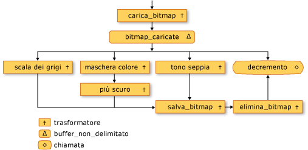
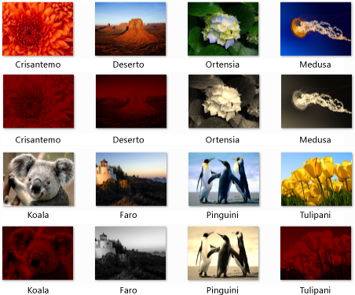

# Procedura dettagliata: creazione di una rete per l&#39;elaborazione di immagini
[!INCLUDE[vs2017banner](../../assembler/inline/includes/vs2017banner.md)]

In questo documento viene illustrato come creare una rete di blocchi di messaggi asincroni che eseguono l'elaborazione di immagini.  
  
 La rete determina le operazioni da eseguire su un'immagine in base alle relative caratteristiche.  In questo esempio viene utilizzato il modello di *flusso di dati* per instradare le immagini tramite la rete.  Nel modello di flusso di dati i componenti indipendenti di un programma comunicano tra loro inviando messaggi.  Quando un componente riceve un messaggio, può eseguire una determinata azione e quindi passare il risultato dell'azione a un altro componente.  Confrontare questo modello con il modello di *flusso di controllo*, in cui un'applicazione utilizza le strutture di controllo, ad esempio le istruzioni condizionali, i cicli e così via, per controllare l'ordine delle operazioni in un programma.  
  
 Una rete basata sul flusso di dati crea una *pipeline* delle attività.  Ogni fase della pipeline esegue contemporaneamente una parte dell'attività globale.  Un esempio può essere rappresentato da una catena di montaggio dell'industria automobilistica.  Man mano che ciascun veicolo passa attraverso la catena di montaggio, in una postazione viene assemblato il telaio, in un'altra viene montato il motore e così via.  Grazie alla catena di montaggio in cui è possibile eseguire il montaggio di più veicoli contemporaneamente si ottiene una maggiore produzione rispetto al montaggio completo dei veicoli uno alla volta.  
  
## Prerequisiti  
 Prima di iniziare questa procedura dettagliata, leggere i documenti riportati di seguito.  
  
-   [Blocchi dei messaggi asincroni](../../parallel/concrt/asynchronous-message-blocks.md)  
  
-   [Procedura: Usare il filtro di blocco dei messaggi](../../parallel/concrt/how-to-use-a-message-block-filter.md)  
  
-   [Procedura dettagliata: Creazione di un agente del flusso di dati](../../parallel/concrt/walkthrough-creating-a-dataflow-agent.md)  
  
 Si consiglia inoltre di acquisire una buona conoscenza delle basi di [!INCLUDE[ndptecgdiplus](../../parallel/concrt/includes/ndptecgdiplus_md.md)] prima di avviare questa procedura dettagliata.  Per ulteriori informazioni su [!INCLUDE[ndptecgdiplus](../../parallel/concrt/includes/ndptecgdiplus_md.md)], vedere [GDI\+](_gdiplus_GDI_start_cpp).  
  
##   Sezioni  
 In questa procedura dettagliata sono contenute le sezioni seguenti:  
  
-   [Definizione delle funzionalità di elaborazione di immagini](#functionality)  
  
-   [Creazione della rete di elaborazione di immagini](#network)  
  
-   [Esempio completo](#complete)  
  
##   Definizione delle funzionalità di elaborazione di immagini  
 In questa sezione vengono illustrate le funzioni di supporto utilizzate dalle rete per l'elaborazione di immagini per gestire le immagini lette dal disco.  
  
 Le funzioni `GetRGB` e `MakeColor` riportate di seguito estraggono e combinano rispettivamente le singole componenti del colore specificato.  
  
 [!code-cpp[concrt-image-processing-filter#2](../../parallel/concrt/codesnippet/CPP/walkthrough-creating-an-image-processing-network_1.cpp)]  
  
 La funzione `ProcessImage` riportata di seguito chiama l'oggetto [std::function](../../standard-library/function-class.md) specificato per trasformare il valore del colore di ogni pixel in un oggetto [Bitmap](https://msdn.microsoft.com/en-us/library/ms534420.aspx) [!INCLUDE[ndptecgdiplus](../../parallel/concrt/includes/ndptecgdiplus_md.md)].  La funzione `ProcessImage` utilizza l'algoritmo [concurrency::parallel\_for](../Topic/parallel_for%20Function.md) per elaborare ogni riga della bitmap in parallelo.  
  
 [!code-cpp[concrt-image-processing-filter#3](../../parallel/concrt/codesnippet/CPP/walkthrough-creating-an-image-processing-network_2.cpp)]  
  
 Le funzioni `Grayscale`, `Sepiatone`, `ColorMask` e `Darken` riportate di seguito chiamano la funzione `ProcessImage` per trasformare il valore del colore di ogni pixel in un oggetto `Bitmap`.  Ognuna di queste funzioni utilizza un'espressione lambda per definire la trasformazione dei colori di un pixel.  
  
 [!code-cpp[concrt-image-processing-filter#4](../../parallel/concrt/codesnippet/CPP/walkthrough-creating-an-image-processing-network_3.cpp)]  
  
 Anche la funzione `GetColorDominance` riportata di seguito chiama la funzione `ProcessImage`,  ma anziché modificare il valore di ciascun colore, questa funzione utilizza gli oggetti [concurrency::combinable](../../parallel/concrt/reference/combinable-class.md) per calcolare se la componente cromatica rosso, verde o blu domina l'immagine.  
  
 [!code-cpp[concrt-image-processing-filter#5](../../parallel/concrt/codesnippet/CPP/walkthrough-creating-an-image-processing-network_4.cpp)]  
  
 La funzione `GetEncoderClsid` riportata di seguito recupera l'identificatore di classe per il tipo MIME specificato di un codificatore.  L'applicazione utilizza questa funzione per recuperare il codificatore per una bitmap.  
  
 [!code-cpp[concrt-image-processing-filter#6](../../parallel/concrt/codesnippet/CPP/walkthrough-creating-an-image-processing-network_5.cpp)]  
  
 \[[Top](#top)\]  
  
##   Creazione della rete di elaborazione di immagini  
 In questa sezione viene descritto come creare una rete di blocchi di messaggi asincroni che eseguono l'elaborazione di immagini su ogni immagine [!INCLUDE[TLA#tla_jpeg](../../parallel/concrt/includes/tlasharptla_jpeg_md.md)] \(con estensione jpg\) in una directory specificata.  La rete esegue le operazioni di elaborazione di immagini seguenti:  
  
1.  Per le immagini create da Tom, viene eseguita la conversione in scala di grigi.  
  
2.  Per le immagini che hanno il rosso come colore dominante, vengono rimosse le componenti verde e blu e vengono quindi scurite.  
  
3.  Per le altre immagini, viene applicato l'effetto seppia.  
  
 La rete applica solo la prima operazione di elaborazione di immagini che corrisponde a una di queste condizioni.  Se ad esempio un'immagine è creata da Tom e ha il rosso come colore dominante, l'immagine viene convertita solo in scala di grigi.  
  
 Dopo avere eseguito ogni operazione di elaborazione di immagini, la rete salva l'immagine su disco come file bitmap \(con estensione bmp\).  
  
 Nei passaggi seguenti viene illustrato come creare una funzione che implementa questa rete di elaborazione di immagini e applica la rete a ogni immagine [!INCLUDE[TLA#tla_jpeg](../../parallel/concrt/includes/tlasharptla_jpeg_md.md)] in una directory specificata.  
  
#### Per creare la rete di elaborazione di immagini  
  
1.  Creare una funzione `ProcessImages` che accetta il nome di una directory su disco.  
  
     [!code-cpp[concrt-image-processing-filter#7](../../parallel/concrt/codesnippet/CPP/walkthrough-creating-an-image-processing-network_6.cpp)]  
  
2.  Nella funzione `ProcessImages` creare una variabile di `countdown_event`.  La classe `countdown_event` viene illustrata più avanti in questa procedura dettagliata.  
  
     [!code-cpp[concrt-image-processing-filter#8](../../parallel/concrt/codesnippet/CPP/walkthrough-creating-an-image-processing-network_7.cpp)]  
  
3.  Creare un oggetto [std::map](../../standard-library/map-class.md) che associa un oggetto `Bitmap` al nome file originale.  
  
     [!code-cpp[concrt-image-processing-filter#9](../../parallel/concrt/codesnippet/CPP/walkthrough-creating-an-image-processing-network_8.cpp)]  
  
4.  Aggiungere il codice seguente per definire i membri della rete di elaborazione di immagini.  
  
     [!code-cpp[concrt-image-processing-filter#10](../../parallel/concrt/codesnippet/CPP/walkthrough-creating-an-image-processing-network_9.cpp)]  
  
5.  Aggiungere il codice seguente per connettere la rete.  
  
     [!code-cpp[concrt-image-processing-filter#11](../../parallel/concrt/codesnippet/CPP/walkthrough-creating-an-image-processing-network_10.cpp)]  
  
6.  Aggiungere il codice seguente per inviare all'intestazione della rete il percorso completo di ogni file [!INCLUDE[TLA#tla_jpeg](../../parallel/concrt/includes/tlasharptla_jpeg_md.md)] della directory.  
  
     [!code-cpp[concrt-image-processing-filter#12](../../parallel/concrt/codesnippet/CPP/walkthrough-creating-an-image-processing-network_11.cpp)]  
  
7.  Attendere che la variabile di `countdown_event` raggiunga lo zero.  
  
     [!code-cpp[concrt-image-processing-filter#13](../../parallel/concrt/codesnippet/CPP/walkthrough-creating-an-image-processing-network_12.cpp)]  
  
 Nella tabella seguente sono descritti i membri della rete.  
  
|Membro|Descrizione|  
|------------|-----------------|  
|`load_bitmap`|Oggetto [concurrency::transformer](../../parallel/concrt/reference/transformer-class.md) che carica un oggetto `Bitmap` dal disco e aggiunge una voce all'oggetto `map` per associare l'immagine al nome file originale.|  
|`loaded_bitmaps`|Oggetto [concurrency::unbounded\_buffer](../Topic/unbounded_buffer%20Class.md) che invia le immagini caricate ai filtri di elaborazione di immagini.|  
|`grayscale`|Oggetto `transformer` che converte le immagini create da Tom in scala di grigi.  Utilizza i metadati dell'immagine per determinarne l'autore.|  
|`colormask`|Oggetto `transformer` che rimuove le componenti cromatiche verde e blu dalle immagini che hanno il rosso come colore dominante.|  
|`darken`|Oggetto `transformer` che scurisce le immagini che hanno il rosso come colore dominante.|  
|`sepiatone`|Oggetto `transformer` che applica l'effetto seppia alle immagine non create da Tom e che non hanno il rosso come colore predominante.|  
|`save_bitmap`|Oggetto `transformer` che salva oggetto `image` elaborato su disco come bitmap.  `save_bitmap` recupera il nome file originale dall'oggetto `map` e modifica l'estensione di file in bmp.|  
|`delete_bitmap`|Oggetto `transformer` che libera memoria per le immagini.|  
|`decrement`|Oggetto [concurrency::call](../../parallel/concrt/reference/call-class.md) che funge da nodo terminale nella rete.  Decrementa l'oggetto `countdown_event` per segnalare all'applicazione principale che un'immagine è stata elaborata.|  
  
 Il buffer dei messaggi `loaded_bitmaps` è importante perché, essendo un oggetto `unbounded_buffer`, offre gli oggetti `Bitmap` a più ricevitori.  Quando un blocco di destinazione accetta un oggetto `Bitmap`, l'oggetto `unbounded_buffer` non offre tale oggetto `Bitmap` ad altre destinazioni.  Pertanto, l'ordine in cui vengono collegati gli oggetti a un oggetto `unbounded_buffer` è importante.  I blocchi di messaggi `grayscale`, `colormask` e `sepiatone` utilizzano ciascuno un filtro per accettare solo determinati oggetti `Bitmap`.  Il buffer dei messaggi `decrement` è una destinazione importante del buffer dei messaggi `loaded_bitmaps` poiché accetta tutti gli oggetti `Bitmap` rifiutati dagli altri buffer dei messaggi.  Un oggetto `unbounded_buffer` è necessario per propagare i messaggi nell'ordine specificato.  Pertanto, un oggetto `unbounded_buffer` viene bloccato finché ad esso non viene collegato un nuovo blocco di destinazione e accetta il messaggio se nessun blocco di destinazione corrente accetta tale messaggio.  
  
 Se l'applicazione richiede che più blocchi di messaggi elaborino il messaggio, anziché solo un blocco di messaggi che accetta per primo il messaggio, è possibile utilizzare un altro tipo di blocco di messaggi, ad esempio `overwrite_buffer`.  La classe `overwrite_buffer` contiene un solo messaggio alla volta, ma propaga il messaggio a ciascuna delle relative destinazioni.  
  
 Nella figura seguente viene illustrata la rete di elaborazione di immagini:  
  
   
  
 L'oggetto `countdown_event` di questo esempio consente alla rete di elaborazione di immagini di notificare all'applicazione principale quando tutte le immagini sono state elaborate.  La classe `countdown_event` utilizza un oggetto [concurrency::event](../../parallel/concrt/reference/event-class.md) per segnalare quando un valore del contatore raggiunge lo zero.  L'applicazione principale incrementa il contatore ogni volta che invia un nome file alla rete.  Il nodo terminale della rete decrementa il contatore dopo l'elaborazione di ogni immagine.  Dopo aver attraversato la directory specificata, l'applicazione principale attende che l'oggetto `countdown_event` segnali che il contatore ha raggiunto lo zero.  
  
 Nell'esempio seguente viene illustrata la classe `countdown_event`:  
  
 [!code-cpp[concrt-image-processing-filter#14](../../parallel/concrt/codesnippet/CPP/walkthrough-creating-an-image-processing-network_13.cpp)]  
  
 \[[Top](#top)\]  
  
##   Esempio completo  
 Nel codice seguente viene illustrato l'esempio completo.  La funzione `wmain` gestisce la libreria [!INCLUDE[ndptecgdiplus](../../parallel/concrt/includes/ndptecgdiplus_md.md)] e chiama la funzione `ProcessImages` per elaborare i file [!INCLUDE[TLA#tla_jpeg](../../parallel/concrt/includes/tlasharptla_jpeg_md.md)] della directory `Sample Pictures`.  
  
 [!code-cpp[concrt-image-processing-filter#15](../../parallel/concrt/codesnippet/CPP/walkthrough-creating-an-image-processing-network_14.cpp)]  
  
 Nella figura seguente viene illustrato l'output di esempio.  Ogni immagine di origine viene rappresentata sopra l'immagine modificata corrispondente.  
  
   
  
 `Lighthouse` è stato creato da Tom Alphin e pertanto è stato convertito in scala di grigi.  `Crisantemo`, `Deserto`, `Koala` e `Tulipani` hanno il rosso come colore dominante e pertanto sono state rimosse le componenti cromatiche blu e verde e sono stati scuriti.  `Hydrangeas`, `Jellyfish` e `Penguins` corrispondono ai criteri predefiniti e pertanto vi è stato applicato l'effetto seppia.  
  
 \[[Top](#top)\]  
  
### Compilazione del codice  
 Copiare il codice di esempio e incollarlo in un progetto di Visual Studio o incollarlo in un file denominato `image-processing-network.cpp`, quindi eseguire il comando seguente in una finestra del prompt dei comandi di Visual Studio.  
  
 **cl.exe \/DUNICODE \/EHsc image\-processing\-network.cpp \/link gdiplus.lib**  
  
## Vedere anche  
 [Procedure dettagliate del runtime di concorrenza](../../parallel/concrt/concurrency-runtime-walkthroughs.md)