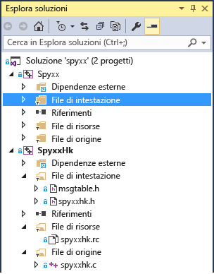

# Guida al porting: Spy++
[!INCLUDE[vs2017banner](../assembler/inline/includes/vs2017banner.md)]

Questo case study relativo al porting contiene informazioni generali sul funzionamento di un tipico progetto di porting e sui tipi di problemi che è possibile riscontrare, oltre ad alcuni suggerimenti e trucchi per la risoluzione dei problemi di porting.  Questa non intende essere una guida definitiva, perché l'esperienza del porting di un progetto dipende in larga misura dalle specifiche del codice.  
  
## Spy\+\+  
 Spy\+\+ è uno strumento di diagnostica GUI ampiamente usato per il desktop di Windows, che fornisce ogni tipo di informazione sugli elementi dell'interfaccia utente sul desktop di Windows.  Spy\+\+ mostra la completa gerarchia di finestre e fornisce l'accesso ai metadati su ogni finestra e controllo.  Questa utile applicazione è fornita da molti anni con Visual Studio.  È stata trovata una vecchia versione compilata per l'ultima volta in Visual C\+\+ 6.0 e ne è stato eseguito il porting in [!INCLUDE[vs_dev14](../ide/includes/vs_dev14_md.md)].  
  
 Questo è considerato un tipico caso di porting di applicazioni desktop Windows che usano MFC e l'API Win32, in special modo in caso di progetti obsoleti che non sono stati aggiornati con ogni versione di Visual C\+\+ fin da Visual C\+\+ 6.0.  
  
### Passaggio 1.Conversione del file di progetto  
 Il file di progetto, due vecchi file con estensione dsw di Visual C\+\+ 6.0, è stato facilmente convertito, senza alcun problema che richiedesse ulteriore attenzione.  Un progetto è l'applicazione Spy\+\+,  l'altro è SpyHk, scritto in C, una DLL di supporto.  Potrebbe non essere altrettanto facile eseguire l'aggiornamento di progetti più complessi, come discusso [qui](../porting/visual-cpp-porting-and-upgrading-guide.md).  Per progetti di maggiori dimensioni può essere utile aggiornare una versione di Visual Studio alla volta.  
  
 Dopo l'aggiornamento dei due progetti, la soluzione era simile alla seguente:  
  
   
  
 Sono disponibili due progetti: uno con un ingente numero di file C\+\+, l'altro rappresentato da una DLL scritta in C.  
  
### Passaggio 2.Problemi del file di intestazione  
 Durante la compilazione di un progetto appena convertito, uno dei primi aspetti spesso osservati è che i file di intestazione usati dal progetto non vengono rilevati.  
  
 Uno dei file non trovati in Spy\+\+ è verstamp.h.  Da una ricerca in Internet, è stato rilevato che questo file proveniva da un SDK di DAO, una tecnologia di dati obsoleta.  L'obiettivo era scoprire quali simboli venivano usati da tale file di intestazione per verificare se esso fosse davvero necessario oppure se quei simboli fossero definiti altrove, quindi è stato aggiunto un commento alla dichiarazione del file di intestazione, che è stata poi ricompilata.  Il risultato è che solo il simbolo VER\_FILEFLAGSMASK è davvero necessario.  
  
```  
1>C:\Program Files (x86)\Windows Kits\8.1\Include\shared\common.ver(212): error RC2104: undefined keyword or key name: VER_FILEFLAGSMASK  
```  
  
 Il modo più semplice per trovare un simbolo nei file di inclusione disponibili consiste nell'usare Cerca nei file \(Ctrl \+ Maiusc \+ F\) e specificare **Directory di inclusione di Visual C\+\+**.  Il simbolo è stato trovato nel file ntverp.h.  Il file di inclusione verstamp.h è stato sostituito con il file ntverp.h e l'errore è scomparso.  
  
### Passaggio 3.Configurazione della proprietà OutputFile del linker  
 I progetti più vecchi talvolta inseriscono file in percorsi non convenzionali che possono causare problemi dopo l'aggiornamento.  In questo caso, è necessario aggiungere $\(SolutionDir\) al percorso di inclusione nelle proprietà del progetto per assicurarsi che Visual Studio riesca a trovare alcuni file di intestazione qui inseriti, piuttosto che in una delle cartelle di progetto.  
  
 MSBuild rileva che la proprietà Link.OutputFile non corrisponde ai valori TargetPath e TargetName, emettendo l'errore MSB8012.  
  
  **avviso MSB8012: TargetPath\(...  \\spyxx\\spyxxhk\\.  \\..  \\Debug\\SpyxxHk.dll\) non corrisponde al valore della proprietà OutputFile del linker \(...  \\spyxx\\Debug\\SpyHk55.dll\).  È possibile che il progetto non venga compilato correttamente.  Per risolvere il problema, accertarsi che i valori di proprietà $\(OutDir\), $\(TargetName\) e $\(TargetExt\) corrispondano al valore specificato in %\(Link.OutputFile\).  avviso MSB8012: TargetName\(SpyxxHk\) non corrisponde al valore della proprietà OutputFile del linker \(SpyHk55\).  È possibile che il progetto non venga compilato correttamente.  Per risolvere il problema, accertarsi che i valori di proprietà $\(OutDir\), $\(TargetName\) e $\(TargetExt\) corrispondano al valore specificato in %\(Link.OutputFile\).**  **Link.OutputFile** è l'output di compilazione \(ad esempio, EXE, DLL\) e in genere viene creato da $\(TargetDir\)$\(TargetName\)$\(TargetExt\), fornendo il percorso, il nome file e l'estensione.  Si tratta di un errore che si verifica comunemente durante la migrazione dei progetti dal vecchio strumento di compilazione di Visual C\+\+ \(vcbuild.exe\) al nuovo strumento di compilazione \(MSBuild.exe\).  Dal momento che la modifica dello strumento di compilazione ha avuto luogo in Visual Studio 2010, potrebbe essere possibile riscontrare questo problema ogni volta che si esegue la migrazione di un progetto precedente alla versione 2010 a una versione 2010 o successiva.  Il problema fondamentale è che la migrazione guidata del progetto non aggiorna il valore **Link.OutputFile** perché non è sempre possibile determinare su cosa deve basarsi il relativo valore rispetto alle altre impostazioni del progetto.  Di conseguenza, è in genere necessario impostarlo manualmente.  Per altre informazioni, vedere questo [post](http://blogs.msdn.com/b/vcblog/archive/2010/03/02/visual-studio-2010-c-project-upgrade-guide.aspx) sul blog di Visual C\+\+.  
  
 In questo caso, la proprietà **Link.OutputFile** nel progetto convertito è stata impostata su .  \\Debug\\Spyxx.exe e .  \\Release\\Spyxx.exe per il progetto Spy\+\+, a seconda della configurazione.  La soluzione migliore consiste nel sostituire semplicemente questi valori hardcoded con $\(TargetDir\)$\(TargetName\)$\(TargetExt\) per tutte le configurazioni.  Se il problema persiste, è possibile personalizzare da qui o modificare le proprietà nella sezione Generale in cui tali valori vengono impostati \(le proprietà sono **Directory di Output**, **Nome destinazione**, ed **Estensione di destinazione**.  Tenere presente che se la proprietà che si sta visualizzando usa macro, è possibile scegliere **Modifica** dall'elenco a discesa per visualizzare la finestra di dialogo che mostra la stringa finale con le sostituzioni di macro effettuate.  È possibile visualizzare le macro disponibili e i relativi valori correnti scegliendo il pulsante **Macro**.  
  
### Passaggio 4.Aggiornamento della versione di Windows di destinazione  
 Il successivo errore indica che la versione WINVER non è supportata in MFC.  WINVER per Windows XP è 0x0501.  
  
  **C:\\Program Files \(x86\)\\Microsoft Visual Studio 14.0\\VC\\atlmfc\\include\\afxv\_w32.h\(40\): errore irreversibile C1189: \#errore: MFC non supporta WINVER minore di 0x0501.  Modificare la definizione di WINVER nelle proprietà del progetto o nell'intestazione precompilata.**  Windows XP non è più supportato da Microsoft, quindi anche se in [!INCLUDE[vs_dev14](../ide/includes/vs_dev14_md.md)] è consentita la destinazione a questo sistema operativo, il relativo supporto dovrebbe essere gradualmente eliminato nelle applicazioni, incoraggiando gli utenti ad adottare le nuove versioni di Windows.  
  
 Per correggere l'errore, definire WINVER aggiornando l'impostazione **Proprietà progetto** alla versione meno recente di Windows che si vuole usare come destinazione.  [Qui](http://msdn.microsoft.com/library/windows/desktop/aa383745.aspx) è disponibile una tabella dei valori relativi alle varie versioni di Windows.  
  
 Il file stdafx.h contiene alcune di queste definizioni di macro.  
  
```  
#define WINVER       0x0500  // these defines are set so that we get the  
#define _WIN32_WINNT 0x0500  // maximum set of message/flag definitions,  
#define _WIN32_IE    0x0400  // from both winuser.h and commctrl.h.  
```  
  
 WINVER verrà impostato su Windows 7.  È più semplice leggere il codice in un secondo momento se si usa la macro per Windows 7 \(\_WIN32\_WINNT\_WIN7\), anziché il valore stesso \(0x0601\).  
  
```  
#define WINVER _WINNT_WIN32_WIN7 // Minimum targeted Windows version is Windows 7  
```  
  
### Passaggio 5.Errori del linker  
 Con queste modifiche, il progetto SpyHk \(DLL\) viene compilato producendo un errore del linker.  
  
```  
LINK : warning LNK4216: Exported entry point _DLLEntryPoint@12  
```  
  
 Il punto di ingresso per una DLL non deve essere esportato.  Il punto di ingresso è destinato solo a essere chiamato dal caricatore quando la DLL viene caricata inizialmente in memoria, quindi non deve trovarsi nella tabella di esportazione, che è pertinente ad altri chiamanti.  È necessario assicurarsi che la direttiva `__declspec(dllexport)` non sia collegata.  In spyxxhk.c, è necessario rimuoverlo da due posizioni: la dichiarazione e la definizione di DLLEntryPoint.  Non è mai stato consigliabile usare questa direttiva, ma le versioni precedenti del linker e del compilatore non la contrassegnavano come problema.  Le versioni più recenti del linker inviano un avviso.  
  
```  
// deleted __declspec(dllexport)  
BOOL WINAPI DLLEntryPoint(HINSTANCE hinstDLL,DWORD fdwReason, LPVOID lpvReserved);  
  
```  
  
 Il progetto DLL in C, SpyHK.dll, ora viene compilato e collegato senza errori.  
  
### Passaggio 6.Altri file di intestazione obsoleti  
 A questo punto si inizia a elaborare il progetto eseguibile principale, Spyxx.  
  
 Non sono stati trovati altri due file di inclusione: ctl3d.h e penwin.h.  Nonostante possa essere utile cercare in Internet per provare a identificare cosa includesse l'intestazione, in alcuni casi le informazioni non sono granché utili.  È stato rilevato che ctl3d.h faceva parte di Exchange Development Kit e offriva il supporto per un determinato stile di controlli in Windows 95, mentre penwin.h si riferisce a Window Pen Computing, un'API obsoleta.  In questo caso, è sufficiente commentare la riga \#include e gestire i simboli non definiti come già fatto con il file verstamp.h.  Tutto ciò che si riferisce ai controlli 3D o Pen Computing è stato rimosso dal progetto.  
  
 Dato un progetto con molti errori di compilazione che si stanno eliminando gradualmente, non è realistico trovare immediatamente tutti gli usi di un'API obsoleta quando si rimuove la direttiva \#include.  Anche se non rilevato immediatamente, a un certo punto si è verificato l'errore WM\_DLGBORDER non definito.  Si tratta semplicemente di uno dei tanti simboli indefiniti provenienti dal file clt3d.h.  Dopo avere determinato che si riferisce a un'API non aggiornata, sono stati rimossi tutti i relativi riferimenti nel codice.  
  
### Passaggio 7.Aggiornamento del vecchio codice iostream  
 L'errore successivo è comune nel vecchio codice C\+\+ che usa iostream.  
  
 mstream.h\(40\): errore irreversibile C1083: Impossibile aprire file di inclusione: 'iostream.h': Nessun file o directory di questo tipo  
  
 Il problema è che la libreria iostream precedente è stata rimossa e sostituita.  È necessario sostituire la vecchia libreria iostream con gli standard più recenti.  
  
```  
#include <iostream.h>  
#include <strstrea.h>  
#include <iomanip.h>  
```  
  
 Questi sono i file di inclusione aggiornati:  
  
```  
#include <iostream>  
#include <sstream>  
#include <iomanip>  
```  
  
 Con questa modifica si verificano problemi con ostrstream, che non è più usata.  La sostituzione appropriata è ostringstream.  Si è provato ad aggiungere una definizione typedef per ostrstream per evitare di dover modificare eccessivamente il codice, almeno come inizio.  
  
```  
typedef std::basic_ostringstream<TCHAR> ostrstream;  
  
```  
  
 Attualmente il progetto viene creato usando MBCS \(Multi\-byte Character Set\), dunque char è il tipo di dati carattere appropriato.  Tuttavia, per consentire un più semplice aggiornamento del codice a UTF\-16 Unicode, viene aggiornato a TCHAR, che si risolve in char o wchar\_t a seconda che la proprietà **Set di caratteri** nelle impostazioni del progetto sia impostata su MBCS o su Unicode.  
  
 È necessario aggiornare alcuni altri blocchi di codice.  La classe base ios è stata sostituita con ios\_base e ostream è stata sostituita da basic\_ostream\<T\>.  Si aggiungono altre due definizioni typedef e la sezione viene compilata.  
  
```  
typedef std::basic_ostream<TCHAR> ostream;  
typedef ios_base ios;  
```  
  
 L'uso di queste definizioni typedef è solo una soluzione temporanea.  Per una soluzione definitiva, è possibile aggiornare ogni riferimento all'API rinominata oppure obsoleta.  
  
 Di seguito viene riportato l'errore successivo.  
  
  **errore C2039: 'freeze': non è un membro di 'std::basic\_stringbuf\<char,std::char\_traits\<char\>,std::allocator\<char\>\>'** Il problema successivo è che basic\_stringbuf non ha un metodo freeze.  Il metodo freeze viene usato per evitare una perdita di memoria nella libreria ostream precedente.  Per il momento non è necessario, visto che si sta usando la nuova libreria ostringstream.  È possibile eliminare la chiamata da bloccare.  
  
```  
//rdbuf()->freeze(0);  
```  
  
 I due errori successivi si sono verificati nelle righe adiacenti.  Il primo errore è relativo all'uso di ends, cioè il vecchio manipolatore IO della libreria iostream, che aggiunge un terminatore null a una stringa.  Il secondo errore spiega che l'output del metodo str non può essere assegnato a un puntatore non\-const.  
  
```  
// Null terminate the string in the buffer and  
// get a pointer to it.  
//  
*this << ends;  
LPSTR psz = str();  
```  
  
  **2\>mstream.cpp\(167\): errore C2065: 'ends': identificatore non dichiarato**  
**2\>mstream.cpp\(168\): errore C2440: 'initializing': impossibile convertire da 'std::basic\_string\<char,std::char\_traits\<char\>,std::allocator\<char\>\>' a 'LPSTR'** Usando la nuova libreria stream, ends non è necessario, perché la stringa termina sempre con null, quindi è possibile rimuovere tale riga.  Riguardo al secondo errore, il problema è che ora str\(\) non restituisce un puntatore a una matrice di caratteri per una stringa, ma restituisce il tipo std::string.  La soluzione al secondo errore consiste nel modificare il tipo in LPCSTR e usare il metodo c\_str\(\) per richiedere un puntatore.  
  
```  
//*this << ends;  
LPCTSTR psz = str().c_str();  
```  
  
 Un errore che sembrava irrisolvibile si è verificato in questo codice.  
  
```  
MOUT << _T(" chUser:'") << chUser  
<< _T("' (") << (INT)(UCHAR)chUser << _T(')');  
```  
  
 La macro `MOUT` si risolve in \*g\_pmout, cioè un oggetto di tipo `mstream`.  La classe mstream deriva dalla classe di stringa di output standard, `std::basic_ostream<TCHAR>.`. Tuttavia, con \_T nei pressi del valore letterale stringa, che è stato inserito in preparazione alla conversione in Unicode, la risoluzione dell'overload per l'operatore \>\> non riesce, con il messaggio di errore seguente:  
  
 **1\>winmsgs.cpp\(4612\): errore C2666: 'mstream::operator \<\<': 2 overload presentano conversioni simili 1\> c:\\source\\spyxx\\spyxx\\mstream.h\(120\): nota: potrebbe essere 'mstream &mstream::operator \<\<\(ios &\(\_\_cdecl \*\)\(ios &\)\)' 1\> c:\\source\\spyxx\\spyxx\\mstream.h\(118\): nota: o 'mstream &mstream::operator \<\<\(ostream &\(\_\_cdecl \*\)\(ostream &\)\)' 1\> c:\\source\\spyxx\\spyxx\\mstream.h\(116\): nota: o 'mstream &mstream::operator \<\<\(ostrstream &\(\_\_cdecl \*\)\(ostrstream &\)\)' 1\> c:\\source\\spyxx\\spyxx\\mstream.h\(114\): nota: o 'mstream &mstream::operator \<\<\(mstream &\(\_\_cdecl \*\)\(mstream &\)\)' 1\> c:\\source\\spyxx\\spyxx\\mstream.h\(109\): nota: o 'mstream &mstream::operator \<\<\(LPTSTR\)' 1\> c:\\source\\spyxx\\spyxx\\mstream.h\(104\): nota: o 'mstream &mstream::operator \<\<\(TCHAR\)' 1\> c:\\source\\spyxx\\spyxx\\mstream.h\(102\): nota: o 'mstream &mstream::operator \<\<\(DWORD\)' 1\> c:\\source\\spyxx\\spyxx\\mstream.h\(101\): nota: o 'mstream &mstream::operator \<\<\(WORD\)' 1\> c:\\source\\spyxx\\spyxx\\mstream.h\(100\): nota: o 'mstream &mstream::operator \<\<\(BYTE\)' 1\> c:\\source\\spyxx\\spyxx\\mstream.h\(95\): nota: o 'mstream &mstream::operator \<\<\(long\)' 1\> c:\\source\\spyxx\\spyxx\\mstream.h\(90\): nota: o 'mstream &mstream::operator \<\<\(unsigned int\)' 1\> c:\\source\\spyxx\\spyxx\\mstream.h\(85\): nota: o 'mstream &mstream::operator \<\<\(int\)' 1\> c:\\source\\spyxx\\spyxx\\mstream.h\(83\): nota: o 'mstream &mstream::operator \<\<\(HWND\)' 1\> C:\\Program Files \(x86\)\\Microsoft Visual Studio 14.0\\VC\\atlmfc\\include\\afxdisp.h\(1132\): nota: o 'CDumpContext &operator \<\<\(CDumpContext &,COleSafeArray &\)' 1\> C:\\Program Files \(x86\)\\Microsoft Visual Studio 14.0\\VC\\atlmfc\\include\\afxdisp.h\(1044\): nota: o 'CArchive &operator \<\<\(CArchive &,ATL::COleDateTimeSpan\)' 1\> C:\\Program Files \(x86\)\\Microsoft Visual Studio 14.0\\VC\\atlmfc\\include\\afxdisp.h\(1042\): nota: o 'CDumpContext &operator \<\<\(CDumpContext &,ATL::COleDateTimeSpan\)' 1\> C:\\Program Files \(x86\)\\Microsoft Visual Studio 14.0\\VC\\atlmfc\\include\\afxdisp.h\(1037\): nota: o 'CArchive &operator \<\<\(CArchive &,ATL::COleDateTime\)' 1\> C:\\Program Files \(x86\)\\Microsoft Visual Studio 14.0\\VC\\atlmfc\\include\\afxdisp.h\(1035\): nota: o 'CDumpContext &operator \<\<\(CDumpContext &,ATL::COleDateTime\)' 1\> C:\\Program Files \(x86\)\\Microsoft Visual Studio 14.0\\VC\\atlmfc\\include\\afxdisp.h\(1030\): nota: o 'CArchive &operator \<\<\(CArchive &,COleCurrency\)' 1\> C:\\Program Files \(x86\)\\Microsoft Visual Studio 14.0\\VC\\atlmfc\\include\\afxdisp.h\(1028\): nota: o 'CDumpContext &operator \<\<\(CDumpContext &,COleCurrency\)' 1\> C:\\Program Files \(x86\)\\Microsoft Visual Studio 14.0\\VC\\atlmfc\\include\\afxdisp.h\(955\): nota: o 'CArchive &operator \<\<\(CArchive &,ATL::CComBSTR\)' 1\> C:\\Program Files \(x86\)\\Microsoft Visual Studio 14.0\\VC\\atlmfc\\include\\afxdisp.h\(951\): nota: o 'CArchive &operator \<\<\(CArchive &,COleVariant\)' 1\> C:\\Program Files \(x86\)\\Microsoft Visual Studio 14.0\\VC\\atlmfc\\include\\afxdisp.h\(949\): nota: o 'CDumpContext &operator \<\<\(CDumpContext &,COleVariant\)' 1\> C:\\Program Files \(x86\)\\Microsoft Visual Studio 14.0\\VC\\atlmfc\\include\\afxwin.h\(248\): nota: o 'CArchive &operator \<\<\(CArchive &,const RECT &\)' 1\> C:\\Program Files \(x86\)\\Microsoft Visual Studio 14.0\\VC\\atlmfc\\include\\afxwin.h\(247\): nota: o 'CArchive &operator \<\<\(CArchive &,POINT\)' 1\> C:\\Program Files \(x86\)\\Microsoft Visual Studio 14.0\\VC\\atlmfc\\include\\afxwin.h\(246\): nota: o 'CArchive &operator \<\<\(CArchive &,SIZE\)' 1\> C:\\Program Files \(x86\)\\Microsoft Visual Studio 14.0\\VC\\atlmfc\\include\\afxwin.h\(242\): nota: o 'CDumpContext &operator \<\<\(CDumpContext &,const RECT &\)' 1\> C:\\Program Files \(x86\)\\Microsoft Visual Studio 14.0\\VC\\atlmfc\\include\\afxwin.h\(241\): nota: o 'CDumpContext &operator \<\<\(CDumpContext &,POINT\)' 1\> C:\\Program Files \(x86\)\\Microsoft Visual Studio 14.0\\VC\\atlmfc\\include\\afxwin.h\(240\): nota: o 'CDumpContext &operator \<\<\(CDumpContext &,SIZE\)' 1\> C:\\Program Files \(x86\)\\Microsoft Visual Studio 14.0\\VC\\atlmfc\\include\\afx.h\(1639\): nota: o 'CArchive &operator \<\<\(CArchive &,const CObject \*\)' 1\> C:\\Program Files \(x86\)\\Microsoft Visual Studio 14.0\\VC\\atlmfc\\include\\afx.h\(1425\): nota: o 'CArchive &operator \<\<\(CArchive &,ATL::CTime\)' 1\> C:\\Program Files \(x86\)\\Microsoft Visual Studio 14.0\\VC\\atlmfc\\include\\afx.h\(1423\): nota: o 'CDumpContext &operator \<\<\(CDumpContext &,ATL::CTime\)' 1\> C:\\Program Files \(x86\)\\Microsoft Visual Studio 14.0\\VC\\atlmfc\\include\\afx.h\(1418\): nota: o 'CArchive &operator \<\<\(CArchive &,ATL::CTimeSpan\)' 1\> C:\\Program Files \(x86\)\\Microsoft Visual Studio 14.0\\VC\\atlmfc\\include\\afx.h\(1416\): nota: o 'CDumpContext &operator \<\<\(CDumpContext &,ATL::CTimeSpan\)' 1\> C:\\Program Files \(x86\)\\Microsoft Visual Studio 14.0\\VC\\include\\ostream\(694\): nota: o 'std::basic\_ostream\<wchar\_t,std::char\_traits\<wchar\_t\>\> &std::operator \<\<\<wchar\_t,std::char\_traits\<wchar\_t\>\>\(std::basic\_ostream\<wchar\_t,std::char\_traits\<wchar\_t\>\> &,const char \*\)' 1\> C:\\Program Files \(x86\)\\Microsoft Visual Studio 14.0\\VC\\include\\ostream\(741\): nota: o 'std::basic\_ostream\<wchar\_t,std::char\_traits\<wchar\_t\>\> &std::operator \<\<\<wchar\_t,std::char\_traits\<wchar\_t\>\>\(std::basic\_ostream\<wchar\_t,std::char\_traits\<wchar\_t\>\> &,char\)' 1\> C:\\Program Files \(x86\)\\Microsoft Visual Studio 14.0\\VC\\include\\ostream\(866\): nota: o 'std::basic\_ostream\<wchar\_t,std::char\_traits\<wchar\_t\>\> &std::operator \<\<\<wchar\_t,std::char\_traits\<wchar\_t\>\>\(std::basic\_ostream\<wchar\_t,std::char\_traits\<wchar\_t\>\> &,const \_Elem \*\)' 1\> con 1\> \[ 1\> \_Elem\=wchar\_t 1\> \] 1\> C:\\Program Files \(x86\)\\Microsoft Visual Studio 14.0\\VC\\include\\ostream\(983\): nota: o 'std::basic\_ostream\<wchar\_t,std::char\_traits\<wchar\_t\>\> &std::operator \<\<\<wchar\_t,std::char\_traits\<wchar\_t\>,wchar\_t\[10\]\>\(std::basic\_ostream\<wchar\_t,std::char\_traits\<wchar\_t\>\> &&,const \_Ty \(&\)\)' 1\> with 1\> \[ 1\> \_Ty\=wchar\_t \[10\] 1\> \] 1\> C:\\Program Files \(x86\)\\Microsoft Visual Studio 14.0\\VC\\include\\ostream\(1021\): nota: o 'std::basic\_ostream\<wchar\_t,std::char\_traits\<wchar\_t\>\> &std::operator \<\<\<wchar\_t,std::char\_traits\<wchar\_t\>\>\(std::basic\_ostream\<wchar\_t,std::char\_traits\<wchar\_t\>\> &,const std::error\_code &\)' 1\> winmsgs.cpp\(4612\): nota: durante la ricerca di corrispondenza con l'elenco di argomenti '\(CMsgStream, const wchar\_t \[10\]\)'** Ci sono talmente tante definizioni di operatore \>\> che questo tipo di errore può incutere timore.  Dopo un'osservazione più attenta degli overload disponibili, è possibile dedurre che molti di essi sono irrilevanti ed esaminando più da vicino la definizione di classe `mstream` è stata identificata la funzione seguente, che dovrebbe essere chiamata in questo caso.  
  
```  
mstream& operator<<(LPTSTR psz)  
{  
return (mstream&)ostrstream::operator<<(psz);  
}  
```  
  
 Il motivo per cui non viene chiamata è che il valore letterale stringa ha il tipo `const wchar_t[10]`, come è possibile vedere dall'ultima riga di quel lungo messaggio di errore, dunque la conversione a un puntatore non\-const non è automatica.  Tuttavia, l'operatore non dovrebbe modificare il parametro di input, dunque il parametro più appropriato è LPCTSTR \(`const char*` durante la compilazione come MBCS e `const wchar_t*` come Unicode\), non LPTSTR \(`char*` durante la compilazione come MBCS e `wchar_t*` come Unicode\).  Tale modifica consente di correggere l'errore.  
  
 Questo tipo di conversione era consentito con il compilatore precedente, meno rigoroso, ma le modifiche di conformità più recenti richiedono un codice più corretto.  
  
### Passaggio 8.Conversioni più rigorose del compilatore  
 Vengono visualizzati anche molti errori come il seguente:  
  
```  
error C2440: 'static_cast': cannot convert from 'UINT (__thiscall CHotLinkCtrl::* )(CPoint)' to 'LRESULT (__thiscall CWnd::* )(CPoint)'  
```  
  
 L'errore si verifica in una mappa messaggi che è semplicemente una macro:  
  
```  
BEGIN_MESSAGE_MAP(CFindToolIcon, CWnd)  
    // other message omitted …  
    ON_WM_NCHITTEST() // Error occurs on this line.  
END_MESSAGE_MAP()  
```  
  
 Passando alla definizione di questa macro, si nota che fa riferimento alla funzione OnNcHitTest.  
  
```  
#define ON_WM_NCHITTEST() \  
{ WM_NCHITTEST, 0, 0, 0, AfxSig_l_p, \  
(AFX_PMSG)(AFX_PMSGW) \  
(static_cast< LRESULT (AFX_MSG_CALL CWnd::*)(CPoint) > (&ThisClass :: OnNcHitTest)) },  
```  
  
 Il problema ha a che fare con la mancata corrispondenza nel puntatore ai tipi di funzione membro.  Il problema non è la conversione dal tipo di classe CHotLinkCtrl al tipo di classe CWnd, perché è una valida conversione derivata dalla base.  Il problema è il tipo restituito: UINT rispetto a  LRESULT.  LRESULT si risolve in LONG\_PTR che è un puntatore a 64 bit o un puntatore a 32 bit, a seconda del tipo binario di destinazione, quindi UINT non viene convertito in questo tipo.  Ciò non è insolito quando si aggiorna il codice scritto prima del 2005, perché il tipo restituito di molti metodi di mappa del messaggio sono cambiati da UINT a LRESULT in Visual Studio 2005, come parte delle modifiche di compatibilità a 64 bit.  Si modifica il tipo restituito nel codice seguente da UINT a LRESULT:  
  
```  
afx_msg UINT OnNcHitTest(CPoint point);  
```  
  
 Dopo la modifica è visibile il codice riportato di seguito:  
  
```  
afx_msg LRESULT OnNcHitTest(CPoint point);  
```  
  
 Dal momento che esistono circa dieci occorrenze di questa funzione in diverse classi derivate da CWnd, è opportuno usare **Vai a definizione** \(tastiera: F12\) e **Vai a dichiarazione** \(tastiera: Ctrl \+ F12\) quando il cursore si trova nella funzione nell'editor per trovarle e passare ad esse dalla finestra degli strumenti **Trova simbolo**.  **Vai a definizione** è in genere l'opzione più utile.  **Vai a dichiarazione** troverà le dichiarazioni diverse dalla dichiarazioni di classe di definizione, ad esempio le dichiarazioni di classe friend della classe o i riferimenti in avanti.  
  
### Passaggio 9.Modifiche MFC  
 L'errore successivo riguarda anche a un tipo di dichiarazione modificato e si verifica anche in una macro.  
  
  **errore C2440: 'static\_cast': impossibile convertire da 'void \(\_\_thiscall CFindWindowDlg::\* \)\(BOOL,HTASK\)' a 'void \(\_\_thiscall CWnd::\* \)\(BOOL,DWORD\)'** Il problema è che il secondo parametro di CWnd::OnActivateApp è cambiato da HTASK a DWORD.  Questa modifica si è verificata nella versione 2002 di Visual Studio, Visual Studio .NET.  
  
```  
afx_msg void OnActivateApp(BOOL bActive, HTASK hTask);  
```  
  
 È necessario aggiornare le dichiarazioni di OnActivateApp nelle classi derivate di conseguenza come segue:  
  
```  
afx_msg void OnActivateApp(BOOL bActive, DWORD dwThreadId);  
```  
  
 A questo punto, è possibile compilare il progetto.  Tuttavia, occorre gestire alcuni avvisi e componenti facoltativi dell'aggiornamento, ad esempio la conversione da MBCS a Unicode o il miglioramento della sicurezza usando le funzioni CRT sicure.  
  
### Passaggio 10.Risoluzione degli avvisi del compilatore  
 Per ottenere un elenco completo degli avvisi, è necessario eseguire l'opzione **Ricompila tutto** nella soluzione, invece di una compilazione normale, per assicurarsi che tutto ciò che è stato compilato in precedenza verrà ricompilato, perché vengono visualizzati solo i report di avviso della compilazione corrente.  L'altra questione riguarda se accettare il livello di avviso corrente o usare un maggiore livello di avviso.  Durante il porting di una grande quantità di codice, specialmente codice obsoleto, l'uso di un maggiore livello di avviso potrebbe essere appropriato.  Può anche essere utile iniziare con il livello di avviso predefinito e quindi aumentare il livello di avviso fino a ricevere tutti gli avvisi.  Se si usa l'opzione \/Wall, si riceveranno alcuni avvisi nei file di intestazione del sistema; molti utenti usano l'opzione \/W4 per rivedere gran parte degli avvisi relativi al codice senza ricevere quelli relativi alle intestazioni del sistema.  Se si vuole che gli avvisi vengano visualizzati come errori, aggiungere l'opzione \/WX.  Queste impostazioni sono nella sezione C\/C\+\+ della finestra di dialogo Proprietà del progetto.  
  
 Uno dei metodi nella classe CSpyApp genera un avviso relativo a una funzione che non è più supportata.  
  
```  
void SetDialogBkColor() {CWinApp::SetDialogBkColor(::GetSysColor(COLOR_BTNFACE));}  
```  
  
 L'avviso è indicato di seguito:  
  
  **avviso C4996: 'CWinApp::SetDialogBkColor': CWinApp::SetDialogBkColor non è più supportato.  Gestire invece WM\_CTLCOLORDLG nella finestra di dialogo**  Il messaggio WM\_CTLCOLORDLG è già stato gestito nel codice di Spy\+\+, quindi l'unica modifica necessaria era eliminare i riferimenti a SetDialogBkColor, che non è più necessario.  
  
 L'avviso successivo era facile da risolvere commentando il nome della variabile.  È stato ricevuto l'avviso seguente:  
  
  **avviso C4456: se si dichiara 'lpszBuffer' la dichiarazione locale precedente verrà nascosta** Il codice che produce questo avviso purtroppo comporta una macro.  
  
```  
DECODEPARM(CB_GETLBTEXT)  
{  
P2WPOUT();  
  
P2LPOUTPTRSTR;  
P2IFDATA()  
{  
PARM(lpszBuffer, PPACK_STRINGORD, ED2);  
  
INDENT();  
  
P2IFISORD(lpszBuffer)  
{  
P2OUTORD(lpszBuffer);  
}  
else  
{  
PARM(lpszBuffer, LPTSTR, ED2);  
P2OUTS(lpszBuffer);  
}  
}  
}  
```  
  
 Un uso intensivo di macro come in questo codice tende a rendere il codice più difficile da gestire.  In questo caso, le macro includono le dichiarazioni delle variabili.  La macro PARM è definita come segue:  
  
```  
#define PARM(var, type, src)type var = (type)src  
```  
  
 Di conseguenza, la variabile lpszBuffer viene dichiarata due volte nella stessa funzione.  Non è così lineare risolvere questo avviso come lo sarebbe se il codice non stesse usando le macro; ad ogni modo, basta semplicemente rimuovere la seconda dichiarazione del tipo.  Allo stato dei fatti, si ha l'ingrato compito di dover decidere se riscrivere il codice della macro come codice ordinario \(un'attività tediosa e soggetta a errori\) oppure disabilitare l'avviso.  
  
 In questo caso, si è scelto di disabilitare l'avviso.  A tale scopo, aggiungere un pragma come segue:  
  
```  
#pragma warning(disable : 4456)  
```  
  
 Quando si disabilita un avviso, è possibile limitare l'effetto della disattivazione al solo codice che genera l'avviso, per evitare di eliminare l'avviso quando può invece fornire informazioni utili.  Si aggiunge il codice per ripristinare l'avviso poco dopo la riga che lo genera o, ancora meglio, siccome questo avviso viene generato in una macro, usare la parola chiave `__pragma`, che funziona nelle macro \(`#pragma` non funziona nelle macro\).  
  
```  
#define PARM(var, type, src)__pragma(warning(disable : 4456))  \  
type var = (type)src \  
__pragma(warning(default : 4456))  
```  
  
 L'avviso successivo richiede alcune revisioni del codice.  Win32 API GetVersion \(e GetVersionEx\) è deprecata.  
  
  **avviso C4996: 'GetVersion': è stato dichiarato deprecato** Il codice seguente illustra come viene ottenuta la versione.  
  
```  
// check Windows version and set m_bIsWindows9x/m_bIsWindows4x/m_bIsWindows5x flags accordingly.  
DWORD dwWindowsVersion = GetVersion();  
  
```  
  
 È seguito da una grande quantità di codice che esamina il valore dwWindowsVersion per determinare se è in esecuzione su Windows 95 e quale versione di Windows NT.  Dal momento che sono tutte obsolete, è necessario rimuovere il codice e gestire tutti i riferimenti a tali variabili.  
  
 L'articolo relativo alle [modifiche di versione del sistema operativo in Windows 8.1 e Windows Server 2012 R2](https://msdn.microsoft.com/library/windows/desktop/dn302074.aspx) illustrano la situazione.  
  
 Esistono metodi nella classe CSpyApp che interrogano la versione del sistema operativo: IsWindows9x, IsWindows4x e IsWindows5x.  Un buon punto di partenza consiste nel presupporre che le versioni di Windows che si intende supportare \(Windows 7 e versioni successive\) siano tutte simili a Windows NT 5 per quanto riguarda le tecnologie usate da questa applicazione.  Questi metodi venivano usati per gestire le limitazioni dei sistemi operativi meno recenti  e sono stati quindi modificati in modo da restituire TRUE per IsWindows5x e FALSE per gli altri.  
  
```  
BOOL IsWindows9x() {/*return(m_bIsWindows9x);*/ return FALSE;  }  
BOOL IsWindows4x() {/*return(m_bIsWindows4x);*/ return FALSE;  }  
BOOL IsWindows5x() {/*return(m_bIsWindows5x);*/ return TRUE;  }  
```  
  
 Sono dunque rimaste solo alcune situazioni in cui le variabili interne veniva usate direttamente.  Dal momento che tali variabili sono state rimosse, si sono verificati alcuni errore che devono essere gestiti in modo esplicito.  
  
  **errore C2065: 'm\_bIsWindows9x': identificatore non dichiarato**   
```  
void CSpyApp::OnUpdateSpyProcesses(CCmdUI *pCmdUI)  
{  
pCmdUI->Enable(m_bIsWindows9x || hToolhelp32 != NULL);  
}  
```  
  
 È stato possibile sostituirla con una chiamata al metodo o semplicemente passare TRUE e rimuovere il precedente caso speciale per Windows 9x.  
  
```  
void CSpyApp::OnUpdateSpyProcesses(CCmdUI *pCmdUI)  
{  
pCmdUI->Enable(TRUE /*!m_bIsWindows9x || hToolhelp32 != NULL*/);  
}  
```  
  
 L'avviso finale al livello predefinito \(3\) ha a che fare con un campo di bit.  
  
  **treectl.cpp\(1656\): avviso C4463: overflow. 1 verrà assegnato al campo di bit che accetta solo valori compresi tra \-1 e 0** Il codice che lo attiva è il seguente:  
  
```  
m_bStdMouse = TRUE;  
```  
  
 La dichiarazione di m\_bStdMouse indica che è un campo di bit.  
  
```  
class CTreeListBox : public CListBox  
{  
DECLARE_DYNCREATE(CTreeListBox)  
  
CTreeListBox();  
  
private:  
int ItemFromPoint(const CPoint& point);  
  
class CTreeCtl* m_pTree;  
BOOL m_bGotMouseDown : 1;  
BOOL m_bDeferedDeselection : 1;  
BOOL m_bStdMouse : 1;  
```  
  
 Questo codice è stato scritto prima che il tipo bool predefinito fosse supportato in Visual C\+\+.  In tale codice, BOOL era un typedef per int.  Il tipo int è un tipo con segno e la rappresentazione di bit di un tipo signed int consiste nell'usare il primo bit come bit di segno, in modo che un campo di bit di tipo int possa essere interpretato come 0 o \-1, in modo probabilmente diverso da quanto previsto.  
  
 Con una semplice osservazione del codice non si direbbe che questi siano campi di bit.  Forse l'intento era di mantenere le dimensioni dell'oggetto ridotte, oppure in qualche punto è stato usato il layout binario dell'oggetto?  I campi di bit sono stati modificati in membri BOOL ordinari, perché non vi era alcun motivo di usare un campo di bit.  L'uso dei campi di bit per mantenere ridotte le dimensioni di un oggetto non sempre funziona:  dipende dalla modalità di layout del tipo da parte del compilatore.  
  
 Ci si potrebbe chiedere se usare sempre il tipo bool standard possa essere utile.  Molti dei modelli di codice precedenti, ad esempio il tipo BOOL, furono inventati per risolvere i problemi che sono stati risolti in seguito in C\+\+ standard, quindi la modifica da BOOL al tipo incorporato bool è solo un esempio di una modifica che si potrebbe considerare dopo aver iniziato l'esecuzione del codice nella nuova versione.  
  
 Dopo aver gestito tutti gli avvisi visualizzati a livello predefinito \(livello 3\), è stato eseguito il passaggio al livello 4 per ricevere alcuni avvisi aggiuntivi.  Il primo avviso visualizzato era il seguente:  
  
  **avviso C4100: 'nTab': parametro formale senza riferimenti** Il codice che ha generato l'avviso è indicato di seguito.  
  
```  
virtual void OnSelectTab(int nTab) {};  
```  
  
 Sembra abbastanza innocuo, ma siccome serviva una raccolta pulita con il set di opzioni \/W4 e \/WX, è stato aggiunto un commento con il nome della variabile, lasciato a scopo di leggibilità.  
  
```  
virtual void OnSelectTab(int /*nTab*/) {};  
```  
  
 Altri avvisi pervenuti si sono resi utili per la pulizia generale del codice.  Esiste una serie di conversioni implicite da `int` o `unsigned int` a `WORD` \(un typedef per `unsigned short`\),  che implicano una possibile perdita di dati.  In questi casi, è stato aggiunto un cast a `WORD`.  
  
 Un altro avviso di livello 4 ricevuto per questo codice è stato:  
  
  **avviso C4211: utilizzata estensione non standard: ridefinito extern in statico** Il problema si verifica quando una variabile è stata inizialmente dichiarata `extern`, quindi dichiarata in un secondo momento `static`.  I significati di questi due identificatori di classe di archiviazione si escludono a vicenda, ma ciò è consentito come estensione Microsoft.  Se si voleva che il codice fosse portabile ad altri compilatori o si voleva eseguire la compilazione con \/Za \(compatibilità ANSI\), sarebbe stato necessario modificare le dichiarazioni in modo da avere identificatori di classe di archiviazione corrispondenti.  
  
### Passaggio 11.Porting da MBCS a Unicode  
 Quando ci si riferisce a Unicode in ambito Windows in genere si intende UTF\-16.  Altri sistemi operativi, ad esempio Linux, usano UTF\-8, ma Windows in genere non lo usa.  Prima di eseguire effettivamente il porting del codice MBCS in UTF\-16 Unicode, potrebbe essere opportuno eliminare temporaneamente gli avvisi che informano che il formato MBCS è deprecato, per poter eseguire altre operazioni o posticipare il porting fino a un momento appropriato.  Il codice corrente usa il formato MBCS e per continuare è necessario scaricare la versione MBCS di MFC.  Questa libreria piuttosto imponente è stata rimossa dall'installazione predefinita di Visual Studio, quindi deve essere scaricata separatamente.  Vedere [Componente aggiuntivo DLL MBCS MFC](../mfc/mfc-mbcs-dll-add-on.md).  Dopo averla scaricata e aver riavviato Visual Studio, è possibile compilarla e collegarla alla versione MBCS di MFC, ma per eliminare gli avvisi relativi a MBCS è necessario aggiungere anche NO\_WARN\_MBCS\_MFC\_DEPRECATION all'elenco di macro predefinite nella sezione Preprocessor delle proprietà del progetto oppure all'inizio del file di intestazione stdafx.h o di un altro file di intestazione comune.  
  
 Verranno ora presi in esame alcuni errori del linker.  
  
  **errore irreversibile LNK1181: impossibile aprire il file di input 'mfc42d.lib'** L'errore LNK1181 si verifica perché una versione obsoleta di libreria statica di MFC è inclusa nell'input del linker.  Ciò non è più necessario dal momento che è possibile eseguire un collegamento dinamico a MFC, dunque occorre solo rimuovere tutte le librerie statiche di MFC dalla proprietà Input nella sezione Linker delle proprietà del progetto.  Questo progetto usa anche l'opzione \/NODEFAULTLIB ed elenca invece tutte le dipendenze della libreria.  
  
```  
msvcrtd.lib;msvcirtd.lib;kernel32.lib;user32.lib;gdi32.lib;advapi32.lib;Debug\SpyHk55.lib;%(AdditionalDependencies)  
```  
  
 È possibile aggiornare effettivamente il codice MBCS \(Multi\-byte Character Set\) a Unicode.  Dal momento che si tratta di un'applicazione Windows, strettamente connessa alla piattaforma desktop di Windows, verrà eseguito il porting alla codifica Unicode UTF\-16 usata da Windows.  Se si scrive il codice multipiattaforma o si esegue il porting di un'applicazione Windows su un'altra piattaforma, può essere opportuno considerare il porting alla codifica UTF\-8, ampiamente usata sugli altri sistemi operativi.  
  
 Per il porting alla codifica UTF\-16 Unicode, è necessario decidere se si vuole ancora che l'opzione compili il set MBCS.  Se si vuole che l'opzione supporti MBCS, è necessario usare la macro TCHAR come tipo di carattere, che si risolve in char o wchar\_t, a seconda che durante la compilazione si sia definito \_MBCS o \_UNICODE.  Il passaggio a TCHAR e alle versioni TCHAR delle varie API invece di wchar\_t e le relative API associate significa che è possibile ripristinare una versione MBCS del codice semplicemente definendo la macro \_MBCS invece di \_UNICODE.  Oltre a TCHAR, esiste un'ampia gamma di versioni TCHAR come typedef, macro e funzioni ampiamente usati,  ad esempio, LPCTSTR invece LPCSTR e così via.  Nella finestra di dialogo Proprietà del progetto, sotto **Proprietà di configurazione**, nella sezione **Generale**, modificare la proprietà **Set di caratteri** da **Utilizza set di caratteri multibyte** a **Utilizza set di caratteri Unicode**.  Questa impostazione incide su quale macro viene definita durante la compilazione.  Esiste sia una macro UNICODE sia una macro \_UNICODE.  La proprietà del progetto influisce su entrambe in modo coerente.  Le intestazioni di Windows usano il formato UNICODE se le intestazioni di Visual C\+\+ come MFC usano \_UNICODE, ma una è definito, l'altra è sempre definito.  
  
 È disponibile un'ottima [guida](http://msdn.microsoft.com/library/cc194801.aspx) al porting da MBCS a UTF\-16 Unicode usando TCHAR.  È la direzione scelta per questo articolo.  In primo luogo, è stata modificata la proprietà **Set di caratteri** in **Utilizza set di caratteri Unicode** e il progetto è stato ricompilato.  
  
 `TCHAR` era già usato in alcuni punti del codice, apparentemente in previsione di un eventuale supporto di Unicode,  mentre in altri non era presente.  È stata eseguita una ricerca delle istanze di `CHAR`, cioè un typedef per char, sostituendo la gran parte di esse con TCHAR.  È stata anche eseguita la ricerca di `sizeof (CHAR)`.  Ogni volta che si è passato da `CHAR` a `TCHAR`, in genere era necessario passare a `sizeof(TCHAR)` perché era spesso usato per determinare il numero di caratteri in una stringa.  L'uso di un tipo errato in questo caso non produce un errore del compilatore, quindi vale la pena prestare un po' d'attenzione.  
  
 Questo tipo di errore è molto comune solo dopo il passaggio a Unicode.  
  
  **errore C2664: 'int wsprintfW\(LPWSTR,LPCWSTR,...\)': impossibile convertire l'argomento 1 da 'CHAR \[16\]' a 'LPWSTR'** Ecco un esempio di codice che genera questo errore:  
  
```  
wsprintf(szTmp, "%d.%2.2d.%4.4d", rmj, rmm, rup);  
```  
  
 È stata inserita la macro \_T nei pressi del valore letterale stringa per rimuovere l'errore.  
  
```  
wsprintf(szTmp, _T("%d.%2.2d.%4.4d"), rmj, rmm, rup);  
```  
  
 La macro \_T fa sì che il valore letterale stringa venga compilato come stringa char o stringa wchar\_t, a seconda dell'intestazione di MBCS o UNICODE.  Per sostituire tutte le stringhe con \_T in Visual Studio, aprire prima **Sostituzione veloce** \(tastiera: Ctrl \+ F\) oppure **Sostituisci nei file** \(tastiera: Ctrl \+ Maiusc \+ H\), quindi scegliere la casella di controllo **Utilizza espressioni regolari**.  Immettere `((\".*?\")|('.+?'))` come testo di ricerca e `_T($1)` come testo di sostituzione.  Se la macro \_T è già presente in alcune stringhe, questa procedura l'aggiungerà di nuovo e potrebbe anche trovare alcuni casi in cui non è disponibile, come ad esempio quando si usa `#include`; di conseguenza, è meglio usare **Sostituisci successivo** piuttosto che **Sostituisci tutto**.  
  
 Questa funzione particolare, [wsprintf](https://msdn.microsoft.com/library/windows/desktop/ms647550.aspx), viene effettivamente definita nelle intestazioni di Windows, e la relativa documentazione consiglia di non usarla, a causa del possibile sovraccarico del buffer.  Non è specificata una dimensione per il buffer `szTmp`, quindi non esiste alcun modo per la funzione di verificare che il buffer possa contenere tutti i dati da scrivere.  Vedere la sezione successiva sul porting alle funzioni CRT sicure, in cui è possibile risolvere altri problemi simili.  Alla fine, è stata sostituita da [\_stprintf\_s](../c-runtime-library/reference/sprintf-s-sprintf-s-l-swprintf-s-swprintf-s-l.md).  
  
 Un altro errore comune che si può osservare nella conversione in Unicode è il seguente.  
  
  **errore C2440: '\=': impossibile convertire da 'char \*' a 'TCHAR \*'** Il codice che lo genera è il seguente:  
  
```  
pParentNode->m_szText = new char[strTitle.GetLength() + 1];  
_tcscpy(pParentNode->m_szText, strTitle);  
```  
  
 Anche se è stata usata la funzione \_tcscpy, cioè la funzione strcpy TCHAR per la copia di una stringa, il buffer allocato era un buffer char.  È possibile modificarla semplicemente in TCHAR.  
  
```  
pParentNode->m_szText = new TCHAR[strTitle.GetLength() + 1];  
_tcscpy(pParentNode->m_szText, strTitle);  
```  
  
 Analogamente, sono stati modificati `LPSTR` \(puntatore di tipo long a STRing\) e `LPCSTR` \(puntatore di tipo long a Constant STRing\) rispettivamente in `LPTSTR` \(puntatore di tipo long a TCHAR STRing\) e `LPCTSTR` \(puntatore di tipo long a Constant TCHAR STRing\), quando garantito da un errore del compilatore.  Si è scelto di non effettuare tali sostituzioni usando operazioni globali di ricerca e sostituzione, perché ogni situazione doveva essere esaminata singolarmente.  In alcuni casi, è necessaria la versione char, ad esempio durante l'elaborazione di alcuni messaggi di Windows che usano strutture di Windows con il suffisso A.  Nell'API di Windows, il suffisso A significa ASCII o ANSI \(e si applica anche a MBCS\) e il suffisso W significa caratteri estesi o UTF\-16 Unicode.  Questo modello di denominazione viene usato nelle intestazioni di Windows, ma è stato anche adottato nel codice di Spy\+\+, quando si è reso necessario aggiungere una versione Unicode di una funzione che era già stata definita solo in una versione di MBCS.  
  
 In alcuni casi è stato necessario sostituire un tipo in modo da usare una versione che si risolvesse correttamente \(WNDCLASS anziché WNDCLASSA, ad esempio\).  
  
 In molti casi si è reso necessario usare la versione generica \(macro\) di un'API Win32, come GetClassName \(anziché GetClassNameA\).  Nell'istruzione switch del gestore messaggi, alcuni messaggi sono specifici di MBCS o Unicode; in quei casi si è reso necessario modificare il codice in modo da chiamare esplicitamente la versione MBCS, perché sono state sostituite le funzioni dai nomi generici con le funzioni specifiche A e W, quindi è stata aggiunta una macro per il nome generico che si risolve nel nome A o W corretto, in base all'eventuale definizione di UNICODE.  In molte parti del codice, quando si è eseguito il passaggio alla definizione di \_UNICODE, viene scelta la versione W anche se l'obiettivo è la versione A.  
  
 In alcuni casi è stato necessario adottare misure speciali.  Qualsiasi uso di WideCharToMultiByte o MultiByteToWideChar potrebbe richiedere uno sguardo più attento.  Ecco un esempio del punto in cui veniva usato WideCharToMultiByte.  
  
```  
BOOL C3dDialogTemplate::GetFont(CString& strFace, WORD& nFontSize)  
{  
ASSERT(m_hTemplate != NULL);  
  
DLGTEMPLATE* pTemplate = (DLGTEMPLATE*)GlobalLock(m_hTemplate);  
if ((pTemplate->style & DS_SETFONT) == 0)  
{  
GlobalUnlock(m_hTemplate);  
return FALSE;  
}  
  
BYTE* pb = GetFontSizeField(pTemplate);  
nFontSize = *(WORD*)pb;  
pb += sizeof (WORD);  
WideCharToMultiByte(CP_ACP, 0, (LPCWSTR)pb, -1,  
strFace.GetBufferSetLength(LF_FACESIZE), LF_FACESIZE, NULL, NULL);  
strFace.ReleaseBuffer();  
GlobalUnlock(m_hTemplate);  
return TRUE;  
}  
```  
  
 Per risolvere questo problema, è stato necessario comprendere che è il motivo di questa operazione era copiare una stringa di caratteri "wide" che rappresenta il nome di un tipo di carattere nel buffer interno di un oggetto CString, cioè strFace.  Questa operazione richiedeva un codice leggermente diverso per le stringhe multibyte di CString così come per le stringhe wide\-char CString, quindi è stato aggiunto \#ifdef in questo caso.  
  
```  
#ifdef _MBCS  
WideCharToMultiByte(CP_ACP, 0, (LPCWSTR)pb, -1,  
strFace.GetBufferSetLength(LF_FACESIZE), LF_FACESIZE, NULL, NULL);  
strFace.ReleaseBuffer();  
#else  
wcscpy(strFace.GetBufferSetLength(LF_FACESIZE), (LPCWSTR)pb);  
strFace.ReleaseBuffer();  
#endif  
```  
  
 Naturalmente, anziché wcscpy è stato effettivamente usato wcscpy\_s, la versione più sicura.  Nella sezione successiva viene risolto questo problema.  
  
 Come verifica del lavoro, è necessario reimpostare il set di caratteri in modo da usare il set di caratteri multibyte e assicurarsi che il codice venga compilato usando MBCS oltre a Unicode.  Inutile a dirsi, è necessario eseguire un test completo sull'app ricompilata dopo tutte queste modifiche.  
  
 Nel lavoro effettuato con questa soluzione Spy\+\+, uno sviluppatore di C\+\+ medio ha impiegato due giorni lavorativi per convertire il codice in Unicode,  esclusi i tempi di riesecuzione del test.  
  
### Passaggio 12.Porting per l'uso di funzioni CRT sicure  
 A questo punto è possibile eseguire il porting del codice per usare le versioni sicure \(cioè quelle con il suffisso \_s\) delle funzioni CRT.  In questo caso, la strategia generale consiste nel sostituire la funzione con la versione \_s e quindi, in genere, aggiungervi i parametri di dimensione del buffer aggiuntivi richiesti.  In molti casi si tratta di una procedura molto semplice, perché le dimensioni sono note.  In altri casi, in cui la dimensione non è immediatamente disponibile, è necessario aggiungere altri parametri alla funzione che usa la funzione CRT, o forse esaminare l'utilizzo del buffer di destinazione e vedere quali sono i limiti delle dimensioni appropriate.  
  
 Visual C\+\+ offre uno stratagemma per semplificare l'ottenimento del codice protetto senza aggiungere altrettanti parametri delle dimensioni, che consiste nell'usare gli overload dei modelli.  Dal momento che questi overload sono modelli, sono disponibili solo durante la compilazione come C\+\+, non come C.  Spyxxhk è un progetto in C, quindi lo stratagemma non funzionerà a tale scopo,  tuttavia è possibile usarlo in Spyxx, che non è un progetto in C.  Lo stratagemma consiste nell'aggiungere una riga simile a questa in una posizione tale da consentirne la compilazione in ogni file del progetto, ad esempio in stdafx.h:  
  
```  
#define _CRT_SECURE_TEMPLATE_OVERLOADS 1  
```  
  
 Quando si definisce questa posizione, ogni volta che il buffer è una matrice, anziché un puntatore non elaborato, la relativa dimensione viene dedotta dal tipo di matrice e usata come parametro di dimensione, senza che sia necessario fornirla direttamente.  Ciò consente di ridurre la complessità della riscrittura del codice.  Sarà ancora necessario sostituire il nome della funzione con la versione \_s, ma spesso è possibile farlo con una semplice operazione di ricerca e sostituzione.  
  
 I valori restituiti di alcune funzioni sono cambiati.  Ad esempio, \_itoa\_s \(e \_itow\_s e la macro \_itot\_s\) restituisce un codice di errore \(errno\_t\) anziché la stringa.  In questi casi, è necessario spostare la chiamata a \_itoa\_s su una riga separata e sostituirla con l'identificatore del buffer.  
  
 Alcuni casi comuni: per memcpy, quando si passa a memcpy\_s, spesso è stata aggiunta la dimensione della struttura in cui si esegue la copia.  Analogamente, per la maggior parte delle stringhe e dei buffer, le dimensioni della matrice o del buffer sono facilmente determinate dalla dichiarazione del buffer o con la ricerca della posizione di allocazione originale del buffer.  Per alcune situazioni, è necessario stabilire l'effettiva dimensione disponibile di un buffer e, qualora tali informazioni non fossero disponibili nell'ambito della funzione che si vuole modificare, aggiungerla come parametro aggiuntivo e modificare il codice in modo da fornire le informazioni.  
  
 Con queste tecniche, ci è voluta circa mezza giornata per convertire il codice per usare le funzioni CRT sicure.  Se si sceglie di non usare gli overload dei modelli e di aggiungere manualmente i parametri di dimensione, si impiegherà probabilmente il doppio o il triplo del tempo.  
  
### Passaggio 13.\/Zc:forScope\-è deprecato  
 A partire da Visual C\+\+ 6.0, il compilatore è conforme allo standard corrente, che limita l'ambito delle variabili dichiarate in un ciclo all'ambito del ciclo.  L'opzione del compilatore [\/Zc:forScope](../build/reference/zc-forscope-force-conformance-in-for-loop-scope.md) \(**Force Conformance for Loop Scope** nelle proprietà del progetto\) controlla se questo viene segnalato come errore.  Si dovrebbe aggiornare il codice in modo che sia conforme e aggiungere dichiarazioni all'esterno del ciclo.  Per evitare di apportare le modifiche al codice, è possibile modificare questa impostazione nella sezione Language delle proprietà del progetto C\+\+ in **No \(\/Zc:forScope\-\)**.  Tuttavia, tenere presente che **\/Zc:forScope\-** potrebbe essere rimosso in una versione futura di Visual C\+\+, quindi dopo un certo periodo sarà necessario modificare il codice per conformarlo allo standard.  
  
 Questi problemi sono relativamente semplici da risolvere, ma a seconda del codice potrebbe riguardare una grande quantità di codice.  Di seguito è indicato un problema tipico.  
  
```  
int CPerfTextDataBase::NumStrings(LPCTSTR mszStrings) const   
{  
for (int n = 0; mszStrings[0] != 0; n++)  
mszStrings = _tcschr(mszStrings, 0) + 1;  
return(n);  
}  
```  
  
 Il codice precedente produce l'errore:  
  
  **'n': identificatore non dichiarato** Ciò si verifica perché il compilatore ha deprecato un'opzione del compilatore consentiva codice non più conforme allo standard C\+\+.  Nelle procedure standard, dichiarare una variabile all'interno di un ciclo ne limita l'ambito al solo ciclo, quindi la prassi comune di uso di un contatore cicli all'esterno del ciclo richiede che anche la dichiarazione del contatore sia spostata all'esterno del ciclo, come nel seguente codice modificato:  
  
```  
int CPerfTextDataBase::NumStrings(LPCTSTR mszStrings) const   
{  
int n;  
for (n = 0; mszStrings[0] != 0; n++)  
mszStrings = _tcschr(mszStrings, 0) + 1;  
return(n);  
}  
```  
  
### Riepilogo  
 Il porting di Spy\+\+ dal codice Visual C\+\+ 6.0 originale al compilatore più recente ha richiesto circa 20 ore di codifica in meno nel corso di circa una settimana.  È stato effettuato l'aggiornamento direttamente attraverso otto versioni del prodotto, ma per progetti di grandi dimensioni può essere preferibile eseguire l'aggiornamento di una versione alla volta.  Questa operazione potrebbe richiedere più tempo, ma almeno consente di trovare quale versione degli strumenti ha causato un errore specifico.  
  
## Vedere anche  
 [Porting e aggiornamento: esempi e case study](../porting/porting-and-upgrading-examples-and-case-studies.md)   
 [Precedente case study: COM Spy](../porting/porting-guide-com-spy.md)