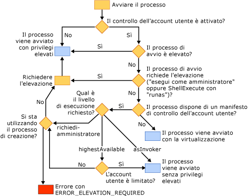

# Effetti del Controllo dell&#39;account utente sull&#39;applicazione
[!INCLUDE[vs2017banner](../assembler/inline/includes/vs2017banner.md)]

Il Controllo dell'account utente è una funzionalità di Windows Vista in cui gli account utente dispongono di privilegi limitati.  Per informazioni dettagliate sul Controllo dell'account utente, visitare i siti seguenti:  
  
-   [Guida dettagliata su Controllo account utente in Windows Vista](http://go.microsoft.com/fwlink/?linkid=53781)  
  
-   [Procedure consigliate e linee guida per lo sviluppo di applicazioni in un ambiente con privilegi minimi](http://go.microsoft.com/fwlink/?linkid=82444)  
  
-   [Informazioni e configurazione di Controllo account utente in Windows Vista](http://go.microsoft.com/fwlink/?LinkId=82445)  
  
## Compilazione di progetti dopo aver attivato il Controllo dell'account utente  
 Se si compila un progetto Visual C\+\+ in Windows Vista con il controllo dell'account utente disabilitato, e si decide di attivare la funzionalità in un secondo momento, è necessario cancellare i dati e ricompilare il progetto per far sì che funzioni correttamente.  
  
## Applicazioni che richiedono privilegi di amministratore  
 Per impostazione predefinita, il linker di Visual C\+\+ incorpora un frammento del controllo dell'account utente nel manifesto di un'applicazione con un livello di esecuzione di `asInvoker`.  Se l'applicazione richiede privilegi di amministratore per essere eseguita correttamente \(ad esempio, se modifica il nodo HKLM del Registro di sistema o scrive in aree protette del disco, come la directory di Windows\), è necessario modificarla.  
  
 La prima opzione consiste nel modificare il frammento del controllo dell'account utente del manifesto per impostare il livello di esecuzione su *requireAdministrator*.  L'applicazione richiederà quindi all'utente le credenziali amministrative prima dell'esecuzione.  Per informazioni su come eseguire questa operazione, vedere [\/MANIFESTUAC \(incorporazione delle informazioni sul controllo dell'account utente nel manifesto\)](../build/reference/manifestuac-embeds-uac-information-in-manifest.md).  
  
 La seconda opzione consiste nel non incorporare un frammento del controllo dell'account utente nel manifesto specificando l'opzione del linker **\/MANIFESTUAC:NO**.  In questo caso, l'applicazione verrà eseguita virtualizzata.  Qualsiasi modifica apportata al Registro di sistema o al file system non viene conservata quando l'applicazione viene terminata.  
  
 Il diagramma di flusso riportato di seguito descrive la modalità di esecuzione dell'applicazione a seconda che il controllo dell'account utente sia attivato e che l'applicazione includa un manifesto del controllo dell'account utente.  
  
   
  
## Vedere anche  
 [Procedure di sicurezza consigliate](../top/security-best-practices-for-cpp.md)