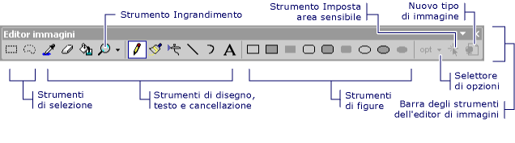
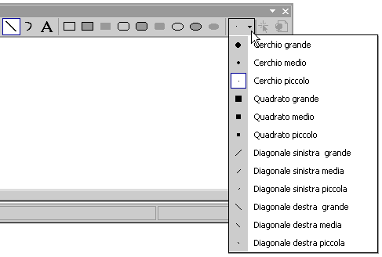

# Image Editor for Icons (C++)

Quando si seleziona un file di immagine (ad esempio con estensione ico, bmp, PNG) nella **Esplora soluzioni**, l'immagine viene aperto nel **Editor di immagini** nello stesso modo che i file di codice aperti nel **Editor di codice** . Quando un **Editor di immagini** scheda è attiva, noterete che le barre degli strumenti con molti strumenti per la creazione e modifica di immagini. Insieme a bitmap, icone e cursori, è possibile modificare immagini in formato GIF o JPEG utilizzando i comandi di **immagine** menu e gli strumenti nel **Editor di immagini** sulla barra degli strumenti.

Le risorse grafiche sono le immagini definite per l'applicazione. È possibile disegno a mano libera o disegnare utilizzando forme. È possibile selezionare parti di un'immagine per la modifica, l'inversione o ridimensionamento, oppure è possibile creare un pennello personalizzato da una parte selezionata di un'immagine e disegno con pennello. È possibile definire le proprietà dell'immagine, salvare immagini in formati diversi e convertire immagini in un formato a altro.

> [!NOTE]
> Usando il **Editor di immagini**, è possibile visualizzare immagini a 32 bit, ma non modificarli.

È anche possibile usare la **Editor di immagini** e il [Editor binario](binary-editor.md) per lavorare con i file di risorse nei progetti gestiti. Per modificare le risorse gestite è necessario che siano collegate. L'editor di risorse di Visual Studio non supporta la modifica di risorse incorporate.

Oltre a creare nuove risorse grafiche, è possibile [importare immagini esistenti](../windows/how-to-copy-resources.md#import-and-export-resources) per la modifica e quindi aggiungerli al progetto. È anche possibile aprire e modificare le immagini che non fanno parte di un progetto per [modifica delle immagini autonome](../windows/editing-an-image-outside-of-a-project-image-editor-for-icons.md).

Per informazioni sul **Editor di immagini**, vedere come [crea un'icona o un'altra immagine](../windows/creating-an-icon-or-other-image-image-editor-for-icons.md), [modificare un'immagine](../windows/selecting-an-area-of-an-image-image-editor-for-icons.md), [usare uno strumento di disegno](../windows/using-a-drawing-tool-image-editor-for-icons.md), [Utilizzare i colori](../windows/working-with-color-image-editor-for-icons.md), e [tasti di scelta rapida](../windows/accelerator-keys-image-editor-for-icons.md).

> [!NOTE]
> Scaricare gratuitamente il **Visual Studio Image Library** che contiene numerose animazioni, bitmap e icone che è possibile usare nelle applicazioni. Per altre informazioni su come scaricare la libreria, vedere la [Visual Studio Image Library](/visualstudio/designers/the-visual-studio-image-library).

## Menu Immagine

Il **immagine** menu, che viene visualizzata solo quando il **Editor di immagini** è attiva, sono disponibili comandi per la modifica delle immagini, la gestione di tavolozze dei colori e l'impostazione **Editor di immagini** finestra Opzioni. Inoltre, i comandi per l'uso di immagini per i dispositivi sono disponibili quando si lavora con le icone e cursori.

|Comando|Descrizione|
|---|---|
|**Inverti colori**|Inverte i colori.|
|**Capovolgi orizzontalmente**|Consente di capovolgere orizzontalmente l'immagine o la selezione.|
|**Capovolgi verticalmente**|Consente di capovolgere verticalmente l'immagine o la selezione.|
|**Ruota di 90 gradi**|Consente di ruotare di 90 gradi l'immagine o la selezione.|
|**Mostra finestra colori**|Apre la **colori** finestra, in cui è possibile scegliere i colori da utilizzare per l'immagine.|
|**Usa selezione come pennello**|Consente di creare un pennello personalizzato da una parte di un'immagine.  La selezione diventa un pennello personalizzato che distribuisce i colori nella selezione tra l'immagine. Le copie della selezione vengono lasciate lungo il percorso di trascinamento. Più lenta il trascinamento, vengono eseguite le altre copie.|
|**Copia e struttura selezione**|Consente di creare e strutturare una copia della selezione corrente.  Se il colore di sfondo è contenuto nella selezione corrente, verrà escluso se è trasparente selezionato.
|**Regola colori**|Apre la **regola colori**, che consente di personalizzare i colori utilizzati per l'immagine.|
|**Carica tavolozza**|Apre la **Carica tavolozza** nella finestra di dialogo consente di caricare i colori tavolozza salvati in precedenza in un file PAL.|
|**Salva tavolozza**|Salva i colori della tavolozza in un file PAL.|
|**Opaco**|Quando selezionato, effettua la selezione corrente opaca.  Se deselezionata, rende trasparente la selezione corrente.|
|**Editor barra degli strumenti**|Apre la [finestra di dialogo Nuova risorsa barra degli strumenti](../windows/new-toolbar-resource-dialog-box.md).|
|**Impostazioni griglia**|Apre la **Impostazioni griglia** finestra di dialogo in cui è possibile specificare grids per l'immagine.|
|**Tipo nuova immagine**|Apre la [New \<dispositivo > finestra di dialogo Tipo immagine](../windows/new-device-image-type-dialog-box-image-editor-for-icons.md).  Una singola risorsa icona può contenere numerose immagini di dimensioni diverse e windows possa usare le dimensioni dell'icona appropriata a seconda del modo in cui sta per essere visualizzato. Un nuovo tipo di dispositivo non modifica le dimensioni dell'icona, ma crea una nuova immagine all'interno dell'icona. Si applica solo alle icone e cursori.|
|**Tipo di immagine icona o cursore corrente**|Apre un sottomenu che elenca le immagini icona o cursore disponibile per i primi nove. L'ultimo comando nel sottomenu **altre**, verrà visualizzata la la [Open \<dispositivo > dialogo dell'immagine](../windows/open-device-image-dialog-box-image-editor-for-icons.md).|
|**Elimina tipo di immagine**|Elimina l'immagine del dispositivo selezionato.|
|**Strumenti**|Consente di visualizzare un sottomenu contenente tutti gli strumenti disponibili i **Editor di immagini** sulla barra degli strumenti.|

Il **Impostazioni griglia** nella finestra di dialogo consente di specificare le impostazioni della griglia per l'immagine e visualizza le linee della griglia sull'immagine modificata. Le righe sono utili per la modifica dell'immagine, ma non vengono salvate come parte dell'immagine stessa.

|Proprietà|Descrizione|
|---|---|
|**Griglia in pixel**|Se selezionata, viene visualizzata una griglia intorno a ogni pixel contenuto nel **Editor di immagini**.  La griglia viene visualizzata solo in 4 × e risoluzioni più alte.|
|**Griglia affiancata**|Se selezionata, viene visualizzata una griglia attorno a blocchi di pixel nel **Editor di immagini**, specificato dai valori della spaziatura della griglia.|
|**Width**|Specifica la larghezza di ogni blocco di riquadro.  Questa proprietà è utile quando si disegnano le bitmap che contiene più immagini disposti a intervalli regolari.|
|**Height**|Specifica l'altezza di ogni blocco di riquadro.  Questa proprietà è utile quando si disegnano le bitmap che contiene più immagini disposti a intervalli regolari.|

## ToolBar

Il **Editor di immagini** sulla barra degli strumenti contiene gli strumenti di disegno, disegno, immettendo il testo, la cancellazione e la modifica delle visualizzazioni. Contiene inoltre un selettore di opzioni con cui è possibile selezionare le opzioni per l'utilizzo di ogni strumento. Ad esempio, è possibile scegliere da vari larghezze di pennello, fattori di ingrandimento e gli stili di riga.

Tutti gli strumenti disponibili nel **Editor di immagini** sulla barra degli strumenti sono anche disponibili dal menu **immagine** > **strumenti**. Usare la **Editor di immagini** sulla barra degli strumenti e **opzione** selettore, selezionare lo strumento o di opzione che si desidera.

 
**Editor di immagini** sulla barra degli strumenti

> [!TIP]
> Descrizioni comandi vengono visualizzati quando si passa il cursore su un pulsante della barra degli strumenti. Questi suggerimenti consentono di identificare la funzione di ogni pulsante.

Poiché molti degli strumenti di disegno sono disponibili dal [tastiera](../windows/accelerator-keys-image-editor-for-icons.md), è talvolta utile nascondere il **Editor di immagini** sulla barra degli strumenti.

- Per visualizzare o nascondere il **Editor di immagini** sulla barra degli strumenti, andare al menu **View** > **barre degli strumenti** e scegliere **Editor di immagini**.

> [!NOTE]
> Gli elementi di questa barra degli strumenti verranno visualizzata non disponibili quando un file di immagine dal progetto corrente o non è aperta nella soluzione il **Editor di immagini**.

### selettore di opzioni

Con il **opzione** selettori è possibile specificare la larghezza di una riga, tratto e altro ancora. L'icona al **opzione** pulsante del selettore varia a seconda di quale strumento è stata selezionata.

 
**Opzione** selettore sul **Editor di immagini** sulla barra degli strumenti

### Strumento testo

Usare la **strumento testo** finestra di dialogo per aggiungere testo a una risorsa di cursori, bitmap o icona.

Per accedere a questa finestra di dialogo, aprire il **Editor di immagini** e andare al menu **immagine** > **strumenti**, quindi selezionare la **strumento testo** comando.

> [!TIP]
> È possibile fare doppio clic sui **strumento testo** finestra di dialogo per accedere a un menu di scelta rapida predefinito che contiene un elenco di comandi di Windows standard.

Aprire il **carattere strumento testo** finestra di dialogo per modificare il tipo di carattere, stile o dimensione del carattere del cursore. Le modifiche vengono applicate al testo visualizzato nei **testo** area.

Per accedere a questa finestra di dialogo, selezionare la **Font** pulsante il **strumento testo** nella finestra di dialogo. Le proprietà disponibili sono:

|Proprietà|Descrizione|
|---|---|
|**Tipo di carattere**|Elenca i tipi di carattere disponibili.|
|**Stile carattere**|Elenca gli stili disponibili per il tipo di carattere specificato.|
|**Dimensione**|Elenca le dimensioni disponibili per il tipo di carattere specificato.|
|**Esempio**|Visualizzare un esempio del modo in cui testo verrà visualizzato con le impostazioni del carattere specificata.|
|**Script**|Elenca gli script del linguaggio disponibili per il tipo di carattere specificato.  Quando si seleziona uno script in lingue diverse, il set di caratteri per quella lingua diventa disponibile per la creazione di documenti multilingue.|

#### Per modificare il tipo di carattere del testo in un'immagine

Ecco un esempio di come aggiungere testo a un'icona in un'applicazione Windows e modificare il tipo di carattere del testo.

1. Creare un'applicazione di moduli di Windows C++. Per informazioni dettagliate, vedere [Procedura: Creare applicazioni di Windows Forms](/previous-versions/visualstudio/visual-studio-2008/s69bf10x(v%3dvs.90)). Un' *app. ico* file viene aggiunto al progetto per impostazione predefinita.

1. Nelle **Esplora soluzioni**, fare doppio clic sul file *app. ico*. Il **Editor di immagini** verrà aperto.

1. Passare al menu di scelta **immagine** > **Tools** e selezionare **strumento testo**.

1. Nel **dello strumento di testo** finestra di dialogo, digitare *C++* nell'area di testo vuoto. Questo testo verrà visualizzato in una finestra ridimensionabile situata nell'angolo superiore sinistro di *app. ico* nel **Editor di immagini**.

1. Nel **Editor di immagini**, trascinare la finestra ridimensionabile al centro del *app. ico* per migliorare la leggibilità del testo.

1. Nel **dello strumento di testo** finestra di dialogo, seleziona il **Font** pulsante.

1. Nel **carattere strumento testo** nella finestra di dialogo:

   - Selezionare **Times New Roman** dall'elenco dei tipi di carattere disponibili elencate nel **Font** casella di riepilogo.

   - Selezionare **Bold** dall'elenco di stili di carattere disponibili elencate nel **lo stile del carattere** casella di riepilogo.

   - Selezionare **10** dall'elenco di disponibilità punto di dimensioni elencate nel **dimensioni** casella di riepilogo.

   - Scegliere **OK**. Il **carattere strumento testo** nella finestra di dialogo verrà chiusa e le nuove impostazioni del tipo di carattere verranno applicate al testo.

1. Scegliere **Close** nel **strumento testo** nella finestra di dialogo. La finestra ridimensionabile intorno al testo non viene più il **Editor di immagini**.

Nell'area di testo viene visualizzato il testo visualizzato come parte della risorsa. Quest'area è inizialmente vuota.

> [!NOTE]
> Se **sfondo trasparente** è impostato, l'immagine verrà inserito solo il testo. Se **sfondo opaco** è impostato, dietro il testo verrà inserito un rettangolo di delimitazione, riempito con il colore di sfondo.

## Riquadri della finestra

Il **Editor di immagini** finestra Mostra due visualizzazioni della stessa immagine, con una barra che separa i due riquadri di divisione. che è possibile trascinare da un lato all'altro per modificare le dimensioni relative dei riquadri. Nel riquadro attivo viene visualizzato un bordo di selezione.

Una vista è dimensioni effettive e l'altra viene ingrandita di un fattore di ingrandimento predefinita pari a 6. Le viste in questi due riquadri vengono aggiornate automaticamente, le modifiche apportate in un riquadro vengono visualizzate immediatamente in altro. I due riquadri rendono più semplice per usare una vista ingrandita dell'immagine, in cui è possibile distinguere i singoli pixel e, contemporaneamente, osservare gli effetti del lavoro svolto sulla vista dimensioni effettive dell'immagine.

Nel riquadro a sinistra viene utilizzato tutto lo spazio è necessario (fino a metà della **immagine** finestra) per visualizzare la visualizzazione di ingrandimento 1:1 predefinito dell'immagine. Riquadro di destra visualizza un'immagine ingrandita 6:1 ingrandimento predefinita. È possibile modificare il livello di ingrandimento in ogni riquadro usando il **Magnify** strumento nel **Editor di immagini** sulla barra degli strumenti o utilizzando i tasti di scelta rapida.

È possibile ingrandire il riquadro inferiore del **Editor di immagini** finestra e utilizzare i due riquadri per mostrare diverse aree di un'immagine di grandi dimensioni. Selezionare questa opzione all'interno del riquadro per selezionarlo.

È possibile modificare le dimensioni relative dei riquadri posizionando il puntatore del mouse sulla barra di divisione e spostando la barra di divisione verso destra o sinistra. Barra di divisione è possibile spostare completamente in entrambi i lati se si desidera lavorare con un solo riquadro.

Se il **Editor di immagini** riquadro viene ingrandita di un fattore pari a 4 o versione successiva, è possibile visualizzare una griglia in pixel che delimita i singoli pixel nell'immagine.

### Per modificare del fattore di ingrandimento

Per impostazione predefinita, il **Editor di immagini** Mostra la visualizzazione nel riquadro sinistro alle dimensioni effettive e la visualizzazione nel riquadro di destra con le dimensioni effettive di 6 volte. Il fattore di ingrandimento (visualizzato nella barra di stato nella parte inferiore dell'area di lavoro) è il rapporto tra le dimensioni effettive dell'immagine e le dimensioni di visualizzazione. Il fattore di predefinito è 6 e l'intervallo va da 1 a 10.

1. Selezionare il **Editor di immagini** riquadro cui fattore di ingrandimento che si desidera modificare.

1. Nel **Editor di immagini** sulla barra degli strumenti, selezionare la freccia a destra del **Magnify** dello strumento e selezionare il fattore di ingrandimento dal sottomenu: **1 X**, **2 X**, **6 X**, oppure **8 X**.

   > [!NOTE]
   > Per selezionare un fattore di ingrandimento diversi da quelli elencati nel **Ingrandisci** dello strumento, usare i tasti di scelta rapida.

### Per visualizzare o nascondere la griglia in pixel

Per tutti i **Editor di immagini** riquadri con un fattore di ingrandimento pari a 4 o versione successiva, è possibile visualizzare una griglia che delimita i singoli pixel nell'immagine.

1. Passare al menu di scelta **immagine** > **Impostazioni griglia**.

1. Selezionare il **griglia in Pixel** casella di controllo per visualizzare la griglia, o deselezionare la casella per nascondere la griglia.

## Requisiti

nessuno

## Vedere anche

[Editor di risorse](../windows/resource-editors.md) 

<!--[Icons](https://msdn.microsoft.com/library/windows/desktop/ms646973.aspx)-->