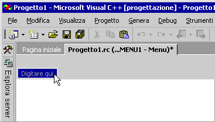
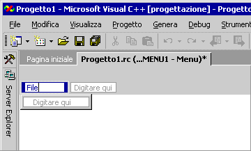

# <a name="menu-editor-c"></a>Editor dei menu (C++)

I menu consentono di disporre i comandi in modo logico e facile da trovare. Con il **Menu** editor, è possibile creare e modificare i menu lavorando direttamente con una barra dei menu molto simile a quello dell'applicazione finita.

> [!TIP]
> Quando si usa la **Menu** editor, in molti casi, è possibile fare clic sul pulsante destro del mouse per visualizzare un menu di scelta rapida dei comandi usati frequentemente. I comandi disponibili dipendono dalla destinazione a cui fa riferimento il puntatore.

> [!NOTE]
> Per i programmi di classe della libreria MFC (Microsoft Foundation) e ATL, è possibile usare **creazioni guidate codice** per associare i comandi di menu al codice. Per altre informazioni, vedere [Aggiunta di un evento](../ide/adding-an-event-visual-cpp.md).

## <a name="how-to"></a>Procedure

> [!NOTE]
> Il **finestra risorse** non è disponibile nelle edizioni Express.

Il **Menu** editor consente di:

### <a name="to-create-a-standard-menu"></a>Per creare un menu standard

1. Dal **View** dal menu **visualizzazione risorse** e quindi fare clic sul **Menu** intestazione e scegliere **Aggiungi risorsa**. Scegliere **Menu**.

1. Selezionare la casella **Nuovo elemento** (il rettangolo che contiene "Digitare qui") nella barra dei menu.

   <br/>
   Casella Nuovo elemento

1. Digitare un nome per il nuovo menu, ad esempio "File".

   Il testo immesso verrà visualizzato nell'editor di **menu** e nella casella **Didascalia** della [finestra Proprietà](/visualstudio/ide/reference/properties-window). È possibile modificare le proprietà per il nuovo menu in questa posizione.

   Dopo aver assegnato al nuovo menu un nome nella barra dei menu, la casella del nuovo elemento viene spostata verso destra (per consentire l'aggiunta di un altro menu) e un'altra casella del nuovo elemento viene visualizzata sotto il primo menu in modo da poter aggiungere i comandi di menu.

   <br/>
   Casella del nuovo elemento con stato attivo spostato dopo aver digitato il nome del menu

   > [!NOTE]
   > Per creare un singolo elemento menu sulla barra dei menu, impostare il **Popup** proprietà **False**.

### <a name="to-create-a-submenu"></a>Per creare un sottomenu

1. Selezionare il comando di menu per il quale si desidera creare un sottomenu.

1. Nella casella **Nuovo elemento** visualizzata a destra, digitare il nome del nuovo comando di menu. Questo nuovo comando verrà visualizzato come prima voce del sottomenu.

1. Aggiungere altri comandi di menu alla voce del sottomenu.

## <a name="to-insert-a-new-menu-between-existing-menus"></a>Per inserire un nuovo menu tra menu esistenti

Selezionare un nome di menu di scelta e premere esistente di **inserire** chiave o del mouse sulla barra dei menu e scegliere **Inserisci nuovo** dal menu di scelta rapida.

Il **nuovo elemento** casella viene inserita prima dell'elemento selezionato.

### <a name="to-add-commands-to-a-menu"></a>Per aggiungere comandi a un menu

1. Creare un menu.

1. Selezionare un nome di menu, ad esempio **File**.

   Ciascuna voce di menu espanderà ed esporrà una casella nuovo elemento per i comandi. Ad esempio, è possibile aggiungere i comandi **New**, **Open**, e **Chiudi** da un **File** menu.

1. Nella casella del nuovo elemento, digitare un nome per il nuovo comando di menu.

   > [!NOTE]
   > Il testo immesso verrà visualizzato nell'editor di **menu** e nella casella **Didascalia** della [finestra Proprietà](/visualstudio/ide/reference/properties-window). È possibile modificare le proprietà per il nuovo menu in questa posizione.

   > [!TIP]
   > È possibile definire un tasto di scelta rapida che consente all'utente di selezionare il comando di menu. Digitare una e commerciale (`&`) davanti a una lettera per specificarla come tasto di scelta. L'utente può selezionare il comando di menu digitando quella lettera.

1. Nel **proprietà** finestra, seleziona il menu comando proprietà che si applicano. Per informazioni dettagliate, vedere [proprietà dei comandi di Menu](../windows/menu-command-properties.md).

1. Nel **prompt dei comandi** nella casella il **proprietà** finestra, digitare la stringa di messaggio di richiesta da visualizzare nella barra di stato dell'applicazione.

   Questo passaggio Crea una voce nella tabella di stringhe con lo stesso identificatore di risorsa del comando di menu creato.

   > [!NOTE]
   > È possibile applicare solo alle voci di menu con un **Popup** proprietà di **True**. Ad esempio, gli elementi del menu di primo livello possono avere richieste se dispongono di voci di menu secondario. Lo scopo di un **dei messaggi di richiesta** consiste nell'indicare cosa succede se un utente seleziona la voce di menu.

1. Premere **invio** per completare il comando di menu.

   La casella del nuovo elemento è selezionata, pertanto è possibile creare comandi di menu aggiuntivi.

### <a name="to-select-multiple-menu-commands"></a>Per selezionare più comandi di menu

È possibile selezionare più nomi di menu o comandi di menu per l'esecuzione delle operazioni bulk, ad esempio l'eliminazione o modifica delle proprietà.

Mentre si tiene premuto il **Ctrl** della chiave, selezionare il menu o comandi del sottomenu desiderato.

### <a name="to-move-and-copy-menus-and-menu-commands"></a>Per spostare e copiare menu e comandi di menu

> [!NOTE]
> È anche possibile trascinare, copiare e incollare in altre finestre dai menu.

#### <a name="to-move-or-copy-menus-or-menu-commands-using-the-drag-and-drop-method"></a>Per spostare o copiare menu o comandi di menu usando il metodo di trascinamento e rilascio

1. Trascinare o copiare l'elemento che si vuole spostare in:

   - La nuova posizione del menu corrente.

   - Un altro menu. È possibile passare agli altri menu trascinandovi sopra il puntatore del mouse.

1. Trascinare il comando di menu quando la guida di inserimento mostra la posizione desiderata.

#### <a name="to-move-or-copy-menus-or-menu-commands-using-shortcut-menu-commands"></a>Per spostare o copiare menu o comandi di menu usando i comandi di menu di scelta rapida

1. Fare clic con il pulsante destro del mouse su uno o più menu o comandi di menu.

1. Dal menu di scelta rapida scegliere **Taglia** (per spostare) o **Copia**.

1. Se stai spostando gli elementi in un altro menu risorse o file script di risorsa [aprirlo in un'altra finestra](/visualstudio/ide/customizing-window-layouts-in-visual-studio).

1. Selezionare la posizione del menu o del comando di menu che si vuole spostare o copiare.

1. Dal menu di scelta rapida scegliere **Incolla**. L'elemento spostato o copiato viene inserito prima dell'elemento selezionato.

### <a name="to-delete-a-menu-or-menu-command"></a>Per eliminare un menu o un comando di menu

Fare clic sul nome di menu o comandi e scegliere **Elimina** dal menu di scelta rapida.

> [!NOTE]
> Analogamente, è possibile usare il menu di scelta rapida per eseguire altre azioni quali Copia, Taglia, Incolla, Inserisci nuovo, Inserisci separatore, Modifica ID, Visualizza come popup, tasti di scelta e così via.

## <a name="pop-up-menus"></a>Menu di scelta rapida

I[menu a comparsa](../mfc/menus-mfc.md) visualizzano i comandi usati frequentemente. Possono essere sensibili al contesto per la posizione del puntatore. Quando si usa il menu a comparsa nell'applicazione è necessario compilare il menu e quindi connetterlo al codice dell'applicazione.

Dopo aver creato la risorsa di menu, il codice dell'applicazione deve caricare la risorsa di menu e usare [TrackPopupMenu](/windows/desktop/api/winuser/nf-winuser-trackpopupmenu) per visualizzare il menu. Dopo che l'utente ha chiuso il menu a comparsa selezionando al suo esterno o ha selezionato un comando, che verrà restituito. Se l'utente sceglie un comando, tale messaggio di comando verrà inviato alla finestra di cui è stato passato l'handle.

### <a name="to-create-a-pop-up-menu"></a>Per creare un menu a comparsa

1. Creare un menu con un titolo vuoto (non forniscono un **didascalia**).

1. [Aggiungere un comando di menu al nuovo menu](../windows/adding-commands-to-a-menu.md). Spostare il primo comando di menu di scelta sotto il titolo del menu vuoto (la didascalia temporanea indica `Type Here`). Digitare una **Didascalia** e qualsiasi altra informazione.

   Ripetere questo processo per tutti gli altri comandi di menu a comparsa.

1. Salvare la risorsa di menu.

### <a name="to-connect-a-pop-up-menu-to-your-application"></a>Per connettere un menu a comparsa all'applicazione

1. Aggiungere un gestore di messaggi per WM_CONTEXTMENU (ad esempio). Per altre informazioni, vedere [Mapping di messaggi a funzioni](../mfc/reference/mapping-messages-to-functions.md).

1. Aggiungere al gestore messaggio il codice seguente:

    ```cpp
    CMenu menu;
    VERIFY(menu.LoadMenu(IDR_MENU1));
    CMenu* pPopup = menu.GetSubMenu(0);
    ASSERT(pPopup != NULL);
    pPopup->TrackPopupMenu(TPM_LEFTALIGN | TPM_RIGHTBUTTON, point.x, point.y, AfxGetMainWnd());
    ```

   > [!NOTE]
   > Il [CPoint](../atl-mfc-shared/reference/cpoint-class.md) passato per il messaggio di gestore di è in coordinate dello schermo.

> [!NOTE]
> La connessione di un menu a comparsa all'applicazione richiede MFC.

### <a name="to-view-a-menu-resource-as-a-pop-up-menu"></a>Per visualizzare una risorsa di menu come menu a comparsa

In genere, quando si usa la **Menu** editor, una risorsa di menu viene visualizzata come una barra dei menu. Tuttavia, potrebbero esserci risorse di menu che vengono aggiunte alla barra dei menu dell'applicazione durante l'esecuzione del programma.

Il menu di scelta rapida e scegliere **Visualizza come Popup** dal menu di scelta rapida.

   Questa opzione è solo una preferenza di visualizzazione e non verrà modificato il menu di scelta.

> [!NOTE]
> Per modificare la visualizzazione della barra dei menu, selezionare **Visualizza come Popup** nuovamente (che consente di rimuovere il segno di spunta e restituisce la visualizzazione della barra dei menu).

## <a name="requirements"></a>Requisiti

Win32

## <a name="see-also"></a>Vedere anche

[Editor di risorse](../windows/resource-editors.md)<br/>
[Comandi di menu](../windows/menu-command-properties.md)<br/>

<!--
[User-Interface Objects and Command IDs](../mfc/user-interface-objects-and-command-ids.md)<br/>
[Menus](../mfc/menus-mfc.md)<br/>
[Menus](https://msdn.microsoft.com/library/windows/desktop/ms646977.aspx)-->