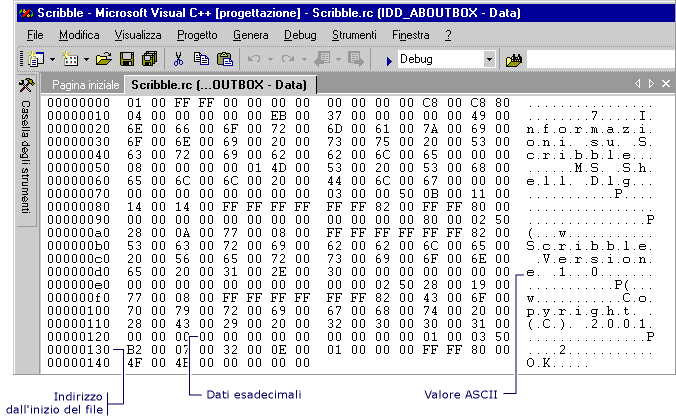

# Apertura di una risorsa per la modifica binaria (C++)

### Per aprire una risorsa desktop di Windows per la modifica binaria

1. In [Visualizzazione risorse](../windows/resource-view-window.md)selezionare il file di risorse che si vuole modificare.

   > [!NOTE]
   > Se il progetto non contiene già un file RC, vedere la pagina relativa alla [creazione di un nuovo file script di risorsa](../windows/how-to-create-a-resource-script-file.md).

2. Fare clic con il pulsante destro del mouse sulla risorsa e scegliere **Apri dati binari** dal menu di scelta rapida.

   > [!NOTE]
   > Se si usa la [visualizzazione di risorse](../windows/resource-view-window.md) finestra per aprire una risorsa con un formato che Visual Studio non riconosce la risorsa (ad esempio RCDATA o una risorsa personalizzata), viene aperto automaticamente nel **binario** editor.

### Per aprire una risorsa gestita per la modifica binaria

1. Nelle **Esplora soluzioni**, selezionare il file di risorse che si desidera modificare.

2. Fare clic con il pulsante destro del mouse sulla risorsa e scegliere **Apri con** dal menu di scelta rapida.

3. Nella finestra di dialogo **Apri con** scegliere **Editor binario**.

   > [!NOTE]
   > È possibile usare l' [Editor immagini](../windows/image-editor-for-icons.md) e l' [Editor binario](binary-editor.md) per usare i file di risorse nei progetti gestiti. Per modificare le risorse gestite è necessario che siano collegate. Negli editor di risorse di Visual Studio non è supportata la modifica di risorse incorporate.

   > [!NOTE]
   > Per informazioni sull'aggiunta di risorse a progetti gestiti, vedi [risorse nelle App Desktop](/dotnet/framework/resources/index) nel *manuale dello sviluppatore di .NET Framework*. Per informazioni sull'aggiunta manuale di file di risorse a progetti gestiti, sull'accesso alle risorse, visualizzazione di risorse statiche e sull'assegnazione di stringhe di risorse alle proprietà, vedere [creazione di file di risorse per le app Desktop](/dotnet/framework/resources/creating-resource-files-for-desktop-apps). Per informazioni sulla globalizzazione e localizzazione delle risorse nelle App gestite, vedere [globalizzazione e localizzazione di applicazioni .NET Framework](/dotnet/standard/globalization-localization/index).

  
Dati binari per una finestra di dialogo visualizzata nell'editor binario

Nell'editor binario vengono rappresentati solo alcuni valori ASCII (da 0x20 a 0x7E). I caratteri estesi vengono visualizzati come punti nella sezione Valore ASCII dell'editor binario (riquadro a destra). I caratteri "stampabili" sono valori ASCII da 32 a 126.

> [!NOTE]
> Se si desidera utilizzare il **binario** editor su una risorsa già modificata in un'altra finestra dell'editor, chiudere l'altra finestra dell'editor prima di tutto.

## Requisiti

nessuno

## Vedere anche

[Binary Editor](binary-editor.md)