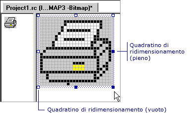

# Ridimensionamento di un'immagine (Editor di immagini per le icone)
Il comportamento dell'editor di immagini durante il ridimensionamento di un'immagine dipende dal fatto che è stata [selezionati](../windows/selecting-an-area-of-an-image-image-editor-for-icons.md) l'intera immagine o solo una parte di esso.  
  
 Quando la selezione include solo una parte dell'immagine, l'editor di immagini riduce la selezione per l'eliminazione delle righe o colonne di pixel e riempire le aree vuote con il colore di sfondo corrente, o si estende la selezione duplicando le righe o colonne di pixel.  
  
 Quando la selezione include l'intera immagine, l'editor di immagini sia compatta ed estende l'immagine, o Ritaglia e lo estende.  
  
 Sono disponibili due meccanismi per ridimensionare un'immagine: i quadratini di ridimensionamento e il [finestra proprietà](/visualstudio/ide/reference/properties-window). È possibile trascinare i quadratini di ridimensionamento per modificare le dimensioni di tutti o parte di un'immagine. Quadratini di ridimensionamento che è possibile trascinare sono pieni. Non è possibile trascinare gli handle che sono vuoti. È possibile utilizzare la finestra proprietà per ridimensionare l'intera immagine, non una parte selezionata.  
  
   
Quadratini di ridimensionamento  
  
> [!NOTE]
>  Se si dispone dell'opzione riquadro griglia selezionato nel [finestra di dialogo Impostazioni griglia](../windows/grid-settings-dialog-box-image-editor-for-icons.md), il ridimensionamento verrà bloccato alla riga successiva riquadro griglia. Se la griglia in Pixel opzione è selezionata (impostazione predefinita), solo il ridimensionamento verrà bloccato sul pixel successivo disponibile.  
  
-   [Ridimensionamento di un'intera immagine](../windows/resizing-an-entire-image-image-editor-for-icons.md)  
  
-   [Ritaglio o estensione di un'intera immagine](cropping-or-extending-an-entire-image-image-editor-for-icons.md)  
  
-   [Riduzione o allungamento di un'intera immagine](../windows/shrinking-or-stretching-an-entire-image-image-editor-for-icons.md)  
  
-   [Riduzione o allungamento di parte di un'immagine](../windows/shrinking-or-stretching-part-of-an-image-image-editor-for-icons.md)  
  
 Per informazioni sull'aggiunta di risorse a progetti gestiti, vedi [risorse nelle App Desktop](/dotnet/framework/resources/index) nel *manuale dello sviluppatore di .NET Framework*. Per informazioni sull'aggiunta manuale di file di risorse a progetti gestiti, sull'accesso alle risorse, visualizzazione di risorse statiche e sull'assegnazione di stringhe di risorse alle proprietà, vedere [creazione di file di risorse per le app Desktop](/dotnet/framework/resources/creating-resource-files-for-desktop-apps). Per informazioni sulla globalizzazione e localizzazione delle risorse nelle App gestite, vedere [globalizzazione e localizzazione di applicazioni .NET Framework](/dotnet/standard/globalization-localization/index).  
  
## Requisiti  
 nessuno  
  
## Vedere anche  
 [Tasti di scelta rapida](../windows/accelerator-keys-image-editor-for-icons.md)   
 [Modifica delle risorse grafiche](../windows/editing-graphical-resources-image-editor-for-icons.md)   
 [Editor di immagini per le icone](../windows/image-editor-for-icons.md)