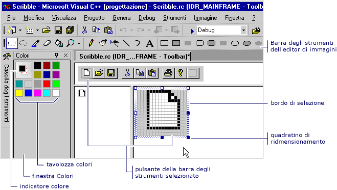

# Editor barra degli strumenti (C++)

Il **sulla barra degli strumenti** editor consente di creare le risorse della barra degli strumenti di C++ e convertire le bitmap in risorse della barra degli strumenti. Il **sulla barra degli strumenti** editor utilizza un'interfaccia grafica per visualizzare una barra degli strumenti e pulsanti in modo molto simile come verranno visualizzati in un'applicazione finita.

Con il **sulla barra degli strumenti** editor, è possibile:

- [Creare nuove barre degli strumenti e pulsanti](../windows/creating-new-toolbars.md)

- [Convertire le bitmap in risorse della barra degli strumenti](../windows/converting-bitmaps-to-toolbars.md)

- [Creare, spostare e modificare i pulsanti della barra degli strumenti](../windows/creating-moving-and-editing-toolbar-buttons.md)

- [Creare descrizioni comandi](../windows/creating-a-tool-tip-for-a-toolbar-button.md)

Il **sulla barra degli strumenti** finestra dell'editor Mostra due visualizzazioni di un'immagine del pulsante, quello utilizzato per la finestra editor di immagini. Una barra di divisione separa i due riquadri. che è possibile trascinare da un lato all'altro per modificare le dimensioni relative dei riquadri. Nel riquadro attivo viene visualizzato un bordo di selezione. Sopra le due visualizzazioni dell'immagine si trova la barra degli strumenti dell'oggetto.

 Editor barra degli strumenti

Il **sulla barra degli strumenti** editor è simile al **immagine** editor delle funzionalità. Le voci di menu, gli strumenti grafici e griglia delle bitmap sono identici a quelli nel **immagine** editor. Un comando di menu non è il **immagine** menu consente di passare tra il **sulla barra degli strumenti** editor e la **immagine** editor. Per altre informazioni sull'uso di **grafica** sulla barra degli strumenti, **colori** tavolozza, o **immagine** menu, vedere [Editor di immagini](../windows/image-editor-for-icons.md).

Per informazioni sull'aggiunta di risorse a progetti gestiti, vedi [risorse nelle App Desktop](/dotnet/framework/resources/index) nel *manuale dello sviluppatore di .NET Framework*. Per informazioni sull'aggiunta manuale di file di risorse a progetti gestiti, sull'accesso alle risorse, visualizzazione di risorse statiche e sull'assegnazione di stringhe di risorse alle proprietà, vedere [creazione di file di risorse per le app Desktop](/dotnet/framework/resources/creating-resource-files-for-desktop-apps). Per informazioni sulla globalizzazione e localizzazione delle risorse nelle App gestite, vedere [globalizzazione e localizzazione di applicazioni .NET Framework](/dotnet/standard/globalization-localization/index).

## Requisiti

MFC o ATL

## Vedere anche

[Editor di risorse](../windows/resource-editors.md) 
[Menu e altre risorse](https://msdn.microsoft.com/library/windows/desktop/ms632583.aspx)