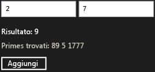

# Procedura dettagliata: creazione di un componente Windows Runtime di base mediante WRL
In questo documento viene illustrato come utilizzare la libreria di modelli C++ (WRL) di Windows Runtime per creare un componente Windows Runtime di base. Il componente aggiunge due numeri e genera un evento quando il risultato è un numero primo. Questo documento viene inoltre illustrato come utilizzare il componente da un'app Universal Windows Platform che utilizza JavaScript.  
  
## Prerequisiti  
  
-   Esperienza con il [Windows Runtime](http://msdn.microsoft.com/library/windows/apps/br211377.aspx).  
  
-   Esperienza con COM.  
  
### Per creare un componente Windows Runtime di base che somma due numeri  
  
1.  In Visual Studio, creare un Visual C++ `WRLClassLibrary` progetto. Il documento [il modello di progetto libreria di classi](../windows/wrl-class-library-project-template.md) viene descritto come scaricare il modello. Denominare il progetto `Contoso`.  
  
2.  In Contoso.cpp e Contoso.idl, sostituire tutte le istanze di "WinRTClass" con "Calculator".  
  
3.  In Contoso.idl, aggiungere il `Add` metodo il `ICalculator` interfaccia.  
  
     [!code-cpp[wrl-basic-component#1](../windows/codesnippet/CPP/walkthrough-creating-a-basic-windows-runtime-component-using-wrl_1.idl)]  
  
4.  In Contoso.cpp, aggiungere il `Add` metodo il `public` sezione il `Calculator` classe.  
  
     [!code-cpp[wrl-basic-component#2](../windows/codesnippet/CPP/walkthrough-creating-a-basic-windows-runtime-component-using-wrl_2.cpp)]  
  
    > [!IMPORTANT]
    >  Poiché si sta creando un componente COM, è necessario utilizzare il `__stdcall` convenzione di chiamata.  
  
     È consigliabile utilizzare `_Out_` e altre annotazioni linguaggio (SAL) di annotazione di origine per descrivere come una funzione utilizza i parametri. Le annotazioni SAL descrivono anche i valori restituiti Utilizzano le annotazioni SAL il [dello strumento di analisi del codice C/C++](/visualstudio/code-quality/code-analysis-for-c-cpp-overview) per individuare possibili errori in C e C++ nel codice sorgente. Gli errori di codifica più comuni segnalati dallo strumento includono i sovraccarichi del buffer, memoria non inizializzata, dereferenziazioni al puntatore null e perdite di memoria e risorse.  
  
### Utilizzare il componente da un'app Universal Windows Platform che utilizza JavaScript  
  
1.  In Visual Studio, aggiungere un nuovo JavaScript `Blank App` progetto per il `Contoso` soluzione. Denominare il progetto `CalculatorJS`.  
  
2.  Nel `CalculatorJS` del progetto, aggiungere un riferimento di `Contoso` progetto.  
  
3.  In default.html, Sostituisci il `body` sezione con questi elementi dell'interfaccia utente:  
  
     [!code-html[wrl-basic-component#3](../windows/codesnippet/Html/walkthrough-creating-a-basic-windows-runtime-component-using-wrl_3.html)]  
  
4.  Nel file default.js, implementare il `OnClick` (funzione).  
  
     [!code-javascript[wrl-basic-component#4](../windows/codesnippet/JavaScript/walkthrough-creating-a-basic-windows-runtime-component-using-wrl_4.js)]  
  
    > [!NOTE]
    >  In JavaScript, la prima lettera del nome di un metodo viene modificata in minuscola per rispettare le convenzioni di denominazione standard.  
  
### Per aggiungere un evento che viene generato quando viene calcolato un numero primo  
  
1.  In Contoso.idl, prima della dichiarazione di `ICalculator`, definire il tipo di delegato, `PrimeNumberEvent`, che fornisce un `int` argomento.  
  
     [!code-cpp[wrl-basic-component#5](../windows/codesnippet/CPP/walkthrough-creating-a-basic-windows-runtime-component-using-wrl_5.idl)]  
  
     Quando si utilizza il `delegate` (parola chiave), il compilatore MIDL per creare un'interfaccia che contiene un `Invoke` metodo che corrisponde alla firma del delegato. In questo esempio, il file generato Contoso_h.h definisce il `IPrimeNumberEvent` interfaccia, viene utilizzato più avanti in questa procedura.  
  
     [!code-cpp[wrl-basic-component#13](../windows/codesnippet/CPP/walkthrough-creating-a-basic-windows-runtime-component-using-wrl_6.cpp)]  
  
2.  Nel `ICalculator` l'interfaccia, definire il `PrimeNumberFound` evento. Il `eventadd` e `eventremove` attributi consentono di specificare che il consumer del `ICalculator` interfaccia possa sottoscrivere e annullare la sottoscrizione a questo evento.  
  
     [!code-cpp[wrl-basic-component#6](../windows/codesnippet/CPP/walkthrough-creating-a-basic-windows-runtime-component-using-wrl_7.idl)]  
  
3.  In Contoso.cpp, aggiungere un `private` [Microsoft::WRL::EventSource](../windows/eventsource-class.md) variabile membro per gestire i sottoscrittori di eventi e richiamare il gestore dell'evento.  
  
     [!code-cpp[wrl-basic-component#7](../windows/codesnippet/CPP/walkthrough-creating-a-basic-windows-runtime-component-using-wrl_8.cpp)]  
  
4.  In Contoso.cpp, implementare il `add_PrimeNumberFound` e `remove_PrimeNumberFound` metodi.  
  
     [!code-cpp[wrl-basic-component#8](../windows/codesnippet/CPP/walkthrough-creating-a-basic-windows-runtime-component-using-wrl_9.cpp)]  
  
### Per generare l'evento quando viene calcolato un numero primo  
  
1.  In Contoso.cpp, aggiungere il `IsPrime` metodo il `private` sezione il `Calculator` classe.  
  
     [!code-cpp[wrl-basic-component#12](../windows/codesnippet/CPP/walkthrough-creating-a-basic-windows-runtime-component-using-wrl_10.cpp)]  
  
2.  Modificare il `Calculator`del `Add` metodo da chiamare il [Microsoft::WRL::EventSource::InvokeAll](../windows/eventsource-invokeall-method.md) metodo quando viene calcolato un numero primo.  
  
     [!code-cpp[wrl-basic-component#11](../windows/codesnippet/CPP/walkthrough-creating-a-basic-windows-runtime-component-using-wrl_11.cpp)]  
  
### Per gestire l'evento da JavaScript  
  
1.  In default.html, modificare il `body` sezione includere un'area di testo che contiene i numeri primi.  
  
     [!code-html[wrl-basic-component#9](../windows/codesnippet/Html/walkthrough-creating-a-basic-windows-runtime-component-using-wrl_12.html)]  
  
2.  Nel file default.js, modificare il `Add` funzione per gestire il `PrimeNumberFound` evento. Il gestore eventi aggiunge i numeri primi nell'area di testo che è stato definito nel passaggio precedente.  
  
     [!code-javascript[wrl-basic-component#10](../windows/codesnippet/JavaScript/walkthrough-creating-a-basic-windows-runtime-component-using-wrl_13.js)]  
  
    > [!NOTE]
    >  In JavaScript, i nomi degli eventi vengono convertiti in minuscolo e sono preceduti da "on" per rispettare le convenzioni di denominazione standard.  
  
 Nella figura seguente mostra l'app Calcolatrice di base.  
  
   
  
## Passaggi successivi  
  
## Vedere anche  
 [Libreria modelli C++ per Windows Runtime (WRL)](../windows/windows-runtime-cpp-template-library-wrl.md)   
 [Modello di progetto libreria di classi](../windows/wrl-class-library-project-template.md)   
 [Strumento di analisi del codice C/C++](/visualstudio/code-quality/code-analysis-for-c-cpp-overview)