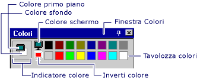

# Procedura: Utilizzare i colori

Il **Editor di immagini** contiene molte funzionalità che gestiscono e personalizzare i colori in modo specifico. È possibile impostare un colore di primo piano o in background, riempire le aree limitate con il colore o selezionare un colore in un'immagine da utilizzare come colore di primo piano o di sfondo corrente. È possibile usare gli strumenti nel [sulla barra degli strumenti Editor di immagini](../windows/toolbar-image-editor-for-icons.md) con la tavolozza dei colori nella **colori** finestra per creare immagini.

Tutti i colori per monocromatico e le immagini di 16 colori, vengono visualizzati nei **colori** tavolozza nel **colori** finestra. Insieme a 16 colori standard, è possibile creare colori personalizzati. Modifica di uno qualsiasi dei colori della tavolozza immediatamente cambierà il colore corrispondente nell'immagine.

Quando si lavora con icona a 256 colori e immagini di cursore, la **colori** proprietà nel [finestra proprietà](/visualstudio/ide/reference/properties-window) viene usato. Per altre informazioni, vedere [creazione di un cursore o l'icona a 256 colori](creating-a-256-color-icon-or-cursor-image-editor-for-icons.md).

> [!NOTE]
> Usando il **Editor di immagini**, è possibile visualizzare immagini a 32 bit, ma non modificarli.

È possibile creare anche le immagini a colori true. Tuttavia campioni di colore true non vengono visualizzati nella tavolozza completa la **colori** finestra; vengono visualizzati solo nell'area indicatore di colore in primo piano o in background. Colori true vengono creati utilizzando il [finestra di dialogo Regola colori](../windows/custom-color-selector-dialog-box-image-editor-for-icons.md).

È possibile salvare le tavolozze di colori personalizzati sul disco e ricaricarli in base alle esigenze. La tavolozza dei colori usata più di recente è salvato nel Registro di sistema e caricato automaticamente al successivo che avvio di Visual Studio.

Il **colori** finestra dispone di due parti:

- Il **tavolozza di colori**, che è una matrice di campioni di colore che rappresentano i colori disponibili. È possibile selezionare gli esempi per scegliere i colori di primo piano e sfondo quando si usano gli strumenti di grafica.

- Il **indicatore colori**, che mostra i colori di sfondo e primo piano e i selettori per il colore dello schermo e inverso.

    
   Finestra Colori

> [!NOTE]
> Il **schermata colore** e **inversione di colore** strumenti sono disponibili solo per le icone e cursori.

È possibile usare la **colori** finestra con il [sulla barra degli strumenti Editor di immagini](../windows/toolbar-image-editor-for-icons.md).

- Per visualizzare il **colori** pulsante destro del mouse nella finestra un' **Editor di immagini** riquadro e scegliere **Visualizza finestra colori**, oppure selezionare **Mostra finestra colori**su di [menu immagine](../windows/image-menu-image-editor-for-icons.md).

- Per nascondere il **colori** finestra, è possibile rimuovere la finestra (questa azione consentirà la finestra Nascondi automaticamente quando non è in uso) o selezionare il **Chiudi** pulsante.

Il **colori** tavolozza inizialmente Visualizza 16 colori standard. Con i colori visualizzati, è anche possibile creare colori personalizzati. È quindi possibile salvare e caricare una tavolozza colori personalizzata.

Il **regola colori** nella finestra di dialogo consente di personalizzare i colori utilizzati per l'immagine. Sono incluse le proprietà seguenti:

|Proprietà|Descrizione|
|--------------------------|--------------------------|
|**Visualizzazione delle sfumature**|Modifica i valori del colore selezionato. Posizionare il selettore di precisione sul colore che si desidera modificare. Quindi spostare il dispositivo di scorrimento verso l'alto o il basso per modificarne la luminosità o valori RGB del colore.|
|**Barra luminosità**|Imposta la luminosità per il colore selezionato nel **visualizzazione delle sfumature** casella. Selezionare e trascinare la freccia bianca la barra della luminosità maggiore o verso il basso per il minore. Il **colore** casella viene visualizzato il colore selezionato e l'effetto della luminosità è impostato.|
|**Colore**|Elenca la tonalità (il valore del selettore) del colore che si sta definendo. I valori compresi tra 0 e 240, dove 0 è rosso, 60 è giallo, 120 è verde, 180 è ciano, 200 è magenta e 240 è blu.|
|**Hue**|Elenca la tonalità (il valore del selettore) del colore che si sta definendo. I valori compresi tra 0 e 240, dove 0 è rosso, 60 è giallo, 120 è verde, 180 è ciano, 200 è magenta e 240 è blu.|
|**Sat**|Specifica il valore di saturazione del colore che si sta definendo. La saturazione è la quantità di colore in una tonalità specificata. I valori compresi tra 0 e 240.|
|**Lum**|Elenca la luminosità del colore che si sta definendo. I valori compresi tra 0 e 240.|
|**Rosso**|Specifica il valore di colore rosso del colore che si sta definendo. I valori compresi tra 0 e 255.|
|**Verde**|Specifica il valore di colore verde del colore che si sta definendo. I valori compresi tra 0 e 255.|
|**Blu**|Specifica il valore di colore blu del colore che si sta definendo. I valori compresi tra 0 e 255.|

È possibile salvare e caricare un **colori** tavolozza contenente colori personalizzati. (Per impostazione predefinita, il **colori** tavolozza usato di recente viene caricata automaticamente quando si avvia Visual Studio.)

> [!TIP]
> Poiché il **immagine** editor non è in grado di ripristinare il valore predefinito **colori** tavolozza, è consigliabile salvare il valore predefinito **colori** con un nome, ad esempio  *PAL* oppure *default. PAL* in modo che sia possibile ripristinare facilmente le impostazioni predefinite.

Usare la **colori della tavolozza caricare** finestra di dialogo per caricare le tavolozze di colori speciale da usare nel progetto C++. Sono incluse le proprietà seguenti:

|Proprietà|Descrizione|
|-----------------|-----------------|
|**Cerca in**|Specifica la posizione in cui si desidera individuare un file o cartella. Selezionare la freccia per scegliere un altro percorso o selezionare l'icona della cartella sulla barra degli strumenti per spostare i livelli.|
|**Nome del file**|Fornisce uno spazio è possibile digitare il nome del file da aprire. Per trovare rapidamente un file che aperto in precedenza, selezionare il nome del file nell'elenco a discesa, se disponibile.  Se esegue una ricerca per un file, è possibile usare un asterisco (*) come caratteri jolly. Ad esempio, è possibile digitare \*.\* per visualizzare un elenco di tutti i file. È anche possibile digitare il percorso completo di un file, ad esempio, C:\My c:\Documenti\MiaTavolozzaColori.PAL o \\\NetworkServer\MyFolder\MyColorPalette.pal.|
|**Tipo file**|Elenca i tipi di file da visualizzare. Tavolozza (*. PAL) è il tipo di file predefinito per le tavolozze di colori.|

## Procedure

### Selezione dei colori di primo piano o in background

Fatta eccezione per il **gomma**, gli strumenti disponibili sul **Editor di immagini** disegno sulla barra degli strumenti con il colore di primo piano o in background corrente quando si preme il pulsante sinistro o destro del mouse, rispettivamente.

- Per selezionare un colore di primo piano, con il pulsante sinistro del mouse, selezionare il colore desiderato la **colori** tavolozza.

- Per selezionare un colore di sfondo, con il pulsante destro del mouse, selezionare il colore desiderato la **colori** tavolozza.

### Per riempire un'area delimitata di un'immagine con un colore

L'editor di immagini fornisce il **riempire** dello strumento per la compilazione di uno qualsiasi di racchiuso tra area dell'immagine con il colore di disegno o il colore di sfondo corrente.

> [!TIP]
> Descrizioni comandi vengono visualizzati quando si passa il cursore su un pulsante della barra degli strumenti. Questi suggerimenti consentono di identificare la funzione di ogni pulsante.

### Usare lo strumento riempimento

1. Nel **Editor di immagini** sulla barra degli strumenti (oppure utilizzare **immagine** > **strumenti**), selezionare il **riempire** dello strumento.

1. Se necessario, scegliere i colori di disegno: Nel [tavolozza di colori](../windows/colors-window-image-editor-for-icons.md), selezionare il pulsante sinistro del mouse per selezionare un colore di primo piano o il pulsante destro del mouse per selezionare un colore di sfondo.

1. Spostare il **riempimento** strumento per l'area da riempire.

1. Selezionare il pulsante sinistro o destro del mouse da riempire con il colore primo piano o il colore di sfondo, rispettivamente.

### Per selezionare un colore da un'immagine da utilizzare altrove

Il **Seleziona colore**, o selezione colori, lo strumento consente di creare colori nell'immagine il colore primo piano corrente o il colore di sfondo, a seconda se si preme il pulsante destro del mouse o sinistra. Per annullare il **Seleziona colore** strumento, scegliere un altro strumento.

> [!TIP]
> Descrizioni comandi vengono visualizzati quando si passa il cursore su un pulsante della barra degli strumenti. Questi suggerimenti consentono di identificare la funzione di ogni pulsante.

#### Per selezionare un colore

1. Nel **Editor di immagini** sulla barra degli strumenti (o dal **immagine** dal menu **strumenti** comando), selezionare il **Seleziona colore** dello strumento.

1. Selezionare il colore che si desidera prelevare dall'immagine.

   > [!NOTE]
   > Una volta selezionato un colore, il **immagine** strumento editor riattiva utilizzati di recente.

1. Disegnare con il pulsante sinistro del mouse per il colore primo piano o il pulsante destro del mouse per il colore di sfondo.

### Scegliere lo sfondo

Quando si sposta o si copia una selezione da un'immagine, sono tutti i pixel nella selezione che corrispondono al colore di sfondo corrente, per impostazione predefinita, trasparente ed essi non oscurano pixel nel percorso di destinazione.

È possibile passare da uno sfondo trasparente (predefinito) a uno sfondo opaco e viceversa. Quando si usa uno strumento di selezione, il **sfondo trasparente** e **sfondo opaco** vengono visualizzate le opzioni nel **opzione** selettore sul **Editordiimmagini** sulla barra degli strumenti (come illustrato di seguito).

 
**Opzioni trasparenti e opache** nella **barra degli strumenti Editor di immagini**

#### Per passare da uno sfondo trasparente e opaco

Nel **Editor di immagini** sulla barra degli strumenti, seleziona la **opzione** selettore e quindi scegliere lo sfondo appropriato:

- `Opaque Background (O)`: Immagine esistente è coperta da tutte le parti della selezione.

- `Transparent Background (T)`: Nelle parti della selezione che corrispondono al colore di sfondo corrente viene visualizzata l'immagine esistente.

   \- oppure -

Nel **immagine** menu, seleziona o deselezionare **opaco**.

Durante l'esecuzione di una selezione attiva per modificare le parti dell'immagine sono trasparenti, è possibile modificare il colore di sfondo.

### Per invertire i colori in una selezione

Il **immagine** editor fornisce un modo pratico per invertire i colori nella parte selezionata dell'immagine in modo che è possibile capire come viene visualizzata un'immagine con colori invertiti.

Per invertire i colori nella selezione corrente nella **immagine** dal menu **Inverti colori**.

### Per personalizzare o modificare i colori nella tavolozza colori

1. Dal **immagine** menu, scegliere **regola colori**.

1. Nel **regola colori** finestra di dialogo casella, definire il colore digitando i valori RGB o HSL nelle caselle di testo appropriate o scegliere un colore nella **visualizzazione delle sfumature** casella.

1. Impostare la luminosità spostando il dispositivo di scorrimento **luminosità** barra.

1. Molti colori personalizzati sono retinati. Se si desidera il colore a tinta unita più vicino al colore retinato, fare doppio clic il **colore** casella.

   Se si decide in seguito si desidera che il colore retinato, spostare il dispositivo di scorrimento **luminosità** barre o a spostare il mirino **visualizzazione delle sfumature** nuovamente la casella per ripristinare il dithering.

1. Selezionare **OK** per aggiungere il nuovo colore.

### Per salvare una tavolozza di colori personalizzati

1. Dal **immagine** menu, scegliere **Salva tavolozza**.

1. Passare alla directory in cui si intende salvare la tavolozza e digitare un nome per la tavolozza.

1. Selezionare **Salva**.

### Per caricare una tavolozza di colori personalizzati

1. Dal **immagine** menu, scegliere **Carica tavolozza**.

1. Nel **Carica tavolozza** dialogo casella, passare alla directory corretta e selezionare la tavolozza che si desidera caricare. **Colore** tavolozze vengono salvate con un'estensione di file PAL.

## Requisiti

nessuno

## Vedere anche

[Tasti di scelta rapida](../windows/accelerator-keys-image-editor-for-icons.md) 
[Creazione di aree trasparenti o di inversione nelle immagini per i dispositivi](../windows/creating-transparent-or-inverse-regions-in-device-images.md) 
[Finestra di dialogo del selettore di colore personalizzato](../windows/custom-color-selector-dialog-box-image-editor-for-icons.md) 
[Editor di immagini per le icone](../windows/image-editor-for-icons.md) 
[Menu immagine](../windows/image-menu-image-editor-for-icons.md) 
